## 前言

佛祖保佑， 永无`bug`。Hello 大家好！我是海的对岸！

这个是项目接入AI，实现过程不难，记录一下。

## 先看效果


## 开始

项目接入AI，`本质`是`调用第三方的接口`，`使用第三方`提供的`api key`，其实对接AI的部分最好是后端包一下，因为密钥啥的，还是保留在服务端`更安全`一点。这里就以前端视角，以deepseek 为例，走通下流程。

我当前的开发环境是vue3 + vite + element-plus + tailwindcss。

还有后续用到的第三方插件会在下文指出。

### 步骤

1.  打开 [deepseek 开放平台](https://platform.deepseek.com/usage)，注册账号，创建api key

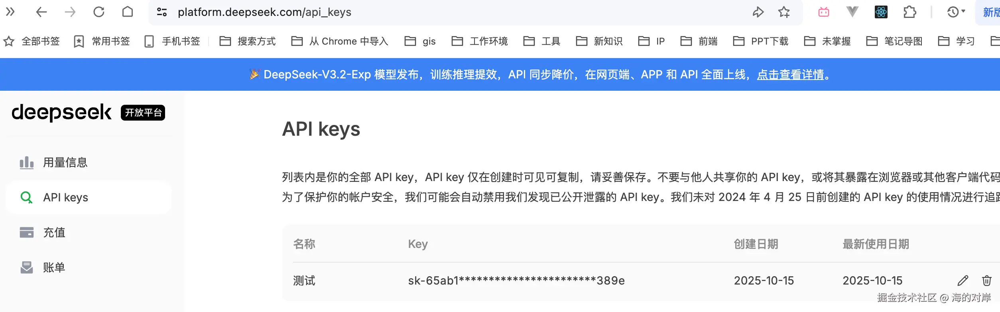

你创建的api key， 只有刚创建的时候是明文，记得要先找个地方保存一下，以后在开放平台查看，也查不到明文的，

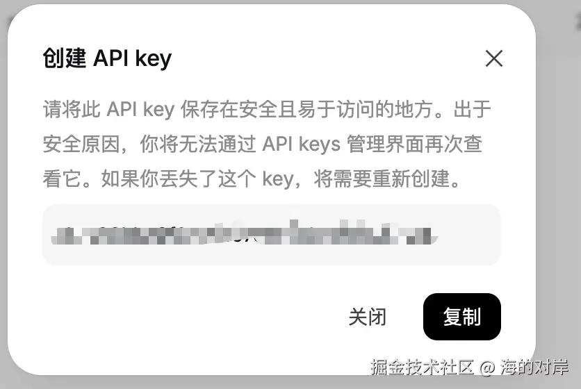

2.  按照文档对接，[deepseek 文档地址](https://api-docs.deepseek.com/zh-cn/)

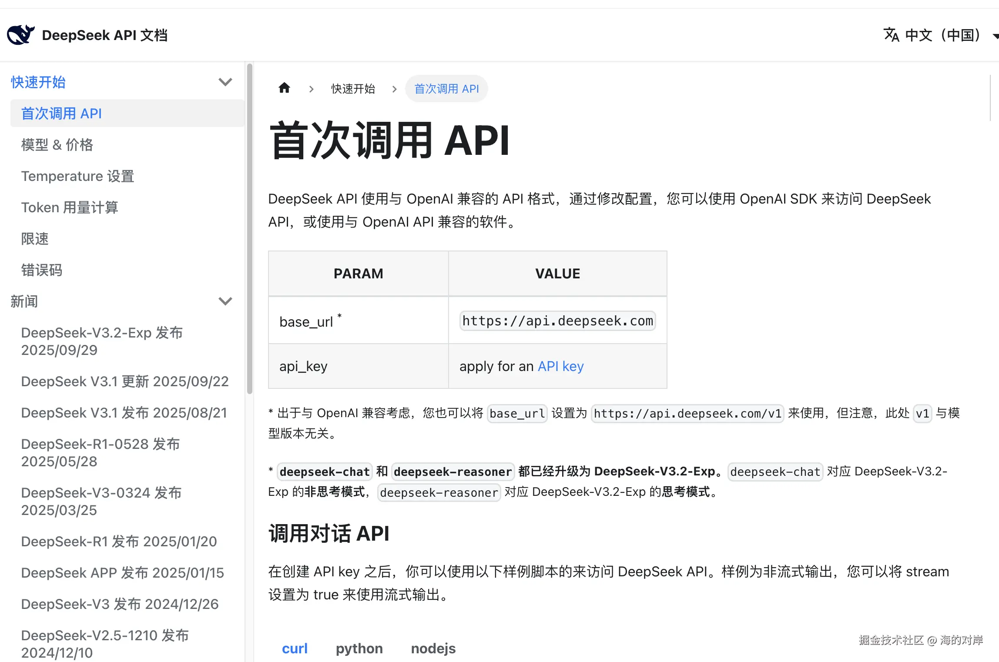

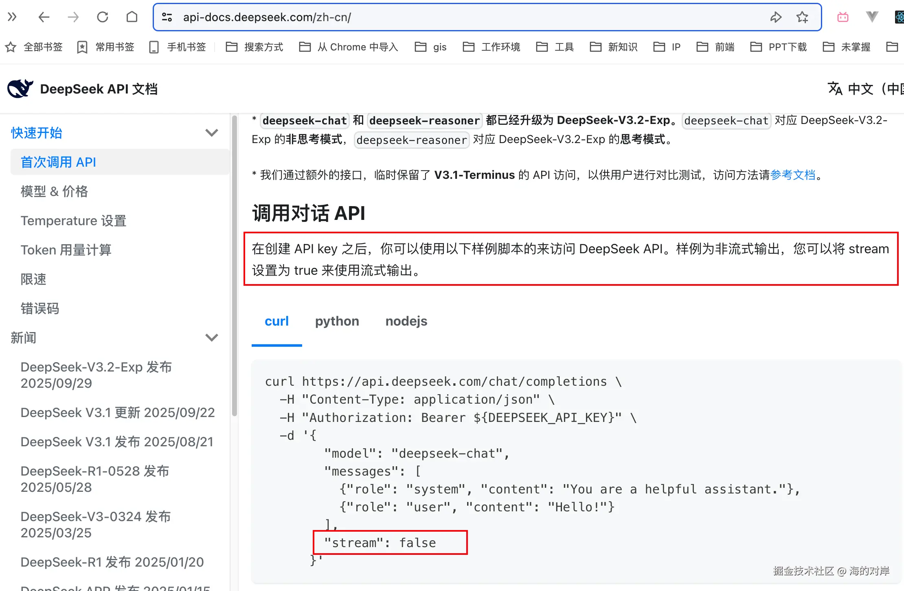

3.  充钱

你没听错，调用deepseek的接口，需要先充值，不然接口走不通，返回 402，表示你没充钱

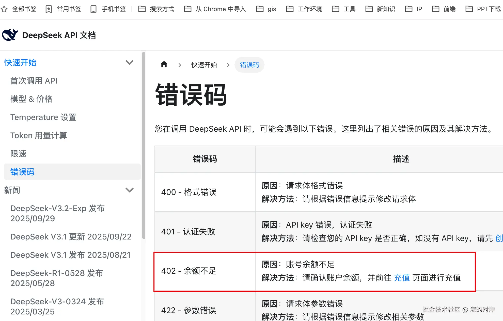

充钱，有个自定义选项，最低1元起充，个人可以冲个2元试试
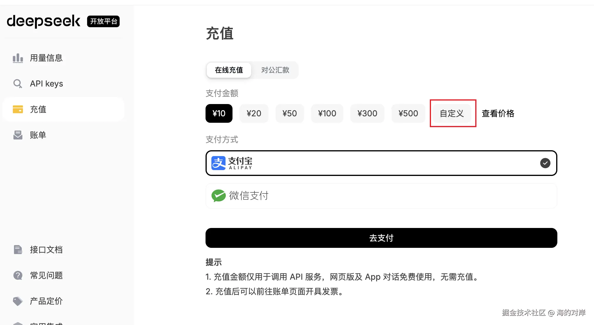

deepseek 比较人性化的一点是，你调用api接口，如果你传参数，传的content字段的值(就是你问的问题)是之前问过的，那么他是不扣费的，因此，我一直用重复的问题来调试对接，这个接口

### 主要说下步骤2


通过上图，我们知道，调用deepseek的接口，可以通过stream字段是否为true，设置成流式调用，也可以非流式，

流式输出和非流式输出的区别，对于设计前端交互体验非常重要。简单来说，这就像是​**​等一道菜全部做完再上桌，还是做好一部分就先上一部分​**​的区别。下面这个表格可以让你快速抓住核心差异。

| 特性                 | 非流式输出 (stream=false)                          | 流式输出 (stream=true)                                     |
| -------------------- | -------------------------------------------------- | ---------------------------------------------------------- |
| ​**​数据返回方式​**​ | 一次性返回完整响应                                 | 逐片段（chunk）实时返回                                    |
| ​**​用户体验​**​     | 需等待全部内容生成完成，页面可能处于加载状态       | ​**​首字符响应极快​**​，内容逐字或逐句出现，类似打字机效果 |
| ​**​前端代码处理​**​ | 简单，直接接收完整JSON结果                         | 需处理数据流，解析每个返回的数据块                         |
| ​**​适用场景​**​     | 响应内容较短或无需实时展示的任务，如简单问答、分类 | ​**​长文本生成、对话聊天​**​等需要即时反馈的场景           |
| ​**​内存占用​**​     | 服务端需生成完整内容，客户端需等待完整数据接收     | 逐步处理，对内存更友好                                     |

- 需要用到的第三方包

```js
需要安装的第三方包
"axios": "^1.12.2",
"highlight.js": "11.10.0",
"markdown-it": "14.1.0",
"nprogress": "0.2.0",
```

- 我们先做个非流式
  核心就是调用deepseek api

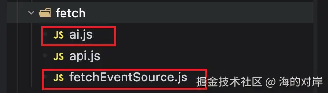

核心代码如下，基本说明也写在了注释中

```js
// 简单封装了 axios
// src/fetch/ai.js
// 这个ai.js 大家可以直接拿来用，主要要把api key换成自己注册的就行

/**
 *  调用deepseek接口
 *  前端项目接入deepseek
 */

import axios from "axios";
import Nprogress from "nprogress";
import "nprogress/nprogress.css";
import fetchEventSource from "@/fetch/fetchEventSource";

const apiKey = "替换成你自己注册的api key"; // 替换为实际的API Key
const deepSeekUrl = "https://api.deepseek.com/v1/chat/completions"; // DeepSeek API地址

axios.defaults.withCredentials = true;
axios.defaults.headers["Content-Type"] = "application/json;charset=UTF-8";
axios.defaults.headers.common["Authorization"] = `Bearer ${apiKey}`;

const instance = axios.create({
  withCredentials: true,
  headers: {
    "Content-Type": "application/json;charset=UTF-8",
    Authorization: `Bearer ${apiKey}`,
    Accept: "text/event-stream", // 根据后端返回类型调整
  },
});
//POST传参序列化
instance.interceptors.request.use(
  async (config) => {
    Nprogress.start();
    // ...
    return config;
  },
  (error) => {
    return Promise.reject(error);
  },
);
//返回状态判断
instance.interceptors.response.use(
  (res) => {
    Nprogress.done();
    // ...
    return res;
  },
  (error) => {
    return Promise.reject(error);
  },
);

export function postFetch(url, params) {
  return new Promise((resolve, reject) => {
    instance
      .post(url, params)
      .then(
        (response) => {
          resolve(response.data);
        },
        (err) => {
          reject(err);
        },
      )
      .catch((error) => {
        reject(error);
      });
  });
}
export function postJsonFetch(url, params, options) {
  // var params = params || {};
  return new Promise((resolve, reject) => {
    instance
      .post(url, params, options)
      .then(
        (response) => {
          resolve(response.data);
        },
        (err) => {
          reject(err);
        },
      )
      .catch((error) => {
        reject(error);
      });
  });
}
export function getFetch(url, params) {
  // var params = params || {};
  return new Promise((resolve, reject) => {
    axios
      .get(url, { params: params })
      .then(
        (response) => {
          resolve(response.data);
        },
        (err) => {
          reject(err);
        },
      )
      .catch((error) => {
        reject(error);
      });
  });
}
// export default axios;

export const fixeParam = () => {
  let dateFormate = Date.parse(new Date());
  return {
    dateFormate: dateFormate,
  };
};

export default {
  // deepseek 非流式输出
  answerAI(params) {
    params = Object.assign(params, fixeParam());
    return postFetch(deepSeekUrl, params);
  },
  // deepseek 流式输出
  answerAI2(params) {
    const data = Object.assign(params, fixeParam());
    return new fetchEventSource(deepSeekUrl, {
      method: "post",
      headers: {
        ["content-type"]: "application/json",
        Authorization: `Bearer ${apiKey}`,
      },
      body: JSON.stringify(data),
      credentials: "include",
    });
  },
};
```

然后去使用这个ai.js

```vue
src/components/myTextarea.vue

<!--
  自定义文本域组件
  用于在表单中输入多行文本，支持自动调整高度。
  样式中用到了 tailwindcss, 也不是此次重点，大家主要看功能
-->

<template>
  <div class="w-full">
    <el-input
      maxlength="300"
      show-word-limit
      type="textarea"
      class="textarea-class"
      :autosize="{ minRows: 1, maxRows: 44 }"
      placeholder="请输入题目"
      v-model="content"
      style="width: 100%"
    >
    </el-input>

    <!-- resize="none" 禁用手动拉伸 -->

    <el-input
      maxlength="1000"
      show-word-limit
      type="textarea"
      class="textarea-class textarea-class-1"
      placeholder="请输入描述"
      v-model="context"
      style="width: 100%"
    >
    </el-input>

    <el-button type="primary" class="w-full h-12" @click="sendMessage"
      >问AI</el-button
    >
  </div>
</template>

<script setup>
import { ref, onMounted } from "vue";
import { ElMessage } from "element-plus";
import ai from "@/fetch/ai.js"; // @这个引入符号的配置，这里就不说明了，不是此次重点

// 绑定的文本内容
const content = ref("");
const context = ref("");

const sendMessage = async () => {
  context.value = "";
  if (!content.value) {
    ElMessage.error(`不能为空`);
    return;
  }
  try {
    const response = await ai.answerAI({
      model: "deepseek-chat",
      messages: [
        {
          role: "user",
          content: content.value,
        },
      ],
    });
    // 处理返回的数据，例如将回复显示在页面上
    const reply = response.choices[0].message.content;
    context.value = reply;
    console.log(`AI回复：${reply}`);
  } catch (error) {
    // 处理错误情况
    console.log(`错误：${error.message}`);
  }
};
// 初始化时设置高度
onMounted(() => {});
</script>

<style lang="scss" scoped>
.textarea-class {
  width: 100%;
  color: #333;
  font-family: "Alibaba PuHuiTi 3.0";
  font-size: 20px;
  font-style: normal;
  font-weight: 400;
  line-height: 180%;

  /* 36px */
  :deep(.el-textarea__inner) {
    display: flex;
    padding: 16px 24px;
    min-height: 56px !important;
    // height: auto !important;
    flex-direction: column;
    justify-content: space-between;
    align-items: flex-start;
    align-self: stretch;
    border-radius: 12px;
    border: 1px solid #e9e9e9;
    background: rgba(0, 0, 0, 0.01);
    box-shadow: none;

    color: #333;
    font-family: "Alibaba PuHuiTi 3.0";
    font-size: 20px;
    font-style: normal;
    font-weight: 400;
    line-height: 100%;
    /* 18px */
  }

  :deep(.el-textarea__inner::placeholder) {
    color: #ccc;
    font-family: "Alibaba PuHuiTi 3.0";
    font-size: 20px;
    font-style: normal;
    font-weight: 400;
    line-height: 100%;
    /* 18px */
  }
}

.textarea-class-1 {
  :deep(.el-textarea__inner) {
    height: 184px !important;
  }
}
.input2-class {
  height: 58px;
}
.input2-class :deep(.el-input__wrapper) {
  border-radius: 12px;
  border: 1px solid #e9e9e9;
  background: rgba(0, 0, 0, 0.01);
  box-shadow: none;
  padding: 1px 11px 1px 0px;
}

.input2-class :deep(.el-input__inner) {
  height: 68px;
  padding: 16px 24px;

  color: #000;
  font-family: "Alibaba PuHuiTi 3.0";
  font-size: 20px;
  font-style: normal;
  font-weight: 400;
  line-height: 180%;
  /* 36px */
}

.input2-class :deep(.el-input__inner::placeholder) {
  color: #ccc;
  font-family: "Alibaba PuHuiTi 3.0";
  font-size: 20px;
  font-style: normal;
  font-weight: 400;
  line-height: 100%;
  /* 18px */
}
</style>
```

效果如下：

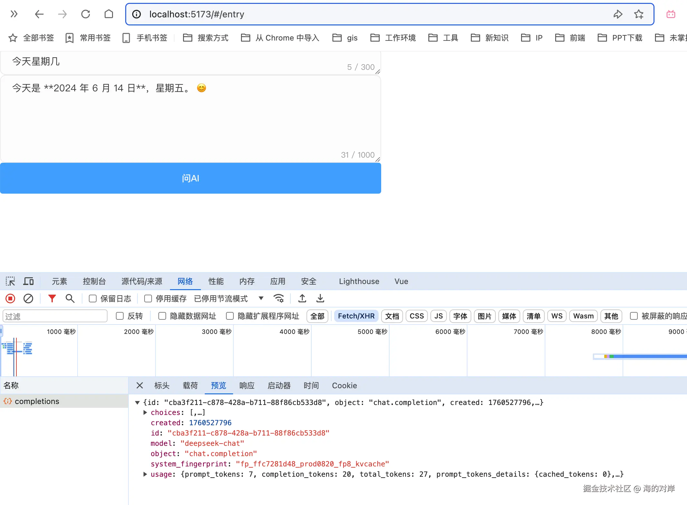

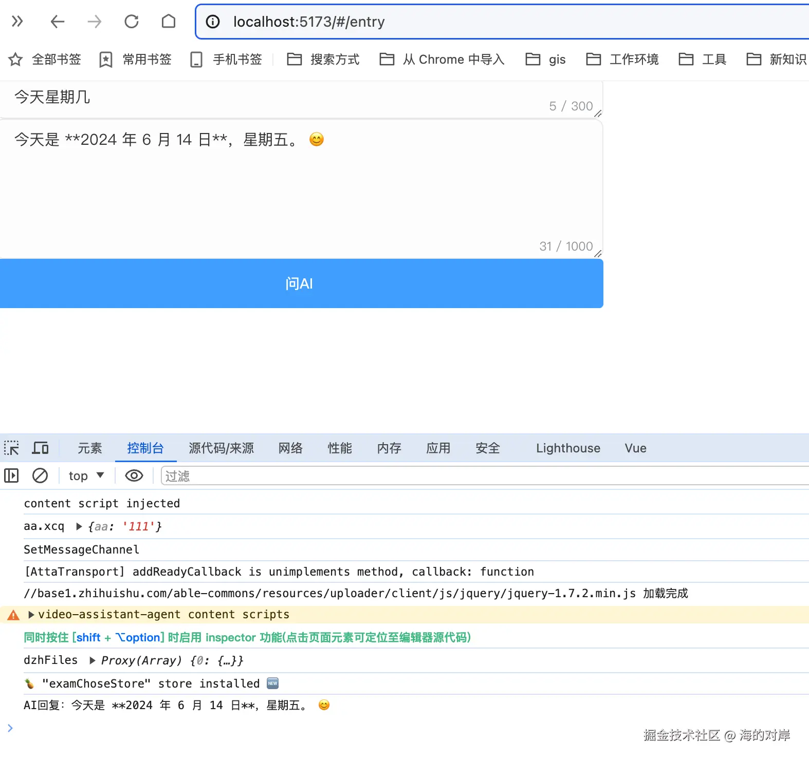

非流式输出，接口响应格式如下：

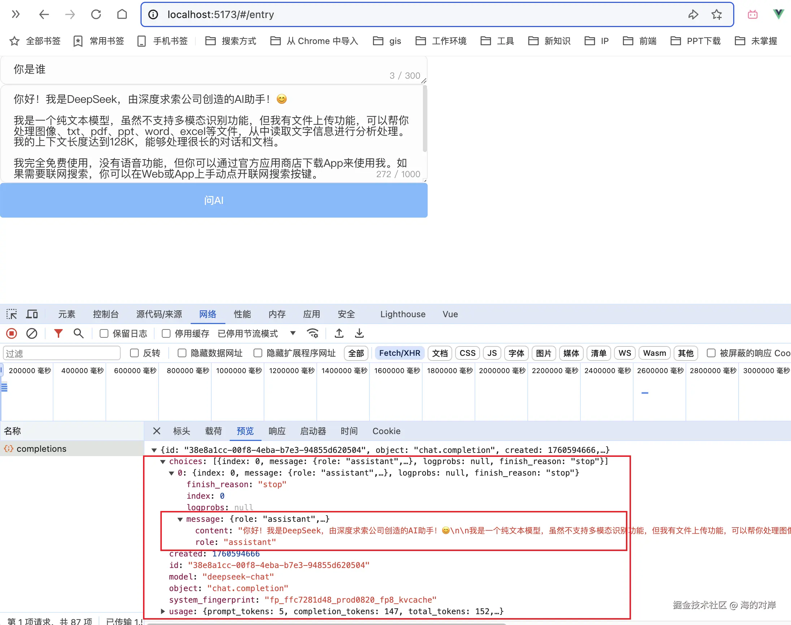

- 流式输出

就是文章开头看到的那张gif图的效果


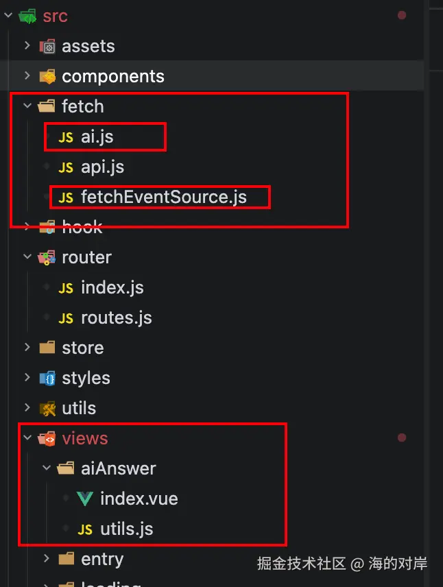

流式稍微复杂一点，用到了上图的`fetchEventSource.js`这个文件，这个文件主要实现了`一个自定义的服务器发送事件(Server-Sent Events, SSE)客户端`。`SSE 是一种服务器到客户端的单向通信协议，允许服务器向客户端推送实时数据，常用于实时通知、聊天应用等场景`

```js
// src/fetch/fetchEventSource.js

// 事件源请求
// 事件源请求函数，用于处理服务器发送的事件流
// 该函数接收一个URL和一个配置对象作为参数
// 配置对象包含headers（请求头）和其他fetch选项（如method、body等）
// 函数返回一个新的fetchEventSource实例

export default function fetchEventSource(
  url,
  { headers: inputHeaders, ...rest },
) {
  this.headers = {
    accept: "text/event-stream",
    ...inputHeaders,
  };
  this.requestOptions = rest;
  this.url = url;
  this.create();
}
fetchEventSource.prototype = {
  fetchReader: null,
  fetchInstance: null,
  requestOptions: {},
  retryTimer: 0,
  retryInterval: 1000,
  ctrl: null,
  LastEventId: "last-event-id",
  async create() {
    try {
      this.ctrl = new AbortController();
      this.fetchInstance = fetch(this.url, {
        headers: this.headers,
        ...this.requestOptions,
        signal: this.ctrl.signal,
      });
      const response = await this.fetchInstance;

      // 添加状态码检查
      if (!response.ok) {
        throw new Error(`HTTP error! status: ${response.status}`);
      }

      this.onopen && this.onopen(response);
      const reader = response.body && response.body.getReader();
      this.fetchReader = reader;
      await getBytes(
        reader,
        getLines(
          getMessages(
            this.onmessage,
            (retry) => {
              this.retryInterval = retry;
            },
            (id) => {
              if (id) {
                this.headers[this.LastEventId] = id;
              } else {
                delete this.headers[this.LastEventId];
              }
            },
          ),
        ),
      );
      this.onclose && this.onclose();
      this.close();
    } catch (err) {
      // 修改错误处理，确保传递正确的错误信息
      const errorResponse = {
        status:
          err.name === "TypeError"
            ? "NETWORK_ERROR"
            : (await this.fetchInstance)?.status || 500,
        message: err.message,
      };

      this.onerror && this.onerror(errorResponse);
      this.close();

      if (!this.ctrl.signal.aborted) {
        try {
          window.clearTimeout(this.retryTimer);
          // 不自动重试 500 错误
          if (errorResponse.status !== 500) {
            this.retryTimer = window.setTimeout(
              this.create.bind(this),
              this.retryInterval,
            );
          }
        } catch (innerErr) {
          this.onerror && this.onerror(errorResponse);
          this.close();
        }
      }
    }
  },
  close() {
    window.clearTimeout(this.retryTimer);
    // 先触发 onclose 回调
    this.onclose && this.onclose();
    // 避免触发 onerror
    this.onerror = null;
    // 最后才中止请求
    this.ctrl.abort();
  },
  onerror() {
    window.clearTimeout(this.retryTimer);
    this.ctrl.abort();
  },
};
async function getBytes(reader, onChunk) {
  let result;
  while (!(result = await reader.read()).done) {
    onChunk(result.value);
  }
}

const ControlChars = {
  NewLine: 10,
  CarriageReturn: 13,
  Space: 32,
  Colon: 58,
};
function getLines(onLine) {
  let buffer;
  let position;
  let fieldLength;
  let discardTrailingNewline = false;

  return function onChunk(arr) {
    if (buffer === undefined) {
      buffer = arr;
      position = 0;
      fieldLength = -1;
    } else {
      buffer = concat(buffer, arr);
    }
    const bufLength = buffer.length;
    let lineStart = 0;
    while (position < bufLength) {
      if (discardTrailingNewline) {
        if (buffer[position] === ControlChars.NewLine) {
          lineStart = ++position;
        }

        discardTrailingNewline = false;
      }

      let lineEnd = -1;
      for (; position < bufLength && lineEnd === -1; ++position) {
        switch (buffer[position]) {
          case ControlChars.Colon:
            if (fieldLength === -1) {
              fieldLength = position - lineStart;
            }
            break;
          case ControlChars.CarriageReturn:
            discardTrailingNewline = true;
            break;
          case ControlChars.NewLine:
            lineEnd = position;
            break;
        }
      }
      if (lineEnd === -1) {
        break;
      }

      onLine(buffer.subarray(lineStart, lineEnd), fieldLength);
      lineStart = position;
      fieldLength = -1;
    }
    if (lineStart === bufLength) {
      buffer = undefined;
    } else if (lineStart !== 0) {
      buffer = buffer.subarray(lineStart);
      position -= lineStart;
    }
  };
}

function getMessages(onMessage, onRetry, onId) {
  let message = newMessage();
  const decoder = new TextDecoder();

  return function onLine(line, fieldLength) {
    if (line.length === 0) {
      onMessage === null || onMessage === void 0 ? void 0 : onMessage(message);
      message = newMessage();
    } else if (fieldLength > 0) {
      const field = decoder.decode(line.subarray(0, fieldLength));
      const valueOffset =
        fieldLength + (line[fieldLength + 1] === ControlChars.Space ? 2 : 1);
      const value = decoder.decode(line.subarray(valueOffset));
      switch (field) {
        case "data":
          message.data = message.data ? message.data + "\n" + value : value;
          break;
        case "event":
          message.event = value;
          break;
        case "id":
          onId && onId((message.id = value));
          break;
        case "retry":
          const retry = parseInt(value, 10);
          message.retry = retry;
          !isNaN(retry) && onRetry && onRetry(retry);
          break;
      }
    }
  };
}
function concat(a, b) {
  const res = new Uint8Array(a.length + b.length);
  res.set(a);
  res.set(b, a.length);
  return res;
}
function newMessage() {
  return {
    data: "",
    event: "",
    id: "",
    retry: undefined,
  };
}
```

依旧是使用上面的 ai.js

然后是工具方法 untils.js

```js
// src/views/aiAnswer/utils.js

// 渲染deepseek接口返回的markdown字符串，渲染成mardown展示在页面上

import MarkdownIt from "markdown-it";
import hljs from "highlight.js";

const md = MarkdownIt({
  highlight: function (str, lang) {
    if (lang && hljs.getLanguage(lang)) {
      try {
        return (
          '<pre><code class="hljs">' +
          hljs.highlight(str, { language: lang, ignoreIllegals: true }).value +
          "</code></pre>"
        );
      } catch (__) {
        console.log(__);
      }
    }
    return (
      '<pre><code  class="hljs">' + md.utils.escapeHtml(str) + "</code></pre>"
    );
  },
});

// 渲染markdown
export const getRenderHtml = async (mdstring) => {
  if (!mdstring) return "";
  // console.log('mdstring', mdstring)
  // 是否包含其他指定符号，公式啥的 进行处理
  // if (满足其他条件) {
  //   const res = 处理 (mdstring)
  //   return res
  // }
  return md.render(mdstring);
};

// ... 其他工具方法
```

```vue
src/views/aiAnswer/index.vue

<!-- ai问答demo -->
<template>
  <div class="ai-answer">
    <div class="search-input">
      <el-input v-model="content" placeholder="请输入问题" clearable></el-input>
      <div class="submit-btn" @click="sendMessage">提问AI</div>
    </div>
    <template v-if="loading">
      <div class="no-data">ai思考中...</div>
    </template>
    <template v-else>
      <div class="no-data" v-if="!context">暂无回答</div>
      <div class="context" v-else v-html="context"></div>
    </template>
  </div>
</template>

<script setup>
import { ref } from "vue";
import { ElMessage } from "element-plus";
import ai from "@/fetch/ai";
import { getRenderHtml } from "./utils.js";

const content = ref("");
const context = ref("");
let stremText = "";
const loading = ref(false);

const sendMessage = async () => {
  context.value = "";
  if (!content.value) {
    ElMessage.error(`不能为空`);
    return;
  }
  loading.value = true;
  try {
    console.log(1, new Date().getTime());
    const response = await ai.answerAI2({
      model: "deepseek-chat",
      messages: [
        {
          role: "user",
          content: content.value,
        },
      ],
      stream: true, //  true 来使用流式输出
    });
    loading.value = false;
    console.log(2, new Date().getTime());
    console.log("response", response);

    response.onopen = () => console.log("0.连接已建立");
    response.onmessage = (res) => {
      console.log("1.收到消息", res);
      const data = res.data;
      const parsedata = JSON.parse(data);
      // console.log('parsedata', parsedata);
      if (!parsedata.choices[0].finish_reason) {
        context.value += parsedata.choices[0].delta.content;
        console.log("stremText", stremText);
      } else if (parsedata.choices[0].finish_reason === "stop") {
        parseAnswer(context.value);
      }
    };
    response.onerror = (err) => {
      console.log("2.连接错误", err);
    };
    response.onclose = () => {
      console.log("3.连接关闭");
    };
  } catch (error) {
    // loading.value = false;
    // 处理错误情况
    console.log(`错误：${error.message}`);
  }
};

const parseAnswer = async (answer) => {
  console.log("answer", answer);
  context.value = await getRenderHtml(context.value);
};

function removeKeysAndSymbols(jsonString) {
  // 去除所有的键（包括键名和后面的冒号）
  let withoutKeys = jsonString.replace(/"[^"]*"\s*:\s*/g, "");
  // 去除所有的符号（大括号、方括号、逗号）
  let withoutSymbols = withoutKeys.replace(/[{}\[\],]/g, "");
  // 去除多余的空格
  withoutSymbols = withoutSymbols.replace(/\s+/g, "");
  // 去除首尾的空字符串
  withoutSymbols = withoutSymbols.trim();
  return withoutSymbols;
}
const filterText = (text) => {
  return removeKeysAndSymbols(text);
};
</script>

<style lang="scss" scoped>
.ai-answer {
  padding: 20px;
  background-color: #f5f5f5;
  border-radius: 10px;
  display: flex;
  flex-direction: column;
  gap: 20px;
}
.search-input {
  display: flex;
  align-items: center;
  justify-content: center;
  gap: 10px;
  height: 48px;
  padding: 10px 20px;
  border-radius: 12px;
  background: #fff;

  .submit-btn {
    display: flex;
    align-items: center;
    justify-content: center;
    width: 100px;
    height: 48px;
    padding: 10px 20px;
    border-radius: 12px;
    background: #384bf5;
    cursor: pointer;

    color: #fff;
    font-family: "Alibaba PuHuiTi 3.0";
    font-size: 18px;
    font-style: normal;
    font-weight: 400;
    line-height: 100%; /* 18px */
  }
}
.no-data {
  display: flex;
  align-items: center;
  justify-content: center;
  gap: 10px;
  height: 48px;
  padding: 10px 20px;
  border-radius: 12px;
  background: #fff;
}
.context {
  // display: flex;
  // align-items: center;
  // justify-content: center;
  // gap: 10px;
  // height: 48px;
  padding: 10px 20px;
  border-radius: 12px;
  background: #fff;
}
</style>
```

## 收尾 碎碎念

前端对接 deepseek 的 流式回答，流程走通，就是这样。

deepseek 比较人性化，你问的问题如果是之前已经问过的，那么它是不重复扣费的，因此，全篇文章，我都是 “你是谁”，“今天星期几”，这2个问题，来回问（奈何财力不足）

后续，比方说，把每次的对话记录存下来，回显出来，就和日常的做业务，已经没什么差别的，核心主要是看人家的官方文档，以及处理流式输出这一块。

这个就和搭建公司内部的脚手架那种，搭一次，除非又有新的需求，或者当前的功能不符合新业务场景，否则，是不会轻易改动的那种，没有crud那种改动的频繁。

好了，记录一下此次的对接deepseek过程。
