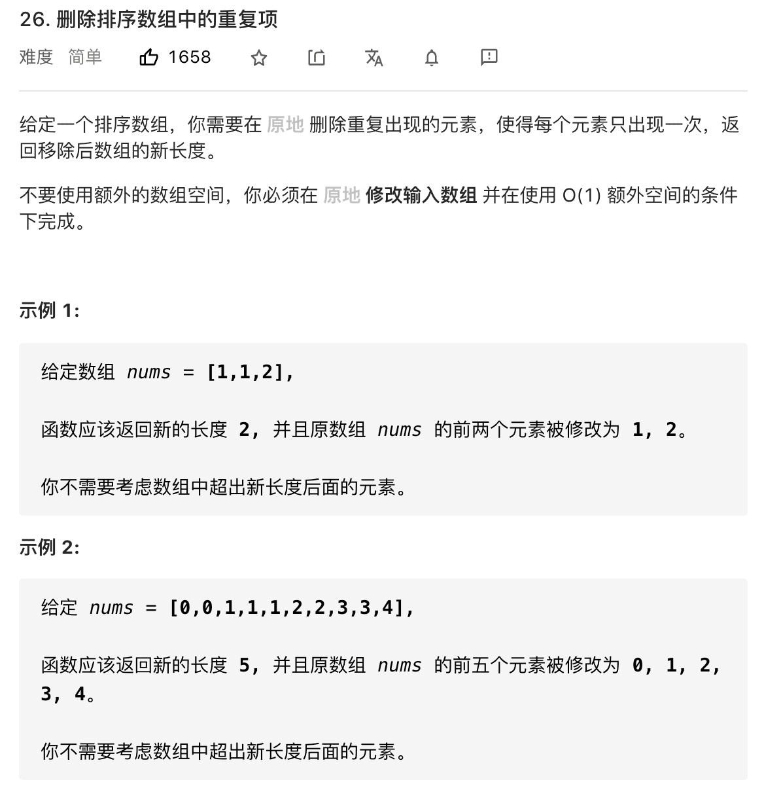
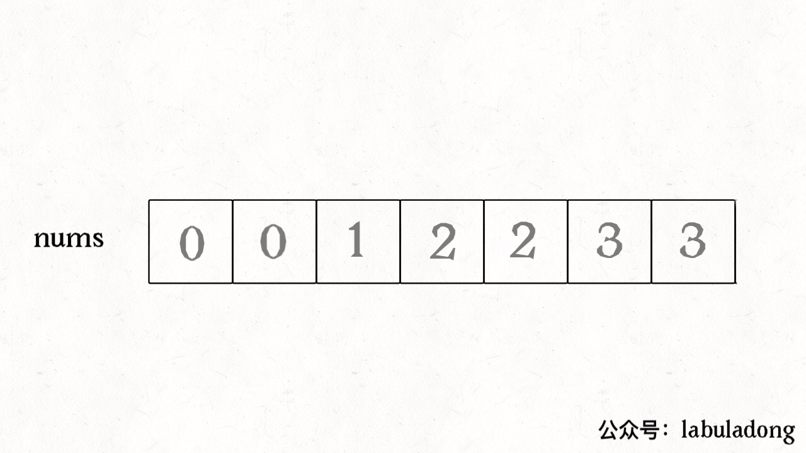
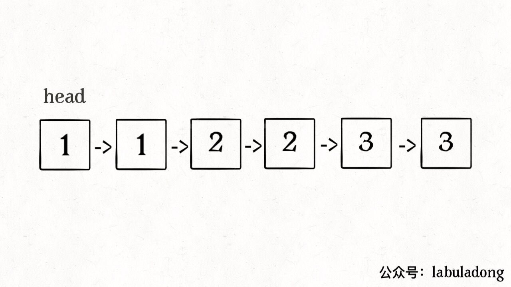
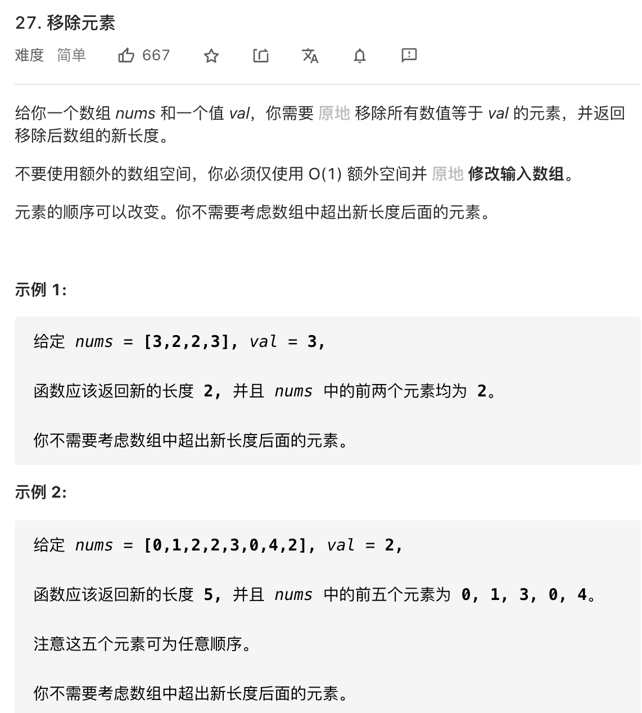

## 双指针技巧：原地修改数组

<!--more-->

我们知道对于**数组**来说，在`尾部插入`、`删除元素`是比较高效的，时间复杂度是 `O(1)`，但是如果在`中间`或者`开头插入`、`删除元素`，就会涉及`数据的搬移`，时间复杂度为 `O(N)`，效率较低。

那么这篇文章我们来看几个场景，讲一讲如何在原地修改数组，避免数据的搬移。

### 有序数组/链表去重

先讲讲如何对一个有序数组去重，先看下题目：



函数签名如下：

```js
var removeDuplicates = function(nums) {...}
```

显然，由于`数组已经排序`，所以重复的元素一定连在一起，找出它们并不难，但如果毎找到一个重复元素就立即删除它，就是在数组中间进行删除操作，整个时间复杂度是会达到 `O(N^2)`。

简单解释一下什么是原地修改：

如果不是原地修改的话，我们直接 new 一个 `int[]` 数组，把去重之后的元素放进这个新数组中，然后返回这个新数组即可。

但是原地删除，不允许我们 new 新数组，只能在原数组上操作，然后返回一个长度，这样就可以通过返回的长度和原始数组得到我们去重后的元素有哪些了。

这种需求在数组相关的算法题中时非常常见的，通用解法就是使用**快慢指针技巧**。

我们让慢指针 `slow` 走在后面，快指针 `fast` 走在前面探路，找到一个不重复的元素就告诉 `slow` 并让 `slow` 前进一步。这样当 `fast` 指针遍历完整个数组 `nums` 后，`nums[0..slow] `**就是不重复元素**。

```js
/**
 * @param {number[]} nums
 * @return {number}
 */
var removeDuplicates = function (nums) {
  if (nums.length <= 0) return 0;
  let slow = 0;
  fast = 0;
  while (fast < nums.length) {
    if (nums[fast] !== nums[slow]) {
      slow++;
      // 维护 nums[0..slow] 无重复
      nums[slow] = nums[fast];
    }
    fast++;
  }
  // 数组长度为索引 + 1
  return slow + 1;
};
```

看下算法执行的过程：



再简单扩展一下，如果给你一个有序链表，如何去重呢？这是力扣第 83 题，其实和数组去重是一模一样的，唯一的区别是把数组赋值操作变成操作指针而已：

```js
/**
 * Definition for singly-linked list.
 * function ListNode(val, next) {
 *     this.val = (val===undefined ? 0 : val)
 *     this.next = (next===undefined ? null : next)
 * }
 */
/**
 * @param {ListNode} head
 * @return {ListNode}
 */
var deleteDuplicates = function (head) {
  if (head == null) return head;
  let slow = head;
  let fast = head;
  while (fast !== null) {
    if (fast.val !== slow.val) {
      // nums[slow] = nums[fast];
      slow.next = fast; // 此处容易出错
      // slow++;
      slow = slow.next;
    }
    fast = fast.next;
  }
  // 断开与后面重复元素的连接
  slow.next = null;
  return head;
};
```



**还有一种方法**，也是一次遍历

思路与算法

由于给定的链表是排好序的，因此**重复的元素在链表中出现的位置是连续的**，因此我们只需要对链表进行一次遍历，就可以删除重复的元素。

具体地，我们从指针 `cur` 指向链表的头节点，随后开始对链表进行遍历。如果当前 `cur` 与 `cur.next` 对应的元素相同，那么我们就将 `cur.next` 从链表中移除；否则说明链表中已经不存在其它与 `cur` 对应的元素相同的节点，因此可以将 `cur` 指向 `cur.next`。

当遍历完整个链表之后，我们返回链表的头节点即可。

细节

当我们遍历到链表的最后一个节点时，`cur.next` 为空节点，如果不加以判断，访问 `cur.next` 对应的元素会产生运行错误。因此我们只需要遍历到链表的最后一个节点，而不需要遍历完整个链表。

```js
var deleteDuplicates = function (head) {
  if (!head) return head;

  let cur = head;
  while (cur.next) {
    if (cur.val === cur.next.val) {
      // 此处容易出错
      cur.next = cur.next.next;
    } else {
      cur = cur.next;
    }
  }
  return head;
};
```

- 时间复杂度：O(n)，其中 n 是链表的长度。
- 空间复杂度：O(1)O(1)。

### 移除元素

这是力扣第 27 题，看下题目：



函数签名如下：

```js
var removeElement = function(nums, val) {...}
```

题目要求我们把 `nums` 中所有值为 `val` 的元素原地删除，依然需要使用 [双指针技巧](https://app6aigdwnl3832.h5.xiaoeknow.com/p/course/text/i_62148a3fe4b066e96087ce27?product_id=p_62148645e4b0beaee42c897e) 中的快慢指针：

如果 `fast` 遇到需要去除的元素，则直接跳过，否则就告诉 `slow` 指针，并让 `slow` 前进一步。

这和前面说到的数组去重问题解法思路是完全一样的，就不画 GIF 了，直接看代码：

```js
/**
 * @param {number[]} nums
 * @param {number} val
 * @return {number}
 */
var removeElement = function (nums, val) {
  let slow = 0,
    fast = 0;
  while (fast < nums.length) {
    if (nums[fast] !== val) {
      nums[slow] = nums[fast];
      slow++;
    }
    fast++;
  }
  return slow;
};
```

**注意这里和有序数组去重的解法有一个重要不同**，我们这里是先给 `nums[slow]` 赋值然后再给 `slow++`，这样可以保证 `nums[0..slow-1]` 是不包含值为 `val` 的元素的，最后的结果数组长度就是 `slow`。

本文就到这里，请你完成如下作业，进行巩固。

移动零也写下吧
方法还是 双指针，快慢指针

解题思路1

- 利用快慢指针，快指针指向的元素如果不等于0的话，放把它放到前面来，也就是放到慢指针所指向的位置，慢指针向后移1位
- 快指针走到数组末尾了，慢指针前面的都是不等于0的元素
- 把慢指针后面的元素都置为0

方法1

```js
/**
 * @param {number[]} nums
 * @return {void} Do not return anything, modify nums in-place instead.
 */
var moveZeroes = function (nums) {
  let fast = 0,
    slow = 0;
  while (fast < nums.length) {
    if (nums[fast] != 0) {
      nums[slow++] = nums[fast];
    }
    fast++;
  }
  while (slow < nums.length) {
    nums[slow++] = 0;
  }
};
```

解题思路2

- 解题思路1在于只把快指针指向的不等于0的元素都移动到慢指针的位置来，其实我们可以进一步想
- 快指针指向的不等于0的元素，把它跟慢指针指向的元素交换
- 当快指针走到末尾的时候，其实已经全部交换完毕了，前面的都是不为0的元素，后面的都是0的元素了

方法2

```js
/**
 * @param {number[]} nums
 * @return {void} Do not return anything, modify nums in-place instead.
 */
var moveZeroes = function (nums) {
  if (nums.length < 0) return;
  let fast = 0,
    slow = 0;
  // 快慢指针
  while (fast < nums.length) {
    if (nums[fast] !== 0) {
      [nums[fast], nums[slow]] = [nums[slow], nums[fast]];
      slow++;
    }
    fast++;
  }
};
```

### 作业

[26.删除排序数组中的重复项（简单）](https://leetcode-cn.com/problems/remove-duplicates-from-sorted-array/)

[27.移除元素（简单）](https://leetcode-cn.com/problems/remove-element/)

### 附加题

[283.移动零（简单）](https://leetcode-cn.com/problems/move-zeroes/)

[83.删除排序链表中的重复元素（简单）](https://leetcode-cn.com/problems/remove-duplicates-from-sorted-list/)
