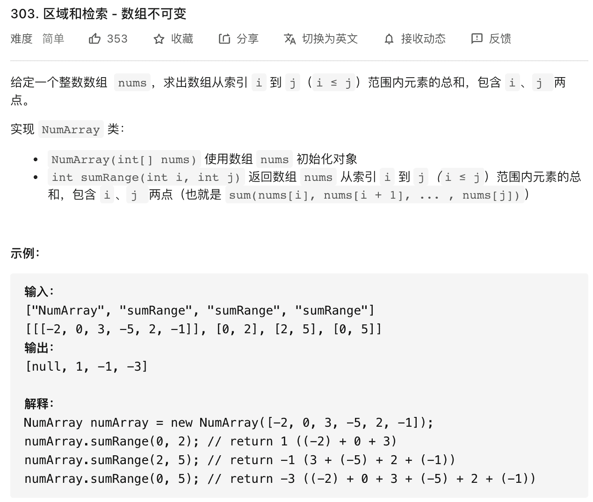
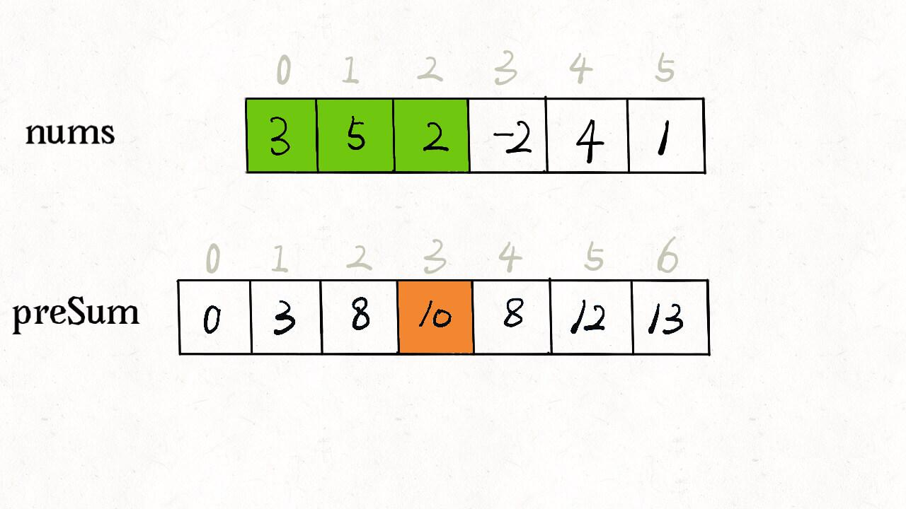

## 前缀和技巧

<!--more-->

前缀和技巧适用于快速计算一个索引区间内的元素之和。

这道力扣题目 [303. 区域和检索 - 数组不可变（中等）](https://leetcode-cn.com/problems/range-sum-query-immutable/) 就是前缀和的基本使用场景：



题目要求你实现这样一个类：

```java
class NumArray {
    public NumArray(int[] nums) {

    }
    
    public int sumRange(int left, int right) {

    }
}
```

`sumRange` 函数需要计算并返回一个索引区间之内的元素和，没学过前缀和的人可能写出如下代码：

```java
class NumArray {

    private int[] nums;

    public NumArray(int[] nums) {
        this.nums = nums;
    }
    
    public int sumRange(int left, int right) {
        int res = 0;
        for (int i = left; i ‹= right; i++) {
            res += nums[i];
        }
        return res;
    }
}
```

这样，可以达到效果，但是效率很差，因为 `sumRange` 的时间复杂度是 `O(N)`，其中 `N` 代表 `nums` 数组的长度。

这道题的最优解法是使用前缀和技巧，将 `sumRange` 函数的时间复杂度降为 `O(1)`。

由于这是第一课，所以我说的细一点，什么是时间复杂度？

### 时间复杂度概念

我们不要说太多的数学公式，因为说的太细了也用不到。

**你就记住，时间复杂度就是代码在最坏情况下的执行次数**。

再说的简单一点，你就找 for 或者 while 这种循环就行了，循环执行了几次，时间复杂度就是多少。

```java
// 时间复杂度 O(N)
void func(int N) {
    for (int i = 0; i ‹ N; i++) {
        System.out.println("hello world");
    }
}

// 时间复杂度 O(N^2)
void func(int N) {
    for (int i = 0; i ‹ N; i++) {
        for (int j = 0; j ‹ N; j++) {
            System.out.println("hello world");
        }
    }
}

// 时间复杂度 O(MN)
void func(int M, int N) {
    for (int i = 0; i ‹ M; i++) {
        for (int j = 0; j ‹ N; j++) {
            System.out.println("hello world");
        }
    }
}
```

上面这些例子很好理解吧，print 函数执行的次数就是时间复杂度。

也许你会问，我好像从来没见过形如 `O(N - 1), O(2N)`，这样的时间复杂度？

是的，这就是这个大写的 `O` 的一个特性，所谓「Big O 表示法」。

你只需要写近似的复杂度，不用追求这些细枝末节，一切常数因子，加减一个常数，加减一个次数较低的项，都可以在 Big O 表示法中省略。

比如下面这几个例子：

```java
// 时间复杂度 O(N - 1) = O(N)
void func(int N) {
    for (int i = 0; i ‹ N - 1; i++) {
        System.out.println("hello world");
    }
}

// 时间复杂度 O(N - 999) = O(N)
void func(int N) {
    for (int i = 0; i ‹ N - 999; i++) {
        System.out.println("hello world");
    }
}

// 时间复杂度 O(100N) = O(N)
void func(int N) {
    for (int i = 0; i ‹ 100 * N; i++) {
        System.out.println("hello world");
    }
}

// 时间复杂度 O(N+N-1+N-2+...+1) 
    //    = O( N*(N+1)/2 )
    //    = O( N^2 + N/2 )
    //    = O(N^2)
void func(int N) {
    for (int i = 0; i ‹ N; i++) {
        for (int j = i; j ‹ N; j++) {
            System.out.println("hello world");
        }
    }
}
```

那什么叫做「最坏」时间复杂度呢？

比如我们之前实现的 `sumRange` 函数代码：

```java
public int sumRange(int left, int right) {
    int res = 0;
    for (int i = left; i ‹= right; i++) {
        res += nums[i];
    }
    return res;
}
```

这个 `left` 和 `right` 都是调用方传入的，我怎么知道他会输入什么？

如果调用方输入 `left = 0, right = 0`，那我这个 for 循环就只循环了 一次，相当于没有循环，时间复杂度是 `O(1)`；

但如果调用方输入 `left = 0, right = nums.length-1`，那我这个 for 循环相当于遍历了整个 `nums` 数组，时间复杂度是 `O(N)`，其中 `N` 代表 `nums` 数组的长度。

这种情况很常见，我们计算时间复杂度的一个原则就是做「最坏」的打算，所以我们会说 `sumRange` 这个函数的时间复杂度是 `O(N)`。

### 前缀和技巧

说回到前缀和技巧，我们说要将 `sumRange` 函数的时间复杂度降为 `O(1)`，说白了就是不要在 `sumRange` 里面用 for 循环，咋整？

直接看代码实现：

```java
class NumArray {

    // 前缀和数组
    private int[] preSum;

    /* 输入一个数组，构造前缀和 */
    public NumArray(int[] nums) {
        preSum = new int[nums.length + 1];
        // 计算 nums 的累加和
        for (int i = 1; i ‹ preSum.length; i++) {
            preSum[i] = preSum[i - 1] + nums[i - 1];
        }
    }
    
    /* 查询闭区间 [left, right] 的累加和 */
    public int sumRange(int left, int right) {
        return preSum[right + 1] - preSum[left];
    }
}
```

核心思路是我们 new 一个新的数组 `preSum` 出来，`preSum[i]` 记录 `nums[0..i-1]` 的累加和，看图 10 = 3 + 5 + 2：



看这个 `preSum` 数组，如果我想求索引区间 `[1, 4]` 内的所有元素之和，就可以通过 `preSum[5] - preSum[1]` 得出。

这样，`sumRange` 函数仅仅需要做一次减法运算，避免了每次进行 for 循环调用，最坏时间复杂度为常数 `O(1)`。

## 我的题解（javascript）

```js
/**
 * @param {number[]} nums
 */

var NumArray = function (nums) {
  const n = nums.length;
  this.sums = new Array(n + 1).fill(0);
  for (let i = 0; i < n; i++) {
    this.sums[i + 1] = this.sums[i] + nums[i];
  }
};

/**
 * @param {number} left
 * @param {number} right
 * @return {number}
 */
NumArray.prototype.sumRange = function (left, right) {
  return this.sums[right + 1] - this.sums[left];
};
```

这个技巧在生活中运用也挺广泛的，比方说，你们班上有若干同学，每个同学有一个期末考试的成绩（满分 100 分），那么请你实现一个 API，输入任意一个分数段，返回有多少同学的成绩在这个分数段内。

那么，你可以先通过计数排序的方式计算每个分数具体有多少个同学，然后利用前缀和技巧来实现分数段查询的 API：

```java
int[] scores; // 存储着所有同学的分数
// 试卷满分 100 分
int[] count = new int[100 + 1]
// 记录每个分数有几个同学
for (int score : scores)
    count[score]++
// 构造前缀和
for (int i = 1; i ‹ count.length; i++)
    count[i] = count[i] + count[i-1];

// 利用 count 这个前缀和数组进行分数段查询
```

### 作业

[560.和为K的子数组（中等）](https://leetcode-cn.com/problems/subarray-sum-equals-k)

### 附加题

[304. 二维区域和检索 - 矩阵不可变](https://leetcode-cn.com/problems/range-sum-query-2d-immutable/)

这里我提个醒，题目给的是一个二维数组 `matrix`，那么你可以构造一个二维的前缀和数组 `preSum`，然后 `preSum[i][j]` 就记录 `matrix[0..i][0..j]` 的和。

题目让你算 `(x1, y1, x2, y2)` 这个的矩形的和，相当于图中红色矩形之和减去绿色矩形减去蓝色矩形最后加上黄色矩形的和，而红绿蓝黄这几个矩形的和都是在你的 `preSum` 里面记录着的。
