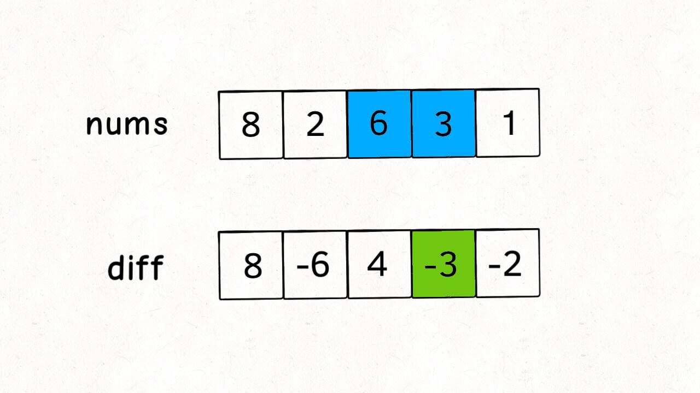
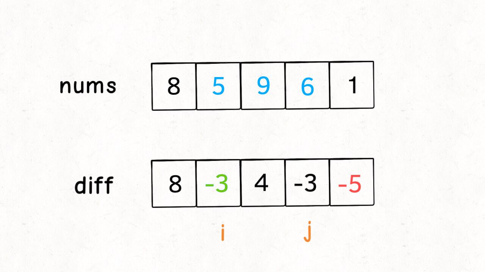
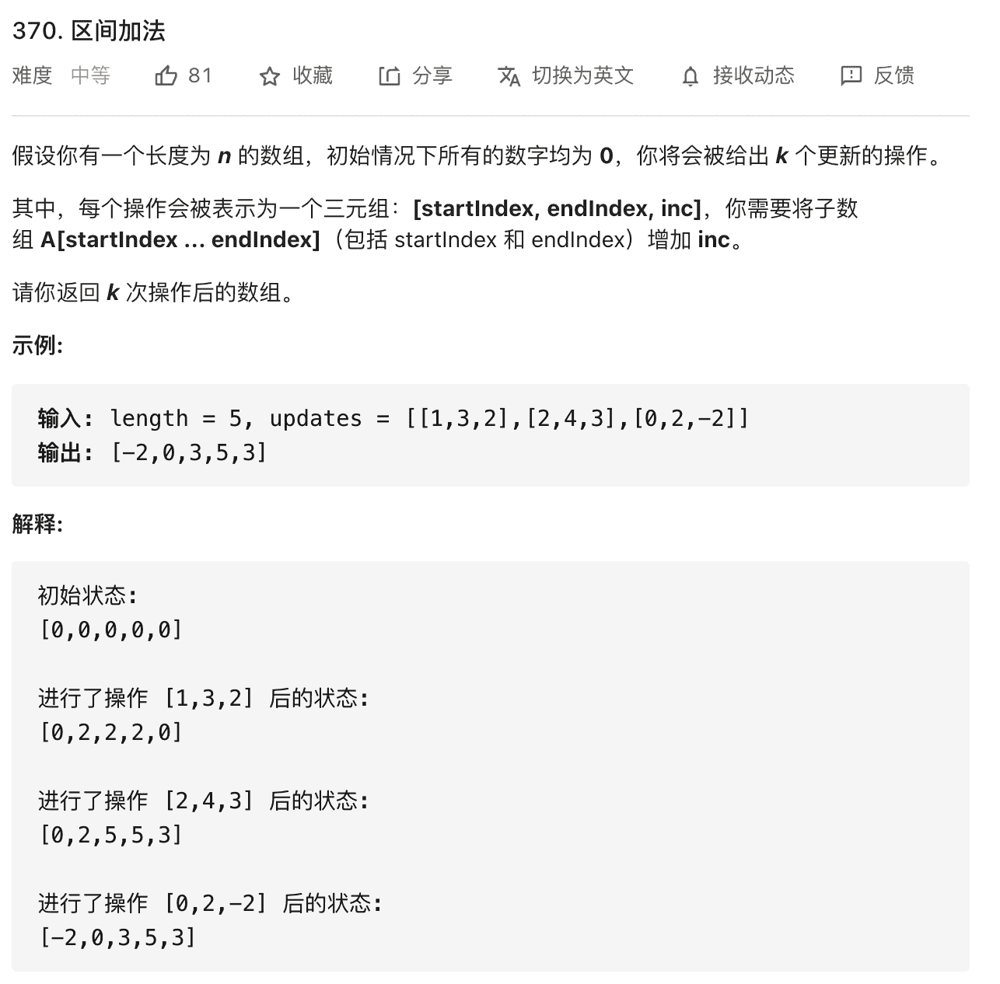
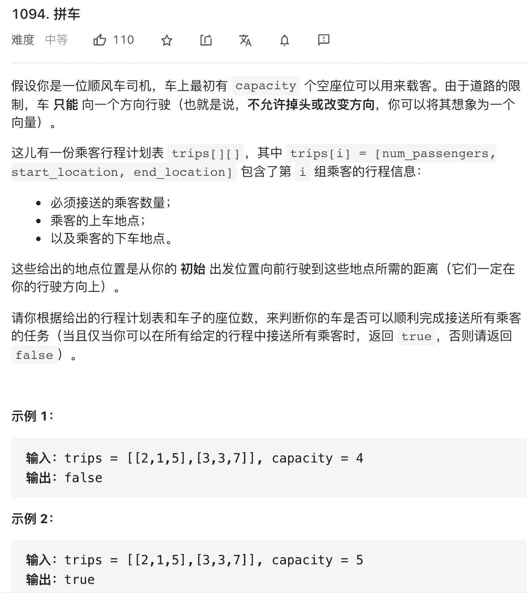
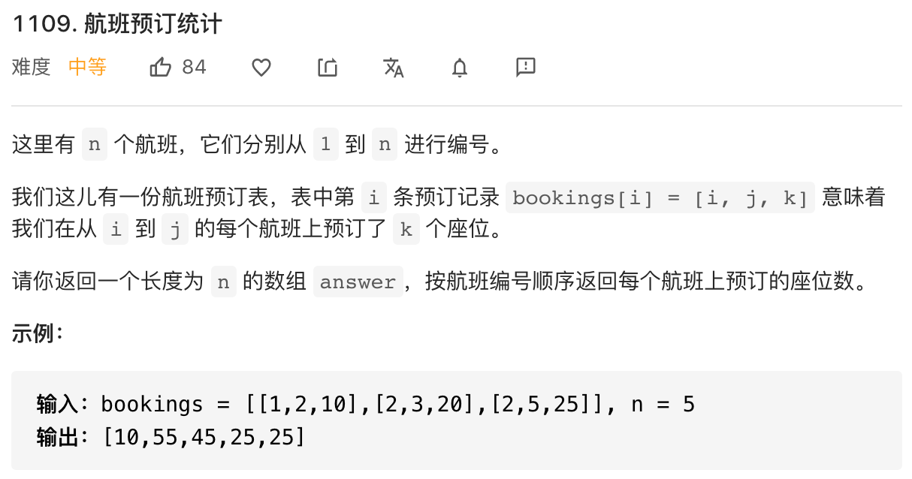

## 差分数组技巧

<!--more-->

前文写过的前缀和技巧是非常常用的算法技巧，**前缀和主要适用的场景是原始数组不会被修改的情况下，频繁查询某个区间的累加和**。

本文讲一个和前缀和思想非常类似的算法技巧「差分数组」，**差分数组的主要适用场景是频繁对原始数组的某个区间的元素进行增减**。

比如说，我给你输入一个数组 `nums`，然后又要求给区间 `nums[2..6]` 全部加 1，再给 `nums[3..9]` 全部减 3，再给 `nums[0..4]` 全部加 2，再给...

一通操作猛如虎，然后问你，最后 `nums` 数组的值是什么？

常规的思路很容易，你让我给区间 `nums[i..j]` 加上 `val`，那我就一个 for 循环给它们都加上呗，还能咋样？

```java
void increment(int[] nums, int i, int j, int val) {
    for (int k = i; k ‹= j; k++) {
        nums[k] += val;
    }
}
```

这种思路的时间复杂度是 O(N)，由于这个场景下对 `nums` 的修改非常频繁，所以效率会很低下，而我们差分数组技巧可以利用一个差分数组，使得这个操作的时间复杂度为 O(1)。

### 差分数组实现

这里就需要差分数组的技巧，类似前文前缀和技巧构造的 `preSum` 数组，我们先对 `nums` 数组构造一个 `diff` 差分数组，`diff[i] `**就是** `nums[i] `**和** `nums[i-1] `**之差**：

```java
int[] diff = new int[nums.length];
// 构造差分数组
diff[0] = nums[0];
for (int i = 1; i ‹ nums.length; i++) {
    diff[i] = nums[i] - nums[i - 1];
}
```



通过这个 `diff` 差分数组是可以反推出原始数组 `nums` 的，代码逻辑如下：

```java
int[] res = new int[diff.length];
// 根据差分数组构造结果数组
res[0] = diff[0];
for (int i = 1; i ‹ diff.length; i++) {
    res[i] = res[i - 1] + diff[i];
}
```

**这样构造差分数组** `diff` **，就可以快速进行区间增减的操作**，如果你想对区间 `nums[i..j]` 的元素全部加 3，那么只需要让 `diff[i] += 3`，然后再让 `diff[j+1] -= 3` 即可：



**原理很简单，回想** `diff` **数组反推** `nums` **数组的过程，** `diff[i] += 3` **意味着给** `nums[i..] `**所有的元素都加了 3，然后** `diff[j+1] -= 3` **又意味着对于** `nums[j+1..] `**所有元素再减 3，那综合起来，是不是就是对** `nums[i..j] `**中的所有元素都加 3 了**？

只要花费 O(1) 的时间修改 `diff` 数组，就相当于给 `nums` 的整个区间做了修改。多次修改 `diff`，然后通过 `diff` 数组反推，即可得到 `nums` 修改后的结果。

现在我们把差分数组抽象成一个类，包含 `increment` 方法和 `result` 方法：

```java
class Difference {
    // 差分数组
    private int[] diff;

    public Difference(int[] nums) {
        assert nums.length › 0;
        diff = new int[nums.length];
        // 构造差分数组
        diff[0] = nums[0];
        for (int i = 1; i ‹ nums.length; i++) {
            diff[i] = nums[i] - nums[i - 1];
        }
    }

    /* 给闭区间 [i,j] 增加 val 或减少 val（val 是负数） */
    public void increment(int i, int j, int val) {
        diff[i] += val;
        if (j + 1 ‹ diff.length) {
            diff[j + 1] -= val;
        }
    }

    public int[] result() {
        int[] res = new int[diff.length];
        // 根据差分数组构造结果数组
        res[0] = diff[0];
        for (int i = 1; i ‹ diff.length; i++) {
            res[i] = res[i - 1] + diff[i];
        }
        return res;
    }
}
```

这里注意一下 `increment` 方法中的 if 语句：

```java
public void increment(int i, int j, int val) {
    diff[i] += val;
    if (j + 1 ‹ diff.length) {
        diff[j + 1] -= val;
    }
}
```

当 `j+1 ›= diff.length` 时，说明是对 `nums[i]` 及以后的整个数组都进行修改，那么就不需要再给 `diff` 数组减 `val` 了。

### 差分数组的运用

首先，力扣 [370. 区间加法](https://leetcode-cn.com/problems/range-addition/description/) 就直接考察了差分数组技巧：



算法的签名如下：

```java
int[] getModifiedArray(int length, int[][] updates);
```

不过，这道题目是 VIP 题目，但我相信你应该是会做的，可以直接用我们之前实现的 `Difference` 类，对 `updates` 数组里面的三元组直接调用 `increment` 方法就行了。

接下来，看几道其他题目，力扣 [1094. 拼车](https://leetcode-cn.com/problems/car-pooling/)：



函数签名：

```java
boolean carPooling(int[][] trips, int capacity) {
```

说白了，题目就是让你对一个初始全为 0 的数组进行区间操作嘛，你可以利用差分数组技巧解决这个问题。

这里再看一下力扣第 1109 题「航班预订统计」：



函数签名如下：

```java
int[] corpFlightBookings(int[][] bookings, int n)
```

这个题目就在那绕弯弯，其实它就是个差分数组的题，我给你翻译一下：

给你输入一个长度为 `n` 的数组 `nums`，其中所有元素都是 0。再给你输入一个 `bookings`，里面是若干三元组 `(i,j,k)`，每个三元组的含义就是要求你给 `nums` 数组的闭区间 `[i-1,j-1]` 中所有元素都加上 `k`。请你返回最后的 `nums` 数组是多少？

PS：因为题目说的 `n` 是从 1 开始计数的，而数组索引从 0 开始，所以对于输入的三元组 `(i,j,k)`，数组区间应该对应 `[i-1,j-1]`。

这么一看，不就是一道标准的差分数组题嘛？这道题也留作今天的作业。

### 作业

[1094. 拼车](https://leetcode-cn.com/problems/car-pooling/)

### 附加题

[1109.航班预订统计](https://leetcode-cn.com/problems/corporate-flight-bookings)
