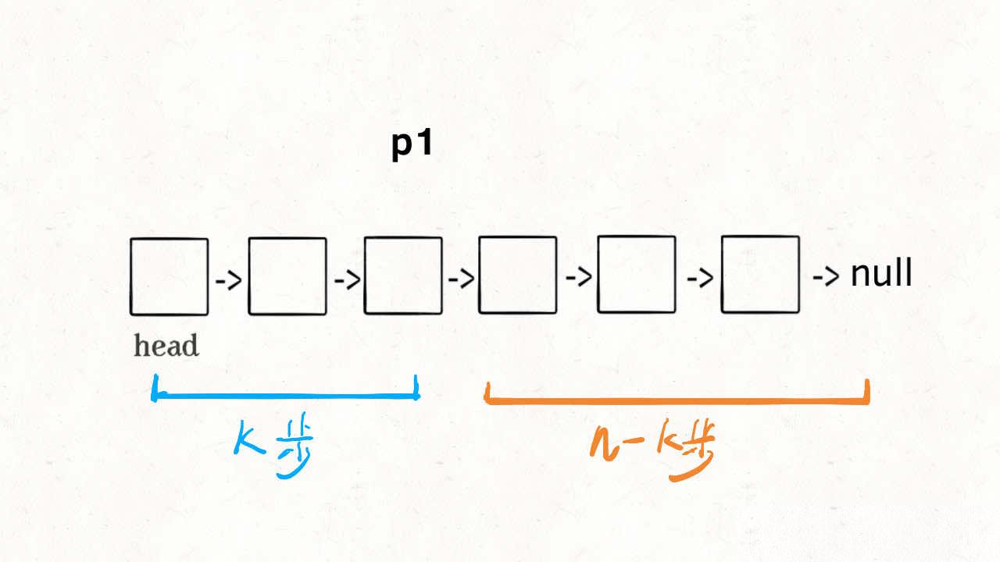
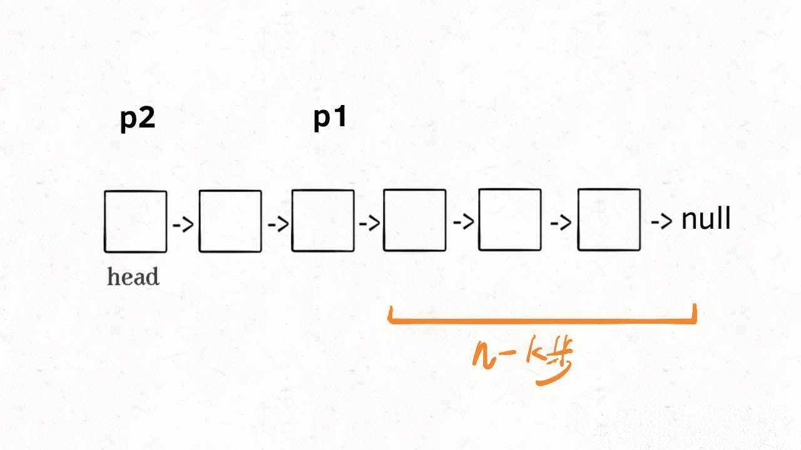
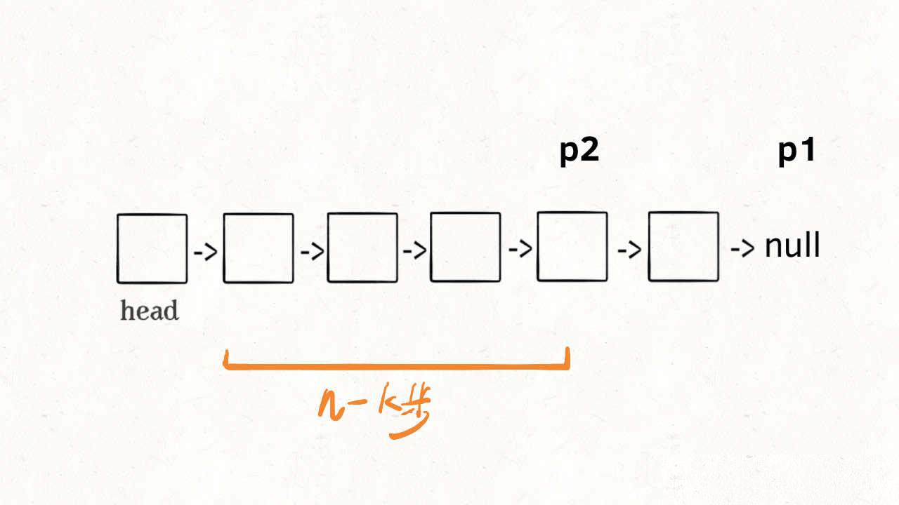
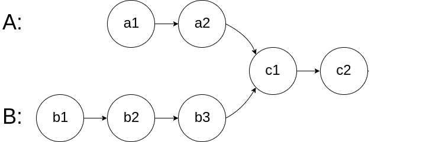
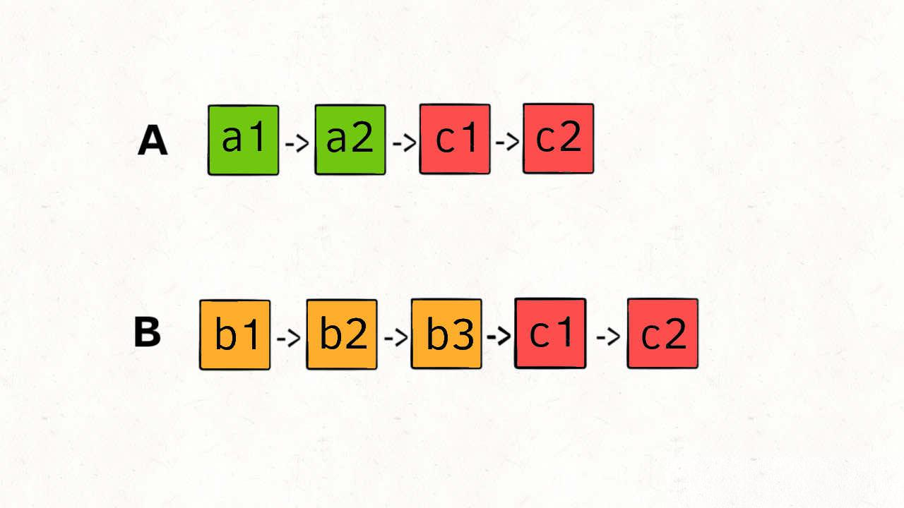
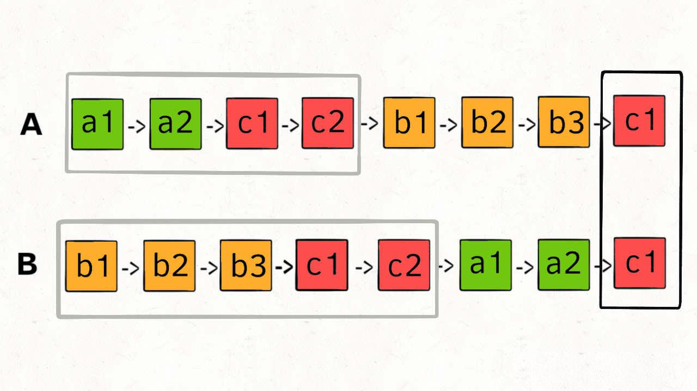

## 链表技巧汇总

<!--more-->

单链表有很多巧妙的操作，本文就来总结几个常规思维不容易想到的小技巧。

### 单链表的倒数第 k 个节点

从前往后寻找单链表的第 `k` 个节点很简单，一个 for 循环遍历过去就找到了，但是如何寻找从后往前数的第 `k` 个节点呢？

那你可能说，假设链表有 `n` 个节点，倒数第 `k` 个节点就是正数第 `n - k` 个节点，不也是一个 for 循环的事儿吗？

是的，但是算法题一般只给你一个 `ListNode` 头结点代表一条单链表，你不能直接得出这条链表的长度 `n`，而需要先遍历一遍链表算出 `n` 的值，然后再遍历链表计算第 `n - k` 个节点。

也就是说，这个解法需要遍历两次链表，遍历 `n + n - k`个节点，才能得到出倒数第 `k` 个节点。

那么，我们能不能**只遍历一次链表**，即只遍历 `n` 个节点，就算出倒数第 `k` 个节点？

可以的，这就比较巧妙了，假设 `k = 2`，思路如下：

首先，我们先让一个指针 `p1` 指向链表的头节点 `head`，然后走 `k` 步：



现在的 `p1`，只要再走 `n - k` 步，就能走到链表末尾的空指针了对吧？

趁这个时候，再用一个指针 `p2` 指向链表头节点 `head`：



接下来就很显然了，让 `p2` 跟着 `p1` 同时向前走，`p1` 走到链表末尾的空指针时走了 `n - k` 步，`p2` 也走了 `n - k` 步，也就是链表的倒数第 `k` 个节点：



这样，只遍历了一次链表，就获得了倒数第 `k` 个节点 `p2`。

没想到吧？上述逻辑的代码如下：

```java
// 返回链表的倒数第 k 个节点
ListNode findFromEnd(ListNode head, int k) {
    ListNode p1 = head;
    // p1 先走 k 步
    for (int i = 0; i ‹ k; i++) {
        p1 = p1.next;
    }
    ListNode p2 = head;
    // p1 和 p2 同时走 n - k 步
    while (p1 != null) {
        p2 = p2.next;
        p1 = p1.next;
    }
    // p2 现在指向第 n - k 个节点
    return p2;
}
```

很多链表相关的算法题都会用到这个技巧，如果你知道了这个套路就手到擒来，我就不一一列举了，浪费篇幅。

当然，如果用 big O 表示法来计算时间复杂度，无论遍历一次链表和遍历两次链表的时间复杂度都是 `O(N)`，但上述这个算法的实际速度肯定更快，也更有技巧性。

### 单链表的中点

问题的关键也在于我们无法直接得到单链表的长度 `n`，常规方法也是先遍历链表计算 `n`，再遍历一次得到第 `n / 2` 个节点，也就是中间节点。

如果想一次遍历就得到中间节点，也需要耍点小聪明，使用「快慢指针」的技巧：

我们让两个指针 `slow` 和 `fast` 分别指向链表头结点 `head`。

**每当慢指针** `slow` **前进一步，快指针** `fast` **就前进两步，这样，当** `fast` **走到链表末尾时，** `slow` **就指向了链表中点**。

上述思路的代码实现如下：

```java
ListNode middleNode(ListNode head) {
    // 快慢指针初始化指向 head
    ListNode slow = head, fast = head;
    // 快指针走到末尾时停止
    while (fast != null && fast.next != null) {
        // 慢指针走一步，快指针走两步
        slow = slow.next;
        fast = fast.next.next;
    }
    // 慢指针指向中点
    return slow;
}
```

需要注意的是，如果链表长度为偶数，也就是说中点有两个的时候，我们这个解法返回的节点是靠后的那个节点。

力扣第 876 题「链表的中间结点」就可以直接套这个解法。

另外，这段代码稍加修改就可以直接用到判断链表成环的算法题上。

### 判断链表是否包含环

判断链表是否包含环属于经典问题了，解决方案也是用快慢指针：

每当慢指针 `slow` 前进一步，快指针 `fast` 就前进两步。

如果 `fast` 最终遇到空指针，说明链表中没有环；如果 `fast` 最终和 `slow` 相遇，那肯定是 `fast` 超过了 `slow`一圈，说明链表中含有环。

只需要把寻找链表中点的代码稍加修改就行了：

```java
boolean hasCycle(ListNode head) {
    // 快慢指针初始化指向 head
    ListNode slow = head, fast = head;
    // 快指针走到末尾时停止
    while (fast != null && fast.next != null) {
        // 慢指针走一步，快指针走两步
        slow = slow.next;
        fast = fast.next.next;
        // 快慢指针相遇，说明含有环
        if (slow == fast) {
            return true;
        }
    }
    // 不包含环
    return false;
}
```

当然，这个问题还有进阶版：如果链表中含有环，如何计算这个环的起点？这个留作作业。

### 两个链表是否相交

这个问题有意思，也是力扣第 160 题「相交链表」函数签名如下：

```java
ListNode getIntersectionNode(ListNode headA, ListNode headB);
```

给你输入两个链表的头结点 `headA` 和 `headB`，这两个链表可能存在相交。

如果相交，你的算法应该返回相交的那个节点；如果没相交，则返回 null。

比如题目给我们举的例子，如果输入的两个链表如下图：



那么我们的算法应该返回 `c1` 这个节点。

这个题直接的想法可能是用 `HashSet` 记录一个链表的所有节点，然后和另一条链表对比，但这就需要额外的空间。

如果不用额外的空间，只使用两个指针，你如何做呢？

难点在于，由于两条链表的长度可能不同，两条链表之间的节点无法对应：



如果用两个指针 `p1` 和 `p2` 分别在两条链表上前进，并不能**同时**走到公共节点，也就无法得到相交节点 `c1`。

**所以，解决这个问题的关键是，通过某些方式，让** `p1` **和** `p2`**能够同时到达相交节点** `c1`。

所以，我们可以让 `p1` 遍历完链表 `A` 之后开始遍历链表 `B`，让 `p2` 遍历完链表 `B` 之后开始遍历链表 `A`，这样相当于「逻辑上」两条链表接在了一起。

如果这样进行拼接，就可以让 `p1` 和 `p2` 同时进入公共部分，也就是同时到达相交节点 `c1`：



那你可能会问，如果说两个链表没有相交点，是否能够正确的返回 null 呢？

这个逻辑可以覆盖这种情况的，相当于 `c1` 节点是 null 空指针嘛，可以正确返回 null。

按照这个思路，可以写出如下代码：

```java
ListNode getIntersectionNode(ListNode headA, ListNode headB) {
    // p1 指向 A 链表头结点，p2 指向 B 链表头结点
    ListNode p1 = headA, p2 = headB;
    while (p1 != p2) {
        // p1 走一步，如果走到 A 链表末尾，转到 B 链表
        if (p1 == null) p1 = headB;
        else            p1 = p1.next;
        // p2 走一步，如果走到 B 链表末尾，转到 A 链表
        if (p2 == null) p2 = headA;
        else            p2 = p2.next;
    }
    return p1;
}
```

这样，这道题就解决了，空间复杂度为 `O(1)`，时间复杂度为 `O(N)`。

好了，本文就讲到这里，相信你已经掌握了链表一系列操作的核心逻辑。

### 作业

[141.环形链表（简单）](https://leetcode-cn.com/problems/linked-list-cycle)

[876. 链表的中间结点](https://leetcode-cn.com/problems/middle-of-the-linked-list/)

### 附加题

[160. 相交链表](https://leetcode-cn.com/problems/intersection-of-two-linked-lists/)

[142.环形链表II（简单）](https://leetcode-cn.com/problems/linked-list-cycle-ii)

[19.删除链表倒数第 N 个元素（中等）](https://leetcode-cn.com/problems/remove-nth-node-from-end-of-list)
