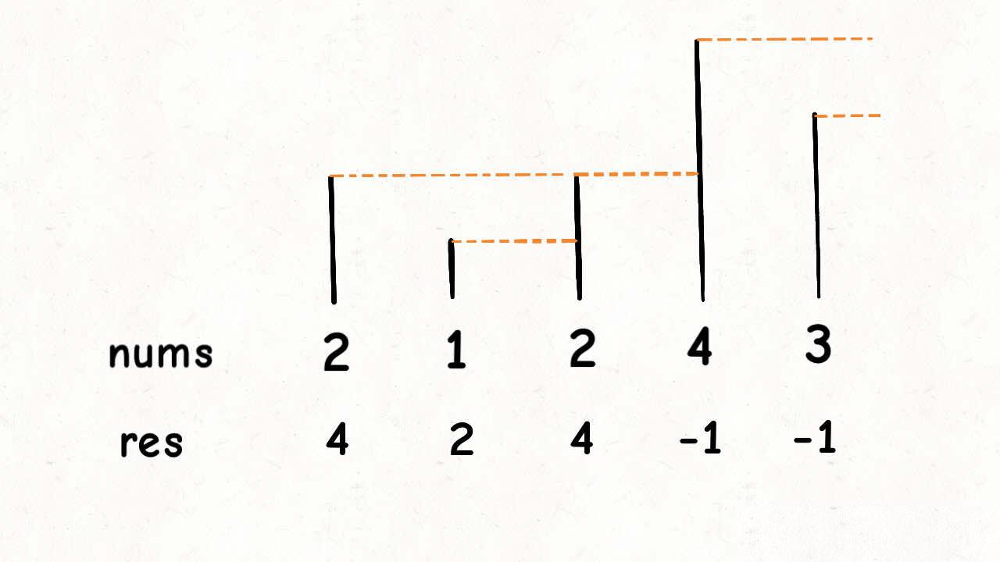
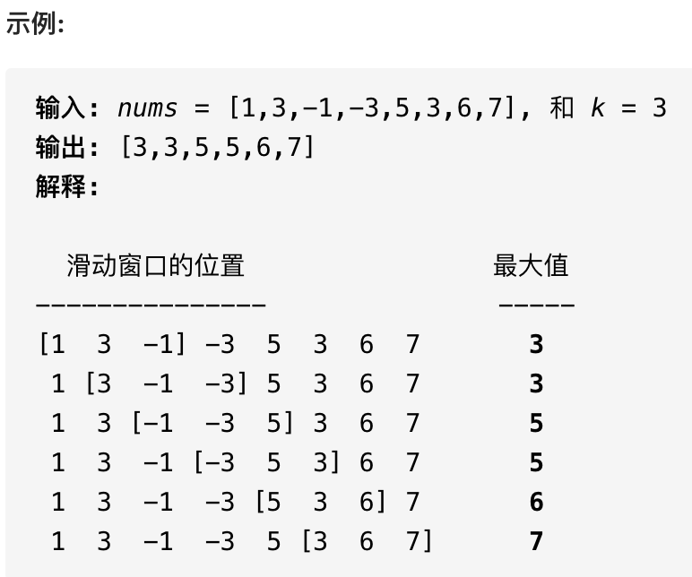
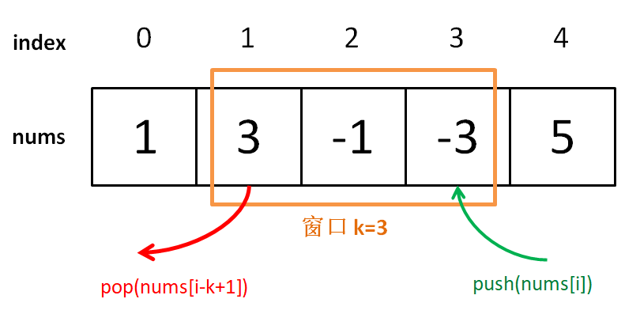
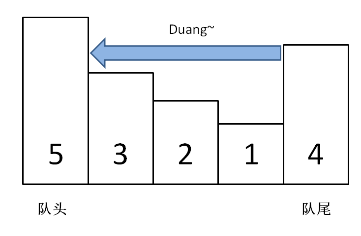

## 单调栈技巧

<!--more-->

栈（stack）是很简单的一种数据结构，先进后出的逻辑顺序，符合某些问题的特点，比如说函数调用栈。

单调栈实际上就是栈，只是利用了一些巧妙的逻辑，使得每次新元素入栈后，栈内的元素都保持有序（单调递增或单调递减）。

听起来有点像堆（heap）？不是的，单调栈用途不太广泛，只处理一种典型的问题，叫做 Next Greater Element，本文教你用单调队列的算法模版解决这类问题。

### 1.1 单调栈模板

现在给你出这么一道题：

给你一个数组 `nums`，请你返回一个等长的结果数组，结果数组中对应索引存储着下一个更大元素，如果没有更大的元素，就存 -1。

函数签名如下：

```java
int[] nextGreaterElement(int[] nums);
```

比如说，输入一个数组 `nums = [2,1,2,4,3]`，你返回数组 `[4,2,4,-1,-1]`。

解释：第一个 2 后面比 2 大的数是 4; 1 后面比 1 大的数是 2；第二个 2 后面比 2 大的数是 4; 4 后面没有比 4 大的数，填 -1；3 后面没有比 3 大的数，填 -1。

这道题的暴力解法很好想到，就是对每个元素后面都进行扫描，找到第一个更大的元素就行了。但是暴力解法的时间复杂度是 `O(n^2)`。

这个问题可以这样抽象思考：把数组的元素想象成并列站立的人，元素大小想象成人的身高。这些人面对你站成一列，如何求元素「2」的 Next Greater Number 呢？

很简单，如果能够看到元素「2」，那么他后面可见的第一个人就是「2」的 Next Greater Number，因为比「2」小的元素身高不够，都被「2」挡住了，第一个露出来的就是答案。



这个情景很好理解吧？带着这个抽象的情景，先来看下代码。

```java
int[] nextGreaterElements(int[] nums) {
    int[] res = new int[nums.length]; // 存放答案的数组
    Stack‹Integer› s = new Stack‹›();
    // 倒着往栈里放
    for (int i = nums.length - 1; i ›= 0; i--) {
        // 判定个子高矮
        while (!s.isEmpty() && s.peek() ‹= nums[i]) {
            // 矮个起开，反正也被挡着了。。。
            s.pop();
        }
        // nums[i] 身后的 next great number
        res[i] = s.isEmpty() ? -1 : s.peek();
        s.push(nums[i]);
    }
    return res;
}
```

这就是单调队列解决问题的模板。for 循环要从后往前扫描元素，因为我们借助的是栈的结构，倒着入栈，其实是正着出栈。while 循环是把两个「个子高」元素之间的元素排除，因为他们的存在没有意义，前面挡着个「更高」的元素，所以他们不可能被作为后续进来的元素的 Next Great Number 了。

这个算法的时间复杂度不是那么直观，如果你看到 for 循环嵌套 while 循环，可能认为这个算法的复杂度也是 `O(n^2)`，但是实际上这个算法的复杂度只有 `O(n)`。

分析它的时间复杂度，要从整体来看：总共有 `n` 个元素，每个元素都被 `push` 入栈了一次，而最多会被 `pop` 一次，没有任何冗余操作。所以总的计算规模是和元素规模 `n` 成正比的，也就是 `O(n)` 的复杂度。

## 单调队列技巧

前文用介绍了单调栈这种特殊数据结构，接下来写一个类似的数据结构「单调队列」。

也许这种数据结构的名字你没听过，其实没啥难的，就是一个「队列」，只是使用了一点巧妙的方法，使得**队列中的元素全都是单调递增（或递减）的**。

「单调栈」主要解决 Next Great Number 一类算法问题，而「单调队列」这个数据结构可以解决滑动窗口相关的问题，比如说力扣第 239 题「滑动窗口最大值」，难度 Hard：

给你输入一个数组 `nums` 和一个正整数 `k`，有一个大小为 `k`的窗口在 `nums` 上从左至右滑动，请你输出每次窗口中 `k` 个元素的最大值。

函数签名如下：

```java
int[] maxSlidingWindow(int[] nums, int k);
```

比如说力扣给出的一个示例：



### 2.1 搭建解题框架

这道题不复杂，难点在于如何在 `O(1)` 时间算出每个「窗口」中的最大值，使得整个算法在线性时间完成。这种问题的一个特殊点在于，「窗口」是不断滑动的，也就是你得**动态地**计算窗口中的最大值。

对于这种动态的场景，很容易得到一个结论：

**在一堆数字中，已知最值为** `A` **，如果给这堆数添加一个数** `B` **，那么比较一下** `A` **和** `B` **就可以立即算出新的最值；但如果减少一个数，就不能直接得到最值了，因为如果减少的这个数恰好是** `A` **，就需要遍历所有数重新找新的最值**。

回到这道题的场景，每个窗口前进的时候，要添加一个数同时减少一个数，所以想在 O(1) 的时间得出新的最值，不是那么容易的，需要「单调队列」这种特殊的数据结构来辅助。

一个普通的队列一定有这两个操作：

```java
class Queue {
    // enqueue 操作，在队尾加入元素 n
    void push(int n);
    // dequeue 操作，删除队头元素
    void pop();
}
```

一个「单调队列」的操作也差不多：

```java
class MonotonicQueue {
    // 在队尾添加元素 n
    void push(int n);
    // 返回当前队列中的最大值
    int max();
    // 队头元素如果是 n，删除它
    void pop(int n);
}
```

当然，这几个 API 的实现方法肯定跟一般的 Queue 不一样，不过我们暂且不管，而且认为这几个操作的时间复杂度都是 O(1)，先把这道「滑动窗口」问题的解答框架搭出来：

```java
int[] maxSlidingWindow(int[] nums, int k) {
    MonotonicQueue window = new MonotonicQueue();
    List‹Integer› res = new ArrayList‹›();
    
    for (int i = 0; i ‹ nums.length; i++) {
        if (i ‹ k - 1) {
            //先把窗口的前 k - 1 填满
            window.push(nums[i]);
        } else {
            // 窗口开始向前滑动
            // 移入新元素
            window.push(nums[i]);
            // 将当前窗口中的最大元素记入结果
            res.add(window.max());
            // 移出最后的元素
            window.pop(nums[i - k + 1]);
        }
    }
    // 将 List 类型转化成 int[] 数组作为返回值
    int[] arr = new int[res.size()];
    for (int i = 0; i ‹ res.size(); i++) {
        arr[i] = res.get(i);
    }
    return arr;
}
```



这个思路很简单，能理解吧？下面我们开始重头戏，单调队列的实现。

### 2.2 实现单调队列数据结构

观察滑动窗口的过程就能发现，实现「单调队列」必须使用一种数据结构支持在头部和尾部进行插入和删除，很明显双链表是满足这个条件的。

「单调队列」的核心思路和「单调栈」类似，`push` 方法依然在队尾添加元素，但是要把前面比自己小的元素都删掉：

```java
class MonotonicQueue {
// 双链表，支持头部和尾部增删元素
private LinkedList‹Integer› q = new LinkedList‹›();

public void push(int n) {
    // 将前面小于自己的元素都删除
    while (!q.isEmpty() && q.getLast() ‹ n) {
        q.pollLast();
    }
    q.addLast(n);
}
```

你可以想象，加入数字的大小代表人的体重，把前面体重不足的都压扁了，直到遇到更大的量级才停住。



如果每个元素被加入时都这样操作，最终单调队列中的元素大小就会保持一个**单调递减**的顺序，因此我们的 `max` 方法可以可以这样写：

```java
public int max() {
    // 队头的元素肯定是最大的
    return q.getFirst();
}
```

`pop` 方法在队头删除元素 `n`，也很好写：

```java
public void pop(int n) {
    if (n == q.getFirst()) {
        q.pollFirst();
    }
}
```

之所以要判断 `data.front() == n`，是因为我们想删除的队头元素 `n` 可能已经被「压扁」了，可能已经不存在了，所以这时候就不用删除了：


至此，单调队列设计完毕，看下完整的解题代码：

```java
/* 单调队列的实现 */
class MonotonicQueue {
    LinkedList‹Integer› q = new LinkedList‹›();
    public void push(int n) {
        // 将小于 n 的元素全部删除
        while (!q.isEmpty() && q.getLast() ‹ n) {
            q.pollLast();
        }
        // 然后将 n 加入尾部
        q.addLast(n);
    }
    
    public int max() {
        return q.getFirst();
    }
    
    public void pop(int n) {
        if (n == q.getFirst()) {
            q.pollFirst();
        }
    }
}

/* 解题函数的实现 */
int[] maxSlidingWindow(int[] nums, int k) {
    MonotonicQueue window = new MonotonicQueue();
    List‹Integer› res = new ArrayList‹›();
    
    for (int i = 0; i ‹ nums.length; i++) {
        if (i ‹ k - 1) {
            //先填满窗口的前 k - 1
            window.push(nums[i]);
        } else {
            // 窗口向前滑动，加入新数字
            window.push(nums[i]);
            // 记录当前窗口的最大值
            res.add(window.max());
            // 移出旧数字
            window.pop(nums[i - k + 1]);
        }
    }
    // 需要转成 int[] 数组再返回
    int[] arr = new int[res.size()];
    for (int i = 0; i ‹ res.size(); i++) {
        arr[i] = res.get(i);
    }
    return arr;
}
```

有一点细节问题不要忽略，在实现 `MonotonicQueue` 时，我们使用了 Java 的 `LinkedList`，因为链表结构支持在头部和尾部快速增删元素；而在解法代码中的 `res` 则使用的 `ArrayList` 结构，因为后续会按照索引取元素，所以数组结构更合适。

读者可能疑惑，`push` 操作中含有 while 循环，时间复杂度应该不是 `O(1)` 呀，那么本算法的时间复杂度应该不是线性时间吧？

单独看 `push` 操作的复杂度确实不是 `O(1)`，但是算法整体的复杂度依然是 `O(N)` 线性时间。要这样想，`nums` 中的每个元素最多被 `push` 和 `pop` 一次，没有任何多余操作，所以整体的复杂度还是 `O(N)`。

空间复杂度就很简单了，就是窗口的大小 `O(k)`。

好了，本文就讲到这里，相信你已经掌握了单调队列和单调栈的核心逻辑。

### 作业

[496.下一个更大元素I（简单）](https://leetcode-cn.com/problems/next-greater-element-i)

### 附加题

[239.滑动窗口最大值（困难）](https://leetcode-cn.com/problems/sliding-window-maximum)

[739.每日温度（中等）](https://leetcode-cn.com/problems/daily-temperatures/)

提示：这个问题本质上也是找 Next Greater Number，只不过现在不是问你 Next Greater Number 是多少，而是问你当前距离 Next Greater Number 的距离而已。

[503.下一个更大元素II（中等）](https://leetcode-cn.com/problems/next-greater-element-ii)
