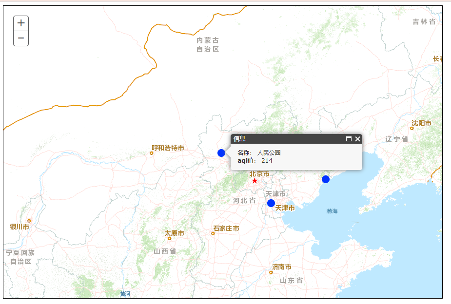

### 代码

```html
<html>
  <head>
    <meta http-equiv="Content-Type" content="text/html; charset=utf-8" />
    <title>第一个地图应用</title>
    <link
      rel="stylesheet"
      href="https://js.arcgis.com/3.17/esri/css/esri.css"
    />
    <script src="https://js.arcgis.com/3.17/"></script>

    <style type="text/css">
      .MapClass {
        width: 900px;
        height: 600px;
        border: 1px solid #000;
      }
    </style>
    <script type="text/javascript">
      dojo.require("esri.map"); //块加载地图组件
      dojo.addOnLoad(function () {
        var MyMap = new esri.Map("MyMapDiv", {
          logo: false,
          center: [116.4, 39.9],
          zoom: 6,
        });
        MyMap.on("load", function () {
          clickEvent(); //绑定点击事件
        });

        var MyTiledMapServiceLayer = new esri.layers.ArcGISTiledMapServiceLayer(
          "http://map.geoq.cn/ArcGIS/rest/services/ChinaOnlineCommunity/MapServer",
        );
        MyMap.addLayer(MyTiledMapServiceLayer);

        var MyGraphicsLayer = new esri.layers.GraphicsLayer(); //创建透明图层，地图点位在此图层上绘制
        MyMap.addLayer(MyGraphicsLayer); //将透明图层添加到地图上;注：透明图层永远在最上层

        var jsonData = [
          { x: "114.898", y: "40.837", name: "人民公园", aqi: "214" },
          { x: "117.15778", y: "39.09812", name: "宾水西道", aqi: "58" },
          { x: "119.607", y: "39.936", name: "市政府", aqi: "90" },
        ]; //模拟点位数据

        for (var i = 0; i < jsonData.length; i++) {
          var longti = parseFloat(jsonData[i].x); //将经度转为浮点型
          var lati = parseFloat(jsonData[i].y); //将纬度转为浮点型
          var pt = new esri.geometry.Point(longti, lati); //创建一个点对象
          //var symbol = new esri.symbol.PictureMarkerSymbol('/images/default_Red.png',10,10);
          var symbol = new esri.symbol.SimpleMarkerSymbol(
            esri.symbol.SimpleMarkerSymbol.STYLE_CIRCLE,
            15,
            new esri.symbol.SimpleLineSymbol(
              esri.symbol.SimpleLineSymbol.STYLE_SOLID,
              new dojo.Color([0, 51, 255]),
              1,
            ),
            new dojo.Color([0, 51, 255, 1]),
          );
          var graphic = new esri.Graphic(pt, symbol, jsonData[i]); //创建一个标注
          MyGraphicsLayer.add(graphic); //将标注添加到绘图图层上
        }

        function clickEvent() {
          MyGraphicsLayer.on("click", function (e) {
            //在绘图图层上绑定点击事件
            MyMap.infoWindow.setTitle("信息"); //设置弹框标题
            var tempStr =
              "&nbsp<b>名称</b>：&nbsp" +
              e.graphic.attributes.name +
              "<br/>&nbsp<b>aqi值</b>：&nbsp" +
              e.graphic.attributes.aqi +
              "<br/>"; //设置弹框信息
            MyMap.infoWindow.setContent(tempStr); //设置弹框内容
            MyMap.infoWindow.show(e.mapPoint); //显示弹框
            MyMap.centerAt(e.mapPoint); //定位到弹框点位
          });
        }
      });
    </script>
  </head>

  <body class="tundra">
    <div id="MyMapDiv" class="MapClass"></div>
  </body>
</html>
```

## 参考文档

1. https://my.oschina.net/u/1764582/blog/1843635
