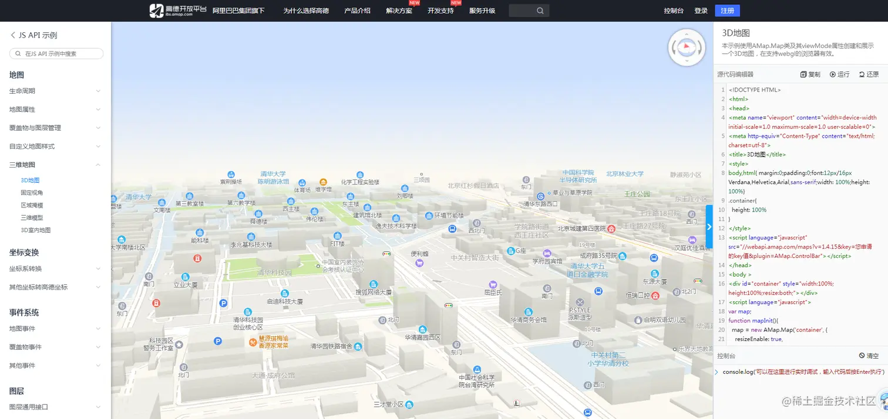
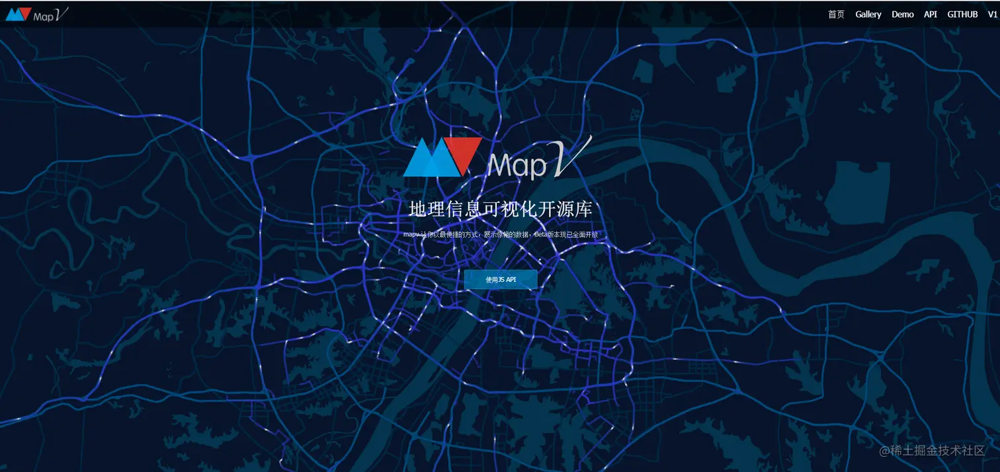
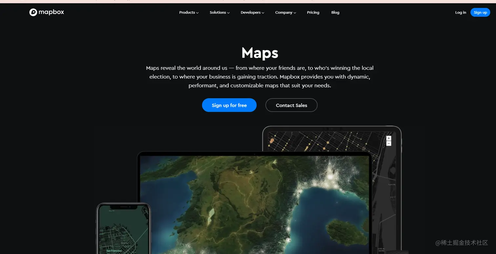
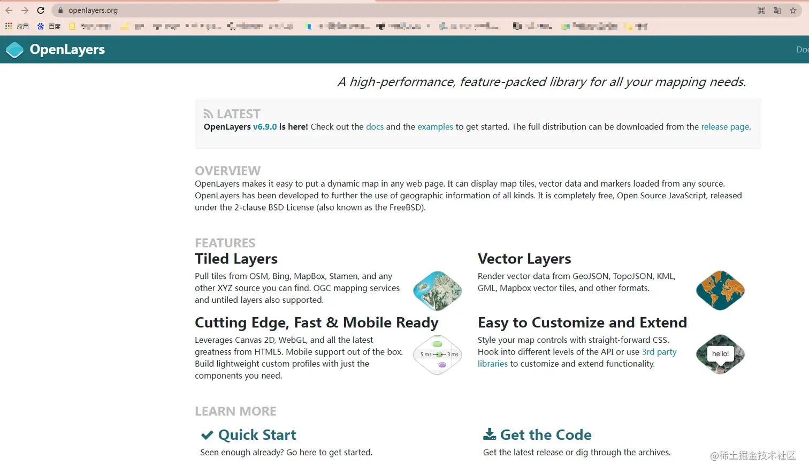
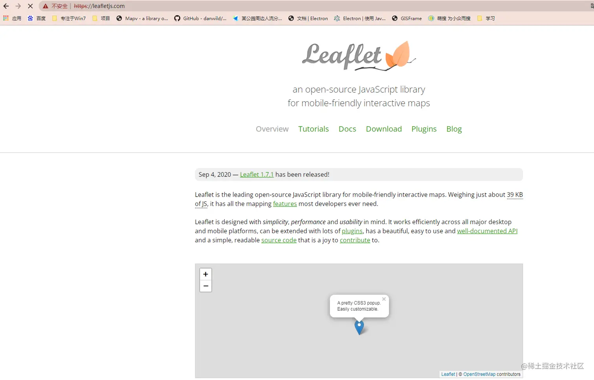
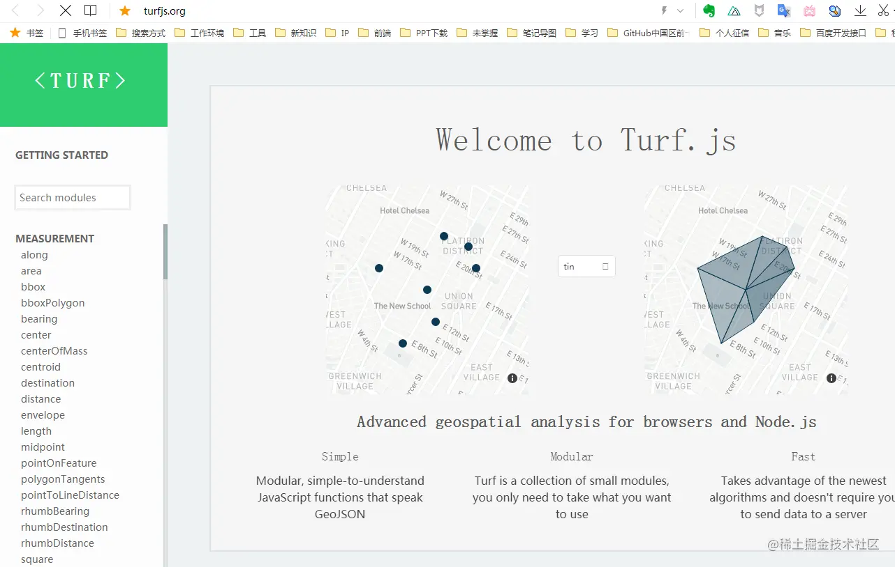

## 前言

<!--more-->

作为一个`WebGIS`开发，从`前端`往`GIS`靠拢，虽说不是`纯GIS`，但是也了解到一些相关`GIS上的东西`

平常时候接触到的都是在`二维上`进行开发工作，但是在这个岗位上继续下去，免不了要接触到`三维`相关的东西，这个时候就引入了`cesium`。

本文是这个系列的第一篇，打算以`前端的角度`，即`webgis开发工程师`的角度，讲述关于`GIS`的知识，带大家，快速了解下`webGIS`的知识

本文文字较多，GIS上概念较多，我尽量将webGIS要用到的概念性的东西都简单的讲一下。

`ps` : `GIS` 全名 叫 **地理信息系统**（Geographic Information System或 Geo－Information system，GIS）有时又称为“**地学信息系统**

## 常用到的地图开发框架

### 高德地图

可三维，可二维 ，实际项目中只用过一次，不太熟，[传送门](https://lbs.amap.com/demo/javascript-api/example/3d/map3d)

只有写了一篇，[【vue与高德地图】加载3D地图](https://juejin.cn/post/7023409347082321956)，大家感兴趣，可以看下

### 百度地图的mapv

这个是二维的 ，实际项目中没用到过，本人不熟，[传送门](https://mapv.baidu.com/)

### 阿里巴巴的L7

可三维可二维 ，实际项目中没用到过，本人不熟， [传送门](http://antv-2018.alipay.com/zh-cn/l7/1.x/index.html)

### mapbox

知道，但没用过，不熟，[传送门](https://www.mapbox.com/maps/)

### openlayers

做二维的，知道，了解过，但是不熟(实际项目中只用过一次，不算太熟悉) [传送门](https://openlayers.org/)

### leaflet

做二维的，日常开发用这个做二维，熟，[传送门](https://leafletjs.com/)

### arcgis for js

这个是和arcgis配套的，他有个特点，就是【3版本及以下的】和【4版本】差异比较大，目前项目中用过一次，不算太熟悉

### turf.js

涉及到一些`地图计算`相关的，相交，包含，扇形 等等，可配合leaflet 食用 更佳，[传送门](http://turfjs.org/)

## 坐标系

### 坐标系

说到GIS，那么肯定，免不了 谈到 坐标系

1. 火星坐标系    (GCJ-02)  

    使用者：谷歌中国地图、高德 使用

2. 百度坐标系    (BD-09)   

    使用者： 百度使用

3. 地理坐标系 GPS （WGS84）

4. 国标2000坐标系 （CGCS2000）

    使用者：天地图

最后两个，`国标2000坐标系`与`WGS84坐标系`偏差不大，因为CGCS2000坐标系与WGS84坐标系的原点、尺度、定向及定向演变的定义都是相同的，参考椭球的参数略有不同而已。相同的坐标点，在CGCS2000与WGS84下，经度是相同的，只在纬度上存有0.11mm上下的区别，可以忽略掉。

### 坐标转换

1. 说到坐标系，又免不了要谈到，坐标转换

- 有时候，后端给的经纬度数据，或者客户那里的给的经纬度，实际用不了，需要转化下才能用，或者对方的经纬度是他们自己`自定义的地方经纬度`，这个时候据需要转换之后，才能使用。

平时，我们使用地图服务的时候，就要根据用的是什么地图服务，采用相应的坐标系

打个比方，我要用高德地图的地图服务，那么我到时候再地图上展示的点位坐标，就应该用火星坐标系（GCJ-02）

2. 关于`经纬度转换`，常见的坐标系范畴内，网上有现成的在线转换网址

- 在线转换，[传送门](http://www.giscalculator.com/enter_coordpicker/)
- 有的经纬度是客户方自定义的，不属于常见的坐标系范畴，那么就只能和客户沟通，让客户那里给出转换方法，或者，他们把经纬度转换好了，再给我们

3. 有时候我们需要再地图上`拾取点位`，也有现成的在线网址，给我们拾取点位

- 百度坐标拾取，[传送门](http://api.map.baidu.com/lbsapi/getpoint/index.html?qq-pf-to=pcqq.c2c)
- 高德坐标拾取，[传送门](https://lbs.amap.com/tools/picker)

## webGIS 开发 与 纯GIS的交叉点

### 纯GIS

指的是**地信专业**的同学，地信，全称是**地理信息专业**，他们涉及到 **地理数据的处理**，有时候还会有**模型**的处理，**建模**。

他们常用到的工具是`arcgis`，`qgis` 等等，`着重和地图打交道`，可能有的同学还会用到`CAD`。

### webGIS

我们和他们的交接点在于，我们要用到的东西，是他们提供的。

比方说

1. 我(webgis) 需要一个某某区域的数据（geojson数据），那么这个数据就是纯GIS提供的，

2. 我(webgis) 需要在地图上加载出某某区域内的3维模型，像三维沙盘这种的，建模数据，也是纯GIS提供的

通俗的讲：
`webGIS` 就是`从 纯GIS`那里`拿地理相关的数据`，将这个数据，经过一些前端的处理，在地图上(网页)  加载出来.

常见的GIS网站，或者，大平台下面的GIS子模块，基本就是 一个大地图，然后地图上，有几个点位，你点击一下某个点位，就会触发一些操作，展示一些东西，

比如，这个点位上方出现一个弹框，这个弹框上就是展示这个点位的详细信息，

又比如，这个地图上多出了一个大的面板，面板上展示一系列的信息等等
