## 前言

<!--more-->

整理了一下`webgis`在工作常用到的`地图功能`，本系列将会以下方思维导图的形式讲解下去


承接上篇[【vue-cesium】在vue上使用cesium开发三维地图（一）](https://juejin.cn/post/7026255186788089870)

介绍了GIS上常用到的一些概念，这些概念webGIS工程师也需要了解，以及webGIS工程师会用到的框架

下面，正片开始

## cesium介绍

cesium官网：[传送门](https://cesium.com/platform/cesiumjs/)

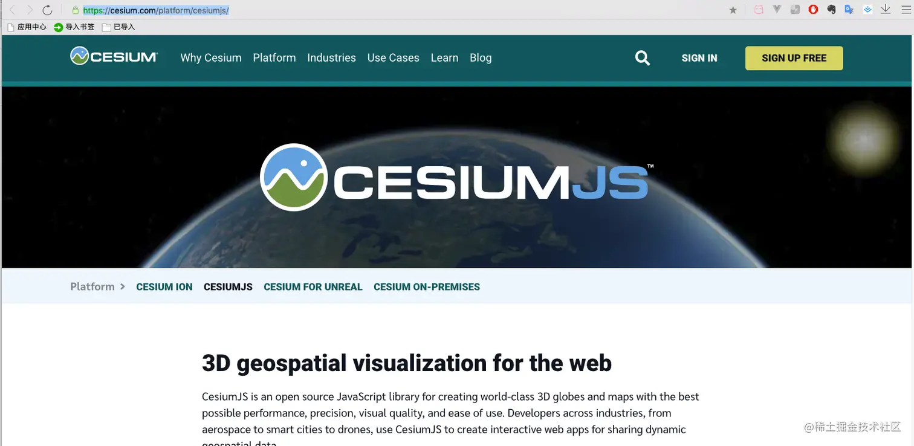

### 官网主页介绍

**3D geospatial visualization for the web**

CesiumJS is an open source JavaScript library for creating world-class 3D globes and maps with the best possible performance, precision, visual quality, and ease of use. Developers across industries, from aerospace to smart cities to drones, use CesiumJS to create interactive web apps for sharing dynamic geospatial data.

Built on open formats, CesiumJS is designed for robust interoperability and scaling for massive datasets.

- Stream in 3D Tiles and other standard formats from Cesium ion or another source
- Visualize and analyze on a high-precision WGS84 globe
- Share with users on desktop or mobile

翻译过来就是：

**web的三维地理空间可视化**

CesiumJS是一个开源JavaScript库，用于创建具有最佳性能、精度、视觉质量和易用性的世界级3D球体和地图。从航空航天到智能城市再到无人驾驶飞机，各个行业的开发者都使用CesiumJS创建交互式web应用程序来共享动态地理空间数据。

CesiumJS基于开放格式构建，旨在为海量数据集提供强大的互操作性和可扩展性。

-来自铯离子或其他来源的3D瓷砖和其他标准格式的流

-在高精度WGS84地球仪上进行可视化和分析

-与桌面或移动设备上的用户共享

### 我们webgis工程师要关注的点

从官方的介绍中，我们得到了以下信息

1.  `开源的JavaScript库`
2.  `做三维的`
3.  `创建交互式web应用程序`

这正是我们需要的

## 如何使用

### 注册token

1.  使用的话，我们需要在官网上注册一个`token`，这个`token`在后面要用

- 先打开官网
- 注册或登录

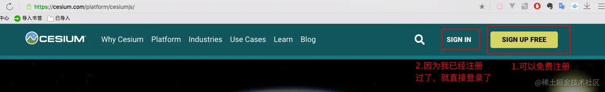

- 登录进入

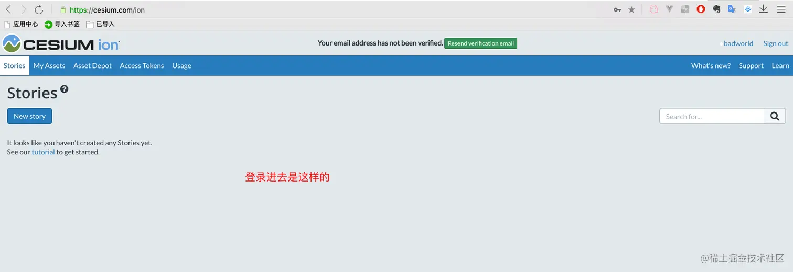

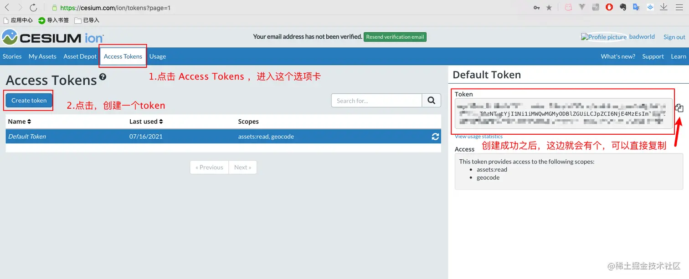

- `token`创建也很简单
  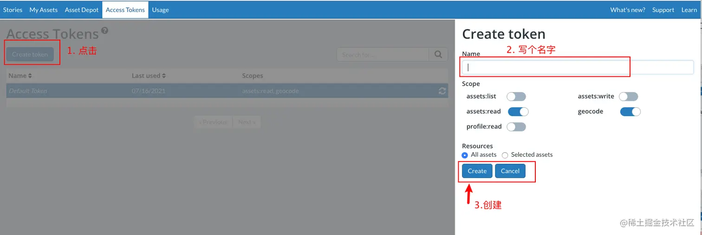

这样`token`就有了

## 在vue项目中使用

### 安装cesium

- 安装`cesium`

`ps`: 因为`cesium`我打算做成一个系列，所以，vue安装cesium 我也写在本系列中了。如果是vue要安装其他第三方插件，可以看我[【vue起步】快速搭建vue项目引入第三方插件](https://juejin.cn/post/7020064317852614687)

```js
npm i cesium@1.67.0 --save
npm i copy-webpack-plugin@5.1.1 --save -dev
yarn add webpack@4.42.0 -D
或
yarn add cesium@1.67.0
yarn add copy-webpack-plugin@5.1.1
yarn add webpack@4.42.0 -D
```

#### 这里有一个小坑：

- 目前`cesium`的最新版本是`1.87.0`，实际写这篇文章的时候，我就用的`1.87.0`，`vue.config.js`配置好后，`yarn serve`运行，结果配置报错，因此我还是改用之前的`1.67.0`版本，这个版本实测是不报错的

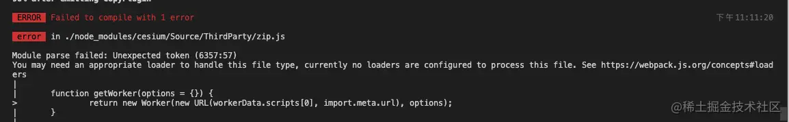

- `vue`中`引入cesium`, `vue.config.js` 中`配置cesium参数`是报错`compilation.getCache is not a function`

`vue` 中引入`cesium` 需要用`copy-webpack-plugin` 把一些文件拷贝到打包目录 \
用的是`vue2.x`版本

报错的`compilation.getCache is not a function` 是因为`copy-webpack-plugin`的版本过高，经踩坑，使用安装`"^5.1.1"`版本的`copy-webpack-plugin`即可解决！

#### 这里还有一个小坑


因为我没有安装`webpack`,报了这么一个错误，webpack的版本，还是用项目中的`4.42.0`

### 配置vue.config.js

- 配置vue.config.js
  `vue.config.js`代码如下：

```js
const path = require("path");
const CopyWebpackPlugin = require('copy-webpack-plugin');
const webpack = require('webpack');
const cesiumSource = './node_modules/cesium/Source'
function resolve(dir) {
  return path.join(__dirname, dir);
}

module.exports = {
  // 打包后运行环境目录
  publicPath: process.env.NODE_ENV === "production" ? "/projectName/" : "/",
  ...
  devServer: {
       ...
    proxy: {
            ...
    }
  },

  configureWebpack: {
    output: {
      sourcePrefix: ' ' // 1 让webpack 正确处理多行字符串配置 amd参数
    },
    amd: { // 2
      toUrlUndefined: true // webpack在cesium中能友好的使用require
    },

    resolve: {
      extensions: ['.js', '.vue', '.json'],
      alias: {
        'cesium': path.resolve(__dirname, cesiumSource) // 3 定义别名cesium后，cesium代表了cesiumSource的文件路径，此处配置好后，就在main.js中直接使用cesium引入资源
      }
    },
    plugins: [ // 4
      new CopyWebpackPlugin([{ from: path.join(cesiumSource, 'Workers'), to: 'Workers' }]),
      new CopyWebpackPlugin([{ from: path.join(cesiumSource, 'Assets'), to: 'Assets' }]),
      new CopyWebpackPlugin([{ from: path.join(cesiumSource, 'Widgets'), to: 'Widgets' }]),
      new CopyWebpackPlugin([{ from: path.join(cesiumSource, 'ThirdParty/Workers'), to: 'ThirdParty/Workers' }]),
      new webpack.DefinePlugin({ // 5
        CESIUM_BASE_URL: JSON.stringify('./')
      })
    ],
    module: {
      unknownContextRegExp: /^.\/.*$/,
      unknownContextCritical: false, // 6 不让webpack打印载入特定库时候的警告
    },
  },

      ...
  },
};

```

`vue.config.js`中的`CopyWebpackPlugin部分`，不要随便升级，因为更新之后的`CopyWebpackPlugin部分` 的配置发生改动了，后来语法改了，语法改了之后，会提示你要加`patterns`字段，我这边就不升级，按照原来的来。

`需要的npm包安装好，vue.config.js配置好，运行项目 yarn serve`

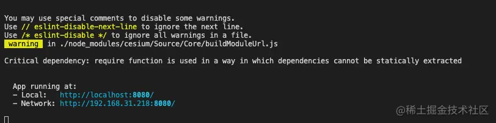

### main.js中引入cesium

- main.js中引入cesium
  老规矩，在`lib`文件夹下新建一个`cesium`文件夹，表示我们安装的第三方插件

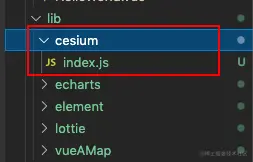

`index.js`中的代码如下

```js
// 引入cesium相关文件
const cesium = require("cesium/Cesium.js");
const widgets = require("cesium//Widgets/widgets.css");

// 如果vue.config.js中不配置别名，就要用下面的方式按路径引入
// const cesium = require('cesium/Build/Cesium/Cesium.js');
// const widgets = require('cesium/Build/Cesium/Widgets/widgets.css');

export default (Vue) => {
  Vue.prototype.cesium = cesium;
  Vue.prototype.widgets = widgets;
};
```

### 创建cesiumMap.vue组件

- 创建`cesiumMap.vue`文件，`展示地图`

在`src`下的`components`文件夹下新建一个`cesium`文件夹，里面放`cesiumMap.vue`

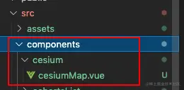

`cesiumMap.vue`代码如下

```js
<template>
  <div id="container" class="box">
    <div id="cesiumContainer"></div>
  </div>
</template>
<script>
export default {
  name: "cesiumMap",
  data() {
    return {};
  },
  methods: {
    init() {
      const Cesium = this.cesium;
      Cesium.Ion.defaultAccessToken = "your_access_token";
      const viewer = new Cesium.Viewer("cesiumContainer");
      viewer._cesiumWidget._creditContainer.style.display = "none"; // 隐藏版权
    },
  },
  mounted() {
    this.init();
  },
};
</script>
<style scoped lang="scss">
html,
body,
#cesiumContainer {
  width: 100%;
  height: 100%;
  margin: 0;
  padding: 0;
  overflow: hidden;
}
.box {
  height: 100%;
}
</style>

```

代码块中的`your_access_token`就是之前最开始注册的`token`，填进去就行了

### router中注册组件

- 还有最后一步，需要在router中引入

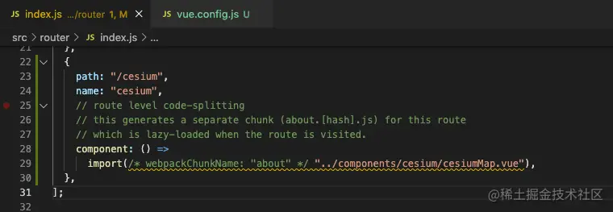

## 页面访问

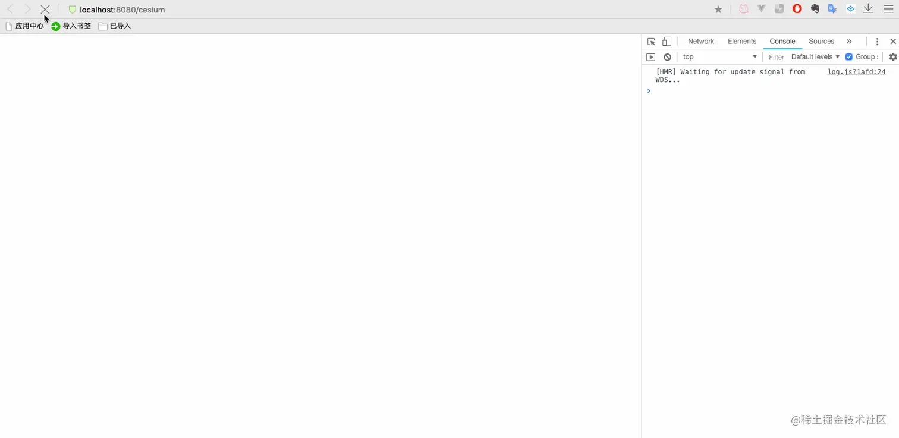

控制台会报一个错，点进去，也没看出什么名堂来，暂时不影响使用，后续再看吧

## 参考资料

1. [cesium官网](https://cesium.com/platform/cesiumjs/)
2. [Cesium API 文档](https://cesium.com/learn/cesiumjs/ref-doc/) 英文的
3. [Cesium 中文网翻译的 API 文档](http://cesium.xin/cesium/cn/Documentation1.62/) 中文的，但肯定没有英文的新，全，不过日常开发基本够了
4. [Cesium 官方示例demo](https://sandcastle.cesium.com/)
5. [Cesium 中文网](http://cesium.xin/) 里面的教程，有免费，有付费，免费的也能学到不少，对初学者

这些网站不要求大家都很了解，掌握。只希望大家都点开看一看，做到脑子里有个大概的印象，这样，当实际要用的时候，知道去哪里找，即可。
