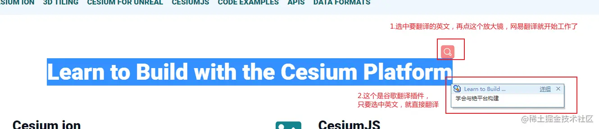
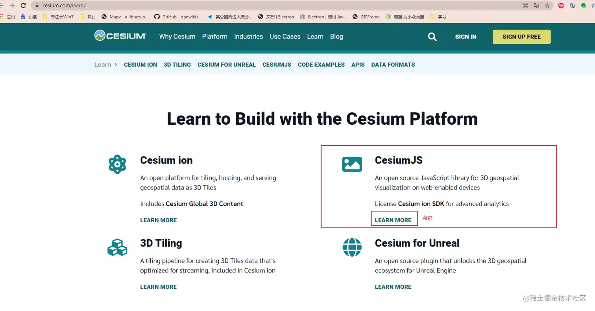
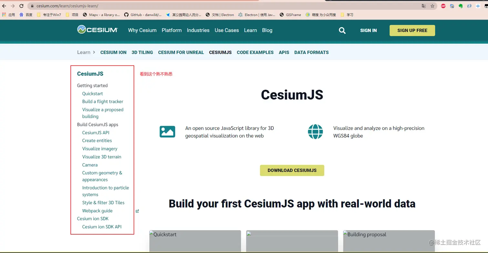
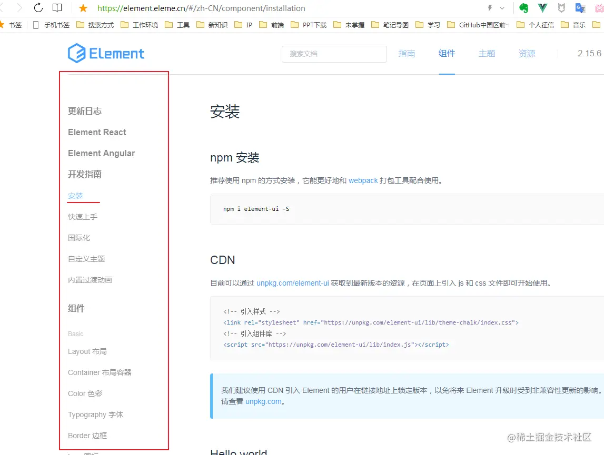
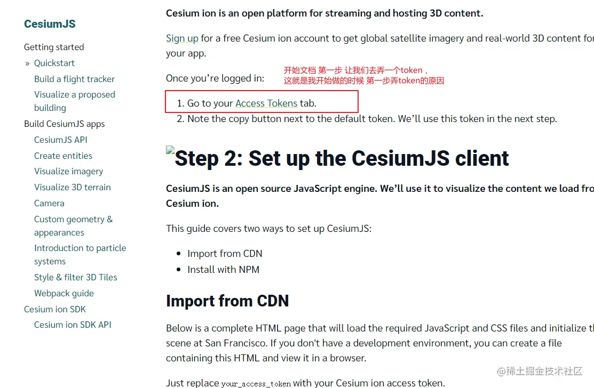
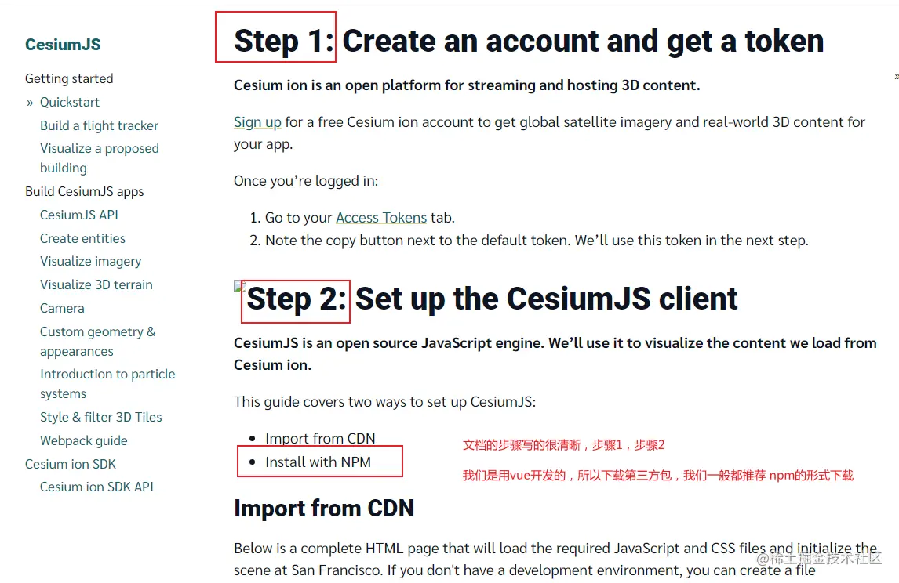
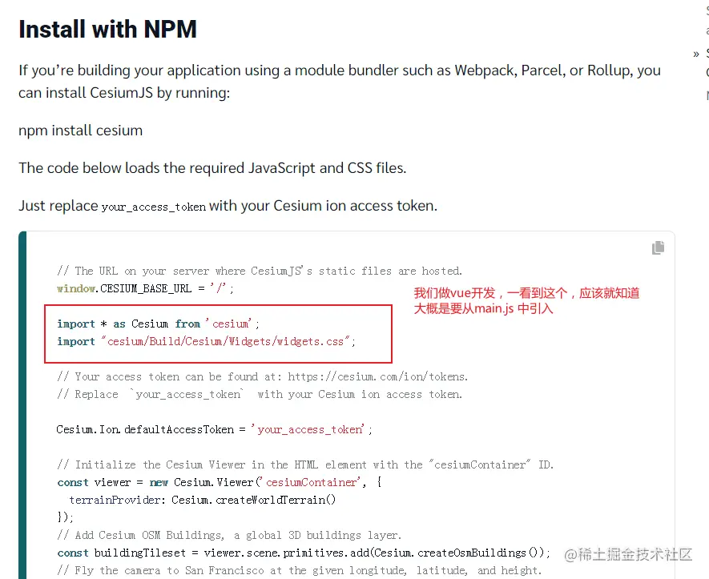
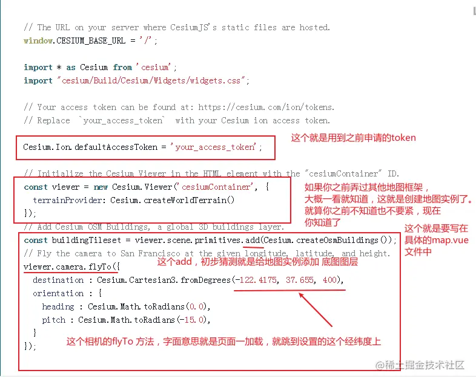
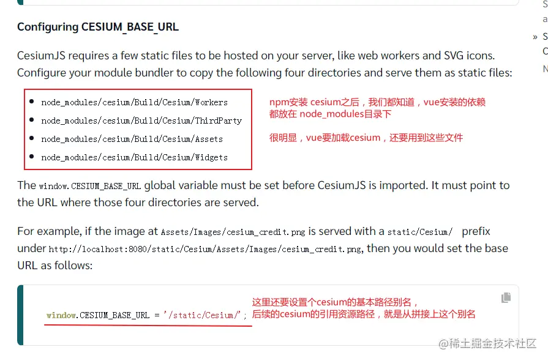

## 前言

<!--more-->

上篇文章[【vue-cesium】在vue上使用cesium开发三维地图（二）](https://juejin.cn/post/7026376272687136781)

只是直接把vue加载cesium的代码告诉大家，但是并没有说，为什么要这么弄？

这里，讲解下 vue 加载cesium 步骤，`希望带大家学习方法，思路，去思考，而不是只copy代码，知其然不知其所以然`。

把vue 加载cesium 步骤写出来，更加有助于大家在遇到不清楚，不知道的东西时候，可以学会自主查询。

## 开始

### 看官网

[cesium官网](https://cesium.com/learn/)

刚看到官网，`纯英文`，对于英语几乎全还给英语老师的我来说，感到了鸭梨山大，但是我们不是可以`在线翻译`嘛，实在不认识，我们就去`翻译`。

说到翻译，脑子里就蹦出了下面这几个：

1.  百度翻译
2.  谷歌翻译
3.  网易翻译
4.  浏览器翻译小插件

而我的操作是：

1.  `本地`下一个`网易翻译的客户端`，开机自启，
2.  `浏览器`安装`划词翻译助手`
3.  有时候我要手输入单词看翻译，直接`浏览器地址栏`手输一个`fanyi.baidu.com`的页面

如此`三板斧`下去，英语是不是就不算什么大问题啦，佩服机智的我，`在此，希望大家不要害怕英文`。

接着，回到`cesium官网`，第一眼看下去，全英文，不知道怎么办，再仔细看下，你就发现了`华点`，我们`本质是前端工程师`，日常和`javascript`打交道，在下面这个图中，我们一眼就看到，这个`CesiumJS` 十之八九 就是我们要找的东西。

看到下面有个 `LEARN MORE` 没有，翻译过来就是`学习更多`啊，果断点进去

然后，我们发现了，这就是`学习文档`啊，一般看到文档了，后面基本路就顺了，虽然这是英文，但是这些单词，大概还是认识的，我们从第一个开始看，`Quickstart`  翻译过来 就是`开速开始`啊，

相信大家用`前端UI框架`的时候，第一反应，应该都是去`这个框架`的`首页去查文档`，对吧，我这里放张`element-ui`的`文档首页`，给大家感受感受

是不是发现 `cesium文档`  和 `element-ui 文档` 其实也差不多，都是从`快速开始` 起步，然后一步一步的往下走的，学习新东西，`最直接的方法`，就是去`源头`看，就是去看它的`官方文档`，这是最准确，最快捷的。

当然，官方文档`有的地方看不懂`，就把`看不懂的地方`，去`百度上搜`，看其他人在这个方面写的`博客`，`文章`，加速自己的快速理解。

### 我们继续

直接点击这个`Access Tokens 超链接`，就跳转过去了，你登录了就直接跳转过去了，你没登陆，就跳转到登录页面，登录之后，也进去了。

### 鼠标往下翻

回到我们的`vue项目`，我们知道，在vue中，一些配置相关的都是在`vue.config.js`中进行`配置`。那么以上文档上看到的配置相关的，我们要在`vue.config.js`中进行配置了

关于在`vue.config.js`中的配置，就不在此多说了，因为`踩坑`踩的太多了，不太记得了，大部分已经在[上面文章](https://juejin.cn/post/7026376272687136781)中写出来了，不保证全部写出来了。总之

这里经过我不断的上网查询，踩坑，安装相关的依赖，报错，再百度，再踩坑，最后总结出了[【vue-cesium】在vue上使用cesium开发三维地图（二）](https://juejin.cn/post/7026376272687136781)

## 多说一句

多说一句，大多数人，学习新东西，看着文档，一步一步走，也很少会一上来成功的，所以`不要怕出问题`，`出现问题`，`那就去查`，`去问`，`去解决问题`，当你问题碰得多了，也解决的多了，你的经验就蹭蹭蹭的上来了，你解决问题的能力也就提升上去了，

## 还想多说一句

前端领域，更新迭代快，而且早期前端是 `刀耕火种`的时代，那个时代虽然不像现在这么多框架，开发没现在那么方便，但是那个时候，需要什么新的功能，都是直接`操作原生js，dom元素`，直接开干的，

而现在，`各种框架层出不穷`，很多`底层的东西`，都已经帮你`封装`好了，你`直接调用`就好了，这就导致，你日常开发中，碰到的有些需要`定制的功能`，你上网查，发现网上可能没有，也可能有现成的，但那也是早期时候，`原生js`，直接写的，`直接操作dom元素`。

但你所用的UI框架里没有现成的，你得学会，自己把这些原生的转成自己这个框架中的。

### 举个例子

我用vue开发，有个仪表盘的需求要我写一个，[【vue自定义组件】D3.js实现动态仪表盘组件](https://juejin.cn/post/7019212564219297823)，我网上查到了，但网上是`原生js` 搞出来的，我直接用不了，那我就要自己转化了。

### 再举个例子

我用vue开发，摸索三维地图的时候，我看到`高德地图`里面就有`三维模式`的，[【vue与高德地图】加载3D地图](https://juejin.cn/post/7023409347082321956)，但人家也是`原生js，h5` 实现的，我也要转成 vue的，那我就要去查，去找，去思考

好比现在`leetcode` 算法题，大部分的题解都是` Java`，`C`，`C++`，`Python`写出来的。关于`JS的题解就是少`，我们又是主力用JS开发的。那怎么办，我们就要`学会转换`，把其他的东西，转换成我们自己的东西。

希望大家能活学活用，能转换，一帆风顺。
