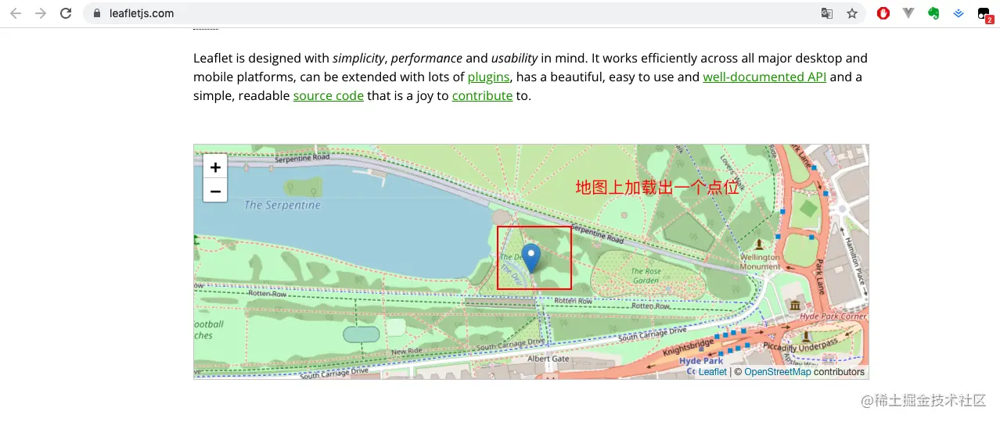
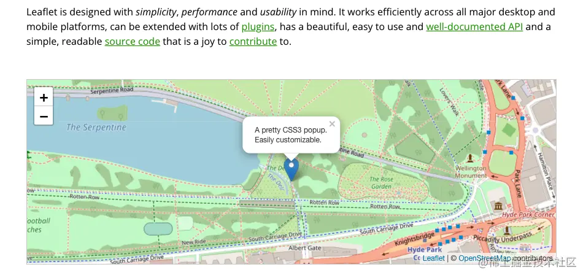

## 前言

<!--more-->

本系列往期文章：

1. [【vue-cesium】在vue上使用cesium开发三维地图（一）](https://juejin.cn/post/7026255186788089870)
2. [【vue-cesium】在vue上使用cesium开发三维地图（二）](https://juejin.cn/post/7026376272687136781)
3. [【vue-cesium】在vue上使用cesium开发三维地图（二）续](https://juejin.cn/post/7026747156400717855)

今天主要介绍下`webgis`中那些基本算是标配的功能，常见的功能如下图：

## webgis功能介绍

### 地图加载

这个很好理解，就是你打开网页，页面一加载，你在屏幕上第一个看到的就是`一张地图`，然后各种各样的东西纷纷`在地图上加载出来`，像接下来要说的`点位`，`弹框`，这属于`静态的画面`，还有`动态的功能`，比方说`定位`，`动画`等等。

我们通常把`这张地图`称为`底图`，后续的`点位之类的东西`都是在`这张底图`上放置

(这就是页面一加载，一张地图出来)

### 点位加载

这里在cesium官网没找到合适的图(`ps 其实是后面的功能还没做好，做好了就把图补上来`)，就用leaflet的示例图看下，效果是一样的，大家把leaflet的底图当成cesium的底图就好

### 点位弹框

啥意思？这个也是字面意思，在`地图上`加载出`点位信息`的基础上，在`点位`的`正上方`出现一个`弹框`，或者`其他方向`出现一个弹框。

因为我查看`cesium文档`，没找到`cesium的弹框`（`也可能我没找到`），所以cesium上的弹框，到时候我用div自己创建一个，大概样子就像leaflet的弹框差不多，不过到时候，弹框里面的内容我会自己定义

### 点位定位

这个其实也很好理解，就是`让点位回到地图中央`。地图是可以`拖动`的，对吧，`地图拖动`的时候，地图上的点位`也跟着地图移动`。我把地图拖动之后，点击拖动之后的点位，这个点位就到了地图的中央。

### 其他

以上都是最最基础的功能，基本上每个webgis的项目，这些功能都是标配的。

当然，还有一些高级一点的功能，比方说，`反向溯源`，`河流流动`，`扩散`，`克里金`，`凸包`等等。
后面有时间，也会写下来。

好了，基本的功能介绍到这，下篇文章开始一一实现这些基本功能。
