## 前言

<!--more-->

本系列往期文章：

1. [【vue-cesium】在vue上使用cesium开发三维地图（一）](https://juejin.cn/post/7026255186788089870)
2. [【vue-cesium】在vue上使用cesium开发三维地图（二）](https://juejin.cn/post/7026376272687136781)
3. [【vue-cesium】在vue上使用cesium开发三维地图（二）续](https://juejin.cn/post/7026747156400717855)
4. [【vue-cesium】在vue上使用cesium开发三维地图（三）](https://juejin.cn/post/7027117541365383175/)

常见`webgis`的功能如下图：

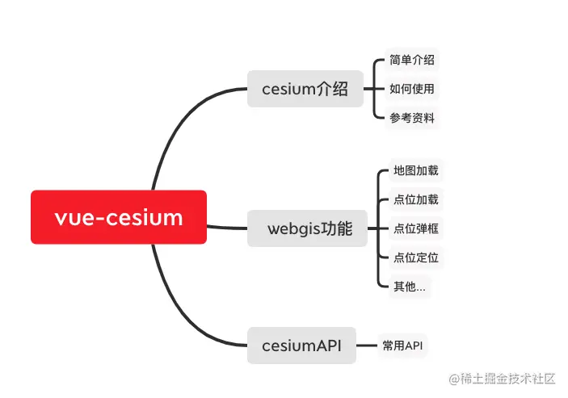

今天讲下**地图加载**

## 地图加载

效果如下：


## 开始讲解

之前，我们讲到，看着[官网的文档](https://cesium.com/learn/)，地图实例是这样创建下来的，见下图：

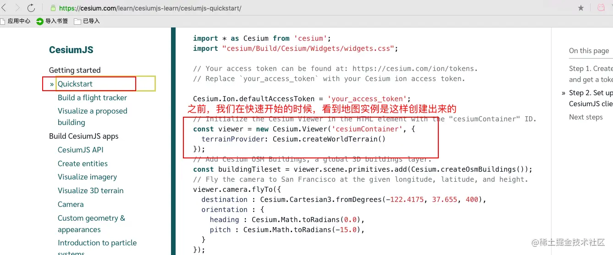

但是`cesium`的`Viewer方法`中，是可以设置不少参数的，我们打开`cesium`的`API文档`看看

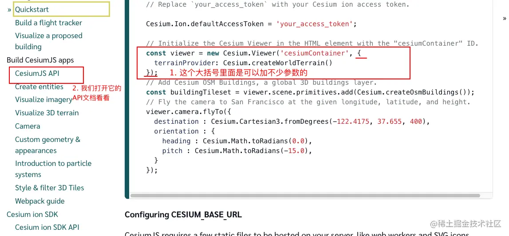

cesium的官方文档，内容很多

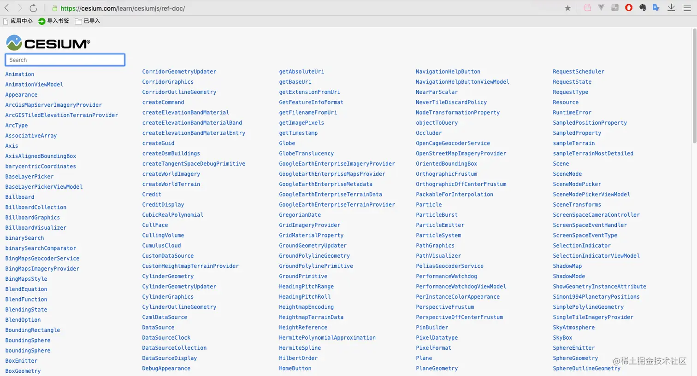

我们先看`Viewer方法`

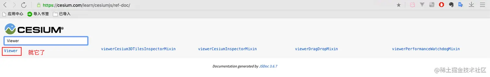

点进去

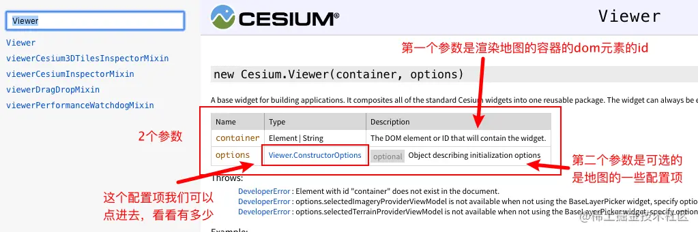

因为英文的看起来需要翻译，有些麻烦，之前在这个系列的[【vue-cesium】在vue上使用cesium开发三维地图（二）](https://juejin.cn/post/7026376272687136781) 中的**参考资料**部分讲到有一个cesium的中文网，看起来更加直观一点，接下来的讲解到api的部分，我就用cesium中文网上的API文档来讲

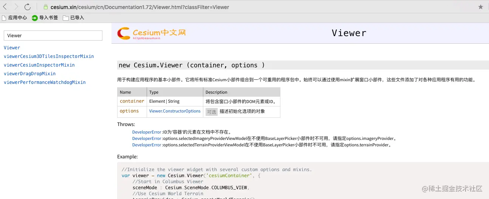

是不是友好多了

点击上图的这个`Viewer.ConstructorOptions` 配置项看看

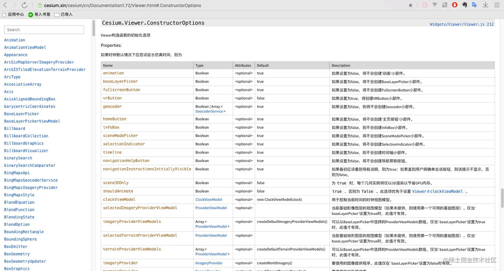

有没有那种 看到`JavaAPI文档`的即视感，有木有，哈哈哈

直接和大家对这`API文档讲解`，很枯燥，也很无聊。

## 项目式学习

所以，我换个方式，我打算，按照我做的样子讲解，用到哪些东西，就去`对着文档去查`这些东西。我管这种形式叫`项目式学习`，我先放张效果图，然后对这这张效果图逐步靠拢，带着目标学习。

### 开始

我实际开发中，都是开局一张展开的地图，屏幕上就是一张地图，其他什么都没有，所以在上篇文章[【vue-cesium】在vue上使用cesium开发三维地图（二）](https://juejin.cn/post/7026376272687136781)，最后成功加载出来的地图上，我们要改改，如下图：

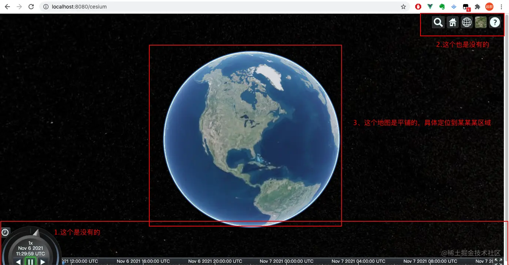

开始改动，一番操作下来，现在页面上只剩下地球了
(地球：我好方，现在就剩我一个了)

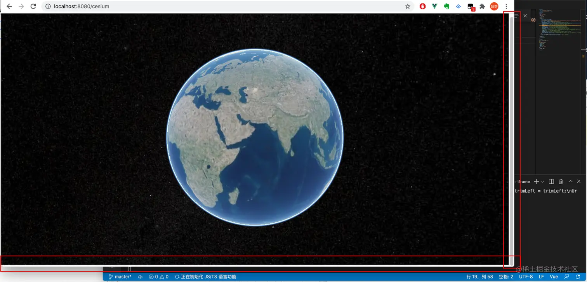

贴上代码，都加上了注释，放心食用

`cesiumMap.vue`

```js
<template>
  ...
</template>
<script>
export default {
  ...
  methods: {
    init() {
      ...
      const viewer = new Cesium.Viewer("cesiumContainer", {
        baseLayerPicker: false, // 如果设置为false，将不会创建右上角图层按钮。
        geocoder: false, // 如果设置为false，将不会创建右上角查询(放大镜)按钮。
        navigationHelpButton: false, // 如果设置为false，则不会创建右上角帮助(问号)按钮。
        homeButton: false, // 如果设置为false，将不会创建右上角主页(房子)按钮。
        sceneModePicker: false, // 如果设置为false，将不会创建右上角投影方式控件(显示二三维切换按钮)。
        animation: false, // 如果设置为false，将不会创建左下角动画小部件。
        timeline: false, // 如果设置为false，则不会创建正下方时间轴小部件。
        fullscreenButton: false, // 如果设置为false，将不会创建右下角全屏按钮。
        scene3DOnly: true, // 为 true 时，每个几何实例将仅以3D渲染以节省GPU内存。
        shouldAnimate: false, // 默认true ，否则为 false 。此选项优先于设置 Viewer＃clockViewModel 。
        // ps. Viewer＃clockViewModel 是用于控制当前时间的时钟视图模型。我们这里用不到时钟，就把shouldAnimate设为false
        infoBox: false, // 是否显示点击要素之后显示的信息
        sceneMode: 3, // 初始场景模式 1 2D模式 2 2D循环模式 3 3D模式  Cesium.SceneMode
        requestRenderMode: false, // 启用请求渲染模式，不需要渲染，节约资源吧
        fullscreenElement: document.body, // 全屏时渲染的HTML元素 暂时没发现用处，虽然我关闭了全屏按钮，但是键盘按F11 浏览器也还是会进入全屏

      });
     ...
    },
  },
  mounted() {
    this.init();
  },
};
</script>
<style scoped lang="scss">
...
</style>
```

### 处理小空白

然后，我们看到页面右侧还有滚动条，而且页面的最下方，还有一长条白色的空白，我们来处理一下

在上次写的`css`中做如下改动

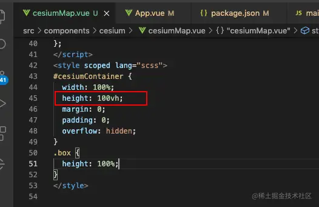

并且在`App.vue`中，把内外边框都去掉

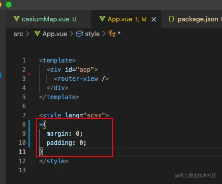

这样就好多了

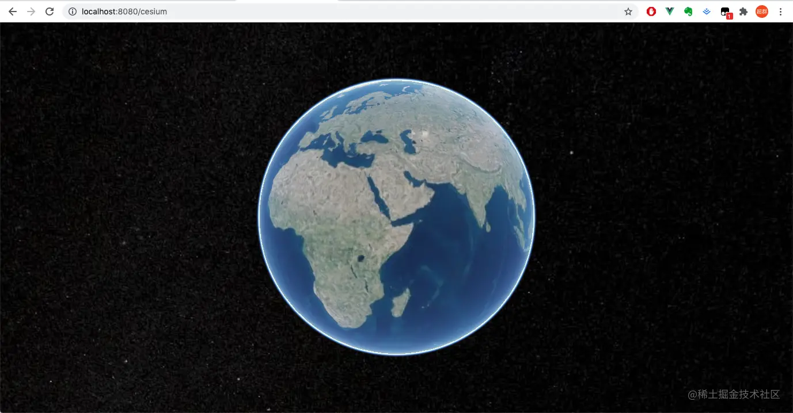

### 设置地图源

接下来，我们来设置地图的地图服务，我这里使用高德影像图

- 高德影像地形地图：

```js
https://webst02.is.autonavi.com/appmaptile?style=6&x={x}&y={y}&z={z}
```

- 高德影像注记地图：

```js
http://webst02.is.autonavi.com/appmaptile?x={x}&y={y}&z={z}&lang=zh_cn&size=1&scale=1&style=8
```

因为我们关掉了默认的图层切换按钮，所以我们需要给他配上这个地图源

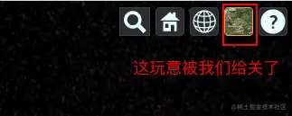

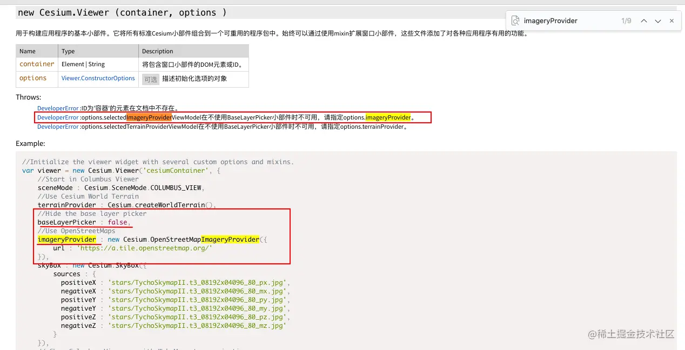

我们配置地图源调用的是这个方法`Cesium.UrlTemplateImageryProvider`

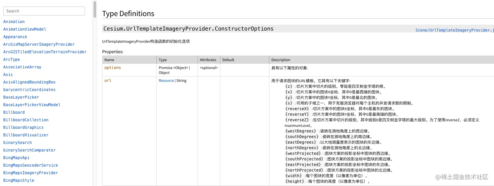

### 定位

还没结束，我们要让地图一加载就定位到一个位置，我这里以张家港为例，那我正常的流程应该是：

1. 页面一加载
2. 展示出来的是高德地图，有地图有标注
3. 地图直接定位到张家港

定位操作，要先设置一个区域，作为初始位置，确定区域的方法是`BoundingSphere`

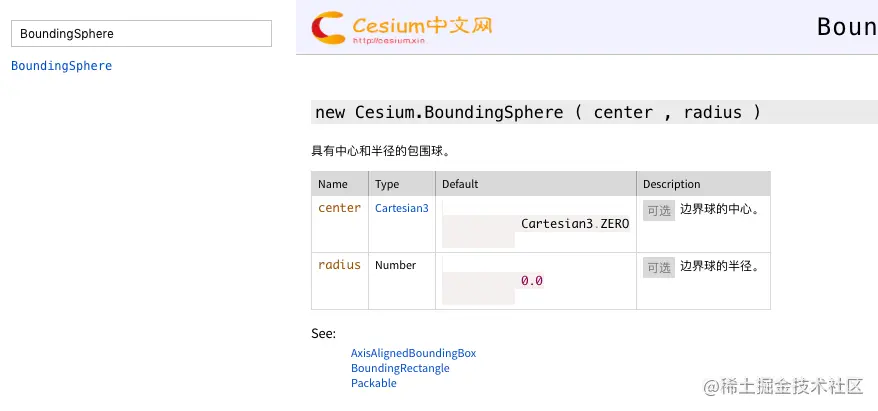

然后要定位到这个初始位置，`new Cesium.Camera.flyTo`


贴上代码

`cesiumMap.vue`

```js
<template>
  ...
</template>
<script>
export default {
  ...
  methods: {
    init() {
      ...
      const viewer = new Cesium.Viewer("cesiumContainer", {
        ...
        // 我使用高德影像地形地图
        imageryProvider: new Cesium.UrlTemplateImageryProvider({
          url: "https://webst02.is.autonavi.com/appmaptile?style=6&x={x}&y={y}&z={z}",
        }),

      });
      // 再加上高德影像注记地图
      viewer.imageryLayers.addImageryProvider(
        new Cesium.UrlTemplateImageryProvider({
          url: "http://webst02.is.autonavi.com/appmaptile?x={x}&y={y}&z={z}&lang=zh_cn&size=1&scale=1&style=8",
        })
      );
      // 设置初始位置  Cesium.Cartesian3.fromDegrees(longitude, latitude, height, ellipsoid, result)
      const boundingSphere = new Cesium.BoundingSphere(
        Cesium.Cartesian3.fromDegrees(120.55538, 31.87532, 100),
        15000
      );
      // 定位到初始位置
      viewer.camera.flyToBoundingSphere(boundingSphere, {
        // 定位到初始位置的过渡时间，设置成0，就没有过渡，类似一个过场的动画时长
        duration: 0,
      });
     ...
    },
  },
  mounted() {
    this.init();
  },
};
</script>
<style scoped lang="scss">
...
</style>
```

效果有了


## 优化一下

因为这个创建出来的`实例 viewer`，只在`init方法`中，我们接下来要经常用到它，所以我们把这个`viewer`对象，提升到`data`中

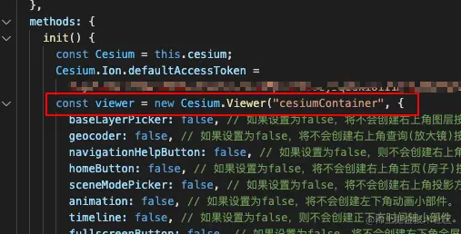

提升之后

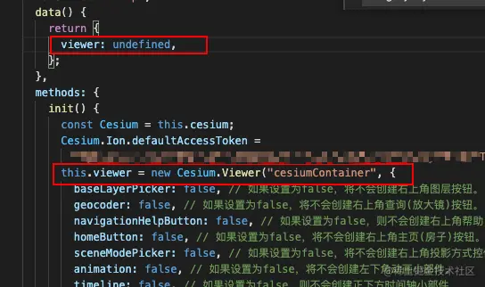

完整代码：

```js
<template>
  <div id="container" class="box">
    <div id="cesiumContainer"></div>
  </div>
</template>
<script>
export default {
  name: "cesiumMap",
  data() {
    return {
      viewer: undefined,
    };
  },
  methods: {
    init() {
      const Cesium = this.cesium;
      // 这里要改成自己注册的token，别忘了
      Cesium.Ion.defaultAccessToken = "your_access_token";
      this.viewer = new Cesium.Viewer("cesiumContainer", {
        baseLayerPicker: false, // 如果设置为false，将不会创建右上角图层按钮。
        geocoder: false, // 如果设置为false，将不会创建右上角查询(放大镜)按钮。
        navigationHelpButton: false, // 如果设置为false，则不会创建右上角帮助(问号)按钮。
        homeButton: false, // 如果设置为false，将不会创建右上角主页(房子)按钮。
        sceneModePicker: false, // 如果设置为false，将不会创建右上角投影方式控件(显示二三维切换按钮)。
        animation: false, // 如果设置为false，将不会创建左下角动画小部件。
        timeline: false, // 如果设置为false，则不会创建正下方时间轴小部件。
        fullscreenButton: false, // 如果设置为false，将不会创建右下角全屏按钮。
        scene3DOnly: true, // 为 true 时，每个几何实例将仅以3D渲染以节省GPU内存。
        shouldAnimate: false, // 默认true ，否则为 false 。此选项优先于设置 Viewer＃clockViewModel 。
        // ps. Viewer＃clockViewModel 是用于控制当前时间的时钟视图模型。我们这里用不到时钟，就把shouldAnimate设为false
        infoBox: false, // 是否显示点击要素之后显示的信息
        sceneMode: 3, // 初始场景模式 1 2D模式 2 2D循环模式 3 3D模式  Cesium.SceneMode
        requestRenderMode: false, // 启用请求渲染模式，不需要渲染，节约资源吧
        fullscreenElement: document.body, // 全屏时渲染的HTML元素 暂时没发现用处，虽然我关闭了全屏按钮，但是键盘按F11 浏览器也还是会进入全屏
        // 我使用高德影像地形地图
        imageryProvider: new Cesium.UrlTemplateImageryProvider({
          url: "https://webst02.is.autonavi.com/appmaptile?style=6&x={x}&y={y}&z={z}",
        }),
      });
      // 再加上高德影像注记地图
      this.viewer.imageryLayers.addImageryProvider(
        new Cesium.UrlTemplateImageryProvider({
          url: "http://webst02.is.autonavi.com/appmaptile?x={x}&y={y}&z={z}&lang=zh_cn&size=1&scale=1&style=8",
        })
      );
      // 设置初始位置  Cesium.Cartesian3.fromDegrees(longitude, latitude, height, ellipsoid, result)
      const boundingSphere = new Cesium.BoundingSphere(
        Cesium.Cartesian3.fromDegrees(120.55538, 31.87532, 100),
        15000
      );
      // 定位到初始位置
      this.viewer.camera.flyToBoundingSphere(boundingSphere, {
        // 动画，定位到初始位置的过渡时间，设置成0，就没有动画
        duration: 0,
      });
      this.viewer._cesiumWidget._creditContainer.style.display = "none"; // 隐藏版权
    },
  },
  mounted() {
    this.init();
  },
};
</script>
<style scoped lang="scss">
#cesiumContainer {
  width: 100%;
  height: 100vh;
  margin: 0;
  padding: 0;
  overflow: hidden;
}
.box {
  height: 100%;
}
</style>
```
