## 前言

<!--more-->

本系列往期文章：

1. [【vue-cesium】在vue上使用cesium开发三维地图（一）](https://juejin.cn/post/7026255186788089870)
2. [【vue-cesium】在vue上使用cesium开发三维地图（二）](https://juejin.cn/post/7026376272687136781)
3. [【vue-cesium】在vue上使用cesium开发三维地图（二）续](https://juejin.cn/post/7026747156400717855)
4. [【vue-cesium】在vue上使用cesium开发三维地图（三）](https://juejin.cn/post/7027117541365383175/)
5. [【vue-cesium】在vue上使用cesium开发三维地图（四）地图加载](https://juejin.cn/post/7027488472847876127/)

常见`webgis`的功能如下图：

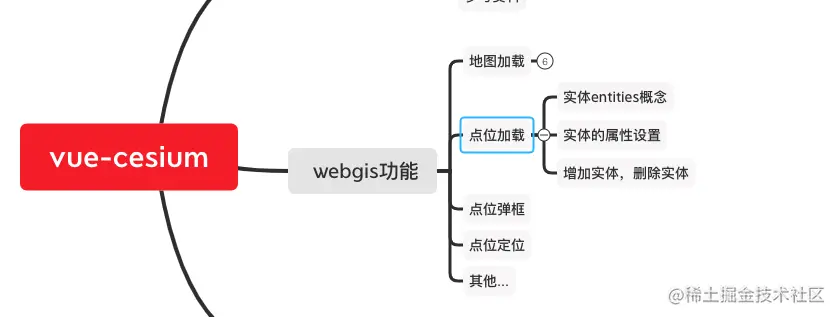

今天讲下**点位加载**

## 点位加载

效果如下：


## 开始讲解

首先讲下，`entities`实体，通俗的讲，一个三维地图上，上面可以`放`一些`模型`，比方说，`放`一个`房子模型`，`放`一个`工厂模型`，这个房子，工厂，肉眼看上去，就是放在了地图上，你鼠标不管怎么移动视角，都看到这个房子，工厂，是和地图绑定在一块的。房子，工厂都是和地图一起移动的。这个我们人眼看到的`模型`，在cesium里面有个学名，就叫`实体`。

我们这次说的点位加载，它也属于实体，实体可以是二维的，也可以是三维的，我先讲下我们这个实体里面有哪些东西，在接下来讲二维和三维的实体。

## entities

我们还是先打开[cesium的API中文文档](http://cesium.xin/cesium/cn/Documentation1.72/index.html)

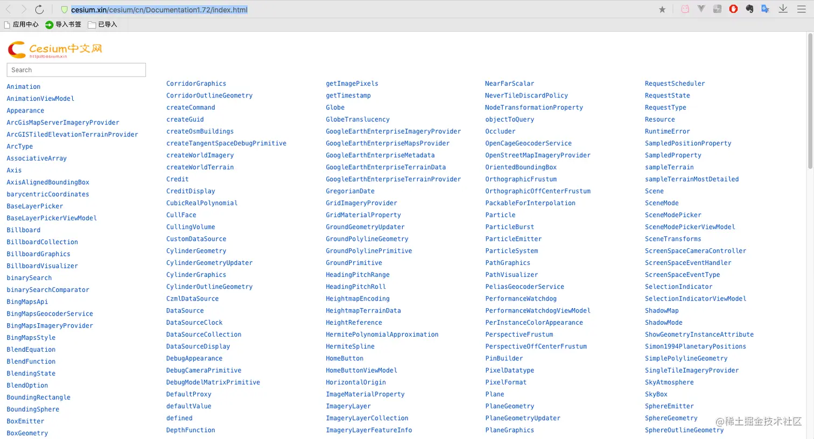

搜索`viewer`

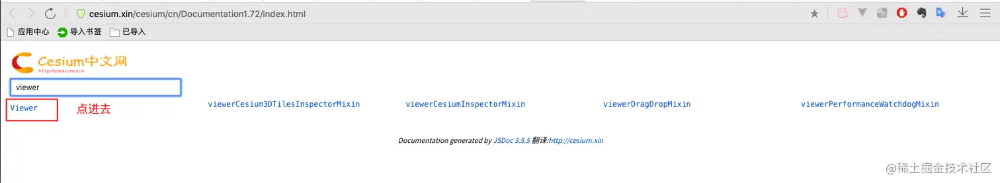

ctrl + F 搜 `entities`，回车

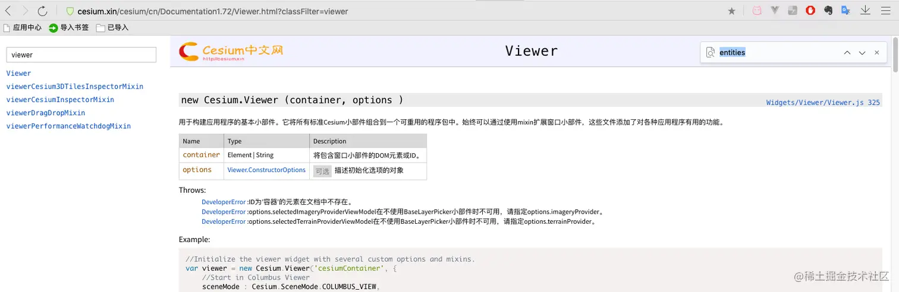

点进去

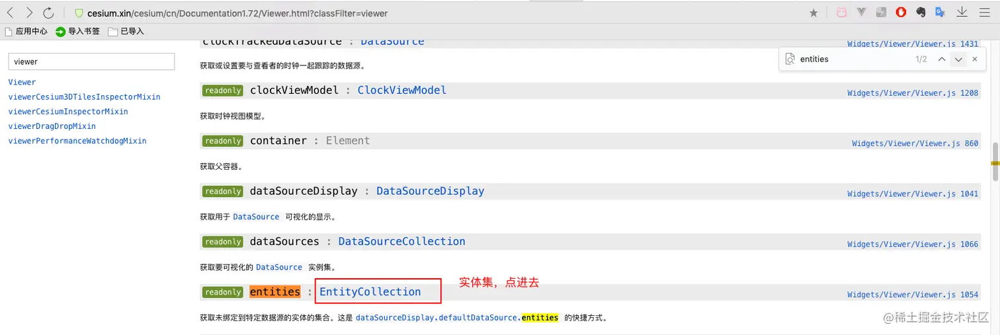

找到了

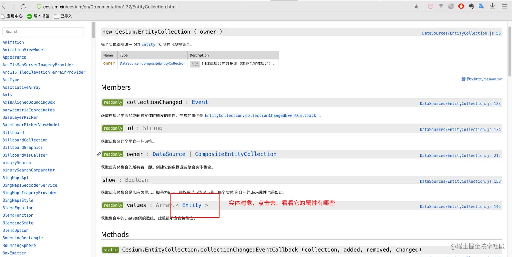

`entities`的`属性`

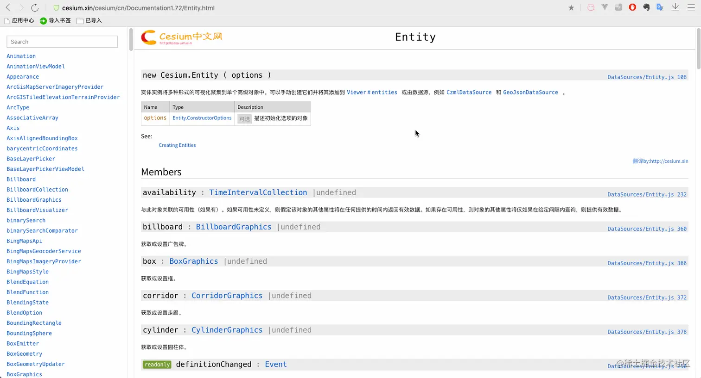

接下来我们要用的属性可以从这里找

## 增加实体，删除实体

我们要把实体添加到地图上，盲猜 应该是`xxxAdd()`方法 \
我们从这一页`Entity`回到`EntityCollection`页面，接着往下翻
发现了 `添加` 和 `删除`方法

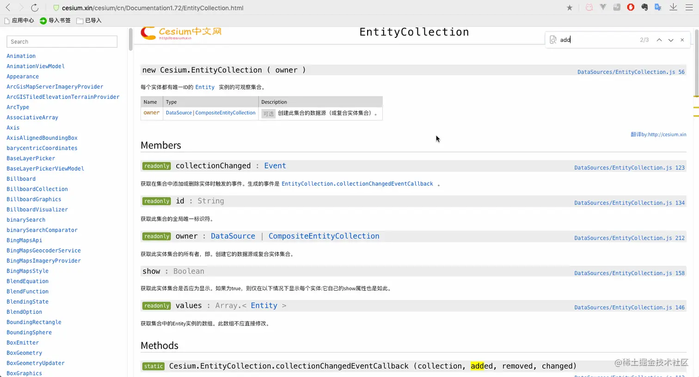

## 点位加载

我们现在加载个点位试试看

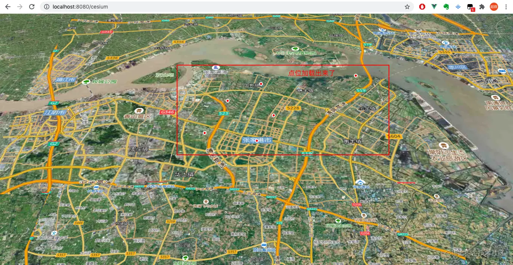

`ps`: 现在代码中的属性，大家可以直接在cesiumAPI文档中查看，就在我上方放的图片中，属性都可以搜得到的

代码如下：

```js
<template>
  <div id="container" class="box">
    <div id="cesiumContainer"></div>
  </div>
</template>
<script>
export default {
  name: "cesiumMap",
  data() {
    return {
      viewer: undefined,
      pointInfo: [], // 点位信息
    };
  },
  methods: {
    init() {
      ...
    },
    loadPoints() {
      // 用模拟数据测试
      this.pointInfo = [
        {
          id: "392f7fbb-ae25-4eef-ac43-58fd91148d1f",
          latitude: "31.87532",
          longitude: "120.55538",
          psName: "有限公司1",
        },
        {
          id: "0278a88c-b4f4-4d64-9ccb-65831b3fb19d",
          latitude: "31.991057",
          longitude: "120.700713",
          psName: "有限公司2",
        },
        {
          id: "248f6853-2ced-4aa6-b679-ea6422a5f3ac",
          latitude: "31.94181",
          longitude: "120.51517",
          psName: "有限公司3",
        },
        {
          id: "F8DADA95-A438-49E1-B263-63AE3BD7DAC4",
          latitude: "31.97416",
          longitude: "120.56132",
          psName: "有限公司4",
        },
        {
          id: "9402a911-78c5-466a-9162-d5b04d0e48f0",
          latitude: "31.91604",
          longitude: "120.57771",
          psName: "有限公司5",
        },
        {
          id: "EB392DD3-6998-437F-8DCB-F805AD4DB340",
          latitude: "31.88727",
          longitude: "120.48887",
          psName: "有限公司6",
        },
      ];
      this.addMarker();
    },
    // cesium 加载点位
    addMarker() {
      const Cesium = this.cesium;
      // 清除上一次加载的点位
      this.viewer.entities.removeAll();
      // foreach循环加载点位
      this.pointInfo.forEach((pointObj) => {
        this.viewer.entities.add({
          name: pointObj.psName,
          code: pointObj.id,
          id: pointObj.id,
          position: Cesium.Cartesian3.fromDegrees(
            pointObj.longitude * 1,
            pointObj.latitude * 1
          ),
          // 点
          point: {
            pixelSize: 5,
            color: Cesium.Color.RED,
            outlineColor: Cesium.Color.WHITE,
            outlineWidth: 2,
          },
        });
      });
    },
  },
  mounted() {
    this.init();
    this.loadPoints();
  },
};
</script>
<style scoped lang="scss">
...
</style>

```

点位是加载出来了，但是有几个`问题`：

- 1. 点位的`名称`没有，这样谁也不知道哪个点位名称到底表示哪个点，
- 2. 点位的`图标`是cesium固定的，就是白点，实际项目中肯定会因为数据的类型不同，展示出来的点位也不一样

所以要改

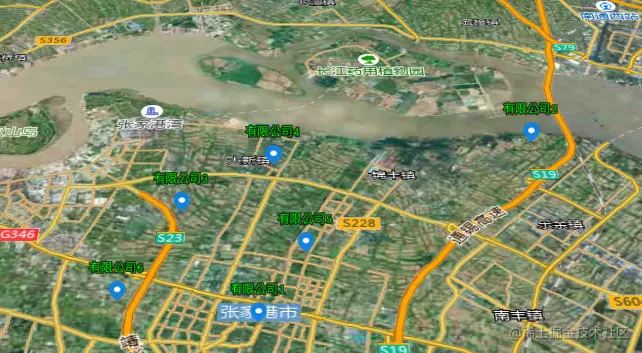

修改后的代码如下：

```js
<template>
  <div id="container" class="box">
    <div id="cesiumContainer"></div>
  </div>
</template>
<script>
export default {
  name: "cesiumMap",
  data() {
    return {
      viewer: undefined,
      pointInfo: [], // 点位信息
    };
  },
  methods: {
    init() {
      ...
    },
    loadPoints() {
      ...
    },
    // cesium 加载点位
    addMarker() {
      const Cesium = this.cesium;
      // 清除上一次加载的点位
      this.viewer.entities.removeAll();
      // foreach循环加载点位
      this.pointInfo.forEach((pointObj) => {
        ...
          // 点
          // point: {
          //   pixelSize: 5,
          //   color: Cesium.Color.RED,
          //   outlineColor: Cesium.Color.WHITE,
          //   outlineWidth: 2,
          // },
          // 文字标签
          label: {
            // show: false,
            text: pointObj.psName,
            font: "12px monospace",
            style: Cesium.LabelStyle.FILL_AND_OUTLINE,
            fillColor: Cesium.Color.LIME,
            outlineWidth: 4,
            verticalOrigin: Cesium.VerticalOrigin.BOTTOM, // 垂直方向以底部来计算标签的位置
            pixelOffset: new Cesium.Cartesian2(0, -20), // 偏移量
          },
          // 图标
          billboard: {
            image: require("@/assets/imgs/point.png"),
            width: 18,
            height: 24,
          },
        });
      });
    },
  },
  mounted() {
    this.init();
    this.loadPoints();
  },
};
</script>
<style scoped lang="scss">
...
</style>

```

修改之后，感觉好一点了，但是，点位的图标 和 文字样式明显不协调，我们把文字的样式再改改

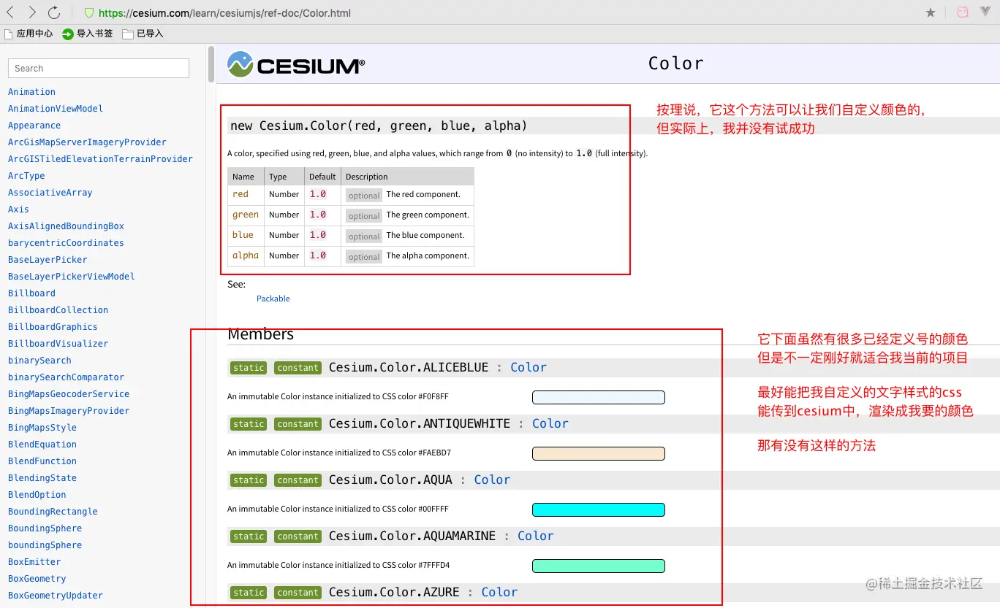

后来还真被我找到了一个可以传入我自定义样式的方法

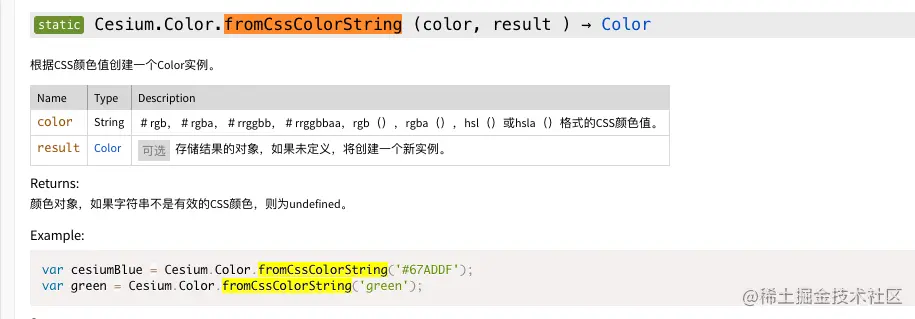

那我再改改

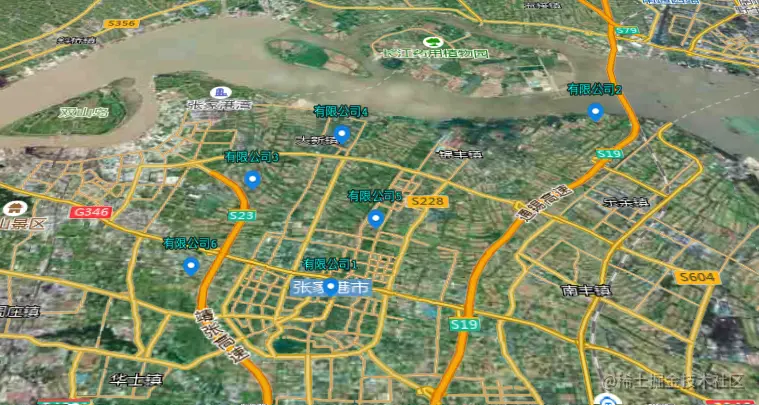

这样就完成了，
完整代码如下：

```js
<template>
  <div id="container" class="box">
    <div id="cesiumContainer"></div>
  </div>
</template>
<script>
export default {
  name: "cesiumMap",
  data() {
    return {
      viewer: undefined,
      pointInfo: [], // 点位信息
    };
  },
  methods: {
    init() {
      const Cesium = this.cesium;
      // 这里要改成自己注册的token，别忘了
      Cesium.Ion.defaultAccessToken = "your_access_token";
      this.viewer = new Cesium.Viewer("cesiumContainer", {
        baseLayerPicker: false, // 如果设置为false，将不会创建右上角图层按钮。
        geocoder: false, // 如果设置为false，将不会创建右上角查询(放大镜)按钮。
        navigationHelpButton: false, // 如果设置为false，则不会创建右上角帮助(问号)按钮。
        homeButton: false, // 如果设置为false，将不会创建右上角主页(房子)按钮。
        sceneModePicker: false, // 如果设置为false，将不会创建右上角投影方式控件(显示二三维切换按钮)。
        animation: false, // 如果设置为false，将不会创建左下角动画小部件。
        timeline: false, // 如果设置为false，则不会创建正下方时间轴小部件。
        fullscreenButton: false, // 如果设置为false，将不会创建右下角全屏按钮。
        scene3DOnly: true, // 为 true 时，每个几何实例将仅以3D渲染以节省GPU内存。
        shouldAnimate: false, // 默认true ，否则为 false 。此选项优先于设置 Viewer＃clockViewModel 。
        // ps. Viewer＃clockViewModel 是用于控制当前时间的时钟视图模型。我们这里用不到时钟，就把shouldAnimate设为false
        infoBox: false, // 是否显示点击要素之后显示的信息
        sceneMode: 3, // 初始场景模式 1 2D模式 2 2D循环模式 3 3D模式  Cesium.SceneMode
        requestRenderMode: false, // 启用请求渲染模式，不需要渲染，节约资源吧
        fullscreenElement: document.body, // 全屏时渲染的HTML元素 暂时没发现用处，虽然我关闭了全屏按钮，但是键盘按F11 浏览器也还是会进入全屏
        // 我使用高德影像地形地图
        imageryProvider: new Cesium.UrlTemplateImageryProvider({
          url: "https://webst02.is.autonavi.com/appmaptile?style=6&x={x}&y={y}&z={z}",
        }),
      });
      // 再加上高德影像注记地图
      this.viewer.imageryLayers.addImageryProvider(
        new Cesium.UrlTemplateImageryProvider({
          url: "http://webst02.is.autonavi.com/appmaptile?x={x}&y={y}&z={z}&lang=zh_cn&size=1&scale=1&style=8",
        })
      );
      // 设置初始位置  Cesium.Cartesian3.fromDegrees(longitude, latitude, height, ellipsoid, result)
      const boundingSphere = new Cesium.BoundingSphere(
        Cesium.Cartesian3.fromDegrees(120.55538, 31.87532, 100),
        15000
      );
      // 定位到初始位置
      this.viewer.camera.flyToBoundingSphere(boundingSphere, {
        // 动画，定位到初始位置的过渡时间，设置成0，就没有动画
        duration: 0,
      });
      this.viewer._cesiumWidget._creditContainer.style.display = "none"; // 隐藏版权
    },
    loadPoints() {
      // 用模拟数据测试
      this.pointInfo = [
        {
          id: "392f7fbb-ae25-4eef-ac43-58fd91148d1f",
          latitude: "31.87532",
          longitude: "120.55538",
          psName: "有限公司1",
        },
        {
          id: "0278a88c-b4f4-4d64-9ccb-65831b3fb19d",
          latitude: "31.991057",
          longitude: "120.700713",
          psName: "有限公司2",
        },
        {
          id: "248f6853-2ced-4aa6-b679-ea6422a5f3ac",
          latitude: "31.94181",
          longitude: "120.51517",
          psName: "有限公司3",
        },
        {
          id: "F8DADA95-A438-49E1-B263-63AE3BD7DAC4",
          latitude: "31.97416",
          longitude: "120.56132",
          psName: "有限公司4",
        },
        {
          id: "9402a911-78c5-466a-9162-d5b04d0e48f0",
          latitude: "31.91604",
          longitude: "120.57771",
          psName: "有限公司5",
        },
        {
          id: "EB392DD3-6998-437F-8DCB-F805AD4DB340",
          latitude: "31.88727",
          longitude: "120.48887",
          psName: "有限公司6",
        },
      ];
      this.addMarker();
    },
    // cesium 加载点位
    addMarker() {
      // 自定义label颜色
      const _textColor = "rgb(11, 255, 244)";
      const Cesium = this.cesium;
      // 清除上一次加载的点位
      this.viewer.entities.removeAll();
      // foreach循环加载点位
      this.pointInfo.forEach((pointObj) => {
        this.viewer.entities.add({
          name: pointObj.psName,
          code: pointObj.id,
          id: pointObj.id,
          position: Cesium.Cartesian3.fromDegrees(
            pointObj.longitude * 1,
            pointObj.latitude * 1
          ),
          // 点
          // point: {
          //   pixelSize: 5,
          //   color: Cesium.Color.RED,
          //   outlineColor: Cesium.Color.WHITE,
          //   outlineWidth: 2,
          // },
          // 文字标签
          label: {
            // show: false,
            text: pointObj.psName,
            font: "12px monospace",
            style: Cesium.LabelStyle.FILL_AND_OUTLINE,
            // fillColor: Cesium.Color.LIME,
            fillColor: Cesium.Color.fromCssColorString(_textColor),
            outlineWidth: 4,
            verticalOrigin: Cesium.VerticalOrigin.BOTTOM, // 垂直方向以底部来计算标签的位置
            pixelOffset: new Cesium.Cartesian2(0, -20), // 偏移量
          },
          // 图标
          billboard: {
            image: require("@/assets/imgs/point.png"),
            width: 18,
            height: 24,
          },
        });
      });
    },
  },
  mounted() {
    this.init();
    this.loadPoints();
  },
};
</script>
<style scoped lang="scss">
#cesiumContainer {
  width: 100%;
  height: 100vh;
  margin: 0;
  padding: 0;
  overflow: hidden;
}
.box {
  height: 100%;
}
</style>

```

## 伪 · 加载三维模型

因为手里头没有三维的数据，所以没得三维模型，就用cesium里面自带的方块模型给大家加载下看看
，不过自带的却是挺丑的。


代码如下：

```js
<template>
  <div id="container" class="box">
    <div id="cesiumContainer"></div>
  </div>
</template>
<script>
export default {
  name: "cesiumMap",
  data() {
    return {
      viewer: undefined,
    };
  },
  methods: {
    init() {
      ...

      // 增加实体模型
      const blueBox = this.viewer.entities.add({
        name: "Blue box",
        position: Cesium.Cartesian3.fromDegrees(120.55538, 31.87532, 100.0),
        box: {
          // new Cesium.Cartesian3(长, width, height)
          dimensions: new Cesium.Cartesian3(40.0, 100.0, 150.0),
          material: Cesium.Color.BLUE, // 配置颜色
          // material: Cesium.Color.RED.withAlpha(0.5), // 配置颜色透明度
          // fill: false, // 配置 是否填满
          // outline: true, // 配置 是否显示外边框线
          // outlineColor: Cesium.Color.YELLOW, // 配置 设置外边框线颜色
        },
      });
      this.viewer.zoomTo(this.viewer.entities); // 定位到实体
    },
  },
  mounted() {
    this.init();
  },
};
</script>
<style scoped lang="scss">
#cesiumContainer {
  width: 100%;
  height: 100vh;
  margin: 0;
  padding: 0;
  overflow: hidden;
}
.box {
  height: 100%;
}
</style>

```

## 多说一句

`cesiumAPI`里面的`东西很多`，我也不是都知道。我也是遇到功能上要做的，然后去`搜`，也会搜到有的前辈，大佬给出的答案。

不过呢，有的是我想要的，有的是类似的，接近我想到的，但不是我最终想要的，那我怎么办？

我就把大佬们用到的`cesium的方法`，`属性`等等，`自己对着API去查`，这样可以`加快我的了解进度`，让我知道我找的对不对，不对，我就换别的，再接着查，不一条路走到黑。

## 参考资料

1. [cesium的Demo网站](https://sandcastle.cesium.com/?src=Cesium%20Inspector.html)，还是很有参考价值的

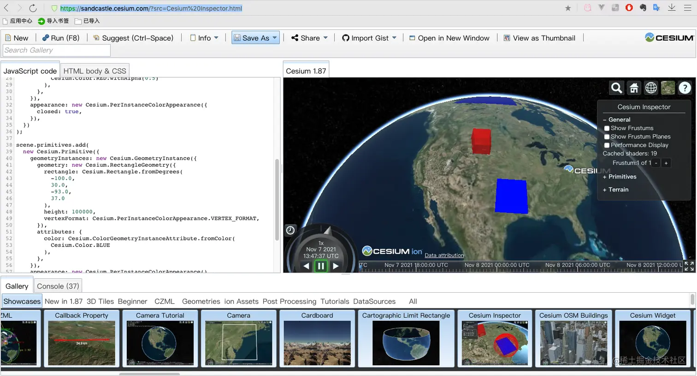

都看到这里了，求各位观众大佬们点个赞再走吧，你的赞对我非常重要
