## 前言

<!--more-->

本系列往期文章：

1. [【vue-cesium】在vue上使用cesium开发三维地图（一）](https://juejin.cn/post/7026255186788089870)
2. [【vue-cesium】在vue上使用cesium开发三维地图（二）](https://juejin.cn/post/7026376272687136781)
3. [【vue-cesium】在vue上使用cesium开发三维地图（二）续](https://juejin.cn/post/7026747156400717855)
4. [【vue-cesium】在vue上使用cesium开发三维地图（三）](https://juejin.cn/post/7027117541365383175/)
5. [【vue-cesium】在vue上使用cesium开发三维地图（四）地图加载](https://juejin.cn/post/7027488472847876127/)
6. [【vue-cesium】在vue上使用cesium开发三维地图（五）点位加载](https://juejin.cn/post/7027859428497948703)

常见`webgis`的功能如下图：

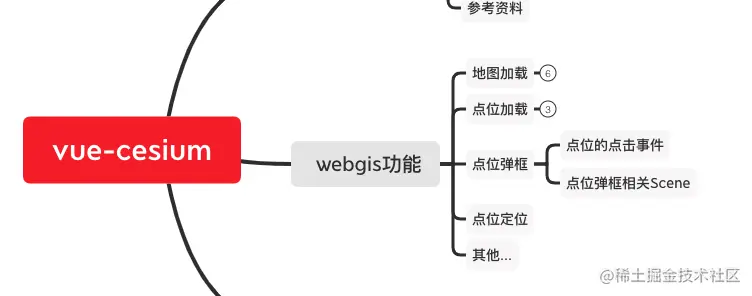
今天讲下**点位弹框**

## 优化下昨天的代码

在讲今天的之前，我们先把昨天的代码优化下
优化后的效果：

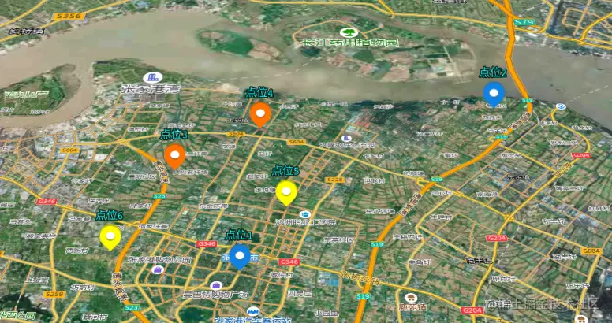

为了更贴近真实项目，模拟数据我用axios调接口的方式来获取点位的数据，安装`axios`的方法，我写在了这里[【vue起步】快速搭建vue项目引入第三方插件](https://juejin.cn/post/7020064317852614687)

并且模拟的json数据，我也写在了这篇文章里，大家可以去看下

### 开始优化

之前说过，实际环境中，会有不同的点位，所以需要按照点位类型来展示不同的点位图标
我们把点位图标给写成一个可以判断点位类型的方法

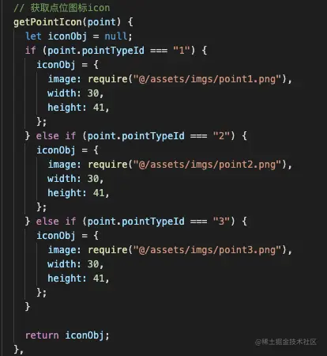

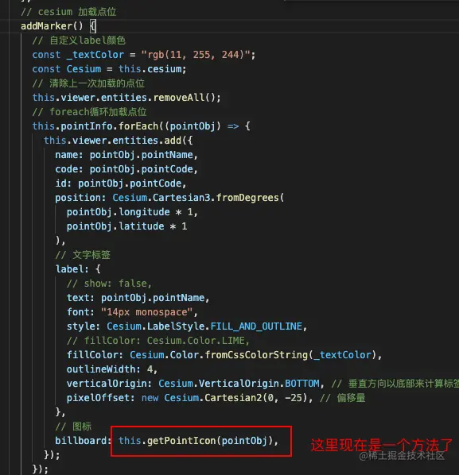

清除上一次的点位数据，也改成一个方法

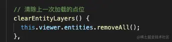

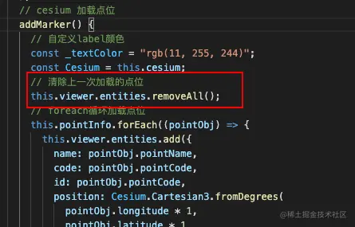

加载点位的方法，这里用了`axios`

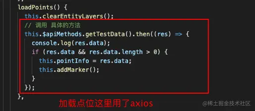

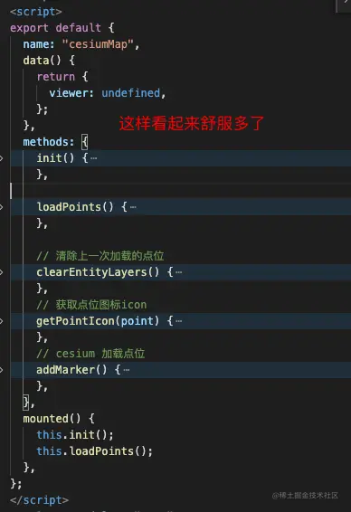

## 点位弹框

效果如下：


### 正片开始,点击事件

点位弹框是点击之后才出来了，所以我们现在要做的第一件事，就是搞定`cesium的点击事件`

`ScreenSpaceEventHandler`
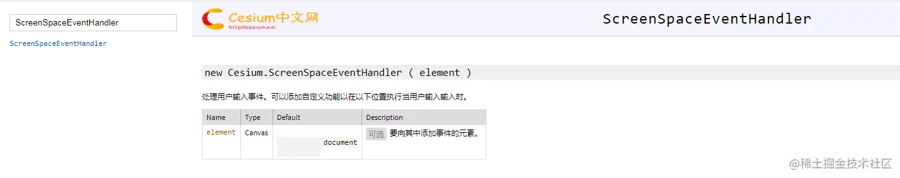
`ScreenSpaceEventType`
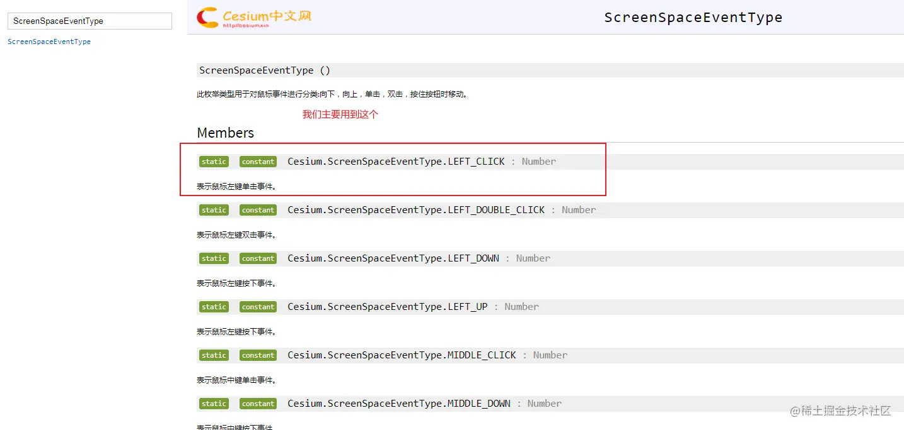

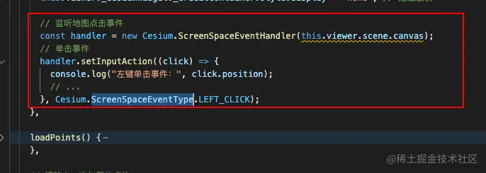

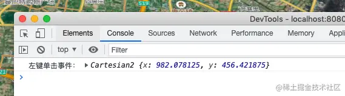

### 经纬度获取

弹窗的实现效果是点击某个存在的点模型后在点的右侧打开，原理是通过获取点击点的`屏幕坐标`，将坐标的`y`和`x`分别赋值给`div`的`top`和`left`属性。我们现在要先拿到屏幕坐标。

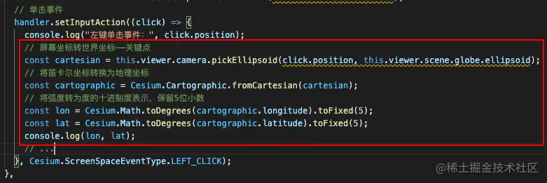

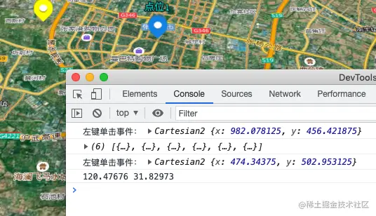

### 下面是创建弹框相关

此处用到了cesiumAPI的`Sence`

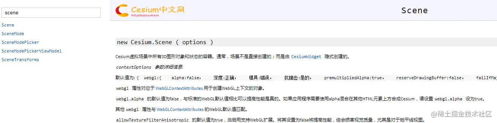

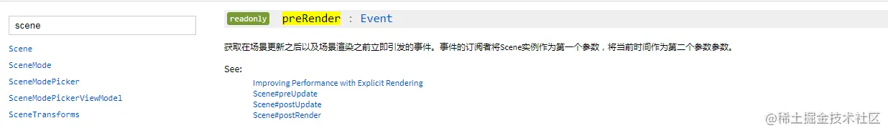

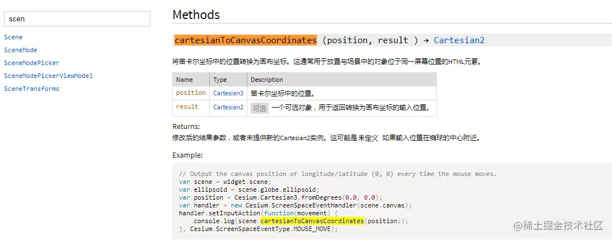

点位弹框的显示隐藏，用到了`jquery`,也安装一下，参考[【vue起步】快速搭建vue项目引入第三方插件](https://juejin.cn/post/7020064317852614687)

### 1.创建弹窗div

创建弹框，两种方式，大家按照各自的实际情况来选择：

1.  可以直接在html中创建一个`<div>我是弹框</div>`的标签，然后弹框的内容通过`js往里面添加`
1.  也可以直接通过js的方法 `document.createElement('div');`的方法，在`js中创建html标签`，进而构造出弹框来

因为我们是`vue开发`，`组件思维`更适合我们的这个场景，我们就选用第一种方式，在html里面创建一个`<div>我是弹框</div>`标签，弹框里面的内容可能根据业务不同，展示的内容页不同，这个内容我们就通过组件的方式引进来，而且这种方式，也避免了在同一个.vue文件中，写大量的代码，避免了后期查看代码的复杂性。

```js
<template>
  <div id="container" class="box">
    <div id="cesiumContainer"></div>
    <!-- 地图气泡弹框 -->
    <div class="" id="one">
        <module1Popup :pointInfo="popData" ref="popUp"/>
    </div>
  </div>
</template>

<script>
import cesiumPopup from "./cesiumPopup.vue";

export default {
  name: 'HelloWorld',
  components: {
    cesiumPopup
  },
  ...
};
</script>
```

如果弹框里面还要加其他的东西，我还可以再接着引入其他的组件，丰富弹框的内容，这样岂不美滋滋

**开始**

`html`部分需要加上弹框

```html
<template>
  <div id="container" class="box">
    <div id="cesiumContainer"></div>
    <!-- 地图弹框 -->
    <div class="dynamic-layer" id="one">
      <div class="line"></div>
      <div class="main">
        <cesiumPopup :pointInfo="popData" ref="popUp" />
      </div>
    </div>
  </div>
</template>
```

`css`部分需要设置样式

```css
// ---------------------------------------------------------- 弹框样式 ------------------------------------------------------
.dynamic-layer {
  display: none;
  user-select: none;
  pointer-events: none;
  position: fixed;
  top: 0;
  left: 0;
  width: 534px;
  // width: 100%; // 这里设置成100%，打算在组件内根据内容设置具体的宽度实践 发现无效
  z-index: 99990;
}
.dynamic-layer .line {
  position: absolute;
  left: 0;
  width: 0;
  /* height: 100px; */
  bottom: 0;
  /* background: url(./img/line.png); */
}
.dynamic-layer .main {
  display: none;
  position: absolute;
  top: 0;
  left: 30px;
  right: 0;
  /* bottom: 100px; */
  transform: translateY(-100%);
  background: url(~@/assets/map/layer_border.png) no-repeat;
  background-size: 100% 100%;
  color: white;
  padding: 20px 20px 20px 20px;
  font-size: 14px;
  user-select: text;
  pointer-events: auto;
  background-color: rgba(3,22,37,.85);
}
// ---------------------------------------------------------- 弹框样式 ------------------------------------------------------
```

**大头戏**，`js`部分，需要注意的地方都写了注释，大家放心食用

```js
  methods: {
  init() {
      ...

      // 监听地图点击事件
      const handler = new Cesium.ScreenSpaceEventHandler(this.viewer.scene.canvas);
      // 单击事件
      handler.setInputAction((click) => {
        console.log("左键单击事件：", click.position);
        // 屏幕坐标转世界坐标——关键点
        const cartesian = this.viewer.camera.pickEllipsoid(click.position, this.viewer.scene.globe.ellipsoid);
        // 将笛卡尔坐标转换为地理坐标
        const cartographic = Cesium.Cartographic.fromCartesian(cartesian);
        // 将弧度转为度的十进制度表示，保留5位小数
        const lon = Cesium.Math.toDegrees(cartographic.longitude).toFixed(5);
        const lat = Cesium.Math.toDegrees(cartographic.latitude).toFixed(5);
        console.log(lon, lat);

        // 获取地图上的点位实体(entity)坐标
        const pick = this.viewer.scene.pick(click.position);
        // 如果pick不是undefined，那么就是点到点位了
        if (pick && pick.id) {
          // 定位到地图中心
          // this.locationToCenter(lon, lat);
          console.log(pick.id);
          const data = {
            layerId: "layer1", // 英文，且唯一,内部entity会用得到
            lon: lon,
            lat: lat,
            element: "#one", // 弹框的唯一id
            boxHeightMax: 0, // 中间立方体的最大高度
          };

          this.$("#one").css("z-index", 9990);
          this.showDynamicLayer(this.viewer, data, () => { // 回调函数 改变弹窗的内容;
            this.popData.title = pick.id.name;
            this.popData.pointId = pick.id.id;
          });
          // 调用弹框的默认方法
          this.$refs.popUp.defalutSetting();
        } else {
          // 移除弹框
          if (document.querySelector("#one")) {
            this.removeDynamicLayer(this.viewer, { element: "#one" });
            this.$("#one").css("z-index", -1);
          }
        }
      }, Cesium.ScreenSpaceEventType.LEFT_CLICK);
    },
  ...
    // 创建一个动态实体弹窗
    showDynamicLayer(viewer, data, callback) {
      /* 弹窗的dom操作--默认必须*/
      this.$(data.element).css({ opacity: 0 }); // 使用hide()或者display是不行的 因为cesium是用pre定时重绘的div导致 left top display 会一直重绘
      this.$(".dynamic-layer .line").css({ width: 0 });
      this.$(data.element).find(".main").hide(0);
      /* 弹窗的dom操作--针对性操作*/
      callback();

      // 添加div弹窗
      const lon = data.lon * 1, lat = data.lat * 1;
      // data.boxHeightMax为undef也没事
      var divPosition = this.cesium.Cartesian3.fromDegrees(lon, lat, data.boxHeightMax);
      this.$("#one").css({ opacity: 1 });
      this.$("#one").find(".line").animate({
        width: 50 // 线的宽度
      }, 500, () => {
        this.$("#one").find(".main").fadeIn(500);
      });
      // 当为true的时候，表示当element在地球背面会自动隐藏。默认为false，置为false，不会这样。但至少减轻判断计算压力
      this.creatHtmlElement(viewer, data.element, divPosition, [10, -0], true);
    },

    // 创建一个 htmlElement元素 并且，其在earth背后会自动隐藏
    creatHtmlElement(viewer, element, position, arr, flog) {
      const Cesium = this.cesium;
      var ele = document.querySelector(element);
      var scratch = new Cesium.Cartesian2(); // cesium二维笛卡尔 笛卡尔二维坐标系就是我们熟知的而二维坐标系；三维也如此
      var scene = viewer.scene, camera = viewer.camera;
      scene.preRender.addEventListener(() => {
        var canvasPosition = scene.cartesianToCanvasCoordinates(position, scratch); // cartesianToCanvasCoordinates 笛卡尔坐标（3维度）到画布坐标
        if (Cesium.defined(canvasPosition)) {
          ele.style.left = canvasPosition.x + arr[0] + "px";
          ele.style.top = canvasPosition.y + arr[1] + "px";
          /* 此处进行判断**/// var px_position = Cesium.SceneTransforms.wgs84ToWindowCoordinates(scene, cartesian)
          if (flog && flog == true) {
            var e = position, i = camera.position, n = scene.globe.ellipsoid.cartesianToCartographic(i).height
            if (!(n += 1 * scene.globe.ellipsoid.maximumRadius, Cesium.Cartesian3.distance(i, e) > n)) {
              // $(element).show()
              ele.style.display = "block";
            } else {
              ele.style.display = "none";
              // $(element).hide()
            }
          }
        }
      });
    },

    // 移除动态弹窗 为了方便 这里的移除 是真的移除，因此 到时是需要重建弹窗的doom的
    removeDynamicLayer(viewer, data) {
      document.querySelector(data.element).style.opacity = 0;
    },
  },
```

现在弹框创建出来了

`ps`: 现在弹框`cesiumPopup.vue`中先不放东西
代码如下：

```js
<template>
  <div>
    我是弹框
  </div>
</template>

<script>
export default {
  methods: {
    defalutSetting() {},
  },
};
</script>
```

简单解释下js中的代码

### 2.绑定到点击事件

在`左键点击监听事件`中调用，在点击事件中通过`pick`来判断`是否选中点对象`(该方法可在`官方api`中学习到)

点击监听事件的基础上进行了扩展，通过pick判断是否选中对象，`选中`后`打开弹窗`，展示传入的信息

### 3.使弹窗跟随点移动

不论缩放地图或者移动点，都会造成弹窗的移动的需求，那么就要通过监听来完成弹窗移动的效果。

预渲染`preRender`

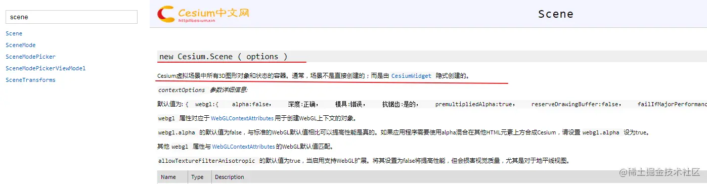

`scene`，我的理解，它就是渲染之后的整个`canvas`对象，地图一系列的东西都在这个`canvas`中

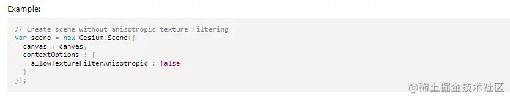

我自己找到的方法 `viewer.scene.preRender.addEventListener`

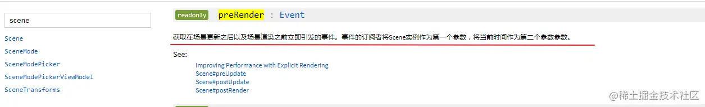

Cesium虚拟场景中所有3D图形对象和状态的容器，

获取在场景更新之后和场景渲染之前立即引发的事件。

### 4.点转到地球背后弹窗隐藏

因为我当前遇到的业务，基本都是在具体某某某地区地图上，不会让你把地图给缩放成一个地球，然后移动地球干嘛干嘛。不过代码中也实现了，也有注释。

## 来看看效果

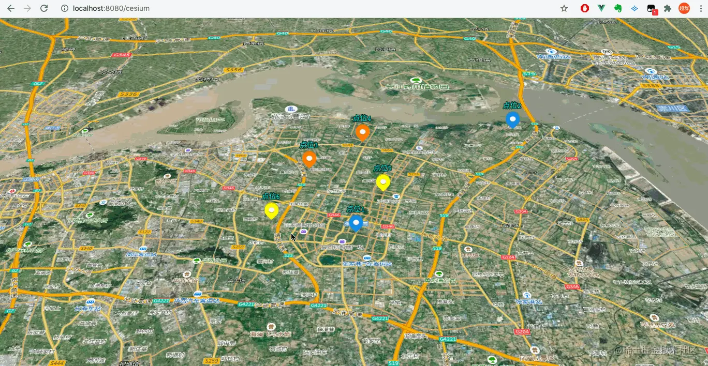

## 下节预告

1. 我们弹框既然用组件来做，那么肯定要涉及到传值
2. 现在点位弹框是在右边展示出来的，那么我们常见的业务中，点位弹框是从点位的正上方展示出来的，那么要怎么改？
3. gis项目一般在地图的左右侧也有内容，而且有时候会在左右侧操作的时候，要定位到点位，这个时候不是你手在点位上点击。这个时候通过左右侧操作，弹框出来，这是点位选中的四角框是出不来的，然后弹框出来之后，你怎么知道这个弹框它对应的是哪个点位？

我们下节内容揭晓答案
