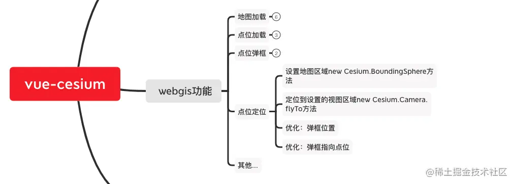
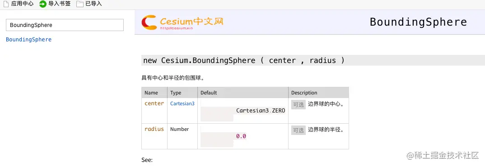
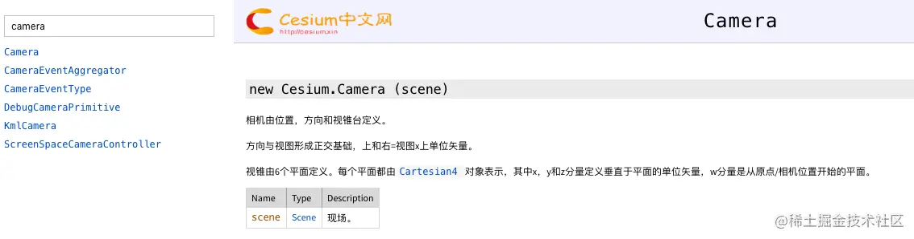
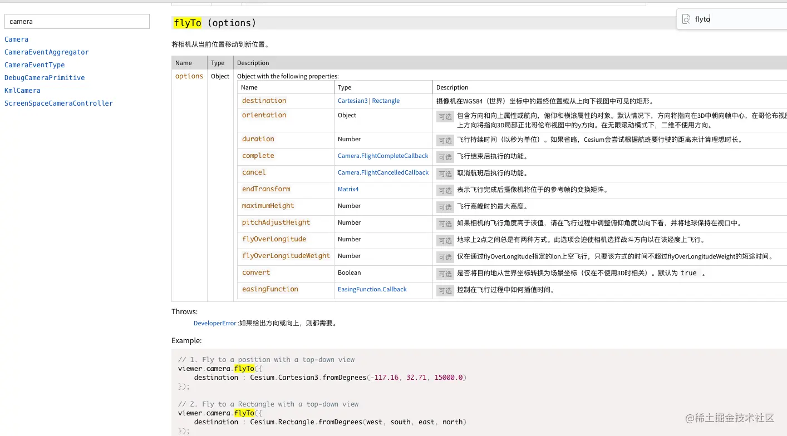
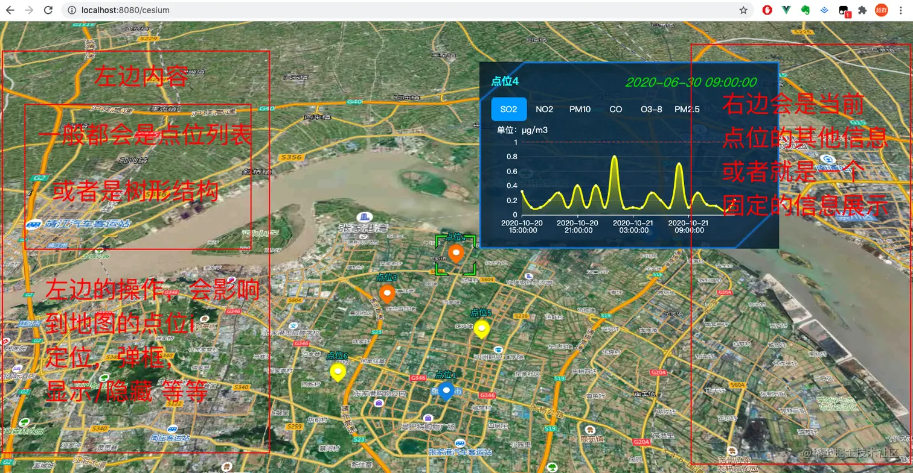
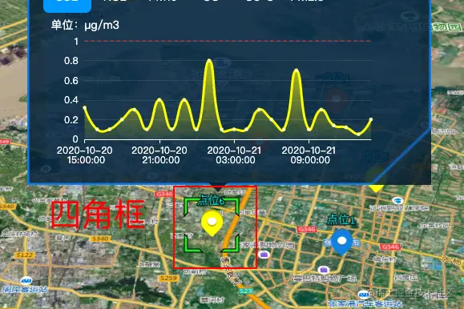
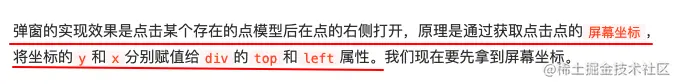

## 前言

<!--more-->

本系列往期文章：

1. [【vue-cesium】在vue上使用cesium开发三维地图（一）](https://juejin.cn/post/7026255186788089870)
2. [【vue-cesium】在vue上使用cesium开发三维地图（二）](https://juejin.cn/post/7026376272687136781)
3. [【vue-cesium】在vue上使用cesium开发三维地图（二）续](https://juejin.cn/post/7026747156400717855)
4. [【vue-cesium】在vue上使用cesium开发三维地图（三）](https://juejin.cn/post/7027117541365383175/)
5. [【vue-cesium】在vue上使用cesium开发三维地图（四）地图加载](https://juejin.cn/post/7027488472847876127/)
6. [【vue-cesium】在vue上使用cesium开发三维地图（五）点位加载](https://juejin.cn/post/7027859428497948703)
7. [【vue-cesium】在vue上使用cesium开发三维地图（六）点位弹框](https://juejin.cn/post/7028240455561117710)

常见`webgis`的功能如下图：



今天讲下**点位定位**

## 先讲定位

用到的api是`new Cesium.BoundingSphere`



然后要定位到这个初始位置，`new Cesium.Camera.flyTo`





上面这2个`api`之前在讲`地图加载`的时候已经介绍过了，其实这里就是把之前的api复用一下。

代码如下：

```js
 // 点位定位到地图中心
    locationToCenter(lon, lat) {
      const Cesium = this.cesium;
      const pointLocation = new Cesium.BoundingSphere(Cesium.Cartesian3.fromDegrees(lon * 1, lat * 1, 100), 15000); // 120.55538, 31.87532
      this.viewer.camera.flyToBoundingSphere(pointLocation);
    },
```

然后在`init()`中点击点位的时候加入这个方法

```js
init() {
      ...

      // 监听地图点击事件
      const handler = new Cesium.ScreenSpaceEventHandler(this.viewer.scene.canvas);
      // 单击事件
      handler.setInputAction((click) => {
        ...

        // 获取地图上的点位实体(entity)坐标
        const pick = this.viewer.scene.pick(click.position);
        // 如果pick不是undefined，那么就是点到点位了
        if (pick && pick.id) {
          // 定位到地图中心
          this.locationToCenter(lon, lat);
          ...
        } else {
          // 移除弹框
          if (document.querySelector("#one")) {
            this.removeDynamicLayer(this.viewer, { element: "#one" });
            this.$("#one").css("z-index", -1);
          }
        }
      }, Cesium.ScreenSpaceEventType.LEFT_CLICK);
    },
```

定位问题就这样解决了。


## 优化

### 我们先给弹框加点内容

也是一样的，用`axios`方式`加载json数据`，**axios的调用方式**可以看[【vue起步】快速搭建vue项目引入第三方插件](https://juejin.cn/post/7020064317852614687)

json数据如下：

```json
{
  "success": true,
  "code": 200,
  "msg": "操作成功",
  "count": 8,
  "data": {
    "lowValue": "0",
    "unit": "mg/l",
    "upperValue": "1",
    "factorCode": "w21003",
    "tstamp": "2020-06-30 09:00:00",
    "factorName": "氨氮",
    "data": [
      {
        "tstamp": "2020-10-20 15:00:00",
        "factorValue": "0.32"
      },
      {
        "tstamp": "2020-10-20 16:00:00",
        "factorValue": "0.1"
      },
      {
        "tstamp": "2020-10-20 17:00:00",
        "factorValue": "0.1"
      },
      {
        "tstamp": "2020-10-20 18:00:00",
        "factorValue": "0.2"
      },
      {
        "tstamp": "2020-10-20 19:00:00",
        "factorValue": "0.3"
      },
      {
        "tstamp": "2020-10-20 20:00:00",
        "factorValue": "0.1"
      },
      {
        "tstamp": "2020-10-20 21:00:00",
        "factorValue": "0.4"
      },
      {
        "tstamp": "2020-10-20 22:00:00",
        "factorValue": "0.1"
      },
      {
        "tstamp": "2020-10-20 23:00:00",
        "factorValue": "0.4"
      },
      {
        "tstamp": "2020-10-21 00:00:00",
        "factorValue": "0.1"
      },
      {
        "tstamp": "2020-10-21 01:00:00",
        "factorValue": "0.8"
      },
      {
        "tstamp": "2020-10-21 02:00:00",
        "factorValue": "0.1"
      },
      {
        "tstamp": "2020-10-21 03:00:00",
        "factorValue": "0.1"
      },
      {
        "tstamp": "2020-10-21 04:00:00",
        "factorValue": "0.1"
      },
      {
        "tstamp": "2020-10-21 05:00:00",
        "factorValue": "0.3"
      },
      {
        "tstamp": "2020-10-21 06:00:00",
        "factorValue": "0.2"
      },
      {
        "tstamp": "2020-10-21 07:00:00",
        "factorValue": "0.1"
      },
      {
        "tstamp": "2020-10-21 08:00:00",
        "factorValue": "0.7"
      },
      {
        "tstamp": "2020-10-21 09:00:00",
        "factorValue": "0.1"
      },
      {
        "tstamp": "2020-10-21 10:00:00",
        "factorValue": "0.3"
      },
      {
        "tstamp": "2020-10-21 11:00:00",
        "factorValue": "0.14"
      },
      {
        "tstamp": "2020-10-21 12:00:00",
        "factorValue": "0.12"
      },
      {
        "tstamp": "2020-10-21 13:00:00",
        "factorValue": "0.05"
      },
      {
        "tstamp": "2020-10-21 14:00:00",
        "factorValue": "0.2"
      }
    ]
  }
}
```

`cesiumPopup.vue`弹框的内容如下，基本都有注释，都能看得懂

```js
<template>
  <div style="width: 532px;">
    <div class="header">
      <div class="title">{{pointInfo.title}}</div>
      <div class="dateTime">{{dateTime}}</div>
    </div>
    <div class="pop-tab">
      <div :class="{'tab':true, 'checked': item.checked}"
        v-for="(item) in choseList" :key="item.code"
        @click="choseType(item)">
        {{item.label}}
      </div>
    </div>
    <div class="factorUnitText">单位：{{curChosedUnit}}</div>

    <div v-show="isChartHaveData" style="width: 435px; height: 170px;">
      <Echart ref="FactorChart" :options="echartObj" :autoResize="true" style="width: 435px; height: 170px;"/>
    </div>
    <div v-show="!isChartHaveData" style="width: 445px;height: 170px;color:#909399;text-align: center;line-height: 170px;">暂无数据</div>
  </div>
</template>
<script>
export default {
  props: {
    pointInfo: {
      type: Object, // 要传的值的类型
      default() {
        return {
          pointId: "--",
          title: "--",
        };
      },
    },
  },
  data() {
    return {
      // tab 列表
      choseList: [
        { code: "SO2", label: "SO2", unit: "μg/m3", checked: true },
        { code: "NO2", label: "NO2", unit: "μg/m3", checked: false },
        { code: "PM10", label: "PM10", unit: "μg/m3", checked: false },
        { code: "CO", label: "CO", unit: "μg/m3", checked: false },
        { code: "O38", label: "O3-8", unit: "μg/m3", checked: false },
        { code: "PM25", label: "PM2.5", unit: "μg/m3", checked: false },
      ],
      // 默认选中的项
      curChosed: "SO2", // 当前选中因子编码
      curChosedLabel: "SO2", // 当前选中因子名称
      curChosedUnit: "μg/m3", // 当前选中因子单位
      echartObj: {}, // 图表对象
      dateTime: "--", // 传的时间
      lineChartData: [], // 接口返回的图表数据
      upperValue: "", // 上限值
      isChartHaveData: false, // false 图表无数据 true 图表有数据
    };
  },
  methods: {
    choseType(item) {
      // 清空上一次的图表
      this.echartObj = {};
      this.choseList.forEach((element) => {
        element.checked = false;
      });
      item.checked = true;
      this.curChosed = item.code;
      this.curChosedLabel = item.label;
      this.curChosedUnit = item.unit;
      this.loadEcharts();
    },
    loadEcharts() {
      this.dateTime = "";
      this.isChartHaveData = false;

      // 调用 具体的方法
      this.$apiMethods
        .getChartData(this.pointInfo.pointId, this.curChosed)
        .then((res) => {
          // console.log(res.data.data);
          if (res.data != null) {
            this.dateTime = res.data.tstamp;
            this.upperValue = res.data.upperValue;
            if (res.data.data != null && res.data.data.length > 0) {
              this.isChartHaveData = true;
              this.lineChartData = res.data.data;
              this.drawChart();
            } else {
              this.isChartHaveData = false;
            }
          } else {
            this.isChartHaveData = false;
          }
        })
        .catch(() => {
          setTimeout(() => {
            this.isChartHaveData = false;
          }, 8000);
        });
    },
    drawChart() {
      const XData = []; // 横坐标数据
      const YData = []; // 纵坐标数据
      const limitData = []; // 限值数据

      this.lineChartData.forEach((item) => {
        XData.push(item.tstamp);
        YData.push(item.factorValue);
        limitData.push(this.upperValue);
      });

      const seriesData = [
        {
          name: this.curChosedLabel,
          type: "line",
          smooth: true,
          stack: "总量",
          data: YData,
          areaStyle: {},
          itemStyle: {
            normal: {
              lineStyle: {
                width: 3, // 折线宽度
                color: "rgba(252, 254, 0, 1)",
              },
            },
          },
        }
      ];

      if (this.upperValue != null && this.upperValue != "") {
        seriesData.push({
          name: "标准限值",
          type: "line",
          showSymbol: false,
          data: limitData,
          lineStyle: {
            normal: {
              width: 1,
              color: "#e74143", // 这儿设置安全基线颜色
              type: "dashed",
            },
          },
        });
      }

      this.echartObj = {
        tooltip: {
          trigger: "axis",
          axisPointer: {
            type: "cross",
            label: {
              backgroundColor: "#6a7985",
            },
          },
        },
        grid: {
          top: "6%",
          left: "6%",
          right: "6%",
          bottom: "3%",
          containLabel: true,
        },
        xAxis: {
          type: "category",
          boundaryGap: false,
          data: XData,
          axisLine: { // x轴线的颜色以及宽度
            show: true,
            lineStyle: {
              color: "white",
              width: 1,
              type: "solid",
            },
          },
          axisLabel: {
            show: true,
            textStyle: {
              color: "white",
            },
            // 坐标轴刻度标签的相关设置。
            formatter(params) {
              let newParamsName = ""; // 最终拼接成的字符串
              const paramsNameNumber = params.length; // 实际标签的个数
              const provideNumber = 10; // 每行能显示的字的个数
              const rowNumber = Math.ceil(paramsNameNumber / provideNumber); // 换行的话，需要显示几行，向上取整
              /**
               * 判断标签的个数是否大于规定的个数， 如果大于，则进行换行处理 如果不大于，即等于或小于，就返回原标签
               */
              // 条件等同于rowNumber>1
              if (paramsNameNumber > provideNumber) {
                /** 循环每一行,p表示行 */
                // eslint-disable-next-line no-plusplus
                for (let p = 0; p < rowNumber; p++) {
                  let tempStr = ""; // 表示每一次截取的字符串
                  const start = p * provideNumber; // 开始截取的位置
                  const end = start + provideNumber; // 结束截取的位置
                  // 此处特殊处理最后一行的索引值
                  if (p === rowNumber - 1) {
                    // 最后一次不换行
                    tempStr = params.substring(start, paramsNameNumber);
                  } else {
                    // 每一次拼接字符串并换行
                    tempStr = `${params.substring(start, end)}\n`;
                  }
                  newParamsName += tempStr; // 最终拼成的字符串
                }
              } else {
                // 将旧标签的值赋给新标签
                newParamsName = params;
              }
              // 将最终的字符串返回
              return newParamsName;
            },
          },
        },
        yAxis: {
          type: "value",
          axisTick: false,
          axisLabel: {
            show: true,
            textStyle: {
              color: "white",
            },
          },
          splitLine: {
            show: true,
            lineStyle: {
              color: ["#777"],
              opacity: 0.3,
              width: 1,
              type: "solid",
            },
          },
          axisLine: { // y轴线的颜色以及宽度
            show: false,
            lineStyle: {
              color: "#9dcbfb",
              width: 1,
              type: "solid",
            },
          },
        },
        itemStyle: { // 面积图颜色设置
          color: {
            type: "linear",
            x: 0,
            y: 0,
            x2: 0,
            y2: 1,
            colorStops: [
              {
                offset: 0,
                color: "rgba(252, 254, 0, 1)", // 0% 处的颜色
              },
              {
                offset: 1,
                color: "rgba(252, 254, 0, 0.1)", // 100% 处的颜色
              },
            ],
            globalCoord: false, // 缺省为 false
          },
        },
        series: seriesData,
      };
    },
    clearEcharts() {
      this.$refs.FactorChart.dispose(); // 组件销毁时清除定时器
    },
    // 因为弹框组件是一直放在cesiumMap.vue中，没有使用v-if，所以它是一直就存在的，所以我们想让弹框一打开，就调用mounted()钩子，调用加载loadEcharts方法，是没有用的
    // 因此，我们这边要做一个弹框每次打开就会调用的方法
    defalutSetting() {
      // 恢复默认设置
      this.choseList.forEach((element) => {
        element.checked = false;
        if (element.code == "SO2") {
          element.checked = true;
          this.curChosed = "SO2";
          this.curChosedLabel = "SO2";
          this.unit = "μg/m3";
        }
      });
      this.loadEcharts();
    },
  },
  mounted() {},
};
</script>

<style lang="scss" scoped>
.header{
  position: relative;
  margin-bottom: 15px;
  .title{
    display: inline-block;
    color: #19ffff;
    font-weight: 700;
    font-size: 18px;
  }
  .dateTime{
    color: #00de00;
    transform: skew(-20deg);
    font-size: 21px;
    padding-left: 10px;
    padding-right: 10px;
    position: absolute;
    right: 75px;
    top: 0px;
  }
}
.pop-tab {
  .tab {
    display: inline-block;
    width: 60px;
    height: 40px;
    background-color: transparent;
    cursor: pointer;
    text-align: center;
    line-height: 40px;
  }
  .checked {
    background-color: #00a2ff;
    border-radius: 7px;
  }
}
.factorUnitText {
  color: white;
  width: 100px;
  padding: 5px 0px 0px 10px;
}
</style>
```

现在来看看效果：


### 上章提出的问题

上节内容结束时，说到了三点，我们一一来看

#### 问题1

我们弹框既然用组件来做，那么肯定要涉及到`传值`

答： 这一点我们在弹框中已经完成了，通过`prop`的方式，把需要的值传过去了，`cesiumPopup.vue`中已经用到了

#### 问题2

现在`点位弹框`是在`右边展示`出来的，那么我们常见的业务中，`点位弹框`是从`点位`的`正上方展示`出来的，那么要怎么改

答：这个可能有人不太能理解，弹框从右边出来有什么不对吗？这个和`GIS的业务`有关，我来画个图给大家看看



在`GIS项目`中，一般都会在`地图的左右两侧`设置`2个容器`，这两个容器里面放的内容，一般`左边容器`里放的是`点位的列表`，或者`点位的树形结构`，对这些点位操作，比如，`点位`的`定位`，`打开弹框`等同于`在地图上操作点位图标`，还有`隐藏/显示点位`。

`右侧`有时候业务上也要`操作点位`，不过大部分情况下，右侧就是起一个展示点位的其他信息的作用。

说了这么多，就引出了**两个问题**：

1. 点位弹框在右侧展示，如果弹框比较大，而右侧容器又比较宽，像上图的情况，`弹框就和右侧容器相交了`，部分`内容被遮住`了，看`数据看的不全`了
2. 这个问题也是昨天留下来的第三个问题，在`左侧容器里操作点位`，虽然`功能上和在地图上操作点位图标一样`，但`有个效果不同`，那就是在地图上操作点位图标，会有一个`绿色的四角框`出现，但是我在`左侧容器里操作`，是`不会有四角框出现`的，因为我没在地图上点击啊



我们先来**解决第一个问题**：

让点位弹框出现在点位的正上方，上篇文章已经说了弹框实现式，出现位置的原理，看下图：



那么这次我们只要修改这个弹框的`div`的`top`和`left`:

修改的代码如下：

`cesiumMap.vue`

```js
...
  methods: {
  ...
  // 创建一个 htmlElement元素 并且，其在earth背后会自动隐藏
    creatHtmlElement(viewer, element, position, arr, flog) {
      ...
        if (Cesium.defined(canvasPosition)) {
          // 将弹框设置在点位的正上方
          // ele.style.left 中的 534/2 中 534是css样式里设置的弹框宽度，
          // ele.style.left 中的 15 中 30是点位图标宽度的一半
          // ele.style.left 中的 后面的3 就是对着页面微调之后加的增量，保证点位弹框刚好在点位的正上方
          // ele.style.top 中的 30 是点位图标的高度， 图标是30*30的
          // ele.style.top 中的 22 是因为点位上方还有label(点位名称)，弹框不能遮住label，微调出来的结果
          ele.style.left = (canvasPosition.x + arr[0] - 534/2 - 15 + 5) + 'px';
          ele.style.top = (canvasPosition.y + arr[1] - 30 - 22) + 'px';
          ...
        }
      });
    },
  ...
  }
...
```

看下效果：


接下来，**来解决第二个问题**：

要让弹框出现的时候知道，这个弹框对应的是哪个点位，聪明的你肯定猜到了，那就给弹框下方加一个箭头呗，没错，我们画一个箭头放在下方即可。然后，有箭头了，那么cesium自带的点击点位，出现的四角框，就拿掉吧

代码如下：
`html`部分

```html
<template>
  <div id="container" class="box">
    <div id="cesiumContainer"></div>
    <!-- 地图弹框 -->
    <div class="dynamic-layer" id="one">
      <div class="line"></div>
      <div class="main">
        <cesiumPopup :pointInfo="popData" ref="popUp" />
        <!-- 多了这个 -->
        <div class="tooltip-arrow"></div>
      </div>
    </div>
  </div>
</template>
```

css部分

```css
... .tooltip-arrow {
  position: absolute;
  left: 45%;
  bottom: -21px;
  width: 0;
  height: 0;
  border-top: 12px solid rgba(3, 22, 37, 0.85);
  border-right: 12px solid transparent;
  border-bottom: 12px solid transparent;
  border-left: 12px solid transparent;
}
```

js部分

```js
  ...

  methods: {
    init() {
    ...
    this.viewer = new Cesium.Viewer("cesiumContainer", {
        ...
        selectionIndicator: false, // Cesium 关闭点击绿色框
        ...
    });
    ...
    }
    ...
 },
 ...
```

## 最后效果


## 告一段落

更新到这边**基本的通用功能**已经实现了：**地图加载**，**点位加载**，**点位弹框**，**点位定位**，**弹框内容组件化**.

关于api的讲解，我也已经穿插在内容中了，就不单独再拎出来讲了。主格调就是对着用到的方法去查文档，怎么查，文章中也都截图了，无非是**ctrl+c，ctrl+v**，**ctrl+f,ctrl+v**。

至于我说的地图两侧的容器，那就完全是vue上的东西了，我相信大家都能搞出来，用的的是**组件间传值**，**组件间的方法的调用**，大家都能搞定。

后续`cesium`上如果还有`新的发现`，我还会`接着更新`的。
