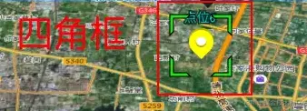
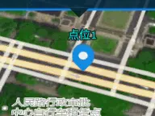
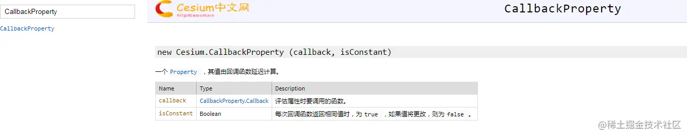
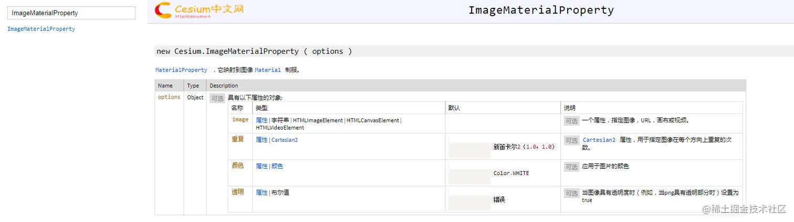
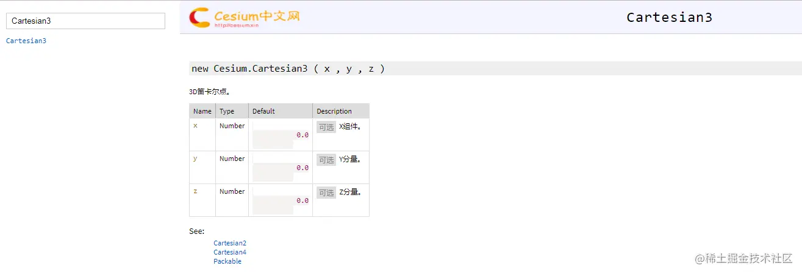
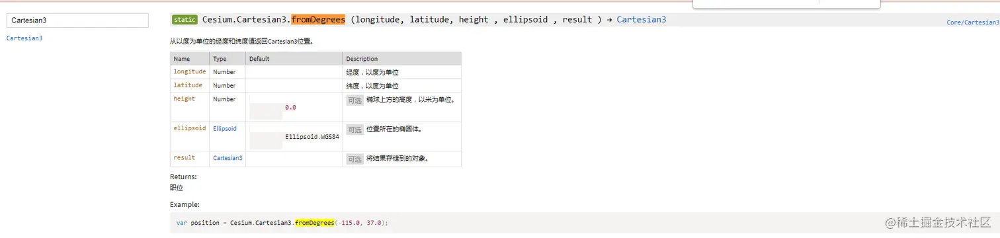
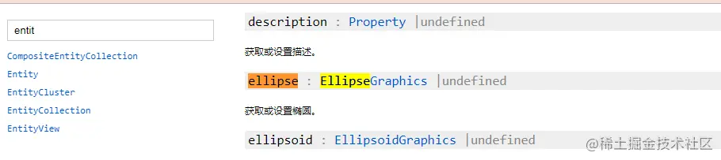
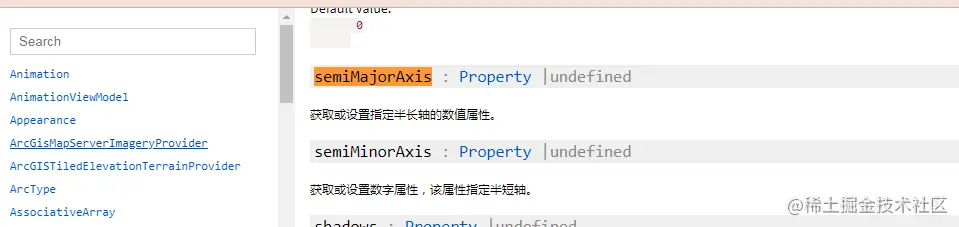
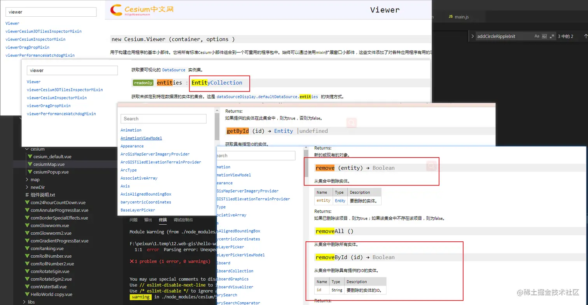
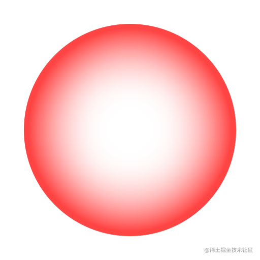

## 前言

<!--more-->

本系列往期文章：

1. [【vue-cesium】在vue上使用cesium开发三维地图（一）](https://juejin.cn/post/7026255186788089870)
2. [【vue-cesium】在vue上使用cesium开发三维地图（二）](https://juejin.cn/post/7026376272687136781)
3. [【vue-cesium】在vue上使用cesium开发三维地图（二）续](https://juejin.cn/post/7026747156400717855)
4. [【vue-cesium】在vue上使用cesium开发三维地图（三）](https://juejin.cn/post/7027117541365383175/)
5. [【vue-cesium】在vue上使用cesium开发三维地图（四）地图加载](https://juejin.cn/post/7027488472847876127/)
6. [【vue-cesium】在vue上使用cesium开发三维地图（五）点位加载](https://juejin.cn/post/7027859428497948703)
7. [【vue-cesium】在vue上使用cesium开发三维地图（六）点位弹框](https://juejin.cn/post/7028240455561117710)
8. [【vue-cesium】在vue上使用cesium开发三维地图（七）定位及优化](https://juejin.cn/post/7028600880660217870)

承接上文，我们实现了`定位`，点击点位，点位被选中，cesium默认的特效，就是在点位周围多了一个`绿色的四脚框`，太丑了。



而且，如果我们通过其他方法调用了地图上的点位点击方法，这个四脚框也不会显示出来，那么，我们能不能自己整个点位选中的特效，然后，我在别的地方调用这个方法，也还是可以把这个特效给调用出来

答案是可以的，这次，我们就来实现这个点位点击的特效

本次实现的效果:



## 预习

用到的函数：













还有我们的老朋友 `viewer`中的**查找实体** 和 **删除实体方法**



## 实现思路

1.  给`cesium`的`viewer实例`，添加`add`两个`圆弧`的`实体`，就和之前的`点位实体`一样，
2.  写两个`回调函数`，( Cesium中使用圆的扩散，可以采用回调函数来进行绘制，这样可以可以获得动态扩散的效果)
3.  然后通过延时函数setTimeOut，让这2个圆弧实体，间隔一定的时间，调用上面的回调函数，形成一种像波纹一样在扩散的效果

说的是很简单，但是可能之前没了解过的，还是不太明白，那么我们就展示代码吧：

1.  先构造出需要的圆弧

```js
// methods 中的 addCircleRipple(viewer, data)方法

/**
     * 圆扩散构造方法
     * @param  {Object}  viewer  viewer实例对象
     * @param  {Object}  data    配置项
     */
    addCircleRipple(viewer, data) {
      const Cesium = this.cesium;
      var r1 = data.minR, r2 = data.minR;
      // 通过 entities.getById()方法找到要操作的实体
      // 移除上一次的波纹效果
      if (viewer.entities.getById(data.id[0])) {
        viewer.entities.remove(viewer.entities.getById(data.id[0]))
      }

      if (viewer.entities.getById(data.id[1])) {
        viewer.entities.remove(viewer.entities.getById(data.id[1]))
      }

      // 回调函数1
      function changeR1() { //这是callback，参数不能内传
        r1 = r1 + data.deviationR;
        if (r1 >= data.maxR) {
          r1 = data.minR;
        }
        return r1;
      }
      // 回调函数2
      function changeR2() {
        r2 = r2 + data.deviationR;
        if (r2 >= data.maxR) {
          r2 = data.minR;
        }
        return r2;
      }
      viewer.entities.add({
        id: data.id[0],
        name: "",
        position: Cesium.Cartesian3.fromDegrees(data.lon, data.lat, data.height),
        ellipse: {
          // 这里为什么一个方法要写成 changeR1 changeR2
          // 因为 Cesium中使用圆的扩散，可以采用回调函数来进行绘制，这样可以可以获得动态扩散的效果。但是做的过程中遇到一个长半轴小于短半轴的报错
          // 原因
          // semiMinorAxis和semiMajorAxis使用同一个回调函数，并且semiMajorAxis属性要早于semiMinorAxis属性，所以造成长半轴小于短半轴。
          // 解决方案：
          // semiMinorAxis使用另一个回调函数
          // 关于这里的报错，可以看最下方的参考文章那里
          semiMinorAxis: new Cesium.CallbackProperty(changeR1, false),
          semiMajorAxis: new Cesium.CallbackProperty(changeR2, false),
          height: data.height,
          material: new Cesium.ImageMaterialProperty({
            image: data.imageUrl,
            repeat: new Cesium.Cartesian2(1.0, 1.0),
            transparent: true,
            color: new Cesium.CallbackProperty(function () {
                var alp = 1 - r1 / data.maxR;
                return Cesium.Color.WHITE.withAlpha(alp)  //entity的颜色透明 并不影响材质，并且 entity也会透明哦
            }, false)
          })
        }
      });
      setTimeout(function () {
        viewer.entities.add({
          id: data.id[1],
          name: "",
          position: Cesium.Cartesian3.fromDegrees(data.lon, data.lat, data.height),
          ellipse: {
            semiMinorAxis: new Cesium.CallbackProperty(changeR1, false),
            semiMajorAxis: new Cesium.CallbackProperty(changeR2, false),
            height: data.height,
            material: new Cesium.ImageMaterialProperty({
              image: data.imageUrl,
              repeat: new Cesium.Cartesian2(1.0, 1.0),
              transparent: true,
              color: new Cesium.CallbackProperty(function () {
                  var alp = 1;
                  alp = 1 - r2 / data.maxR;
                  return Cesium.Color.WHITE.withAlpha(alp)
              }, false)
            })
          }
        });
      }, data.eachInterval);
    }
```

2. 选中效果

```js
// methods 中的 addCircleRippleInit(viewer, long, lat, height)方法

    // 添加点位选中特效
    /**
     * 圆扩散调用方法
     * @param  {String}  long   经度
     * @param  {String}  lat    维度
     * @param  {String}  height 高度
     */
    addCircleRippleInit(viewer, long, lat, height) {
      let data = {
          id: ["abcd-111", "abcd-222"], // 2个实现圆弧效果的实体id，后面对这2个实体的操作都是通过这个id来的
          lon: long * 1, // 经度 就不多说了
          lat: lat * 1, // 维度 也不多说了
          height: height, // 因为是3d地图，地图上的实体会有高度属性，可以设置实体的高度
          maxR: 40,                       // 圆弧的最大半径
          minR: 0,                        // 最好为0
          deviationR: 0.3,                  // 差值 差值也大 速度越快
          eachInterval: 1000,             // 两个圈的时间间隔
          imageUrl: require("@/assets/map/red_circle.png"),
        };
      // 调用上面构造圆弧的方法
      this.addCircleRipple(viewer, data);
    },
```

代码中用到的圆弧图片,`red_circle.png`



3. 使用 ， 在`鼠标单击的事件`中`调用圆弧特效方法`

```js
// methods中的init() 中的主要功能代码

      // 监听地图点击事件
      const handler = new Cesium.ScreenSpaceEventHandler(this.viewer.scene.canvas);
      // debugger;
      // 单击事件
      handler.setInputAction((click) => {

        ...
        // 获取地图上的点位实体(entity)坐标
        const pick = this.viewer.scene.pick(click.position)
        // 如果pick不是undefined，那么就是点到点位了
        if (pick && pick.id) {
          ...
          // 添加弹框特效(红色选中波纹特效)
          this.addCircleRippleInit(this.viewer, lon2, lat2, 1);
        }
          ...

      }, Cesium.ScreenSpaceEventType.LEFT_CLICK);
```

## 参考文章

1. [Cesium关于ellipse中的semiMinorAxis和semiMajorAxis使用回调属性&&Vue中使用图片](https://blog.csdn.net/weixin_40184249/article/details/96020735)
