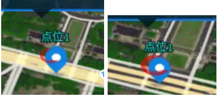
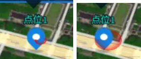
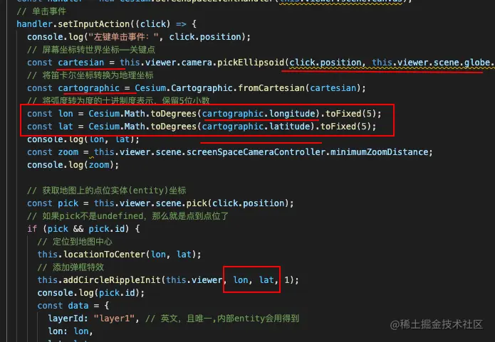
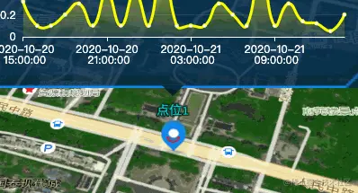

## 前言

<!--more-->

本系列往期文章：

1. [【vue-cesium】在vue上使用cesium开发三维地图（一）](https://juejin.cn/post/7026255186788089870)
2. [【vue-cesium】在vue上使用cesium开发三维地图（二）](https://juejin.cn/post/7026376272687136781)
3. [【vue-cesium】在vue上使用cesium开发三维地图（二）续](https://juejin.cn/post/7026747156400717855)
4. [【vue-cesium】在vue上使用cesium开发三维地图（三）](https://juejin.cn/post/7027117541365383175/)
5. [【vue-cesium】在vue上使用cesium开发三维地图（四）地图加载](https://juejin.cn/post/7027488472847876127/)
6. [【vue-cesium】在vue上使用cesium开发三维地图（五）点位加载](https://juejin.cn/post/7027859428497948703)
7. [【vue-cesium】在vue上使用cesium开发三维地图（六）点位弹框](https://juejin.cn/post/7028240455561117710)
8. [【vue-cesium】在vue上使用cesium开发三维地图（七）定位及优化](https://juejin.cn/post/7028600880660217870)
9. [【vue-cesium】在vue上使用cesium开发三维地图（八）点击波纹特效](https://juejin.cn/post/7030802698744102942)

承接上文

我们已经实现了点位弹框的弹出，点击点位的波纹特效的实现

但是，不知道你有没有发现一个小问题

来，看两张图



因为这个点位图标，它也不是很小很小，我鼠标点击的时候，我点到了，这个点位的`左上方`，弹框 和 特效，都是从点位的`左上方`，我鼠标点击的位置，开始出现弹框，出现波纹特效的



相信聪明的你已经发现问题了，这次，我点击的是这个点位的`右下方`，弹框 和 特效，都是从点位的`右下方`，我鼠标点击的位置，开始出现弹框，出现波纹特效的

## 疑问

为什么会是这种情况，我们看下代码



发现问题了吗？

我们在接下来 弹框，特效，用到的`经纬度`，都是`鼠标点击位置的经纬度`，鼠标点击操作，触发单击事件，捕获到鼠标点击的位置，然后处理坐标，最后转化成我们用到的120.xxx，30.xxx这种形式的坐标，但是这个转化之后的坐标，是鼠标点位位置出的坐标，那么我`鼠标点击`，`左上方`，`右下方`，`上方`，`下方`，只要在这个点位实体的范围里，随便哪块地方点击，弹框和特效都出现在点击的地方，这样是肯定是不行的。

## 解决

我们要怎么做？肯定是要点位的弹框 和 特效 显示在它应该的位置上，而不是每次鼠标点到哪，就在哪出现，换句话说，`弹框和特效的经纬度`，必须是用`点位的经纬度`，而`不是鼠标的经纬度`

解决方法

```js
 methods: {
    init() {
      ...
      // 监听地图点击事件
      const handler = new Cesium.ScreenSpaceEventHandler(this.viewer.scene.canvas);
      // 单击事件
      handler.setInputAction((click) => {
        ...

        // 获取地图上的点位实体(entity)坐标
        const pick = this.viewer.scene.pick(click.position);
        // 如果pick不是undefined，那么就是点到点位了
        if (pick && pick.id) {
          // 得到点位的经纬度
          const cartographic2 = Cesium.Cartographic.fromCartesian(pick.id.position._value);
          const lon2 = Cesium.Math.toDegrees(cartographic2.longitude).toFixed(5);
          const lat2 = Cesium.Math.toDegrees(cartographic2.latitude).toFixed(5);
          // 定位到地图中心
          this.locationToCenter(lon2, lat2);
          // 添加弹框特效
          this.addCircleRippleInit(this.viewer, lon2, lat2, 1);
          console.log(pick.id);
          const data = {
            layerId: "layer1", // 英文，且唯一,内部entity会用得到
            lon: lon2,
            lat: lat2,
            element: "#one", // 弹框的唯一id
            boxHeightMax: 0, // 中间立方体的最大高度
          };

          ...
        } else {
          // 移除弹框
          if (document.querySelector("#one")) {
            this.removeDynamicLayer(this.viewer, { element: "#one" });
            this.$("#one").css("z-index", -1);
          }
        }
      }, Cesium.ScreenSpaceEventType.LEFT_CLICK);
    },
    ...
}
```

既然点击特效改成点位的经纬度定位，那么之前的弹框也是用点击位置的经纬度，也要改成点位的经纬度

弹框这边的偏移量也微调一下

```js
 methods: {
     ...
    // 创建一个 htmlElement元素 并且，其在earth背后会自动隐藏
    creatHtmlElement(viewer, element, position, arr, flog) {
      ...
        if (Cesium.defined(canvasPosition)) {
          // 将弹框设置在点位的正上方
          // ele.style.left 中的 534/2 中 534是css样式里设置的弹框宽度，
          // ele.style.left 中的 15 中 30是点位图标宽度的一半
          // ele.style.left 中的 后面的3 就是对着页面微调之后加的增量，保证点位弹框刚好在点位的正上方
          // ele.style.top 中的 30 是点位图标的高度， 图标是30*30的
          // ele.style.top 中的 22 是因为点位上方还有label(点位名称)，弹框不能遮住label，微调出来的结果
          ele.style.left = (canvasPosition.x + arr[0] - 534/2 - 15 + 15) + 'px';
          ele.style.top = (canvasPosition.y + arr[1] - 30 - 22) + 'px';
          ...
        }
      });
    },
   ...
}
```

这样，不管怎么点，弹框 和特效都稳稳的在中心位置，不会再跟着鼠标来回跑啦



## 结尾，再补充一个`点位特效的移除`的方法

当我们不需要显示点位弹框的时候，我们是点击地图上，弹框就消失了，那么现在，当我们不需要点位弹框特效的时候，也希望在点击地图的时候，让点位特效也消失，

怎么弄？

不卖关子了

其实消失方法昨天已经实现了


```js
methods: {
    init() {
        ...
        // 监听地图点击事件
      const handler = new Cesium.ScreenSpaceEventHandler(this.viewer.scene.canvas);
      // debugger;
      // 单击事件
      handler.setInputAction((click) => {

        ...

        if (pick && pick.id) {

          ...

        } else {
          // 移除弹框
          if (document.querySelector('#one')) {
            this.removeDynamicLayer(this.viewer, { element: '#one' });
            this.$('#one').css('z-index', -1);
          }
          // 移除波纹特效
          if (this.viewer.entities.getById("abcd-111")) {
            this.viewer.entities.remove(this.viewer.entities.getById("abcd-111"))
          }
          if (this.viewer.entities.getById("abcd-222")) {
            this.viewer.entities.remove(this.viewer.entities.getById("abcd-222"))
          }
        }
      }, Cesium.ScreenSpaceEventType.LEFT_CLICK);
      ...
   },
   ...
}
```
