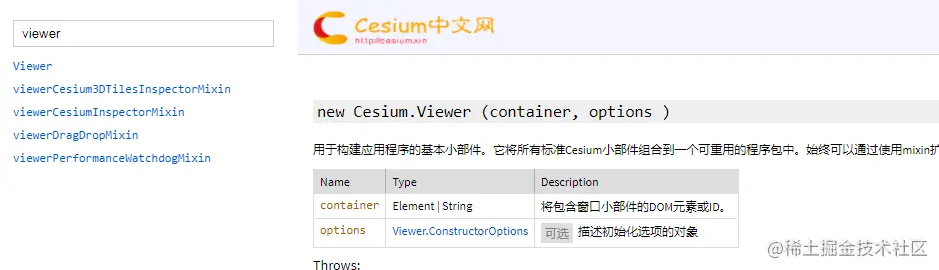
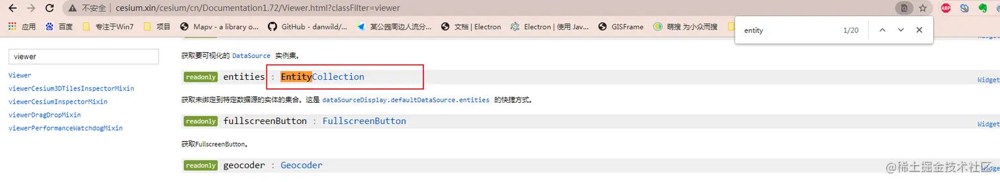
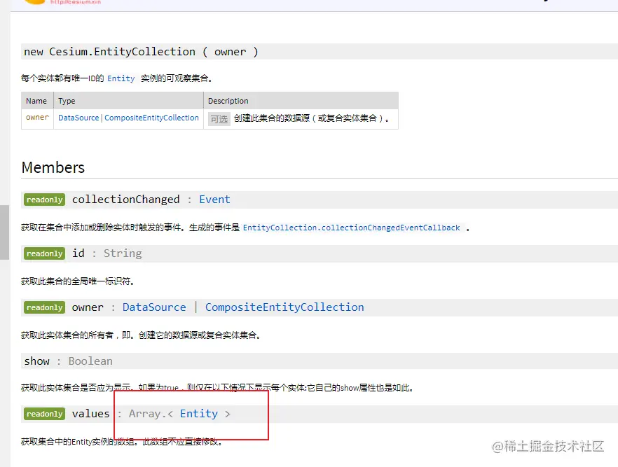
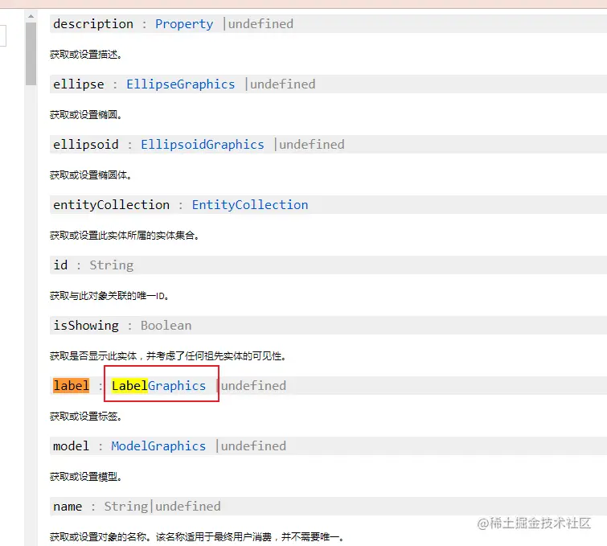
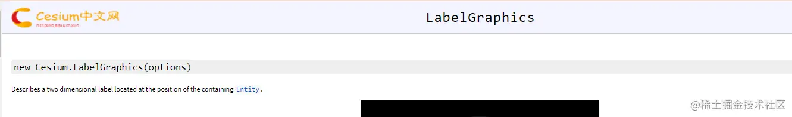
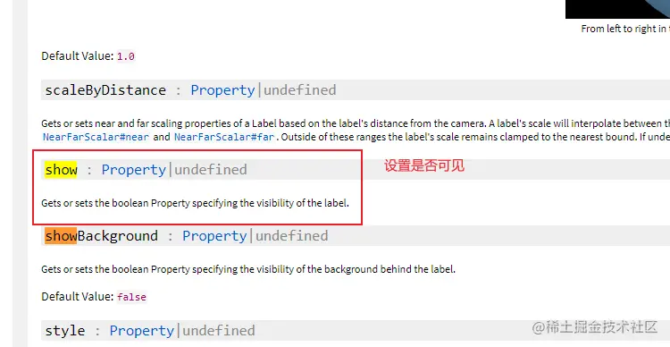
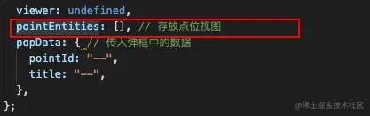
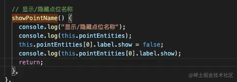
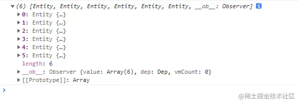
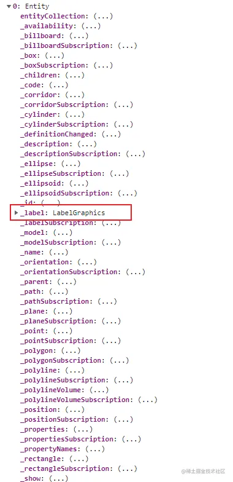

## 前言

<!--more-->

本系列往期文章：

1. [【vue-cesium】在vue上使用cesium开发三维地图（一）](https://juejin.cn/post/7026255186788089870)
2. [【vue-cesium】在vue上使用cesium开发三维地图（二）](https://juejin.cn/post/7026376272687136781)
3. [【vue-cesium】在vue上使用cesium开发三维地图（二）续](https://juejin.cn/post/7026747156400717855)
4. [【vue-cesium】在vue上使用cesium开发三维地图（三）](https://juejin.cn/post/7027117541365383175/)
5. [【vue-cesium】在vue上使用cesium开发三维地图（四）地图加载](https://juejin.cn/post/7027488472847876127/)
6. [【vue-cesium】在vue上使用cesium开发三维地图（五）点位加载](https://juejin.cn/post/7027859428497948703)
7. [【vue-cesium】在vue上使用cesium开发三维地图（六）点位弹框](https://juejin.cn/post/7028240455561117710)
8. [【vue-cesium】在vue上使用cesium开发三维地图（七）定位及优化](https://juejin.cn/post/7028600880660217870)
9. [【vue-cesium】在vue上使用cesium开发三维地图（八）点击波纹特效](https://juejin.cn/post/7030802698744102942)
10. [【vue-cesium】在vue上使用cesium开发三维地图（九）波纹特效偏移问题](https://juejin.cn/post/7030827742157340685)

有时候，点位非常多，非常密集的时候，很多的点位都挤在一起，这个时候，点位名称就更挤了，这个时候，你看地图，就会很费劲，所以点位名称的显示隐藏，这个需求就自然而然的出现了。

## 功能实现

我想看点位名称的时候，就让点位名称显示一下，不想看点位名称的时候，就让点位名称隐藏一下

方法两种：

1. 粗暴复杂法
2. 简单法

### 粗暴复杂法

这个方法也是我一开始想到的，但是实现起来，感觉太麻烦了，直接觉得，应该有更简单的方法。

先讲下这个方法的思路

- a. 从接口获取到点位数据
- b. 定义两个地图图层，图层A放点位实体，图层B放点位名称实体
- c. 进行点位名称隐藏，显示操作的时候，就把图层B 进行添加到地图上，和 移除出地图 操作

是不是挺麻烦的，我也觉得烦

因为我在实操这个方法的时候，点位是用for循环，一个个加上去的，移除的话，也要一个个移除掉，如果removeAll()方法的话，那么点位又要全部再加载上去，一来一去，感觉挺麻烦的，而且，如果点位十分多的情况下，重新加载，耗时也不会低，还影响性能

### 简单法

本着对更加简洁的追求，通过我的不懈努力，果然发现了简单的方法

其实这个也很简单，因为实体在地图上显示，能显示，那么，可能也能隐藏，去翻翻文档

实体是 `viewer`下的`entites`下的具体属性，那么我们对着文档，一层层的找






然后标签，用到的是 label属性，再找







就是它了

那么开始操作



```js
    // cesium 加载点位
    addMarker() {
     ...
      this.pointEntities = [];
      pointsInfo.forEach((pointObj) => {
        const pointEntity = this.viewer.entities.add({
          ...
        });
        // 存放点位数组
        this.pointEntities.push(pointEntity);
      });
    },
```

开始操作 显示/隐藏点位

```js
    // 显示/隐藏点位名称
    showPointName() {
      ...
    },
```

通过`console.log()`的形式，验证我的猜想是不是正确，

看文档`LabelGraphics` 这是个对象，得到点位实体对象数组



我们调用这个方法，打印看看



找到 `label属性`，



找到`show属性`，

调用 隐藏点位名称方法前：


调用隐藏点位名称方法后：


看看控制台：


有时候，如果要测试的比较频繁，那么可以在代码中打上`debugger`，然后把需要测试的字段，在控制台上进行测试，这种`debugger`测试控制台的方法，比每次写在代码中，然后看`console.log()` 的效率更高奥

```js
// 显示/隐藏点位名称

    showPointName() {

      // --------------------------- 测试代码 start ----------------------
      // console.log("显示/隐藏点位名称");
      // console.log(this.pointEntities);
      // this.pointEntities[0].label.show = false;
      // console.log(this.pointEntities[0].label.show);
      // return
      // --------------------------- 测试代码 end ----------------------
      if (this.pointEntities && this.pointEntities.length > 0) {
        // 如果当前点位的label是隐藏的，就让他显示
        if (this.pointEntities[0].label.show == false) {
          this.pointEntities.forEach((ele) => {
            ele.label.show = true;
          });
          return;
        }
        // 如果当前点位的label是显示的，否则就让点位隐藏
        this.pointEntities.forEach((ele) => {
          ele.label.show = false;
        });
      }
      return;
    },
```

### 效果


这里也可以扩展一下，

一般情况下，不同的点位有不同的类型，可以进行过滤操作，只展示某一种类型的点位，这个我这里就不手动实现了，感兴趣的可以试下，实现方法大同小异
