## 前言

<!--more-->

本系列往期文章：

1. [【vue-cesium】在vue上使用cesium开发三维地图（一）](https://juejin.cn/post/7026255186788089870)
2. [【vue-cesium】在vue上使用cesium开发三维地图（二）](https://juejin.cn/post/7026376272687136781)
3. [【vue-cesium】在vue上使用cesium开发三维地图（二）续](https://juejin.cn/post/7026747156400717855)
4. [【vue-cesium】在vue上使用cesium开发三维地图（三）](https://juejin.cn/post/7027117541365383175/)
5. [【vue-cesium】在vue上使用cesium开发三维地图（四）地图加载](https://juejin.cn/post/7027488472847876127/)
6. [【vue-cesium】在vue上使用cesium开发三维地图（五）点位加载](https://juejin.cn/post/7027859428497948703)
7. [【vue-cesium】在vue上使用cesium开发三维地图（六）点位弹框](https://juejin.cn/post/7028240455561117710)
8. [【vue-cesium】在vue上使用cesium开发三维地图（七）定位及优化](https://juejin.cn/post/7028600880660217870)
9. [【vue-cesium】在vue上使用cesium开发三维地图（八）点击波纹特效](https://juejin.cn/post/7030802698744102942)
10. [【vue-cesium】在vue上使用cesium开发三维地图（九）波纹特效偏移问题](https://juejin.cn/post/7030827742157340685)
11. [【vue-cesium】在vue上使用cesium开发三维地图（十）显示隐藏点位名称](https://juejin.cn/post/7031199035138506789)

之前，我们的点位是加载在地图上的，直白的讲，点位就是贴在地图上的。

但是我们这个地图是3维的，而且点位又是实体，那么他除了经纬度之外，有个高度，应该是合理的吧，对不对，xdm。

那么点位可不可以三维的显示在地图上，我们来查查，答案是可以的

## 点位悬空

### 点位悬空

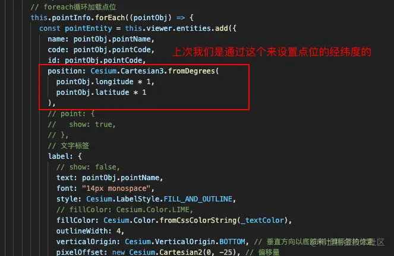

我们来找一找这个方法`Cesium.Cartesian3.fromDegrees`

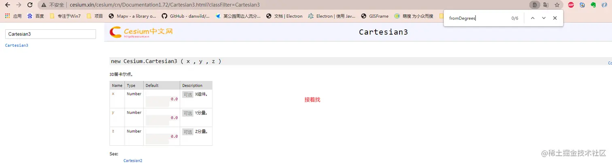

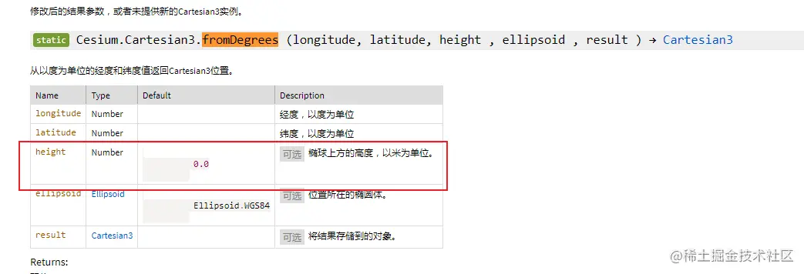

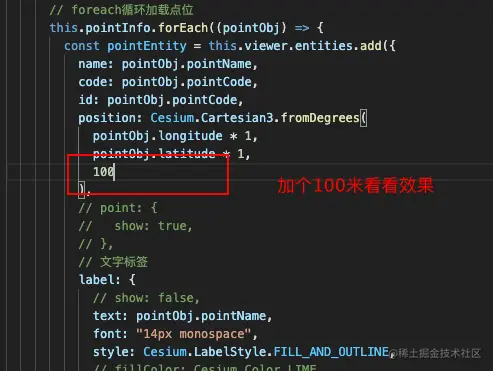

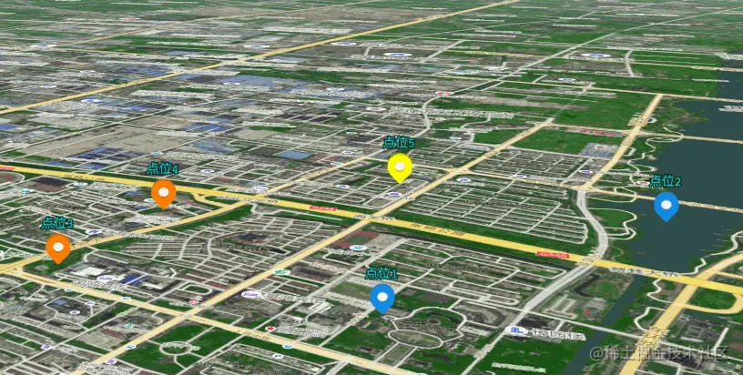

这样，点位就浮起来了

### 增加引线

但是，只是浮起来，好像还是没那么好看，

那我们接着加特效

`cesium的entities`的`add方法`，不仅可以添加`point`，`label`，`billboard`，也可以`添加线(polyline)`，

我们这次增加线

先看看效果：

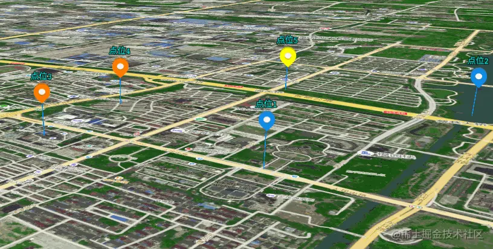

实现：

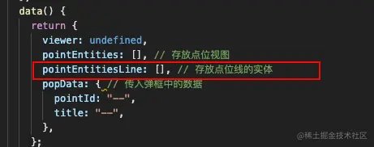

在添加点位的方法中，

```js
addMarker() {
      this.pointEntitiesLine = [];
       ...
      pointsInfo.forEach((pointObj) => {
        ...
        // 循环添加点位引线方法
        const labelEntityLine = this.loadFloatPoint(pointObj, pointObj.longitude * 1, pointObj.latitude * 1, 100);
       ...
        this.pointEntitiesLine.push(labelEntityLine);
      });
}
```

`loadFloatPoint()`方法 代码如下：

```js
    // 加载高度线
    loadFloatPoint(pointObj, long, lat, height) {
      const Cesium = this.cesium;
      const lineColor = "#108de7";
      const entityLine = this.viewer.entities.add({
        name: 'line_' + pointObj.pointName,
        code: 'line_' + pointObj.pointCode,
        id: 'line_' + pointObj.pointCode,
        // 经度维度必须是数字
        // position: Cesium.Cartesian3.fromDegrees(120.42602, 31.92423),
        polyline: {
          positions: Cesium.Cartesian3.fromDegreesArrayHeights([
            long, lat, 0,
            long, lat, height,
          ]),
          width: 1,
          // 材质设置
          // material: Cesium.Color.DODGERBLUE,
          material: Cesium.Color.fromCssColorString(lineColor),
          // material : new Cesium.PolylineGlowMaterialProperty({ //发光线
          //     glowPower : 0.1,
          //     color : Cesium.Color.DODGERBLUE
          // })
        },
      });
      return entityLine;
    },
```

这样，`点位引线`就添加完成了

## 再提升一下

结束了吗？还没有

虽然点位现在已经有3d的感觉了，但是点位弹框还在下面的位置，

点位点击之前：

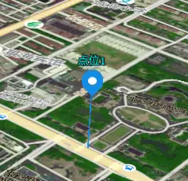

点位点击之后：

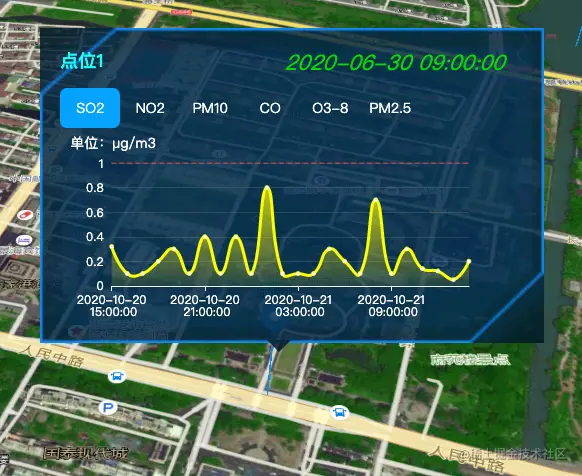

我们来给点位弹框一个俯视的角度，更加3d一点

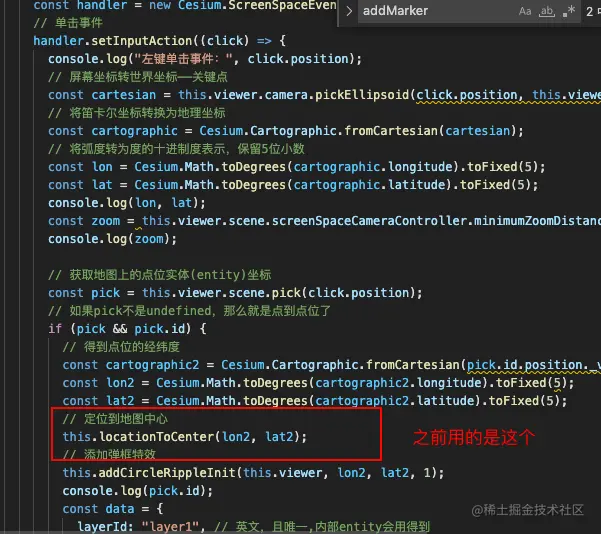

换最新的

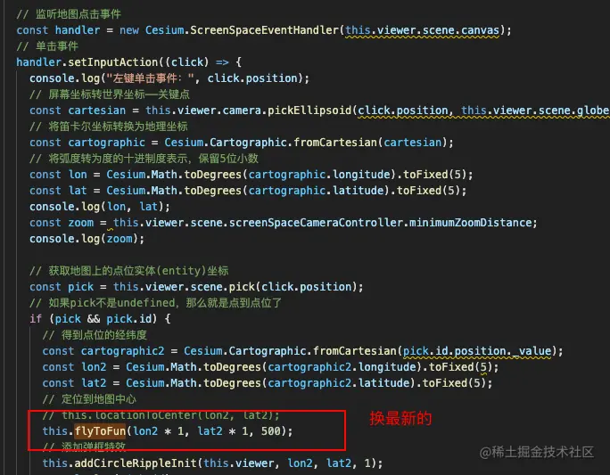

`flyToFun()`方法如下：

```js
    // 飞入到点位方法
    flyToFun(long, lat, height) {
      const Cesium = this.cesium;
      const destination = Cesium.Cartesian3.fromDegrees(long, lat, height);
      this.viewer.scene.camera.flyTo({
        destination: destination,
      });
    },
```

效果出来了：

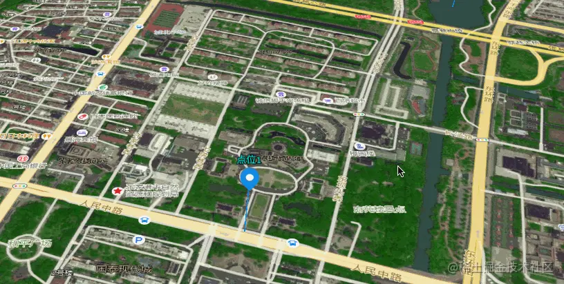
