## 前言

<!--more-->

本系列往期文章：

1. [【vue-cesium】在vue上使用cesium开发三维地图（一）](https://juejin.cn/post/7026255186788089870)
2. [【vue-cesium】在vue上使用cesium开发三维地图（二）](https://juejin.cn/post/7026376272687136781)
3. [【vue-cesium】在vue上使用cesium开发三维地图（二）续](https://juejin.cn/post/7026747156400717855)
4. [【vue-cesium】在vue上使用cesium开发三维地图（三）](https://juejin.cn/post/7027117541365383175/)
5. [【vue-cesium】在vue上使用cesium开发三维地图（四）地图加载](https://juejin.cn/post/7027488472847876127/)
6. [【vue-cesium】在vue上使用cesium开发三维地图（五）点位加载](https://juejin.cn/post/7027859428497948703)
7. [【vue-cesium】在vue上使用cesium开发三维地图（六）点位弹框](https://juejin.cn/post/7028240455561117710)
8. [【vue-cesium】在vue上使用cesium开发三维地图（七）定位及优化](https://juejin.cn/post/7028600880660217870)
9. [【vue-cesium】在vue上使用cesium开发三维地图（八）点击波纹特效](https://juejin.cn/post/7030802698744102942)
10. [【vue-cesium】在vue上使用cesium开发三维地图（九）波纹特效偏移问题](https://juejin.cn/post/7030827742157340685)
11. [【vue-cesium】在vue上使用cesium开发三维地图（十）显示隐藏点位名称](https://juejin.cn/post/7031199035138506789)
12. [【vue-cesium】在vue上使用cesium开发三维地图（十一）点位悬空，空间效果](https://juejin.cn/post/7031581889433436173)

这次讲的内容是**加载三维模型**，在cesium上，应该叫做加载 **3d tiles**.

这次也是凑巧，刚好在网上找到了现成的3d模型，所以就来试试看，加载3d tiles

## 预习

### 模型数据

老规矩，先上材料

3d模型地址：[传送门](https://gitee.com/HQCode/Cesium-test/blob/master/lesson02/Scene/testm3DTiles.json)

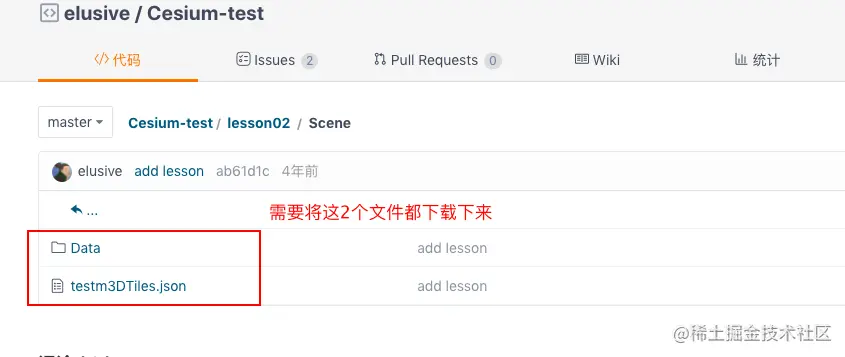

模型还挺大的

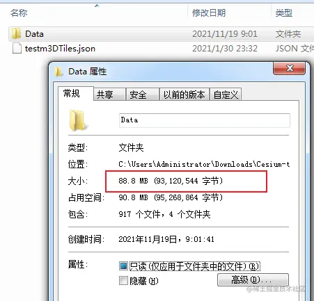

### 3d tiles简介

简单介绍下 3d tiles

3DTiles数据集是cesium小组AnalyticlGraphics与2016年3月定义的一种数据集，3DTiles数据集以分块、分级渲染，将大数据量三维数据以分块，分层的形式组织起来，可以大量减轻浏览器和GPU的负担是一个优秀的，并且格式公开的数据格式。

3D Tiles是用于流式传输大规模异构3D地理空间数据集的开放规范。为了扩展Cesium的地形和图像流，3D Tiles将用于流式传输3D内容，包括建筑物，树木，点云和矢量数据。

## 开干

我把下载的模型放在`public/DemoData`下，新建一个文件夹`Scene`，存放模型数据

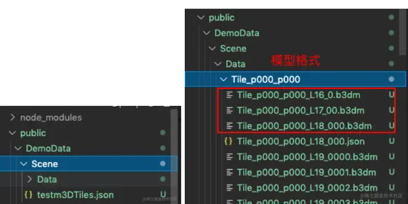

因为之前 在 `vue.config.js` 中配置过本地数据的代理

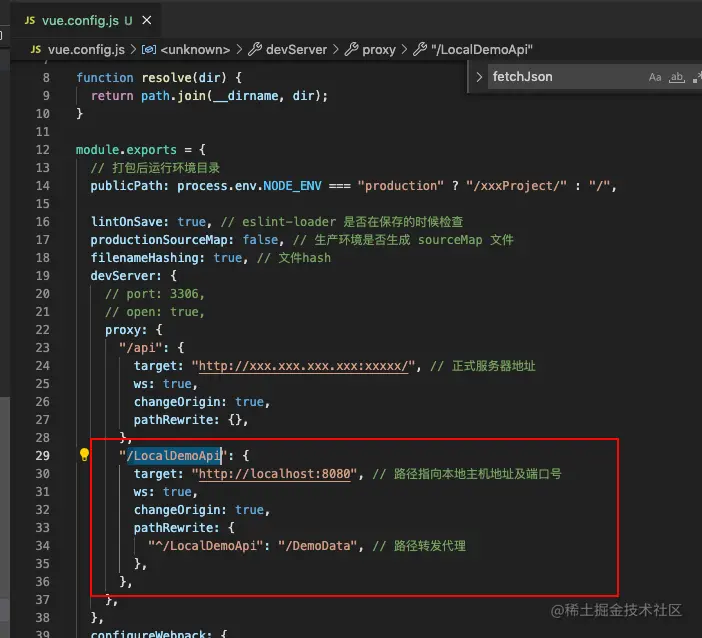

这里解释一下为什么调用这个3d模型要像调接口数据一样调用，因为cesium里面加载3d模型的方法是一个Promise

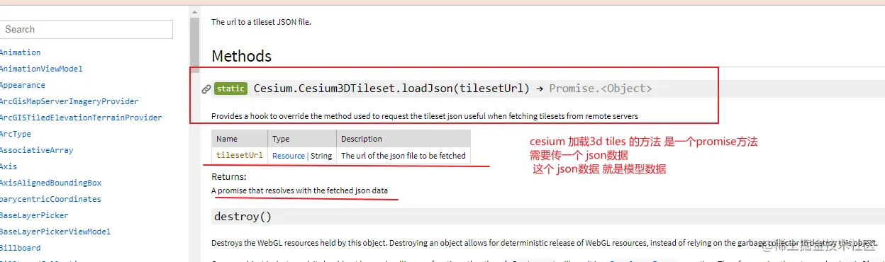

加载模型方法代码如下

```js
  methods: {
    // 加载3d模型  3D Tiles
    // 数据来源 https://gitee.com/HQCode/Cesium-test/blob/master/lesson02/Scene/testm3DTiles.json
    load3DTiles() {
      const Cesium = this.cesium;
      let tilesetModel = this.viewer.scene.primitives.add(new Cesium.Cesium3DTileset({
        url: "LocalDemoApi/Scene/testm3DTiles.json",
      }));
      tilesetModel.readyPromise.then((currentModel) => {
        // 定位到模型
        this.viewer.zoomTo(currentModel, new Cesium.HeadingPitchRange(0.5, -0.2, currentModel.boundingSphere.radius * 1.0));
      }).otherwise((error) => {
        console.log(error);
      });
    },
  ...
  }
```

调用上面的方法加载

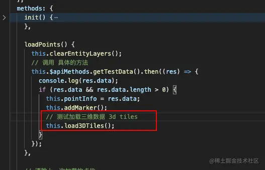

模型加载出来了

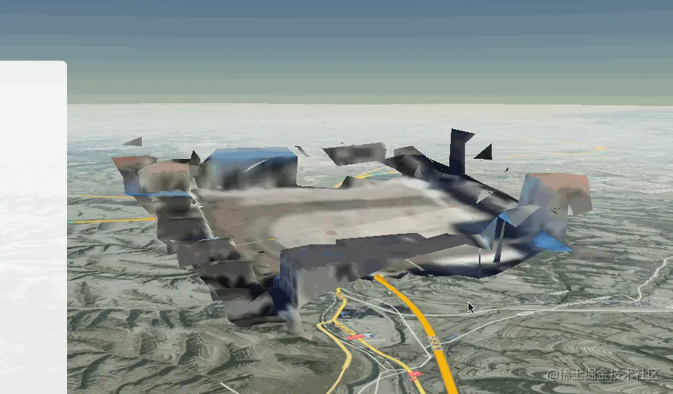

模型是加载出来了，但是位置不太对，模型出现在了空中，这是为什么？
理由也很简单，

1. 3d tiles文件生成时本身就具有位置和高度， 生成的数据不一定是落在地面上，有可能是浮在空中的，这并不是我们想要的,我们希望拍摄的成果能贴到地面上。

2. 单个瓦片的位置信息是写到了数据中的(.b3dm和对应的json文件中),如果能整体调整加载后的tileset，就会是最好的选择

3. 是生成3dtiles文件时使用的底图和地形和cesium加载的可能不同，再加上人工调整模型位置具有一定的偏差，所以3dtiles模型加载到数字地球上之后，大部分概率是需要再次调整位置

调整3dtiles位置 本质是通过 **矩阵运算** 来实现的

快速了解下  矩阵运算

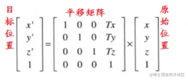

```js
// 创建平移矩阵方法一
// m = Cesium.Matrix4.fromArray([
//     1.0, 0.0, 0.0, 0.0,
//     0.0, 1.0, 0.0, 0.0,
//     0.0, 0.0, 1.0, 0.0,
//     x, y, z, 1.0
// ]);

//创建平移矩阵方法二
var translation = Cesium.Cartesian3.fromArray([x, y, z]);
m = Cesium.Matrix4.fromTranslation(translation);
tilesetModel.modelMatrix = m;
```

我们只要不断的修改 x,y,z ，就可以调整物体的位置了

得到合适的 x,y,z ，在加载3d tiles 的时候，将modelMatrix 设置成 刚刚的x,y,z 值，就可以了

还有一种方法就是计算偏移量（高度为例）

```js
// 设置指定高度

function changeHeight(height) {
  height = Number(height);
  if (isNaN(height)) {
    return;
  }
  var cartographic = Cesium.Cartographic.fromCartesian(
    tileset.boundingSphere.center,
  );
  var surface = Cesium.Cartesian3.fromRadians(
    cartographic.longitude,
    cartographic.latitude,
    cartographic.height,
  );
  var offset = Cesium.Cartesian3.fromRadians(
    cartographic.longitude,
    cartographic.latitude,
    height,
  );
  var translation = Cesium.Cartesian3.subtract(
    offset,
    surface,
    new Cesium.Cartesian3(),
  );
  tileset.modelMatrix = Cesium.Matrix4.fromTranslation(translation);
}
```

下面我们来调整3d模型的位置

我们来看文档

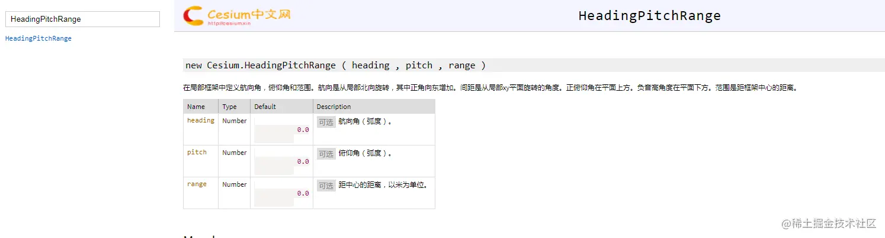

设置定位

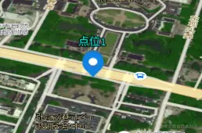

在这张图上，我们可以看到，它这个是3d 笛卡尔坐标

我们 常态下都是对120.xx   30.xxx 这种形式的经纬度比较熟悉，

所以我们弄一个在线调试的经纬度的方法，来调试合适的经纬度
先看看，实现的效果

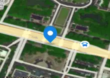

js区域的最上方定义3d模型的一些变量

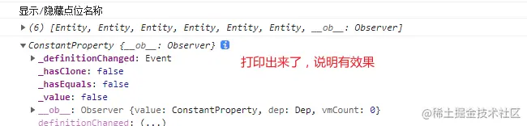

我们先弄3d模型的定位框

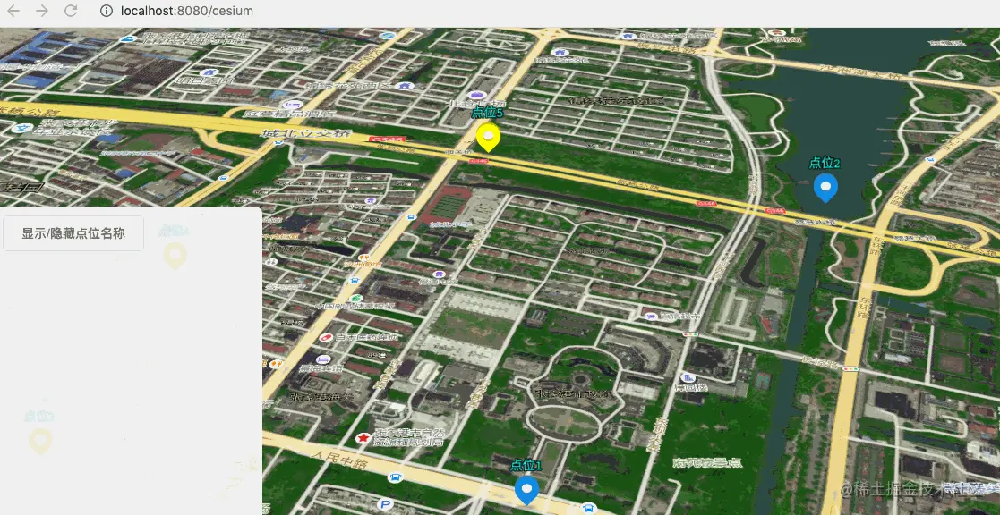

对应的css样式

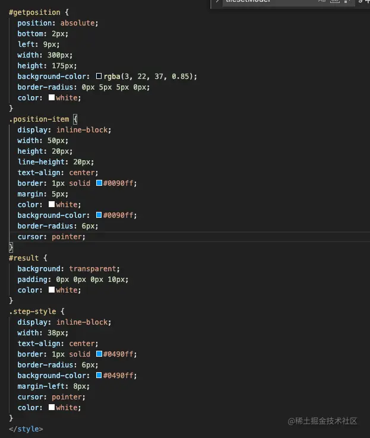

**本来想把这个模型移动到我之前做的点位的那边，但是发现，模型的位置距离我点位的位置，相隔十万八千里，然后我在移动模型的过程中，发现，x,y,z 都要调整，实在是距离太远了，移不动了，**

我想到，实际项目中，给的模型正常情况下都不可能偏的太离谱，我这个网上随意找的模型，就真的比较随意了，因此，我就不移模型了，大家看个效果就行。

## 最后完整加载3d Tiles代码

这里只展示3d模型相关的代码，其他的代码我用... 省略，其他代码可以看我的往期文章

```js
<template>
  <div id="container" class="box">
    <div id="cesiumContainer"></div>

    <!-- 调整3d模型位置方法 -->
    <div id="getposition">
      <span style="margin: 6px 0px 6px 6px;">调整3d模型位置</span>
      <br />
      <button class="position-item" @click="change(0)">x+</button>
      <button class="position-item" @click="change(1)">x-</button>
      <button class="position-item" @click="change(2)">y+</button>
      <button class="position-item" @click="change(3)">y-</button>
      <button class="position-item" @click="change(4)">z+</button>
      <button class="position-item" @click="change(5)">z-</button>
      <br />
      <span style="margin: 6px 0px 6px 6px;">设置移动量：</span>
      <button class="step-style" @click="changeStep(1)">1</button>
      <button class="step-style" @click="changeStep(10)">10</button>
      <button class="step-style" @click="changeStep(100)">100</button>
      <br />
      <button class="position-item" @click="changevisible()">isHide</button>

      <div id="result" style=""></div>
    </div>
  </div>
</template>
<script>
import cesiumPopup from "./cesiumPopup.vue";

let tilesetModel = null; // 存放 测试 3d模型 的对象
let step = 100; // 测试 3d模型 每次移动的步进量 初次加载默认100
// let x = 0;
// let y = 0;
// let z = 0;
let x = 360.0;
let y = -920.0;
let z = -820.0;
let m = null; // 平移矩阵 3d模型的平移方法

export default {
  name: "cesiumMap",
  components: {
    cesiumPopup,
  },
  data() {
    return {
      viewer: undefined,
      pointEntities: [], // 存放点位视图
      pointEntitiesLine: [], // 存放点位线的实体
      popData: { // 传入弹框中的数据
        pointId: "--",
        title: "--",
      },
    };
  },
  methods: {
    init() {
      ...
    },

    loadPoints() {
      ...
          // 测试加载三维数据 3d tiles
          this.load3DTiles();
    },


...

    // 加载3d模型  3D Tiles
    // 数据来源 https://gitee.com/HQCode/Cesium-test/blob/master/lesson02/Scene/testm3DTiles.json
    load3DTiles() {
      const Cesium = this.cesium;
      tilesetModel = this.viewer.scene.primitives.add(new Cesium.Cesium3DTileset({
        url: "LocalDemoApi/Scene/testm3DTiles.json",
      }));
      tilesetModel.readyPromise.then((currentModel) => {
        // 定位到模型
        this.viewer.zoomTo(currentModel, new Cesium.HeadingPitchRange(0.5, -0.2, currentModel.boundingSphere.radius * 1.0));
        this.changeHeight(20);
      }).otherwise((error) => {
        console.log(error);
      });
    },

    // 调整3d模型位置
    change(type) {
      const Cesium = this.cesium;
      switch (type) {
        case 0:
          x += step;
          break;
        case 1:
          x -= step;
          break;
        case 2:
          y += step;
          break;
        case 3:
          y -= step;
          break;
        case 4:
          z += step;
          break;
        case 5:
          z -= step;
          break;
      }

      //创建平移矩阵方法一
      // m = Cesium.Matrix4.fromArray([
      //     1.0, 0.0, 0.0, 0.0,
      //     0.0, 1.0, 0.0, 0.0,
      //     0.0, 0.0, 1.0, 0.0,
      //     x, y, z, 1.0
      // ]);
      //创建平移矩阵方法二
      var translation = Cesium.Cartesian3.fromArray([x, y, z]);
      console.log('translation', translation);
      m = Cesium.Matrix4.fromTranslation(translation);
      document.getElementById("result").innerText = "x:" + x + " y:" + y + " z:" + z;
      tilesetModel.modelMatrix = m;
    },
    // 设置3d模型的移动量，调整位置的时候用得到
    changeStep(stepin) {
      step = stepin;
    },
    // 显示/隐藏3d模型
    changevisible() {
      // console.log(tilesetModel);
      tilesetModel.show = !tilesetModel.show;
    },
    //方法二，直接调用函数，调整高度,height表示物体离地面的高度
    changeHeight(height) {
      const Cesium = this.cesium;
      height = Number(height);
      if (isNaN(height)) {
        return;
      }
      var cartographic = Cesium.Cartographic.fromCartesian(tilesetModel.boundingSphere.center);
      var surface = Cesium.Cartesian3.fromRadians(cartographic.longitude, cartographic.latitude, cartographic.height);
      var offset = Cesium.Cartesian3.fromRadians(cartographic.longitude, cartographic.latitude, height);
      var translation = Cesium.Cartesian3.subtract(offset, surface, new Cesium.Cartesian3());
      tilesetModel.modelMatrix = Cesium.Matrix4.fromTranslation(translation);
    },
  },
  mounted() {
    this.init();
    this.loadPoints();
  },
};
</script>
<style scoped lang="scss">
#cesiumContainer {
  width: 100%;
  height: 100vh;
  margin: 0;
  padding: 0;
  overflow: hidden;
}
.box {
  height: 100%;
}

.leftContent {
  position: absolute;
  top: 200px;
  width: 300px;
  background-color: rgb(255 255 255 / 85%);
  height: 500px;
  border-radius: 8px;
}

#getposition {
  position: absolute;
  bottom: 2px;
  left: 9px;
  width: 300px;
  height: 175px;
  background-color: rgba(3, 22, 37, 0.85);
  border-radius: 0px 5px 5px 0px;
  color: white;
}
.position-item {
  display: inline-block;
  width: 50px;
  height: 20px;
  line-height: 20px;
  text-align: center;
  border: 1px solid #0090ff;
  margin: 5px;
  color: white;
  background-color: #0090ff;
  border-radius: 6px;
  cursor: pointer;
}
#result {
  background: transparent;
  padding: 0px 0px 0px 10px;
  color: white;
}
.step-style {
  display: inline-block;
  width: 38px;
  text-align: center;
  border: 1px solid #0490ff;
  border-radius: 6px;
  background-color: #0490ff;
  margin-left: 8px;
  cursor: pointer;
  color: white;
}
</style>

```

## 参考文档

1. [Cesium编程入门(六)添加 3D Tiles，并调整位置，贴地](https://blog.csdn.net/u013517229/article/details/89925257?ops_request_misc=&request_id=&biz_id=102&utm_term=cesium%203dtiles&utm_medium=distribute.pc_search_result.none-task-blog-2~all~sobaiduweb~default-4-89925257.first_rank_v2_pc_rank_v29&spm=1018.2226.3001.4187)
2. [3dtiles格式\_使用Cesium加载并调整3D Tiles](https://blog.csdn.net/weixin_36068796/article/details/112119834?utm_medium=distribute.pc_relevant.none-task-blog-2~default~baidujs_utm_term~default-4.no_search_link&spm=1001.2101.3001.4242.3)
3. [Cesium学习系列汇总](https://mp.weixin.qq.com/s?__biz=MzU1ODcyMjEwOA==&mid=2247484268&idx=1&sn=861480d7108f70a2fd16000df4df2db1&chksm=fc237e3fcb54f72904a9cd57a3c2bf325e30a00de614ec3145dcb1f0310e7c0f9362d4f00742&scene=18#wechat_redirect)
