宝塔面板的安装先略过

<!--more-->

今天主要讲 在 安装宝塔面板之后，安装`git`，并设置账号，进行服务器上的部署

## 安装git的一系列操作

### 一、Git安装及配置

1. 进入 `宝塔面板`的`终端页面`

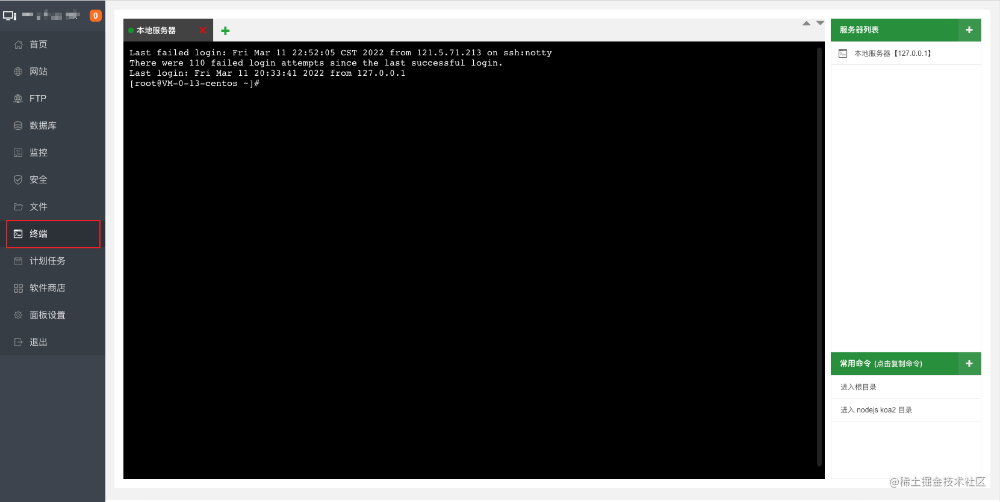

2. 输入以下命令，安装依赖库

```js
yum install curl-devel expat-devel gettext-devel openssl-devel zlib-devel
```

ps.如果出现下面这行：

```
Is this ok [y/d/N]:
```

那么就输入`y`继续安装，没有就继续。

3. 安装编译工具：

```js
yum install gcc perl-ExtUtils-MakeMaker package
```

### 二、下载 git并解压编译安装

1. 查看服务器已有的git版本

```js
git --version
```

不出意外，应该是 1.8.3.1版本

```js
git version 1.8.3.1
```

> 但是官网版本已经更新了，因为yum仓库的Git版本更新的时间会存在延时，我们这里采用源码包安装方式安装。

2. 将陈旧版本的git删除

```js
yum remove git
```

- 选择一个目录来存放下载下来的 git 安装包。这里选择了`/usr/local/src` 目录

```js
cd / usr / local / src;
```

- 下载最新版git到`/usr/local/src`，可以在官网找到版本，目前最新版本是2.26.0。

```js
wget http://ftp.ntu.edu.tw/software/scm/git/git-2.26.0.tar.gz
```

- 解压到当前目录

```js
tar -zvxf git-2.26.0.tar.gz
```

- 进入 `git-2.26.0.tar.gz` 目录下

```js
cd git-2.26.0
```

- 执行编译

```js
make prefix=/usr/local/git all
```

- 安装 git 到 /usr/local/git 目录下

```js
make prefix=/usr/local/git install
```

### 三、配置 git 环境变量

- 打开环境变量配置文件

```js
vim / etc / profile;
```

**按i进入编辑模式，按向下键到底部，添加下面两行命令：**

```js
PATH=$PATH:/usr/local/git/bin   # git 的目录
export PATH
```

**按`esc`退出，按`:wq`保存编辑。(注意是先`:`再是`wq`)**

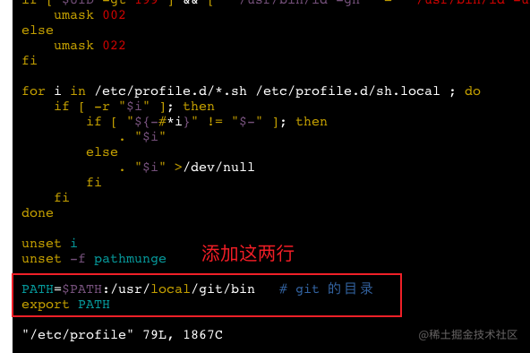

> 【补充】
>
> - 不保存退出的方法：先按ESC，再输入冒号，再直接输入"q!"，回车结束
> - 保存退出的方法：先按ESC，再输入冒号，再直接输入"wq"，回车结束

- 使 git 环境变量生效

```js
source / etc / profile;
```

- 验证安装完成，查看 git 的版本号

```js
git --version
```

这时候我们的git版本已经变成了：

```js
git version 2.26.0
```

### 四、创建 git 用户

- 创建git用户

```js
命令：  adduser + 账号名
例子：  adduser git
```

- 给账户设置权限

```js
chmod 740 /etc/sudoers
vim /etc/sudoers
```

按 `i` 键进入文件的编辑模式，按向下键找到如下字段

```js
root    ALL=(ALL)       ALL
```

在其后面增加一句：

```js
git     ALL=(ALL)       ALL
```

**按 `Esc` 键退出编辑模式，输入`:wq` 保存退出。（先输入`:`，然后输入`wq`回车）**

- 退回权限

```js
chmod 400 /etc/sudoers
```

### 五、配置密钥

秘钥的获取 看本文的最后部分【把博客上传到云服务器】

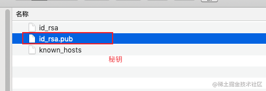

将`id_rsa.pub`里面的密钥复制,在服务器运行下面命令，创建.ssh文件夹

```
su git
mkdir ~/.ssh
```

创建`.ssh/authorized_keys`文件，打开`authorized_keys`文件并将刚才在本地机器复制的内容拷贝其中并保存

```
vim ~/.ssh/authorized_keys
```

**按`i`进入编辑模式粘贴完按 `Esc` 键退出编辑模式，输入`:wq` 保存退出。（先输入`:`，然后输入`wq`回车）**

- 修改权限

```
chmod 755 ~
chmod 700 ~/.ssh
chmod 600 ~/.ssh/authorized_keys
```

- 测试本地连接服务器

在本地电脑git bash here

```
//yourIp为远程服务器的ip地址
ssh -v git@yourIp     //yourIp为你的服务器ip
```

如图则证明本地机器与远程机器已经接通

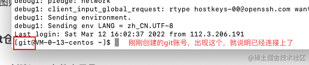

### 六、git仓库设置

1. 创建hexo文件夹目录，先创建一个放hexo博客的文件夹，之后的hexo博客就专门放这个文件夹内
   - 切换到root用户，创建hexo文件夹目录

   ```js
   su root
   mkdir /home/hexo
   ```

   - 让 git 这个账号 对 hexo目录 拥有 读写权限

   ```js
   chown git:git -R /home/hexo
   ```

   在宝塔面板的可视化页面中也可以看得到`hexo`这个文件夹

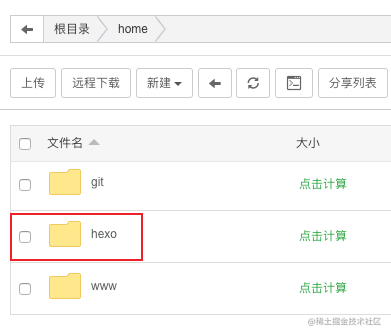

### 七、git仓库设置

之前创建了 git 账号，就会在 /home/下多一个 git的文件夹.

- 获取root权限

```
su root
```

- 进入 git文件夹

```js
cd / home / git;
```

- 初始化一个暴露在外的仓库

```js
git init --bare blog.git
```

- 对这个仓库 再赋予下读写权限

```js
chown git:git -R blog.git
```

在 `/home/hexo/blog.git` 下，有一个自动生成的 `hooks` 文件夹，我们创建一个新的 `git` 钩子 `post-receive`，用于自动部署。

```
vim blog.git/hooks/post-receive
```

**按 `i` 键进入文件的编辑模式**，在该文件中添加两行代码（将下边的代码粘贴进去)，指定 Git 的工作树（源代码）和 Git 目录

```
#!/bin/bash
 git --work-tree=/home/hexo --git-dir=/home/git/blog.git checkout -f
```

解释：

- `/home/hexo` 是指 之前自己创建的存放 hexo博客的文件夹路径
- `/home/git/blog.git` 是指 之前自己创建账号时的 账号名 对应的文件夹名称

这2处，大家可以按照自己的想法，自行设置自己想要的路径

**按 `Esc` 键退出编辑模式，输入`:wq` 保存退出。（先输入`:`，然后输入`wq`回车）**

修改文件权限，使得其可执行。

```
chmod +x /home/git/blog.git/hooks/post-receive
```

## 八、hexo 博客的安装 创建

此处略过，具体可以看我专门写hexo的文章

## 九、把博客上传到云服务器

- 博客上传到云服务器。
  用Git把代码传到服务器，是需要密钥的。这就就直接创建一下密钥。

```js
ssh-keygen -t rsa
```

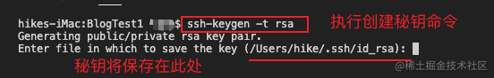

（如果你不手动自定义一个秘钥的名字的话，这个秘钥就会保存在上图的位置中，秘钥名就叫`is——rsa_hexo`）

- 手动给我们的这个hexo的秘钥确定个名称，我这边就叫`id_rsa_hexo`

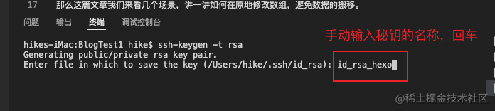

- 紧接着，让我们设置密码，我们就不设置了，直接回车

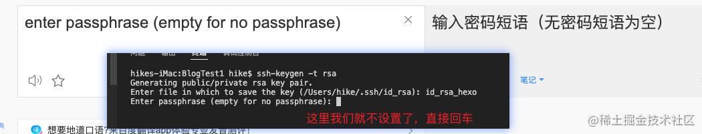

- 最后还要再确认一遍，那就再一次回车

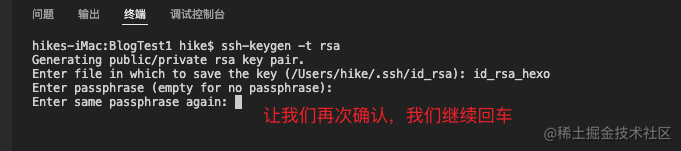

- 这下成功了

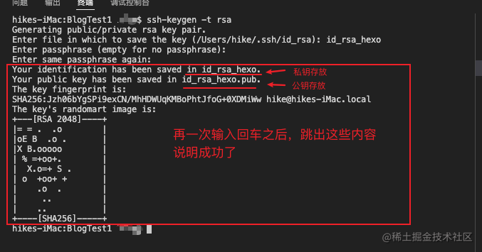

- 查看秘钥的地址
  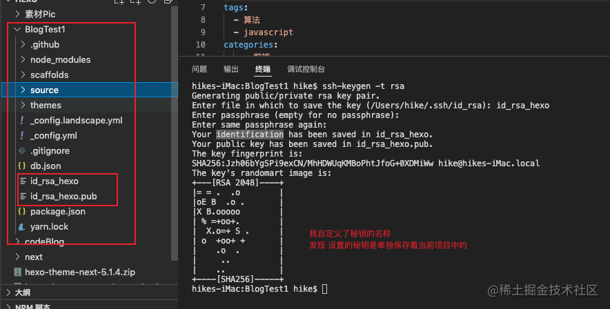

- 去服务器，把本地的秘钥放在服务器上

拿到秘钥之后，服务器上的配置，参考**第五部分**就可以了。此处的秘钥是`id_rsa_hexo.pub`

## 配置 hexo 使用git

打开我们本地的 hexo项目，找到 `_config.yml` 文件 ，打开该文件，并拉到最下面，配置 `deploy`

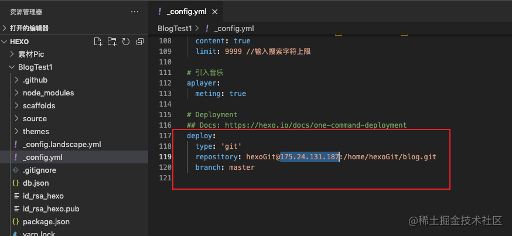

安装hexo 上传的插件

```js
npm install --save hexo-deployer-git
或者
yarn add hexo-deployer-git
```

安装完成后，在hexo项目的 vscode的终端 输入下面的命令

```js
hexo clean
hexo g -d
```

此处碰到个问题，权限不够,如下图：

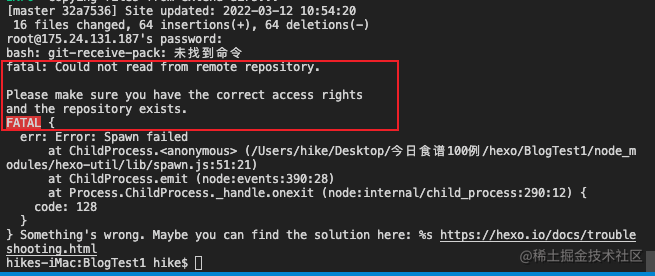

报错内容如下：\
bash: git-receive-pack: command not found（找不到命令）
fatal: Could not read from remote repository.（致命：无法从远程存储库中读取。）

Please make sure you have the correct access rights（请确保您拥有正确的访问权限）
and the repository exists.（存储库存在。）

**解决方法**

在服务器的终端输入两行命令即可

```js
sudo ln -s /usr/local/git/bin/git-receive-pack /usr/bin/git-receive-pack
sudo ln -s /usr/local/git/bin/git-upload-pack /usr/bin/git-upload-pack
```

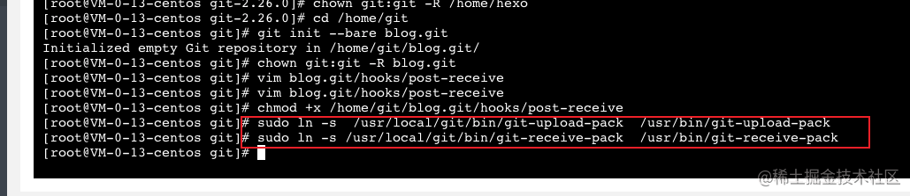

因为前后调试多次，当时也在 本地的终端上执行了这两行命令，本地执行，需要输入本地机子的密码(mac是如此)，如果你也有问题，那你也在本地试试这两行命令

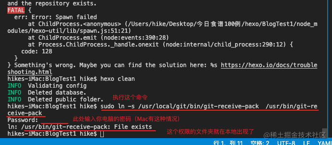

## 参考文章

1. [Hexo博客部署到腾讯云服务器(使用宝塔面板)](https://zhuanlan.zhihu.com/p/128649492)
2. [20分钟Hexo+百度智能云 搭建个人博客系统-视频](https://www.bilibili.com/video/BV1BY411G73u)
3. [20分钟Hexo+百度智能云 搭建个人博客系统-文档](https://jspang.com/article/83)
