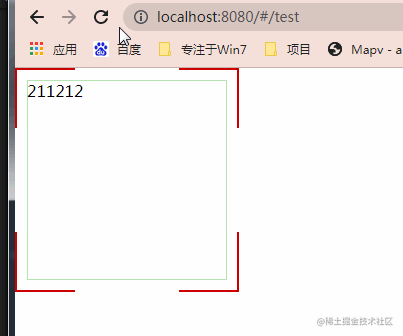
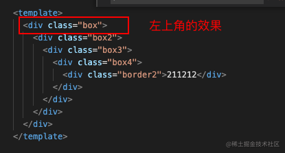
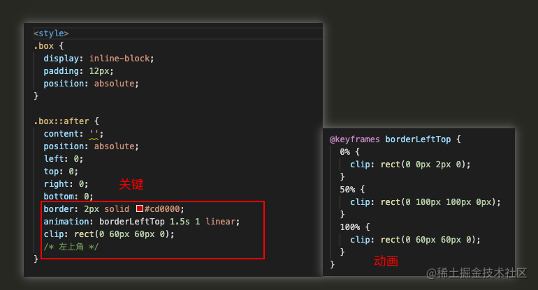
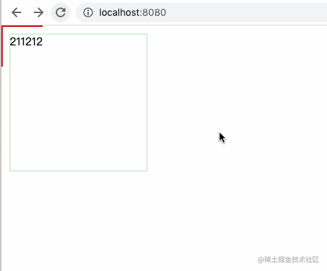

## 前言

<!--more-->

佛祖保佑， 永无`bug`。Hello 大家好！我是海的对岸！

边框动画特效，组件一加载的时候，边框先伸展，再缩回。

看看效果：



## 预习

这次效果的幕后功臣是`CSS`的`animation`和`clip`

1.  animation
2.  clip

### animation介绍

     css中的动画效果，通过`@keyframes`定义一个动画，然后`animation`q去调用它，## 定义和用法

animation 属性是一个简写属性，用于设置六个动画属性：

- animation-name
- animation-duration
- animation-timing-function
- animation-delay
- animation-iteration-count
- animation-direction

注释：请始终规定 animation-duration 属性，否则时长为 0，就不会播放动画了。

| 默认值：          | none 0 ease 0 1 normal                        |
| ----------------- | --------------------------------------------- |
| 继承性：          | no                                            |
| 版本：            | CSS3                                          |
| JavaScript 语法： | _object_.style.animation="mymove 5s infinite" |

#### 语法

```
animation: name duration timing-function delay iteration-count direction;
```

| 值                                                                                                                                       | 描述                                     |
| ---------------------------------------------------------------------------------------------------------------------------------------- | ---------------------------------------- |
| _[animation-name](https://www.w3school.com.cn/cssref/pr_animation-name.asp "CSS3 animation-name 属性")_                                  | 规定需要绑定到选择器的 keyframe 名称。。 |
| _[animation-duration](https://www.w3school.com.cn/cssref/pr_animation-duration.asp "CSS3 animation-duration 属性")_                      | 规定完成动画所花费的时间，以秒或毫秒计。 |
| _[animation-timing-function](https://www.w3school.com.cn/cssref/pr_animation-timing-function.asp "CSS3 animation-timing-function 属性")_ | 规定动画的速度曲线。                     |
| _[animation-delay](https://www.w3school.com.cn/cssref/pr_animation-delay.asp "CSS3 animation-delay 属性")_                               | 规定在动画开始之前的延迟。               |
| _[animation-iteration-count](https://www.w3school.com.cn/cssref/pr_animation-iteration-count.asp "CSS3 animation-iteration-count 属性")_ | 规定动画应该播放的次数。                 |
| _[animation-direction](https://www.w3school.com.cn/cssref/pr_animation-direction.asp "CSS3 animation-direction 属性")_                   | 规定是否应该轮流反向播放动画。           |

### clip介绍

clip 属性剪裁绝对定位元素。

当一幅图像的尺寸大于包含它的元素时会发生什么呢？"clip" 属性允许您规定一个元素的可见尺寸，这样此元素就会被修剪并显示为这个形状。

#### 说明

这个属性用于定义一个剪裁矩形。对于一个绝对定义元素，在这个矩形内的内容才可见。出了这个剪裁区域的内容会根据 overflow 的值来处理。剪裁区域可能比元素的内容区大，也可能比内容区小。

| 默认值：          | auto                                          |
| ----------------- | --------------------------------------------- |
| 继承性：          | no                                            |
| 版本：            | CSS2                                          |
| JavaScript 语法： | _object_.style.clip="rect(0px,50px,50px,0px)" |

#### 可能的值

| 值      | 描述                                                                        |
| ------- | --------------------------------------------------------------------------- |
| _shape_ | 设置元素的形状。唯一合法的形状值是：rect (_top_, *right*, *bottom*, *left*) |
| auto    | 默认值。不应用任何剪裁。                                                    |
| inherit | 规定应该从父元素继承 clip 属性的值。                                        |

## 实现过程

### 先来实现一个边框伸缩的效果

clip: rect(0 100px 100px 0px);

解释下`clip`参数

      参数1:0px,控制Y方向的长短，范围0-（线宽+边距+div的width+边距+线宽）
      数值越大，显示出来的线条越短，0的时候显示的最长
      参数2:100px,控制Y方向的长短，范围0-（线宽+边距+div的width+边距+线宽）
      数值越大，显示出来的线条越大，0的时候显示的0，没有长度
      参数3:100px,控制X方向的长短，范围0-（线宽+边距+div的width+边距+线宽）
      数值越大，显示出来的线条越大，0的时候显示的0，没有长度
      参数4:0px,控制X方向的长短，范围0-（线宽+边距+div的width+边距+线宽）
      数值越大，显示出来的线条越短，0的时候显示的最长

先来实现第一个边`左上角的边框`





`clip`的参数可以看上方的解释

看看效果：



经过`F12调试摸索`，四个角的`clip`分别如下

左上角\
clip: rect(0 60px 60px 0);\
右上角\
clip: rect(0px, 240px, 70px, 150px);\
左下角\
clip: rect(170px, 60px, 224px, 0px);\
右下角\
clip: rect(170px, 224px, 224px, 150px);\

## 完整代码

`comBorderSpecialEffects.vue`

```js
<template>
  <div class="box">
    <div class="box2">
        <div class="box3">
            <div class="box4">
                <div class="border2">211212</div>
            </div>
        </div>
    </div>
  </div>
</template>

<style>
.box {
    display: inline-block;
    padding: 12px;
    position: absolute;
}

.box::after {
    content: '';
    position: absolute;
    left: 0;
    top: 0;
    right: 0;
    bottom: 0;
    border: 2px solid #cd0000;
    animation: borderLeftTop 1.5s 1 linear;
    clip: rect(0 60px 60px 0);
    /* 左上角 */
}

@keyframes borderLeftTop {
    0% {
        clip: rect(0 0px 2px 0);
    }
    50% {
        clip: rect(0 100px 100px 0px);
    }
    100% {
        clip: rect(0 60px 60px 0);
    }
}

.border2 {
    display: inline-block;
    width: 200px;
    height: 200px;
    box-shadow: inset 0 0 0 1px rgba(105, 202, 98, 0.5);
    /* 向框添加一个或多个阴影 */
}

.box2::after {
    content: '';
    position: absolute;
    left: 0;
    top: 0;
    right: 0;
    bottom: 0;
    border: 2px solid #cd0000;
    animation: borderRightTop 1.5s 1 linear;
    clip: rect(0px, 224px, 60px, 164px);
    /* 右上角 */
}

@keyframes borderRightTop {
    0% {
        clip: rect(0 224px 2px 224px);
    }
    50% {
        clip: rect(0 224px 100px 124px);
    }
    100% {
        clip: rect(0 224px, 60px, 164px);
    }
}

.box3::after {
    content: '';
    position: absolute;
    left: 0;
    top: 0;
    right: 0;
    bottom: 0;
    border: 2px solid #cd0000;
    animation: borderLeftBottom 1.5s 1 linear;
    clip: rect(164px, 60px, 224px, 0px);
    /* 左下角 */
}

@keyframes borderLeftBottom {
    0% {
        clip: rect(224px 2px 224px 0px);
    }
    50% {
        clip: rect(124px 100px 224px 0px);
    }
    100% {
        clip: rect(164px, 60px, 224px, 0px);
    }
}

.box4::after {
    content: '';
    position: absolute;
    left: 0;
    top: 0;
    right: 0;
    bottom: 0;
    border: 2px solid #cd0000;
    animation: borderRightBottom 1.5s 1 linear;
    clip: rect(164px, 224px, 224px, 164px);
    /* 右下角 */
}

@keyframes borderRightBottom {
    0% {
        clip: rect(222px 224px 224px 224px);
    }
    50% {
        clip: rect(124px 224px 224px 124px);
    }
    100% {
        clip: rect(164px, 224px, 224px, 164px);
    }
}
</style>
```

老规矩，引用一下

```js
<template>
  <div class="">
    <module/>
  </div>
</template>

<script>
import module from './../../components/comBorderSpecialEffects'
export default {
  name: 'test',
  components: {
    module,
  },
  data() {
    return {
    }
  },
  methods: {
  },
  mounted() {
  },
}
</script>

<style scope>
.index{
  background-color: rgba(3, 22, 37, 0.85);
  padding-left: 60px;
  height: 600px;
  padding-top: 60px;
}
</style>

```

## 效果如下


