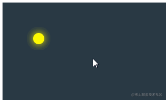

## 前言

<!--more-->

佛祖保佑， 永无`bug`。Hello 大家好！我是海的对岸！

这个也是有次项目中用到的一个效果，就想着实现以下，实现过程不难，记录一下。

## 实现过程

1. 一闪一闪效果，用到了css动画`keyframes`,想了解更多，可以看[传送门](https://www.w3school.com.cn/cssref/pr_keyframes.asp)

- 简单解释下这个`css`的`keyframes`
  `keyframes`创建动画的原理是，将一套 CSS 样式逐渐变化为另一套样式，在动画过程中，您能够多次改变这套 CSS 样式\
  用`@keyframes + 动画名` 的方式 定义一个动画\
  以`百分比`来规定改变发生的时间，或者通过关键词 `"from"` 和 `"to"`，等价于 `0%` 和 `100%`。\
  0% 是动画的开始时间，100% 动画的结束时间。\
  `推荐使用 0% 和 100%`，理由为了获得最佳的浏览器支持\
  还要注意的一点是：请使用动画属性来控制动画的外观，同时将`定义的动画名`与`选择器绑定`。

2. 实现一闪一闪效果步骤，涉及到动画中的时间

- 某个时间段1，是刚开始闪
- 某个时间段2，闪的亮度比之前亮不少
- 某个时间段3，达到最亮
- 某个时间段4，亮度开始降低
- 某个时间段5，亮度降到刚开始闪的时候

样式代码如下：

```js
/* 萤火虫特效 */
@keyframes flicker {
    0%, 100% {
        background: #fefa01;
        box-shadow: 0 0 1rem #fefa01;
    }
    30%, 70% {
        background: #fffd99;
        box-shadow: -1rem 0 8rem 1rem #fefa01;
    }
    50% {
        box-shadow: -1rem 0 8rem 1rem rgba(254, 250, 1, 0.8);
    }
}
```

解释下`上面的代码块`

1. 定义了一个叫`flicker`的`动画名`
2. 这个动画在`0%(动画的开始时间)`的背景颜色`background` 和阴影`box-shadow`,都是`#fefa01`颜色，而且阴影的大小也是一个范围
3. 在动画进行到`30%`的时候，背景颜色`background` 和阴影`box-shadow`，发生变化
4. 在动画进行到`50%`的时候，阴影扩张到最大
5. 因为动画是`从低到高，在从高回到低`,所以在动画的`0%与100%`，`30%与70%` 的阶段，背景颜色和阴影都是一样的，所以他们2个动画阶段都放在了一起。只有`50%`的时候，`50%`已经是`动画的中间点`了，就单独放一个。

完整代码如下：
`comGlowworm.vue`

```js
<template>
  <div class="Css_PM_Mark_Img" ></div>
</template>

<style scope>
.Css_PM_Mark_Img{
width: 22px;
height: 22px;
border-radius: 11px;
animation: flicker 4000ms ease infinite;
}


/* 萤火虫特效 */
@keyframes flicker {
    0%, 100% {
        background: #fefa01;
        box-shadow: 0 0 1rem #fefa01;
    }
    30%, 70% {
        background: #fffd99;
        box-shadow: -1rem 0 8rem 1rem #fefa01;
    }
    50% {
        box-shadow: -1rem 0 8rem 1rem rgba(254, 250, 1, 0.8);
    }
}
</style>
```

老规矩，引用一下

```js
<template>
  <div class="index">
    <module/>
  </div>
</template>

<script>
import module from './../../components/comGlowworm2'
export default {
  name: 'test',
  components: {
    module,
  },
  data() {
    return {
    }
  },
  methods: {
  },
  mounted() {
  },
}
</script>

<style scope>
.index{
  background-color: rgba(3, 22, 37, 0.85);
  padding-left: 60px;
  height: 600px;
  padding-top: 60px;
}
</style>
```

这样，效果就有了



(`gif截屏上的效果光晕不在这个div正中央，实际跑代码的时候，实在正中央的`)

## 稍微升级一下下

有时候，一些`css的效果`，我们希望能`手动控制`下，比如，我鼠标点击下这个div,它的css效果就出来了，我再点击一下，这个效果就不见了

常态下，我们的做法，大概是，用`js`实现，获取这个div标签的对象,通过`id`也好，通过`class`也好，总归是要写`js`代码的

但是，有的时候，一些`样式的操作`，我们是可以通过`css直接搞定的`

以这个`萤火虫的闪烁特效`为例，讲下`鼠标点击出现特效`，`鼠标再点击`，`特效消失`

实现原理：

用好`input`标签，自带`选中css样式`，在这个`选中css样式`中添加动画效果\

(主要看这个`check选中` 与 `取消选中时` 的 `闪烁效果`，而check自身的样式，不是本次的重点，大家就将就的看啦)

```html
<div>
  <input class="checkbox" id="checkbox" type="checkbox" />
  <label class="firefly" for="checkbox">
    <div class="abdomen"></div>
  </label>
</div>
```

```css
.checkbox {
  display: none;
}

.checkbox:checked ~ .firefly .abdomen {
  background: #27231e;
  box-shadow: inset 0 0 1.5rem rgba(150, 0, 0, 0.75);
  /* 动画效果 就这样加进来了，还不用写js代码 */
  animation: flicker 4000ms ease infinite;
}

.abdomen {
  background: #27231e;
  width: 200px;
  height: 200px;
}
```

完整代码：

```js
<template>
  <div>
    <input class="checkbox" id="checkbox" type="checkbox" />
    <label class="firefly" for="checkbox">
        <div class="abdomen"></div>
    </label>

    <input class="checkbox2" id="checkbox2" type="checkbox" />
    <label class="firefly2" for="checkbox2">
        <div class="abdomen2"></div>
    </label>
  </div>
</template>

<style scope>
.checkbox {
    display: none;
}
.checkbox:checked~.firefly .abdomen {
  background: #27231e;
  box-shadow: inset 0 0 1.5rem rgba(150, 0, 0, 0.75);
  animation: flicker 4000ms ease infinite;
}
.abdomen {
  background: #27231e;
  width: 200px;
  height: 200px;
}

.checkbox2 {
    display: none;
}
.checkbox2:checked~.firefly2 .abdomen2 {
  background: #27231e;
  box-shadow: inset 0 0 1.5rem rgba(150, 0, 0, 0.75);
  animation: flicker2 4000ms ease infinite;
}
.abdomen2 {
  background: #27231e;
  width: 200px;
  height: 200px;
  margin-top: 50px;
}

@keyframes flicker2 {
  0%,100% {
    background: #fefa01;
    box-shadow: 0 0 1rem #fefa01, inset -0.25rem 0 0 0.5rem rgba(14, 10, 10, 0.1);
  }
  30%,70% {
    background: #fffd99;
    box-shadow: 0rem 0 8rem 1rem #fefa01, inset -0.25rem 0 0 0.5rem rgba(14, 10, 10, 0.1);
  }
  50% {
    box-shadow: 0rem 0 8rem 1rem rgba(254, 250, 1, 0.8), inset -0.25rem 0 0 0.5rem rgba(14, 10, 10, 0.1);
  }
}

/* ------------------ 萤火虫闪烁特效 ----------------------- */

@keyframes flicker {
  0%,100% {
    background: #fefa01;
    box-shadow: 0 0 1rem #fefa01, inset -0.25rem 0 0 0.5rem rgba(14, 10, 10, 0.1);
  }
  30%,70% {
    background: #fffd99;
    box-shadow: 0rem 0 8rem 1rem #fefa01, inset -0.25rem 0 0 0.5rem rgba(14, 10, 10, 0.1);
  }
  50% {
    box-shadow: 0rem 0 8rem 1rem rgba(254, 250, 1, 0.8), inset -0.25rem 0 0 0.5rem rgba(14, 10, 10, 0.1);
  }
}
</style>
```

引用方式同上方，这里就不多写一遍了。

效果如下：


