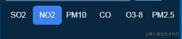

## 前言

<!--more-->

佛祖保佑， 永无`bug`。Hello 大家好！我是海的对岸！

有时我们在项目中要根据ui设计出的原型图，将原型图转变成具体的页面，里面用到的一些组件，不是现成可用的。这个时候就需要自己实现这些特定的组件。

这些组件是自己会用的，对自己来说可以算是通用的，可以拿来复用。

在这里开一个新坑，把到目前为止，自己用到的自己实现的组件，都记录下来，现在从最简单的 **自定义Tab切换**开始

## 直接上代码

效果如下



```js
<template>
  <div>
    <div class="pop-tab">
      <div :class="{'tab':true, 'checked': item.checked}"
        v-for="(item) in choseList" :key="item.code"
        @click="choseType(item)">
        {{item.label}}
      </div>
    </div>
  </div>

</template>
<script>
export default {
  data() {
    return {
      // tab 列表
      choseList: [
        { code: 'SO2', label: 'SO2', checked: true },
        { code: 'NO2', label: 'NO2', checked: false },
        { code: 'PM10', label: 'PM10', checked: false },
        { code: 'CO', label: 'CO', checked: false },
        { code: 'O38', label: 'O3-8', checked: false },
        { code: 'PM25', label: 'PM2.5', checked: false },
      ],
      // 默认选中的项
      curChosed: 'SO2',
    };
  },
  methods: {
    choseType(item) {
      this.choseList.forEach((element) => {
        element.checked = false;
      });
      item.checked = true;
      this.curChosed = item.code;
    },
  },
};

</script>

<style scoped>
*{
  margin: 0px;
  padding: 0;
}
.tab{
  display: inline-block;
  width:60px;
  height:40px;
  background-color: transparent;
  cursor: pointer;
  text-align: center;
  line-height: 40px;
}

.checked{
  background-color: #458bf3;
  border-radius: 7px;
}
</style>
```

## 拓展

一般情况下，**Tab**都是和**内容**组合在一起用的，一个Tab选项，对应一个区域的内容。
所以，上面的代码可以再加些内容

```js
<template>
<div>
    <div class="pop-content">
        <div class="pop-tab-content">
              <div v-if="curChosed === 'SO2'">
                具体内容1
              </div>
              <div v-if="curChosed === 'NO2'">
                具体内容2
              </div>
              <div v-if="curChosed === 'PM10'">
                具体内容3
              </div>
              ....
        </div>

    <div class="pop-tab">
      <div :class="{'tab':true, 'checked': item.checked}"
        v-for="(item) in choseList" :key="item.code"
        @click="choseType(item)">
        {{item.label}}
      </div>
    </div>
</div>

</template>
<script>
export default {
  data() {
    return {
      choseList: [
        { code: 'SO2', label: 'SO2', checked: true },
        { code: 'NO2', label: 'NO2', checked: false },
        { code: 'PM10', label: 'PM10', checked: false },
        { code: 'CO', label: 'CO', checked: false },
        { code: 'O38', label: 'O3-8', checked: false },
        { code: 'PM25', label: 'PM2.5', checked: false },
      ],
      curChosed: 'SO2',
    };
  },
  methods: {
    choseType(item) {
      this.choseList.forEach((element) => {
        element.checked = false;
      });
      item.checked = true;
      this.curChosed = item.code;
    },
  },
};

</script>

<style scoped>
*{
  margin: 0px;
  padding: 0;
}
.tab{
  display: inline-block;
  width:60px;
  height:40px;
  background-color: transparent;
  cursor: pointer;
  text-align: center;
  line-height: 40px;
}

.checked{
  background-color: #458bf3;
  border-radius: 7px;
}
</style>
```
