## 前言

<!--more-->

佛祖保佑， 永无`bug`。Hello 大家好！我是海的对岸！

实际项目中用到了这个功能，当时网上找了下，没找到现成的组件，那就自己写一个了。

## 先看效果

`先不要急着复制代码，我会在最后把整个代码都放出来`

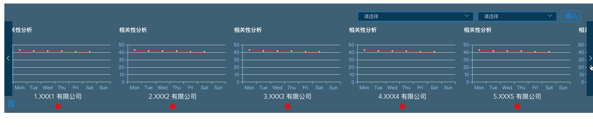

## 实现思路

先拆分下这个组件的功能：

1. 点击`左右两个箭头`，可以实现`左移`，`右移`

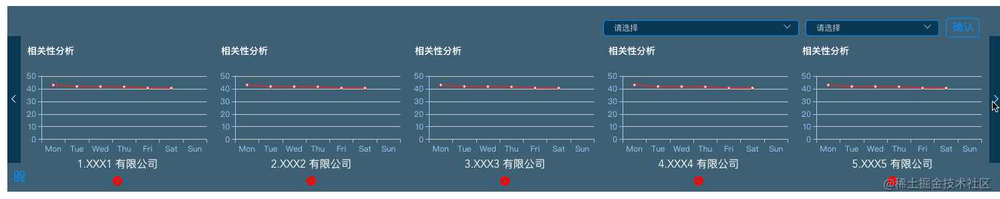

2. 点击`每个图表下方`的`删除按钮`，可以`删除相应的图表`，但是删除之后的序号不变。并且，我再点击查询，又变成查到的10条数据，`删除的同时`，`列表的长度`也相应`变短`

比方说，我把`排在第三个`的`XXX3 有限公司`删了，它后面的`XXX4 有限公司`就跟上来了，它就变成了`排在第三个`的图表，我删的只剩下3个。但是我再点击`查询按钮`，又变成`最初的10条数据`

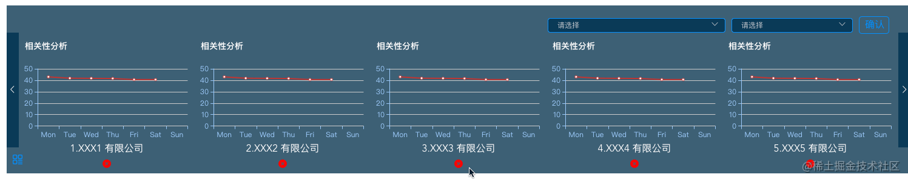

3. 组件左下方的小按钮，可以将图表组件`展开/缩起`，`展开`和`折叠`的时候，`组件`的`宽度`和`高度`发生了变化，`展开`的时候，上方的`搜索框`是`一行平铺`的，`折叠`的时候，上方的`搜索框`是`分成两行展示`的，而且`折叠`的时候，`最左侧的箭头`也`隐藏`了

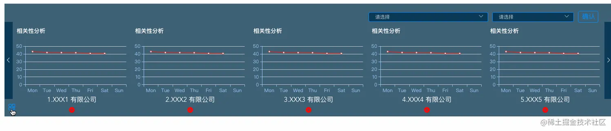

### 步骤

1. 组件的左右移动，用到的是`横向滚动条`，用`js方法`，`调用横向滚动条`，`左移`，`右移`，因为是由左右箭头控制滚动条移动，所以需要`把滚动条用css隐藏起来`

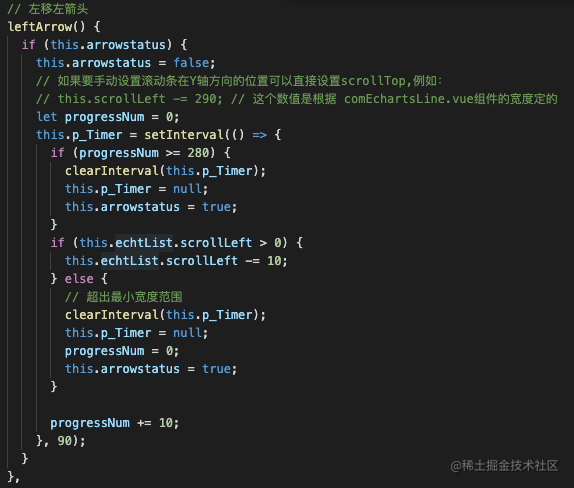

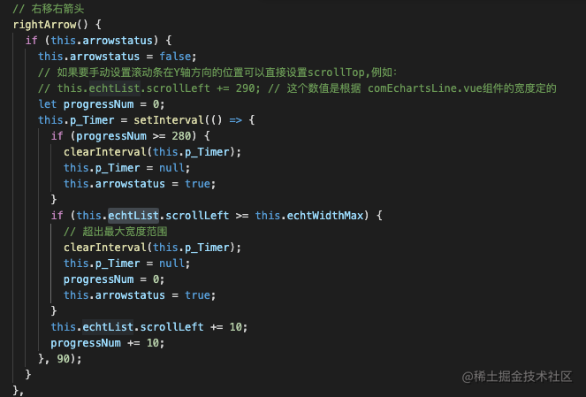

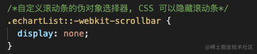

2. 组件是`删除操作`，这个其实挺好解决的，就是`把单独某个`选出来，`把它过滤掉`，这样就叉掉了，主要的大头，在`删除`了一些`图表`之后，组件的`长度`要`产生相应的变化`

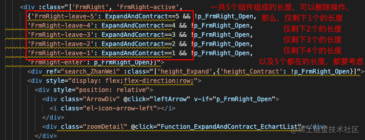

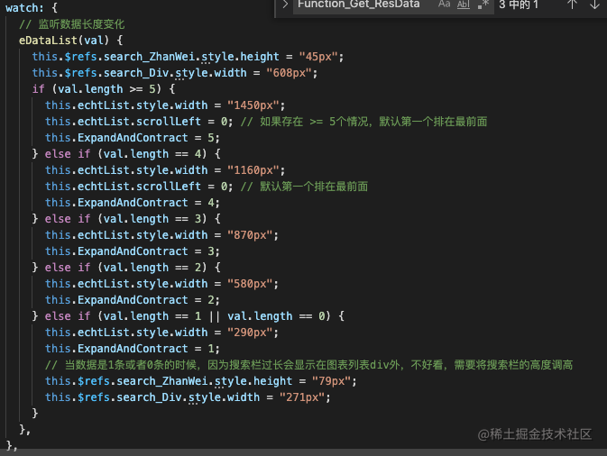

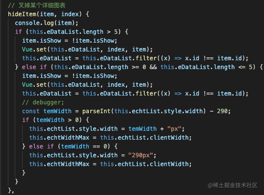

3. 左下方的`展开/折叠`, 通过一个变量来控制`展开、折叠`

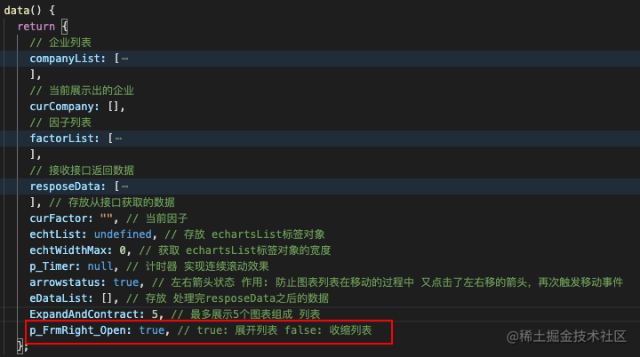

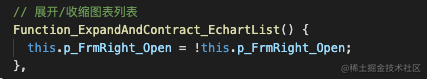

### 展示代码

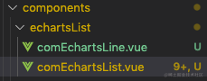

1. 首先要有单一的一个 图表组件
   `comEchartsLine.vue`

```js
<template>
  <div>
    <Echart
      ref="chart"
      style="width: 290px; height: 180px"
      :options="eOption"
      :autoResize="true"
    ></Echart>
  </div>
</template>

<script>
export default {
  props: {
    eInfo: {
      type: Object,
      default: () => ({
        xAxisData: ["Mon", "Tue", "Wed", "Thu", "Fri", "Sat", "Sun"],
        yAxisData: [43, 41.8, 41.7, 41.6, 40.6, 40.6],
      }),
    },
  },
  data() {
    return {
      chartDom: null,
      chartObj: null,
      eOption: {},
      eData: {
        xAxisData: ["Mon", "Tue", "Wed", "Thu", "Fri", "Sat", "Sun"],
        yAxisData: [43, 41.8, 41.7, 41.6, 40.6, 40.6],
      },
    };
  },
  mounted() {
    this.$nextTick(() => {
      this.drawLine();
    });
  },
  methods: {
    drawLine() {
      // 模拟数据
      // this.eOption = {
      //   title: {
      //     text: "相关性分析",
      //     padding: [15, 0, 0, 10],
      //     textStyle: {
      //       color: "white",
      //       fontSize: 14,
      //     },
      //   },
      //   tooltip: {
      //     trigger: "axis",
      //     axisPointer: {
      //       type: "cross",
      //       label: {
      //         backgroundColor: "#6a7985",
      //       },
      //     },
      //   },
      //   grid: {
      //     left: "3%",
      //     right: "4%",
      //     bottom: "3%",
      //     containLabel: true,
      //   },
      //   xAxis: {
      //     type: "category",
      //     data: ["Mon", "Tue", "Wed", "Thu", "Fri", "Sat", "Sun"],
      //     axisLine: {
      //       // x轴线的颜色以及宽度
      //       show: true,
      //       lineStyle: {
      //         color: "#9dcbfb",
      //         width: 0,
      //         type: "solid",
      //       },
      //     },
      //   },
      //   yAxis: {
      //     type: "value",
      //     axisLine: {
      //       // y轴线的颜色以及宽度
      //       show: true,
      //       lineStyle: {
      //         color: "#9dcbfb",
      //         width: 1,
      //         type: "solid",
      //       },
      //     },
      //   },
      //   series: [
      //     {
      //       data: [820, 932, 901, 934, 1290, 1330, 1320],
      //       type: "line",
      //     },
      //   ],
      // };

      // 实际调接口的时候传过来的值
      this.eOption = {
        title: {
          text: "相关性分析",
          padding: [15, 0, 0, 10],
          textStyle: {
            color: "white",
            fontSize: 14,
          },
        },
        tooltip: {
          trigger: "axis",
          axisPointer: {
            type: "cross",
            label: {
              backgroundColor: "#6a7985",
            },
          },
        },
        grid: {
          left: "3%",
          right: "4%",
          bottom: "3%",
          containLabel: true,
        },
        xAxis: {
          type: "category",
          data: this.eInfo.xAxisData,
          axisLine: {
            // x轴线的颜色以及宽度
            show: true,
            lineStyle: {
              color: "#9dcbfb",
              width: 0,
              type: "solid",
            },
          },
        },
        yAxis: {
          type: "value",
          axisLine: {
            // y轴线的颜色以及宽度
            show: true,
            lineStyle: {
              color: "#9dcbfb",
              width: 1,
              type: "solid",
            },
          },
        },
        series: [
          {
            data: this.eInfo.yAxisData,
            type: "line",
          },
        ],
      };
    },
  },
  beforeDestroy() {
    // 释放该页面的 chart 资源
    // this.chartObj.clear();
  },
};
</script>

<style scoped></style>

```

`ps`: `vue`安装`echarts`，`element-ui`插件的方法可以看我之前的文章[【vue起步】快速搭建vue项目引入第三方插件](https://juejin.cn/post/7020064317852614687)

然后基于这个单一图表组件，做出图表列表组件

`comEchartsList.vue`

```js
<template>
  <div>
    <div ref="search_Div" :class="['searchDiv', {'searchDiv_Contract': !p_FrmRight_Open}]">
      <div class="itemOption">
        <el-select v-model="curCompany" size="mini" multiple collapse-tags placeholder="请选择"
          style="width: 293px" popper-class="playerSelPopper">
          <el-option
            v-for="item in companyList"
            :key="item.id"
            :label="item.name"
            :value="item.name">
          </el-option>
        </el-select>
      </div>
      <div class="itemOption">
        <el-select v-model="curFactor" size="mini" placeholder="请选择"
          style="width:200px;" popper-class="playerSelPopper">
          <el-option
            v-for="item in factorList"
            :key="item.code"
            :label="item.name"
            :value="item.code">
          </el-option>
        </el-select>
      </div>
      <div class="itemOption">
        <span style="border: 1px solid #0090ff;padding: 2px 7px 3px 9px;
        border-radius: 5px;color: #0090ff;cursor: pointer;" @click="Function_Get_ResData">确认</span>
      </div>
    </div>
    <div :class="['FrmRight', 'FrmRight-active',
      {'FrmRight-leave-5': ExpandAndContract==5 && !p_FrmRight_Open,
      'FrmRight-leave-4': ExpandAndContract==4 && !p_FrmRight_Open,
      'FrmRight-leave-3': ExpandAndContract==3 && !p_FrmRight_Open,
      'FrmRight-leave-2': ExpandAndContract==2 && !p_FrmRight_Open,
      'FrmRight-leave-1': ExpandAndContract==1 && !p_FrmRight_Open,
      'FrmRight-enter': p_FrmRight_Open}]">
      <div ref="search_ZhanWei" :class="['height_Expand',{'height_Contract': !p_FrmRight_Open}]"></div>
      <div style="display: flex;flex-direction:row;">
        <div style="position: relative">
          <div class="ArrowDiv" @click="leftArrow" v-if="p_FrmRight_Open">
            <i class="el-icon-arrow-left"></i>
          </div>
          <div class="zoomDetail" @click="Function_ExpandAndContract_EchartList"></div>
        </div>
        <div style="display:flex; flex:1;">
          <div style="display: flex;width: 1450px;overflow: auto;" class="echartList" ref="echtList">
            <div v-for="(item, index) in this.eDataList" :key="item.id">
              <div v-if="item.isShow">
                <echartLine style="" :eInfo="item.data"/>
                <div style="text-align: center;color: white;">
                  <span>{{(index+1) + '.' + item.name}}</span>
                </div>
                <div class="closeX">
                  <i class="el-icon-error" style="cursor: pointer;" @click="hideItem(item, index)"></i>
                </div>
              </div>
            </div>
            <div v-if="this.eDataList.length == 0" class="noData">
              <span>暂无数据</span>
            </div>
          </div>
        </div>
        <div class="ArrowDiv" @click="rightArrow">
          <i class="el-icon-arrow-right"></i>
        </div>
      </div>
    </div>
  </div>
</template>

<script>
import Vue from "vue";
import echartLine from "./comEchartsLine";

export default {
  components: {
    echartLine,
  },
  data() {
    return {
      // 企业列表
      companyList: [
        { id: "1", name: "XXX1 有限公司" },
        { id: "2", name: "XXX2 有限公司" },
        { id: "3", name: "XXX3 有限公司" },
        { id: "4", name: "XXX4 有限公司" },
        { id: "5", name: "XXX5 有限公司" },
        { id: "6", name: "XXX6 有限公司" },
        { id: "7", name: "XXX7 有限公司" },
        { id: "8", name: "XXX8 有限公司" },
        { id: "9", name: "XXX9 有限公司" },
        { id: "10", name: "XXX10 有限公司" },
      ],
      // 当前展示出的企业
      curCompany: [],
      // 因子列表
      factorList: [
        { code: "code1", name: "因子1" },
        { code: "code2", name: "因子2" },
        { code: "code3", name: "因子3" },
      ],
      // 接收接口返回数据
      resposeData: [
        {
          id: "0",
          data: {
            xAxisData: ["Mon", "Tue", "Wed", "Thu", "Fri", "Sat", "Sun"],
            yAxisData: [43, 41.8, 41.7, 41.6, 40.6, 40.6],
          },
          isShow: true,
          name: "XXX1 有限公司",
        },
        {
          id: "1",
          data: {
            xAxisData: ["Mon", "Tue", "Wed", "Thu", "Fri", "Sat", "Sun"],
            yAxisData: [43, 41.8, 41.7, 41.6, 40.6, 40.6],
          },
          isShow: true,
          name: "XXX2 有限公司",
        },
        {
          id: "2",
          data: {
            xAxisData: ["Mon", "Tue", "Wed", "Thu", "Fri", "Sat", "Sun"],
            yAxisData: [43, 41.8, 41.7, 41.6, 40.6, 40.6],
          },
          isShow: true,
          name: "XXX3 有限公司",
        },
        {
          id: "3",
          data: {
            xAxisData: ["Mon", "Tue", "Wed", "Thu", "Fri", "Sat", "Sun"],
            yAxisData: [43, 41.8, 41.7, 41.6, 40.6, 40.6],
          },
          isShow: true,
          name: "XXX4 有限公司",
        },
        {
          id: "4",
          data: {
            xAxisData: ["Mon", "Tue", "Wed", "Thu", "Fri", "Sat", "Sun"],
            yAxisData: [43, 41.8, 41.7, 41.6, 40.6, 40.6],
          },
          isShow: true,
          name: "XXX5 有限公司",
        },
        {
          id: "5",
          data: {
            xAxisData: ["Mon", "Tue", "Wed", "Thu", "Fri", "Sat", "Sun"],
            yAxisData: [43, 41.8, 41.7, 41.6, 40.6, 40.6],
          },
          isShow: true,
          name: "XXX6 有限公司",
        },
        {
          id: "6",
          data: {
            xAxisData: ["Mon", "Tue", "Wed", "Thu", "Fri", "Sat", "Sun"],
            yAxisData: [43, 41.8, 41.7, 41.6, 40.6, 40.6],
          },
          isShow: true,
          name: "XXX7 有限公司",
        },
        {
          id: "7",
          data: {
            xAxisData: ["Mon", "Tue", "Wed", "Thu", "Fri", "Sat", "Sun"],
            yAxisData: [43, 41.8, 41.7, 41.6, 40.6, 40.6],
          },
          isShow: true,
          name: "XXX8 有限公司",
        },
        {
          id: "8",
          data: {
            xAxisData: ["Mon", "Tue", "Wed", "Thu", "Fri", "Sat", "Sun"],
            yAxisData: [43, 41.8, 41.7, 41.6, 40.6, 40.6],
          },
          isShow: true,
          name: "XXX9 有限公司",
        },
        {
          id: "9",
          data: {
            xAxisData: ["Mon", "Tue", "Wed", "Thu", "Fri", "Sat", "Sun"],
            yAxisData: [43, 41.8, 41.7, 41.6, 40.6, 40.6],
          },
          isShow: true,
          name: "XXX10 有限公司",
        },
      ], // 存放从接口获取的数据
      curFactor: "", // 当前因子
      echtList: undefined, // 存放 echartsList标签对象
      echtWidthMax: 0, // 获取 echartsList标签对象的宽度
      p_Timer: null, // 计时器 实现连续滚动效果
      arrowstatus: true, // 左右箭头状态 作用: 防止图表列表在移动的过程中 又点击了左右移的箭头，再次触发移动事件
      eDataList: [], // 存放 处理完resposeData之后的数据
      ExpandAndContract: 5, // 最多展示5个图表组成 列表
      p_FrmRight_Open: true, // true: 展开列表 false: 收缩列表
    };
  },
  mounted() {
    // 真正调接口的时候用
    // this.Function_Get_ResData();
    this.eDataList = [...this.resposeData];
    this.echtList = this.$refs.echtList;
    this.echtWidthMax = this.echtList.clientWidth;
    console.log("echtList.scrollLeft", this.echtList.style.width);
  },
  watch: {
    // 监听数据长度变化
    eDataList(val) {
      this.$refs.search_ZhanWei.style.height = "45px";
      this.$refs.search_Div.style.width = "608px";
      if (val.length >= 5) {
        this.echtList.style.width = "1450px";
        this.echtList.scrollLeft = 0; // 如果存在 >= 5个情况，默认第一个排在最前面
        this.ExpandAndContract = 5;
      } else if (val.length == 4) {
        this.echtList.style.width = "1160px";
        this.echtList.scrollLeft = 0; // 默认第一个排在最前面
        this.ExpandAndContract = 4;
      } else if (val.length == 3) {
        this.echtList.style.width = "870px";
        this.ExpandAndContract = 3;
      } else if (val.length == 2) {
        this.echtList.style.width = "580px";
        this.ExpandAndContract = 2;
      } else if (val.length == 1 || val.length == 0) {
        this.echtList.style.width = "290px";
        this.ExpandAndContract = 1;
        // 当数据是1条或者0条的时候，因为搜索栏过长会显示在图表列表div外，不好看，需要将搜索栏的高度调高
        this.$refs.search_ZhanWei.style.height = "79px";
        this.$refs.search_Div.style.width = "271px";
      }
    },
  },
  methods: {
    // 查询数据
    Function_Get_ResData() {
      // 如果当前组件属于折叠状态，那就让他展开，这样数据看的更直观
      if (this.p_FrmRight_Open == false) {
        this.p_FrmRight_Open = true;
      }
      // 这个参数是防止我计时器还在运行的过程中，又跑去点击查询数据按钮，导致数据错乱
      if (this.arrowstatus) {
        // 模拟从接口返回的数据
        this.resposeData = [
          {
            id: "0",
            data: {
              xAxisData: ["Mon", "Tue", "Wed", "Thu", "Fri", "Sat", "Sun"],
              yAxisData: [Math.floor(Math.random() * 40 + 1), Math.floor(Math.random() * 40 + 1), 41.7, 41.6, Math.floor(Math.random() * 40 + 1), 40.6],
            },
            isShow: true,
            name: "XXX1 有限公司",
          },
          {
            id: "1",
            data: {
              xAxisData: ["Mon", "Tue", "Wed", "Thu", "Fri", "Sat", "Sun"],
              yAxisData: [43, 41.8, 41.7, 41.6, 40.6, Math.floor(Math.random() * 40 + 1)],
            },
            isShow: true,
            name: "XXX2 有限公司",
          },
          {
            id: "2",
            data: {
              xAxisData: ["Mon", "Tue", "Wed", "Thu", "Fri", "Sat", "Sun"],
              yAxisData: [43, 41.8, 41.7, Math.floor(Math.random() * 40 + 1), 40.6, 40.6],
            },
            isShow: true,
            name: "XXX3 有限公司",
          },
          {
            id: "3",
            data: {
              xAxisData: ["Mon", "Tue", "Wed", "Thu", "Fri", "Sat", "Sun"],
              yAxisData: [43, 41.8, Math.floor(Math.random() * 40 + 1), 41.6, 40.6, 40.6],
            },
            isShow: true,
            name: "XXX4 有限公司",
          },
          {
            id: "4",
            data: {
              xAxisData: ["Mon", "Tue", "Wed", "Thu", "Fri", "Sat", "Sun"],
              yAxisData: [43, 41.8, 41.7, 41.6, 40.6, Math.floor(Math.random() * 40 + 1)],
            },
            isShow: true,
            name: "XXX5 有限公司",
          },
          {
            id: "5",
            data: {
              xAxisData: ["Mon", "Tue", "Wed", "Thu", "Fri", "Sat", "Sun"],
              yAxisData: [43, 41.8, 41.7, 41.6, 40.6, Math.floor(Math.random() * 40 + 1)],
            },
            isShow: true,
            name: "XXX6 有限公司",
          },
          {
            id: "6",
            data: {
              xAxisData: ["Mon", "Tue", "Wed", "Thu", "Fri", "Sat", "Sun"],
              yAxisData: [43, 41.8, 41.7, 41.6, 40.6, Math.floor(Math.random() * 40 + 1)],
            },
            isShow: true,
            name: "XXX7 有限公司",
          },
          {
            id: "7",
            data: {
              xAxisData: ["Mon", "Tue", "Wed", "Thu", "Fri", "Sat", "Sun"],
              yAxisData: [43, 41.8, 41.7, 41.6, 40.6, Math.floor(Math.random() * 40 + 1)],
            },
            isShow: true,
            name: "XXX8 有限公司",
          },
          {
            id: "8",
            data: {
              xAxisData: ["Mon", "Tue", "Wed", "Thu", "Fri", "Sat", "Sun"],
              yAxisData: [43, 41.8, 41.7, 41.6, 40.6, 40.6],
            },
            isShow: true,
            name: "XXX9 有限公司",
          },
          {
            id: "9",
            data: {
              xAxisData: ["Mon", "Tue", "Wed", "Thu", "Fri", "Sat", "Sun"],
              yAxisData: [43, 41.8, 41.7, 41.6, 40.6, 40.6],
            },
            isShow: true,
            name: "XXX10 有限公司",
          },
        ];
        // 由于 JavaScript 的限制， Vue 不能检测变动的数组 解决方法一,循环重走一遍
        this.eDataList = [...this.resposeData];
        this.eDataList.forEach((item) => {
          item.isShow = true;
        }); // 必须将isShow重新设置成true
      }

      // 由于 JavaScript 的限制， Vue 不能检测变动的数组 解决方法二
      // this.eDataList.splice(0); // 清空数组长度 由于 JavaScript 的限制， Vue 不能检测变动的数组 故采用splice(newLength) 方法重新设置数组长度
      // const arr = [...this.resposeData];
      // for (let i = 0; i < arr.length; i++) {
      //   arr[i].isShow = true; // 由于 JavaScript 的限制， Vue 不能检测变动的数组 v-for的数据源更新之后，vue检测不到，需要将跟新后的数组重新一个个推进v-for的数据源，且将isShow重新设置成true
      //   Vue.set(this.eDataList, i, arr[i]);
      // }
    },
    // 左移左箭头
    leftArrow() {
      if (this.arrowstatus) {
        this.arrowstatus = false;
        // 如果要手动设置滚动条在Y轴方向的位置可以直接设置scrollTop,例如：
        // this.scrollLeft -= 290; // 这个数值是根据 comEchartsLine.vue组件的宽度定的
        let progressNum = 0;
        this.p_Timer = setInterval(() => {
          if (progressNum >= 280) {
            clearInterval(this.p_Timer);
            this.p_Timer = null;
            this.arrowstatus = true;
          }
          if (this.echtList.scrollLeft > 0) {
            this.echtList.scrollLeft -= 10;
          } else {
            // 超出最小宽度范围
            clearInterval(this.p_Timer);
            this.p_Timer = null;
            progressNum = 0;
            this.arrowstatus = true;
          }

          progressNum += 10;
        }, 90);
      }
    },
    // 右移右箭头
    rightArrow() {
      if (this.arrowstatus) {
        this.arrowstatus = false;
        // 如果要手动设置滚动条在Y轴方向的位置可以直接设置scrollTop,例如：
        // this.echtList.scrollLeft += 290; // 这个数值是根据 comEchartsLine.vue组件的宽度定的
        let progressNum = 0;
        this.p_Timer = setInterval(() => {
          if (progressNum >= 280) {
            clearInterval(this.p_Timer);
            this.p_Timer = null;
            this.arrowstatus = true;
          }
          if (this.echtList.scrollLeft >= this.echtWidthMax) {
            // 超出最大宽度范围
            clearInterval(this.p_Timer);
            this.p_Timer = null;
            progressNum = 0;
            this.arrowstatus = true;
          }
          this.echtList.scrollLeft += 10;
          progressNum += 10;
        }, 90);
      }
    },
    // 叉掉某个详细图表
    hideItem(item, index) {
      console.log(item);
      if (this.eDataList.length > 5) {
        item.isShow = !item.isShow;
        Vue.set(this.eDataList, index, item);
        this.eDataList = this.eDataList.filter((x) => x.id !== item.id);
      } else if (this.eDataList.length >= 0 && this.eDataList.length <= 5) {
        item.isShow = !item.isShow;
        Vue.set(this.eDataList, index, item);
        this.eDataList = this.eDataList.filter((x) => x.id !== item.id);
        // debugger;
        const temWidth = parseInt(this.echtList.style.width) - 290;
        if (temWidth > 0) {
          this.echtList.style.width = temWidth + "px";
          this.echtWidthMax = this.echtList.clientWidth;
        } else if (temWidth == 0) {
          this.echtList.style.width = "290px";
          this.echtWidthMax = this.echtList.clientWidth;
        }
      }
    },
    // 展开/收缩图表列表
    Function_ExpandAndContract_EchartList() {
      this.p_FrmRight_Open = !this.p_FrmRight_Open;
    },
  },
};
</script>

<style scoped>
.searchDiv {
  color: white;
  text-align: right;
  padding-top: 10px;
  padding-right: 35px;
  /* background-color: rgba(2, 47, 79, 0.8); */
  z-index: 1;
  position: absolute;
  right: 0px;
}
.searchDiv_Contract {
  width: 271px !important;
}
.height_Expand {
  height: 45px;
}
.height_Contract {
  height: 79px !important;
}
.itemOption {
  margin: 10px 0px 0px 10px;
  display: inline-block;
}
::v-deep .itemOption .el-input--mini .el-input__inner {
  height: 24px !important;
  line-height: 24px !important;
}
::v-deep .el-tag.el-tag--info {
  background-color: transparent !important;
  border-color: transparent !important;
  color: white !important;
}
::v-deep .el-tag.el-tag--info .el-tag__close {
  color: white !important;
}
::v-deep .el-select .el-tag__close.el-icon-close {
  background-color: #555656 !important;
}
::v-deep .itemOption .el-input__inner {
  background-color: rgba(2, 47, 79, 0.8);
  color: white;
  border: 1px solid #0090ff;
}
::v-deep .itemOption .el-input__inner:hover {
  border-color: #0090ff !important;
}
.ArrowDiv {
  color: white;
  height: 190px;
  line-height: 190px;
  width: 20px;
  /* line-height: 236px; */
  cursor: pointer;
  /* border: 1px solid red; */
  text-align: center;
  background-color: rgba(2, 47, 79, 0.8);
}
.echartList {
}
/*自定义滚动条的伪对象选择器, CSS 可以隐藏滚动条*/
.echartList::-webkit-scrollbar {
  display: none;
}
.closeX {
  color: red;
  text-align: center;
  height: 30px;
  line-height: 30px;
  /* cursor: pointer; */
}
.noData{
  display: inline-block;
  width: 100%;
  color: white;
  text-align: center;
  height: 217px;
  line-height: 217px;
}
.zoomDetail {
  background: url("~@/assets/imgs/ico更多.png") center center no-repeat;
  width: 16px;
  height: 16px;
  cursor: pointer;
  /* margin-left: 10px; */
  /* margin-top: 15px; */
  position: absolute;
  left: 10px;
  top: 202px;
}

/* 图表列表往右移入移出 */
.FrmRight {
  position: absolute;
  /* display:block; */
  /* clear:both; */
  right: 0px;
  /* top: 100px; */
  /* color: #333; */
  background-color: rgba(2, 47, 79, 0.8);
  /* border-radius: 5px 0 0 5px; */
}
.FrmRight-leave-5 {
  transform: translate3d(1172px, 0, 0);
}
.FrmRight-leave-4 {
  transform: translate3d(882px, 0, 0);
}
.FrmRight-leave-3 {
  transform: translate3d(592px, 0, 0);
}
.FrmRight-leave-2 {
  transform: translate3d(302px, 0, 0);
}
.FrmRight-leave-1 {
  transform: translate3d(15px, 0, 0);
}
.FrmRight-enter {
  transform: translate3d(0, 0, 0);
}
.FrmRight-active {
  transition: all 0.5s;
}
</style>
```

因为这是一个组件，我们来引用一下

```js
<template>
  <div class="hello">
    <module />
  </div>
</template>

<script>
import module from "./echartsList/comEchartsList.vue";

export default {
  name: "HelloWorld",
  props: {
    msg: String,
  },
  components: {
    module,
  },
  data() {
    return {
    };
  },
  methods: {
  },
  mounted() {
  },
};
</script>

<!-- Add "scoped" attribute to limit CSS to this component only -->
<style scoped lang="scss"></style>

```
