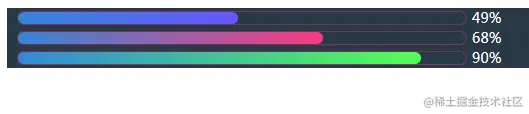
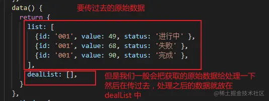
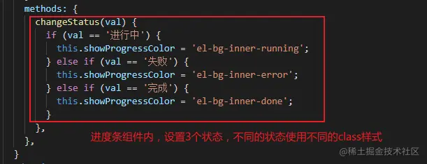

## 前言

<!--more-->

佛祖保佑， 永无`bug`。Hello 大家好！我是海的对岸！

当时`UI`给的`原型图`说要弄这个，看了一下，不难，那就弄下，现在把这个记录下来。

## 实现过程

### 先看效果



### 实现原理

总体思路就是`这个组件`根据`传过来不同的值value`，给`这个值lavue`设置一个`相应的区间`，在`当前区间`内`展示相应的颜色`

`css`控制颜色渐变用到了`background-image`属性，[传送门](https://developer.mozilla.org/zh-CN/docs/Web/CSS/background-image)

> ps: 本组件是基于`element-ui`的`el-progress`标签改造出来的，`Vue`引入`element-ui`，看这里，[传送门](https://juejin.cn/post/7020064317852614687)

1. 为了演示方便，我就设成，进度条有`3个状态`，`进行中`，`失败`，`完成`，不同颜色对应不同的`class样式`，在`style`中进行设置。
2. 传过来的不同的值`value`，判断这个值`value`是不是在这个状态内，为了演示方便，我传`value`同时，我也加了一个`status`字段，表示这个`value`的状态。





### Vue中设置样式，样式穿透

因为，我要`修改element-ui原本的样式`，这就引出了`Vue`中的`样式穿透`，样式穿透有以下`3种`方式

#### 1. **>>>**

常态下，如果`Vue`的`style`中就是普通的`css`,那么则

```css
<style lang="css" scoped>
.a >>> .b {
 /* ... */
}
</style>
```

#### 2. **/deep/**

但是，我们`Vue`用多了，会发现有时候在样式`style`这里，我们会用到`scss`，以后还可能会用到`less`，这样的`预处理器`，但是像`scss等预处理器`却无法解析`>>>`，所以我们使用下面的方式.

```css
<style lang="scss" scoped>
.a{
 /deep/ .b {
  /* ... */
 }
}
</style>
```

#### 3. **::v-deep**

但是经过本人踩坑，在`vue-cli3`编译时，`/deep/`的方式会报错或者警告。\
此时我们可以使用第三种方式，`切记必须是双冒号`

```css
<style lang="scss" scoped>
.a{
 ::v-deep .b {
  /* ... */
 }
}
</style>
```

因为本demo中使用的是`scss`，所以我们是`::v-deep`

## 完整代码

`comGradientProgressBar.vue`

```js
<template>
    <div class="progress">
        <el-progress type="line" :percentage="obj.value" :class="showProgressColor">
            {{obj.value}}
        </el-progress>
    </div>
</template>

<script>
  export default {
    props: {
      obj: {
        type: Object,
        default() {
          return {
            value: 0,
            status: '失败'
          };
        },
      },
    },
    data() {
      return {
        showProgressColor: 'el-bg-inner-running',
      }
    },
    mounted() {
      this.changeStatus(this.obj.status);  // 设置进度条渐变颜色
    },
    methods: {
      changeStatus(val) {
        if (val == '进行中') {
          this.showProgressColor = 'el-bg-inner-running';
        } else if (val == '失败') {
          this.showProgressColor = 'el-bg-inner-error';
        } else if (val == '完成') {
          this.showProgressColor = 'el-bg-inner-done';
        }
      },
    },
  }
</script>

<style lang="scss" scoped>

.progress{
  width: 500px;
  height: 20px;
  /* 这里的背景颜色设置是为了显著的看到效果，实际开发中，作为组件会放在一个容器中，这个容器会自带背景的，如果项目中涉及到主题颜色的切换，那么可以设置符合主题的颜色 */
  /* background-color: rgba(3,22,37,.85); */
  padding-left: 10px;
}

.progress ::v-deep.el-progress__text{
  color: #fff;
  font-size: 14px;
}
.progress ::v-deep.el-progress-bar__outer{
  height: 12px!important;
  border: 1px solid #78335f;
  background-color:transparent;
}

/* 渐变进度条 */
/* 有时候涉及到自定义的样式比较多，而且相同的组件用的也多，那么可以在组件的样式前面加一个自定义的class类名。*/
/* 以进度条为例，我自定义组件下的进度条用到的element-ui的el-progress，我给它加了一个.progress的类名*/
/* 那么其他地方再用到element-ui的el-progress时，那么我给其他地方的el-progress设置样式的时候，就不会影响到我现在的自定义进度条组件中的el-progress了 */
.progress ::v-deep .el-bg-inner-running .el-progress-bar__inner{
background-color: unset;
  background-image: linear-gradient(to right, #3587d8 , #6855ff);
}
.progress ::v-deep .el-bg-inner-error .el-progress-bar__inner{
  background-image: linear-gradient(to right, #3587d8 , #fb3a7e);
}
.progress ::v-deep .el-bg-inner-done .el-progress-bar__inner{
  background-image: linear-gradient(to right, #3587d8 , #53ff54);
}
</style>
```

然后我们引用一下

```js
<!--
 * @Author: your name
 * @Date: 2021-10-13 15:35:06
 * @LastEditTime: 2021-10-29 09:48:53
 * @LastEditors: Please set LastEditors
 * @Description: In User Settings Edit
 * @FilePath: \hello-world\src\views\test\index.vue
-->
<template>
  <div style="background-color: rgba(3,22,37,.85)">
    <module v-for="(item, index) in dealList" :obj="item"/>
  </div>
</template>

<script>
// 旋转展示数值组件
import module from './../../components/comGradientProgressBar'
export default {
  name: 'test',
  components: {
    module,
  },
  data() {
    return {
      list: [
        {id: '001', value: 49, status: '进行中' },
        {id: '001', value: 68, status: '失败' },
        {id: '001', value: 90, status: '完成' },
      ],
      dealList: [],
    }
  },
  methods: {
    dealData() {
      this.dealList = [];
      // 这里要 处理list数据，将value都处理成100以内的数，防止进度条超过100，处理的步骤就不写了
      // 这里就直接把list里的数据当处理好了，放到dealList中
      this.dealList = this.list;
    },
  },
  mounted() {
    this.dealData();
  },
}
</script>

<style scope>
</style>

```
