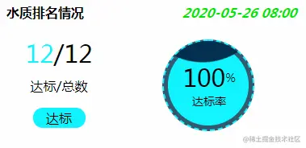
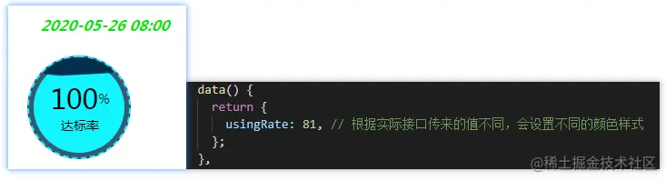
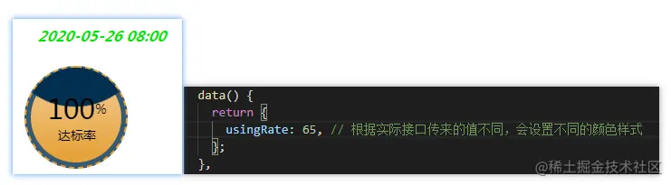
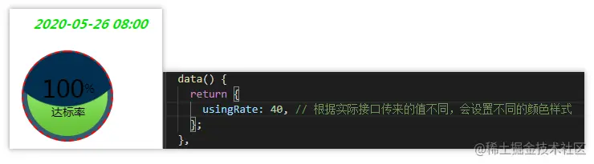
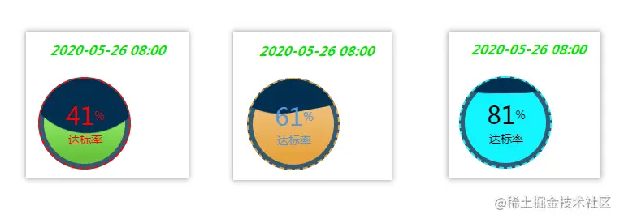

## 前言

<!--more-->

佛祖保佑， 永无`bug`。Hello 大家好！我是海的对岸！

有时我们在项目中要根据ui设计出的原型图，将原型图转变成具体的页面，里面用到的一些组件，不是现成可用的。这个时候就需要自己实现这些特定的组件。

这些组件是自己会用的，对自己来说可以算是通用的，可以拿来复用。

今天的这个组件， 是我实际项目中用到的，觉得比较有意思，就记录下来

## 直接上代码

效果如下：



这个自定义组件 大头部分 在 `css`上。

1. 页面布局方面，`flex`， 想快速了解一下，可以点击[传送门](https://www.ruanyifeng.com/blog/2015/07/flex-examples.html)
2. 波纹效果，css的动画`@keyframes`，想快速了解一下，可以点击[传送门](https://www.runoob.com/cssref/css3-pr-animation-keyframes.html)

代码如下：

```js
<template>
  <div style="width: 382px;">
    <div style="">
      <span class="title">XX排名情况</span>
      <span class="dateTime">2020-05-26 08:00</span>
    </div>
    <div style="position:relative;">
      <div style="width:150px;height:140px;">
        <el-row type="flex" align="middle" justify="center" style="height:40px;"><span class="targetNum">12</span><span class="totalNum">/12</span></el-row>
        <el-row type="flex" align="middle" justify="center" style="height:40px;"><span>达标/总数</span></el-row>
        <el-row type="flex" align="middle" justify="center" style="height:40px;"><span class="isTarget">达标</span></el-row>
      </div>
      <div class="waterCircle">
        <div class="container" :class="{ warning: parseInt(usingRate) > 60, standard: parseInt(usingRate) > 80 }">
          <div class="wave"></div>
          <div class="wave-mask" :style="`top: ${40 - parseInt(usingRate)}px`"></div>
        </div>
      </div>
      <div style="position:absolute;top:30px;left:226px;">
        <div style="width:70px;">
          <el-row type="flex" align="middle" justify="center"><span class="totalNum">100</span><span style="font-size:14px;">%</span></el-row>
          <el-row type="flex" align="middle" justify="center"><div style="font-size:14px;">达标率</div></el-row>
        </div>
      </div>
    </div>
  </div>
</template>

<script>
export default {
  data() {
    return {
      usingRate: 65, // 根据实际接口传来的值不同，会设置不同的颜色样式
    };
  },
  mounted() {
    this.getDataSource();
  },
  methods: {
    getDataSource() {
      // 调接口，得到实际的 usingRate值
    }
  },
};
</script>


<style lang="scss" scoped>
.title{
  display: inline-block;
  padding: 10px 0px 0px 10px;
  font-size: 16px;
  height: 26px;
  font-weight: bold;
}
.dateTime{
  display: inline-block;
  padding:0px 0px 20px 120px;
  color: #01E401;
  font-weight:bold;
  transform: skew(-20deg);
}
.waterQualitySpan{
  display: inline-block;
  width: 50px;
  height: 25px;
  line-height: 25px;
  text-align: center;
}
.targetNum{
  color: #12f4ff;
  font-size: 30px;
}
.totalNum{
  font-size: 30px;
}
.isTarget{
  display: inline-block;
  background: #12f4ff;
  width: 65px;
  text-align: center;
  height: 25px;
  line-height: 25px;
  border-radius: 12px;
  color: black;
}
/* ========================================  波纹 start  =========================================================== */
.waterCircle{
  position: absolute;
  top: 60px;
  left: 260px;
}
.container {
  width: 100px;
  height: 100px;
  border-radius: 50%;
  border: 2px dashed red;
  background: rgba(2, 47, 79, 0.8);
  overflow: hidden;
  position: absolute;
  top: 50%;
  left: 50%;
  transform: translate(-50%, -50%);
  padding: 5px;
  .wave {
    position: relative;
    width: 100px;
    height: 100px;
    background-image: linear-gradient(-180deg, #aaff80 13%, #67c23a 91%);
    border-radius: 50%;
  }
  // 波纹效果
  .wave-mask {
    position: absolute;
    width: 200px;
    height: 200px;
    top: 0;
    left: 50%;
    border-radius: 40%;
    background-color: rgba(2, 47, 79, 1);
    transform: translate(-50%, -70%) rotate(0);
    animation: toRotate 10s linear -5s infinite;
    z-index: 20;
  }
  &.warning {
    border: 2px dashed #e6a23c;
    .wave {
      background-image: linear-gradient(-180deg, #f0c78a 13%, #e6a23c 91%);
    }
    &.standard {
      border: 2px dashed #12f4ff;
      .wave {
        background-image: linear-gradient(-180deg, #12f4ff 13%, #12f4ff 91%);
      }
    }
  }
}
.using-slider {
  width: 400px;
  margin: 0 auto;
}

@keyframes toRotate {
  50% {
    transform: translate(-50%, -70%) rotate(180deg);
  }
  100% {
    transform: translate(-50%, -70%) rotate(360deg);
  }
}
/* ========================================  波纹 end  =========================================================== */

</style>

```

## 拓展1--不同阶段，修改进度值颜色

我们平时应该也见过，有的进度组件，它在某个范围内，展示出来的是一种颜色，到了一个新的范围，展示出来的又是另一种颜色，那我们是不是也可以这样搞，嘿嘿，其实上面的代码已经搞出来了，但不完全，先给大伙看看

当传过来的值是81时：



当传过来的值是65时：



当传过来的值是40时：



我们发现，球里的颜色变了，但是文字颜色没变，文字的值也没变，因为我们代码里是直接写死了值，也没给他设置样式，所以是不会变得
怎么修改呢？

1. `template`部分，要把之前的100 改成变量，再添加相应的 颜色style ，并做些条件判断
2. `script`部分，要把代码修改一下
3. `style`部分，添加相应的颜色

修改之后的代码如下：

```js
<template>
  <div style="width: 382px;">
    <div style="">
      <span class="title">XX排名情况</span>
      <span class="dateTime">2020-05-26 08:00</span>
    </div>
    <div style="position:relative;">
      <div style="width:150px;height:140px;">
        <el-row type="flex" align="middle" justify="center" style="height:40px;"><span class="targetNum">12</span><span class="totalNum">/12</span></el-row>
        <el-row type="flex" align="middle" justify="center" style="height:40px;"><span>达标/总数</span></el-row>
        <el-row type="flex" align="middle" justify="center" style="height:40px;"><span class="isTarget">达标</span></el-row>
      </div>
      <div class="waterCircle">
        <div class="container" :class="{ warning: parseInt(usingRate) > 60, standard: parseInt(usingRate) > 80 }">
          <div class="wave"></div>
          <div class="wave-mask" :style="`top: ${40 - parseInt(usingRate)}px`"></div>
        </div>
      </div>
      <div style="position:absolute;top:30px;left:226px;">
        <div style="width:70px;">
          <el-row type="flex" align="middle" justify="center">
            <!-- 给文字配颜色 -->
            <span :class="['totalNum', {'errorTxt': parseInt(usingRate) < 60,'warningTxt': parseInt(usingRate) > 60, 'standardTxt':parseInt(usingRate) > 80}]">
              {{showPercent}}</span><span style="font-size:14px;" :class="{'errorTxt': parseInt(usingRate) < 60,'warningTxt': parseInt(usingRate) > 60, 'standardTxt':parseInt(usingRate) > 80}">%</span>
            </span>
          </el-row>
          <el-row type="flex" align="middle" justify="center">
            <!-- 给文字配颜色 -->
            <div style="font-size:14px;" :class="{'errorTxt': parseInt(usingRate) < 60,'warningTxt': parseInt(usingRate) > 60, 'standardTxt':parseInt(usingRate) > 80}">
              达标率
            </div>
          </el-row>
        </div>
      </div>
    </div>
  </div>
</template>


<script>
export default {
  props: ['usingRate'],
  data() {
    return {
      upperLimit: 100, // 我这里用100简单举例下，假设它上限是100
    };
  },
  computed: {
    // 我们表达进度，一般都是百分比来表示的，因为有时候这个传过来的值 他不一定刚好上限就是100.所以我们一般会处理一下
    showPercent() {
      if (typeof this.usingRate === 'string' || typeof this.usingRate === 'number') {
        // 处理百分比 传过来的具体值 除以 上限值 再乘以 100 ，表示转成百分比了
        const value = ((this.usingRate * 1) / this.upperLimit) * 100;
        return value;
      } else {
        return 0;
      }
    },
  },
  mounted() {
  },
  methods: {
  },
};
</script>


<style lang="scss" scoped>
.title{
  display: inline-block;
  padding: 10px 0px 0px 10px;
  font-size: 16px;
  height: 26px;
  font-weight: bold;
}
.dateTime{
  display: inline-block;
  padding:0px 0px 20px 120px;
  color: #01E401;
  font-weight:bold;
  transform: skew(-20deg);
}
.waterQualitySpan{
  display: inline-block;
  width: 50px;
  height: 25px;
  line-height: 25px;
  text-align: center;
}
.targetNum{
  color: #12f4ff;
  font-size: 30px;
}
.totalNum{
  font-size: 30px;
}
.errorTxt{
  color: red,
}
.warningTxt{
  color: #5a95dd;
}
.standardTxt{
  color: black;
}
.isTarget{
  display: inline-block;
  background: #12f4ff;
  width: 65px;
  text-align: center;
  height: 25px;
  line-height: 25px;
  border-radius: 12px;
  color: black;
}
/* ========================================  波纹 start  =========================================================== */
.waterCircle{
  position: absolute;
  top: 60px;
  left: 260px;
}
.container {
  width: 100px;
  height: 100px;
  border-radius: 50%;
  border: 2px dashed red;
  background: rgba(2, 47, 79, 0.8);
  overflow: hidden;
  position: absolute;
  top: 50%;
  left: 50%;
  transform: translate(-50%, -50%);
  padding: 5px;
  .wave {
    position: relative;
    width: 100px;
    height: 100px;
    background-image: linear-gradient(-180deg, #aaff80 13%, #67c23a 91%);
    border-radius: 50%;
  }
  // 波纹效果
  .wave-mask {
    position: absolute;
    width: 200px;
    height: 200px;
    top: 0;
    left: 50%;
    border-radius: 40%;
    background-color: rgba(2, 47, 79, 1);
    transform: translate(-50%, -70%) rotate(0);
    animation: toRotate 10s linear -5s infinite;
    z-index: 20;
  }
  &.warning {
    border: 2px dashed #e6a23c;
    .wave {
      background-image: linear-gradient(-180deg, #f0c78a 13%, #e6a23c 91%);
    }
    &.standard {
      border: 2px dashed #12f4ff;
      .wave {
        background-image: linear-gradient(-180deg, #12f4ff 13%, #12f4ff 91%);
      }
    }
  }
}
.using-slider {
  width: 400px;
  margin: 0 auto;
}

@keyframes toRotate {
  50% {
    transform: translate(-50%, -70%) rotate(180deg);
  }
  100% {
    transform: translate(-50%, -70%) rotate(360deg);
  }
}
/* ========================================  波纹 end  =========================================================== */

</style>

```

因为这是一个组件，我们来引用一下

```js
<template>
  <div>
    <module :usingRate="usingRate"/>
  </div>
</template>

<script>
// 水球进度组件
import module from './../../components/comWaterBall'
export default {
  name: 'test',
  components: {
    module,
  },
  data() {
    return {
      usingRate: 40, // 根据实际接口传来的值不同，会设置不同的颜色样式
    }
  },
  methods: {
  },
  mounted() {
  },
}
</script>

<style scope>

</style>
```

这样就好看多了（颜色将就看看，大家可以细调一下，我就展示一下，选颜色啥的还是 ui更适合啊）



## 拓展2 -- 多种传值方法

在刚刚 `修改进度值颜色` 的时候，我们是通过 prop 方式把 值传给组件内部，给组件使用的，其实传值有2种方式

写给大家看下：

```js
<script>
export default {
  // 传值方式

  // 方式1：这种情况，你在传值之前，就要把默认的值的情况考虑好，不然传个undefined，null之类的就炸了
  props: ['usingRate'], // 这种方式也可以传多个 ['xx1', 'xx2', ... ]

  // 方式2：在组件内部 定义好默认的值，这样在传值的时候就无需顾虑以上的特殊情况了
  props: {
    usingRate: {
      type: Number, // 要传的值的类型
      default() {
        return 0; // 默认这个值为0
      },
    },
    // ... 可以传多个
  },
  data() {
    return {
    };
  },
  mounted() {
  },
  methods: {
  },
};
</script>
```

如果 协同开发时，`各方面都约定好了`，那么直接 方式1 一梭子 开干

如果 平时都是功能开发，而且`各自开发各自的模块`，那么建议 采用方式2吧，你也不知道，哪天有的功能可以服用，你的组件，被别人拿去用，别人啥也不管，直接就用了，炸了，找你麻烦，那就把组件内该考虑的都考虑一下，默认值，赋值什么的都加进去。以防万一嘛
