## 前言

<!--more-->

佛祖保佑， 永无`bug`。Hello 大家好！我是海的对岸！

有时我们在项目中要根据ui设计出的原型图，将原型图转变成具体的页面，里面用到的一些组件，不是现成可用的。这个时候就需要自己实现这些特定的组件。

这些组件是自己会用的，对自己来说可以算是通用的，可以拿来复用。

这次要总结的是展示数据的一个小模块，特效上面一般般，大体看下，只是要展示数据，并且有个圆圈在不停的转，看起来不难，来记录一下

## 实现过程简介

效果如下：

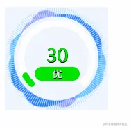

明亮主题下的样子

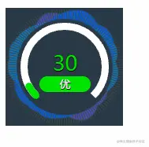

深色主题下的样子

先讲实现过程

1. 功能上展示具体的`等级数值` 和 `数值 对应的 中文label`
2. 外观上多了一个不停旋转的圈圈，这个从`css`入手
3. 还有背景颜色更具主题切换，传个变量控制主题，先写好对应的`背景css`

那么 上代码吧

```js
<template>
  <div :class="['container', {'bg_light': !isDarkTheme, 'bg_dark': isDarkTheme}]">
    <div class="bg3 Clockwise1" style=""></div>
    <div class="bg2 Clockwise1" style=""></div>
    <div :class="[{'bg1': !isDarkTheme, 'bg12': isDarkTheme}] " style="">
      <el-progress :width="112" :height="112" :stroke-width="9" :show-text="false"
       style="position:relative;left:18.5px;top:18.5px;"
       type="dashboard" :percentage="percentage" :color="colors"></el-progress>
      <div class="chartTxt">
        <div :class="{'apiValue': true,  'aqiTxtColorNull': aqiLvl === '',
          'aqiTxtColorI': aqiLvl === '优', 'aqiTxtColorII': aqiLvl === '良',
          'aqiTxtColorIII': aqiLvl === '轻度污染', 'aqiTxtColorIV': aqiLvl === '中度污染',
          'aqiTxtColorVI': aqiLvl === '严重污染', 'aqiTxtColorV': aqiLvl === '重度污染'}">
          {{apiValue?apiValue:'无'}}
        </div>
        <div :class="{'aqiLvl': true, 'lvlColorNull': aqiLvl === '',
          'lvlColorI': aqiLvl === '优', 'lvlColorII': aqiLvl === '良',
          'lvlColorIII': aqiLvl === '轻度污染', 'lvlColorIV': aqiLvl === '中度污染',
          'lvlColorVI': aqiLvl === '严重污染', 'lvlColorV': aqiLvl === '重度污染'}">
          <span class="aqiTxt">{{aqiLvl?aqiLvl : '无'}}</span>
        </div>
      </div>
    </div>
  </div>
</template>

<script>
export default {
  // 传值
  props: ['apiValue', 'aqiLvl', 'isDarkTheme'],

  computed: {
    percentage() {
      // 我们表达进度，一般都是百分比来表示的，因为有时候这个传过来的值 他不一定刚好上限就是100.所以我们一般会处理一下
      if (typeof this.apiValue === 'string' || typeof this.apiValue === 'number') {
        // 处理百分比 传过来的具体值 除以 上限值 再乘以 100 ，表示转成百分比了 这里上限值就是300
        // 此处300是AQI的等级划分值 300-500 是重度污染区间，超过300那就是重度污染了
        if (this.apiValue * 1 < 300) {
          const dealValue = (this.apiValue * 1 / 300) * 100;
          return dealValue;
        } else {
          return 100;
        }
      }
      return 100;
    },
  },
  data() {
    return {
      // percentage: 10,
      colors: [
        { color: '#00e400', percentage: 10 },
        { color: '#ffff00', percentage: 20 },
        { color: '#ff7e00', percentage: 30 },
        { color: '#ff0000', percentage: 40 },
        { color: '#99004c', percentage: 60 },
        { color: '#7e0023', percentage: 100 },
      ],
    };
  },
  methods: {
  },
};
</script>

<style scoped>
*{
  margin: 0;
  padding: 0;
}
@-webkit-keyframes rotate{from{-webkit-transform: rotate(0deg)}
  to{-webkit-transform: rotate(360deg)}
}
@-moz-keyframes rotate{from{-moz-transform: rotate(0deg)}
  to{-moz-transform: rotate(359deg)}
}
@-o-keyframes rotate{from{-o-transform: rotate(0deg)}
  to{-o-transform: rotate(359deg)}
}
@keyframes rotate{from{transform: rotate(0deg)}
  to{transform: rotate(359deg)}
}
.Clockwise1{
  -webkit-animation: rotate 15s linear infinite;
  -moz-animation: rotate 15s linear infinite;
  -o-animation: rotate 15s linear infinite;
  animation: rotate 15s linear infinite;
}
.container{
  margin-top: 10px;
  width: 149px;
  height: 150px;
  border: 0px solid red;
  background-color: transparent;
}
.bg_light{
  background-color: rgba(239,245,254,.9);
}
.bg_dark{
  background-color: rgba(3,22,37,.85);
}
.bg1{
  border: 0px solid blue;
  position: relative;
  top: -300px;
  width:149px;
  height: 150px;
  background-image:  url(~@/assets/imgs/旋转0.png);
}
.bg12{
  border: 0px solid blue;
  position: relative;
  top: -300px;
  width:149px;
  height: 150px;
  background-image:  url(~@/assets/imgs/旋转0备份.png);
}
.bg2{
  border: 0px solid green;
  position: relative;
  top: -150px;
  width:149px;
  height: 150px;
  background-image:  url(~@/assets/imgs/旋转1.png);
  opacity: 0.6;
}
.bg3{
  position: relative;
  width:149px;
  height: 150px;
  background-image:  url(~@/assets/imgs/旋转2.png);
  opacity: 0.6;
}
.bg1 >>> svg path:first-child {
  stroke: #ffffff;
}
.bg12 >>> svg path:first-child {
  stroke: #ffffff;
}
.chartTxt{
  width: 65px;
  /* border: 1px solid white; */
  text-align: center;
  position: relative;
  left: 43px;
  top: -65px;
}
.apiValue{
  font-size: 27px;
  text-shadow: #000 0.5px 0.5px 0.5px, #000 0 0.5px 0, #000 -0.5px 0 0, #000 0 -0.5px 0;
}
.aqiTxtColorNull{
  color: gray;
}
.aqiTxtColorI{
  color: #00e400;
}
.aqiTxtColorII{
    color: #ffff00;
}
.aqiTxtColorIII{
    color: #ff7e00;
}
.aqiTxtColorIV{
    color: #ff0000;
}
.aqiTxtColorV{
    color: #99004c;
}
.aqiTxtColorVI{
    color: #7e0023;
}
.aqiLvl{
  width: 100%;
  height: 20px;
  border-radius: 10px;
  line-height: 20px;
  font-size: 14px;
  /* position: relative; */
  /* left: -7px; */
  color: white
}
.aqiTxt{
  border-radius: 5px;
  padding: 2px;
  text-shadow: #000 0.5px 0.5px 0.5px, #000 0 0.5px 0, #000 -0.5px 0 0, #000 0 -0.5px 0;
}
.lvlColorNull{
  background-color: gray;
}
.lvlColorI{
    background-color: #00e400;
}
.lvlColorII{
    background-color: #ffff00;
}
.lvlColorIII{
    background-color: #ff7e00;
}
.lvlColorIV{
    background-color: #ff0000;
}
.lvlColorV{
    background-color: #99004c;
}
.lvlColorVI{
    background-color: #7e0023;
}
</style>
```

因为这是一个组件，我们来引用一下

```js
<template>
  <div>
    <module :apiValue="curApiValue" :aqiLvl="curAqiLvl" :isDarkTheme="curIsDarkTheme"/>
  </div>
</template>

<script>
// 水球进度组件
import module from './../../components/comRotateSgin'
export default {
  name: 'test',
  components: {
    module,
  },
  data() {
    return {
      curApiValue: 30, // 具体数值
      curAqiLvl: '优', // 具体数值对应的label（优,良,轻度污染,中度污染,严重污染,重度污染）
      curIsDarkTheme: true, // true:深色主题  fasle:明亮主题
    }
  },
  methods: {
  },
  mounted() {
  },
}
</script>

<style scope>

</style>
```

用到的图片素材：

大家F12控制台获取一下即可

1. 旋转0.png
   

2. 旋转0备份.png
   

3. 旋转1.png
   

4. 旋转1备份.png
   

## 后续

后来，美工那边重新给了一个新的原型图，效果更好看

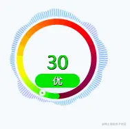

明亮主题下的样子

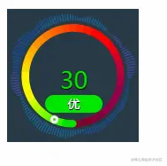

深色主题下的样子

这里主要有个实现的难点，就是 因为`圆圈的色阶`每个等级都是`自然过渡`过去的，所以，图片上的`小圆圈`，要怎么划到不同AQI值对应的相应颜色上，因为自然过渡，色阶的界限不太好把握。

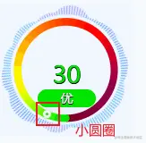

这里想到的想法，就是把`不同等级的AQI区间`，都规定`一个固定的值`(这个值就是`小圆圈要转到的角度`)，然后实际传过来的AQI值在哪个等级区间中，就用那个区间对应的值

具体过程：

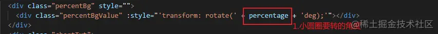

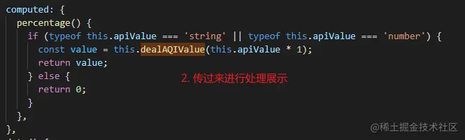

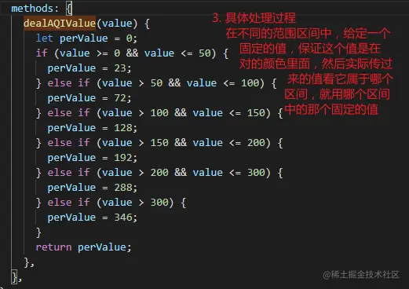

组件完整代码

```js
<template>
  <div :class="['container', {'bg_light': !isDarkTheme, 'bg_dark': isDarkTheme}]">
    <div class="bg3 Clockwise1" style=""></div>
    <div class="bg2 Clockwise1" style=""></div>
    <div :class="[{'bg1': !isDarkTheme, 'bg12': isDarkTheme}] " style="">
      <div class="percentBg" style="">
        <div class="percentBgValue" :style="'transform: rotate(' + percentage + 'deg);'"></div>
      </div>
      <div class="chartTxt">
        <div :class="{'apiValue': true,  'aqiTxtColorNull': aqiLvl === '',
          'aqiTxtColorI': aqiLvl === '优', 'aqiTxtColorII': aqiLvl === '良',
          'aqiTxtColorIII': aqiLvl === '轻度污染', 'aqiTxtColorIV': aqiLvl === '中度污染',
          'aqiTxtColorVI': aqiLvl === '严重污染', 'aqiTxtColorV': aqiLvl === '重度污染'}">
          {{apiValue?apiValue:'无'}}
        </div>
        <div :class="{'aqiLvl': true, 'lvlColorNull': aqiLvl === '',
          'lvlColorI': aqiLvl === '优', 'lvlColorII': aqiLvl === '良',
          'lvlColorIII': aqiLvl === '轻度污染', 'lvlColorIV': aqiLvl === '中度污染',
          'lvlColorVI': aqiLvl === '严重污染', 'lvlColorV': aqiLvl === '重度污染'}">
          <span class="aqiTxt">{{aqiLvl?aqiLvl : '无'}}</span>
        </div>
      </div>
    </div>
  </div>
</template>

<script>
export default {
  props: ['apiValue', 'aqiLvl', 'isDarkTheme'],

  computed: {
    percentage() {
      if (typeof this.apiValue === 'string' || typeof this.apiValue === 'number') {
        const value = this.dealAQIValue(this.apiValue * 1);
        return value;
      } else {
        return 0;
      }
    },
  },
  data() {
    return {
      // percentage: 10,
      colors: [
        { color: '#00e400', percentage: 10 },
        { color: '#ffff00', percentage: 20 },
        { color: '#ff7e00', percentage: 30 },
        { color: '#ff0000', percentage: 40 },
        { color: '#99004c', percentage: 60 },
        { color: '#7e0023', percentage: 100 },
      ],
    };
  },
  methods: {
    dealAQIValue(value) {
      let perValue = 0;
      if (value >= 0 && value <= 50) {
        perValue = 23;
      } else if (value > 50 && value <= 100) {
        perValue = 72;
      } else if (value > 100 && value <= 150) {
        perValue = 128;
      } else if (value > 150 && value <= 200) {
        perValue = 192;
      } else if (value > 200 && value <= 300) {
        perValue = 288;
      } else if (value > 300) {
        perValue = 346;
      }
      return perValue;
    },
  },
};
</script>

<style scoped>
*{
  margin: 0;
  padding: 0;
}
@-webkit-keyframes rotate{from{-webkit-transform: rotate(0deg)}
  to{-webkit-transform: rotate(360deg)}
}
@-moz-keyframes rotate{from{-moz-transform: rotate(0deg)}
  to{-moz-transform: rotate(359deg)}
}
@-o-keyframes rotate{from{-o-transform: rotate(0deg)}
  to{-o-transform: rotate(359deg)}
}
@keyframes rotate{from{transform: rotate(0deg)}
  to{transform: rotate(359deg)}
}
.Clockwise1{
  -webkit-animation: rotate 15s linear infinite;
  -moz-animation: rotate 15s linear infinite;
  -o-animation: rotate 15s linear infinite;
  animation: rotate 15s linear infinite;
}
.container{
  margin-top: 10px;
  width: 149px;
  height: 150px;
  border: 0px solid red;
  background-color: transparent;
}
.bg_light{
  background-color: rgba(239,245,254,.9);
}
.bg_dark{
  background-color: rgba(3,22,37,.85);
}
.bg1{
  border: 0px solid blue;
  position: relative;
  top: -300px;
  width:149px;
  height: 150px;
}
.bg12{
  border: 0px solid blue;
  position: relative;
  top: -300px;
  width:149px;
  height: 150px;
}
.bg2{
  border: 0px solid green;
  position: relative;
  top: -150px;
  width:149px;
  height: 150px;
  background-image:  url(~@/assets/imgs/组263.png);
  opacity: 0.6;
}
.bg3{
  position: relative;
  width:149px;
  height: 150px;
  opacity: 0.6;
}
.bg1 >>> svg path:first-child {
  stroke: #ffffff;
}
.bg12 >>> svg path:first-child {
  stroke: #ffffff;
}
.percentBg{
  width:126px;
  height: 126px;
  background-image:  url(~@/assets/imgs/旋转百分比.png);
  position:relative;
  top: 13px;
  left: 12px;
}
.percentBgValue{
  width:126px;
  height: 126px;
  background-image:  url(~@/assets/imgs/旋转百分比值.png);
  position:relative;
  top: 0px;
  left: 0px;
}
.chartTxt{
  width: 65px;
  /* border: 1px solid white; */
  text-align: center;
  position: relative;
  left: 43px;
  top: -65px;
}
.apiValue{
  font-size: 27px;
  text-shadow: #000 0.5px 0.5px 0.5px, #000 0 0.5px 0, #000 -0.5px 0 0, #000 0 -0.5px 0;
}
.aqiTxtColorNull{
  color: gray;
}
.aqiTxtColorI{
  color: #00e400;
}
.aqiTxtColorII{
    color: #ffff00;
}
.aqiTxtColorIII{
    color: #ff7e00;
}
.aqiTxtColorIV{
    color: #ff0000;
}
.aqiTxtColorV{
    color: #99004c;
}
.aqiTxtColorVI{
    color: #7e0023;
}
.aqiLvl{
  width: 100%;
  height: 20px;
  border-radius: 10px;
  line-height: 20px;
  font-size: 14px;
  /* position: relative; */
  /* left: -7px; */
  color: white
}
.aqiTxt{
  border-radius: 5px;
  padding: 2px;
  text-shadow: #000 0.5px 0.5px 0.5px, #000 0 0.5px 0, #000 -0.5px 0 0, #000 0 -0.5px 0;
}
.lvlColorNull{
  background-color: gray;
}
.lvlColorI{
    background-color: #00e400;
}
.lvlColorII{
    background-color: #ffff00;
}
.lvlColorIII{
    background-color: #ff7e00;
}
.lvlColorIV{
    background-color: #ff0000;
}
.lvlColorV{
    background-color: #99004c;
}
.lvlColorVI{
    background-color: #7e0023;
}
</style>
```

引用方式 `同上面一样引用即可`

用到的图片：

1. 旋转百分比.png
   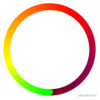

2. 旋转百分比值.png
   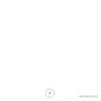

3. 组263.png
   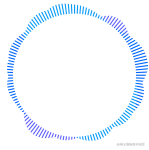

都看到这里了，求各位观众大佬们点个赞再走吧，你的赞对我非常重要
