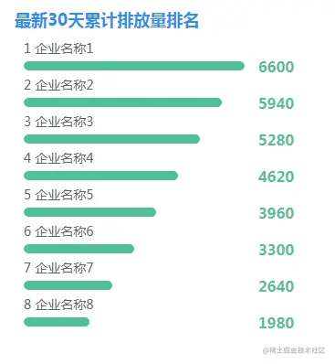
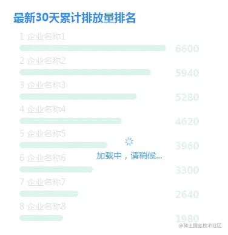
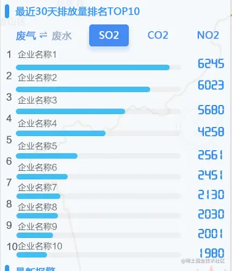

## 前言

<!--more-->

佛祖保佑， 永无`bug`。Hello 大家好！我是海的对岸！

有时我们在项目中要根据ui设计出的原型图，将原型图转变成具体的页面，里面用到的一些组件，不是现成可用的。这个时候就需要自己实现这些特定的组件。

这些组件是自己会用的，对自己来说可以算是通用的，可以拿来复用。

今天写一个排名组件，这个平时用的也比较多。也算是通用的

## 直接上代码

效果如下：



这个自定义组件 是基于 [element-ui 中的 进度条组件](https://element.eleme.cn/#/zh-CN/component/progress) 改造出来的

```js
<template>
  <div style="width:382px;height: calc(100vh - 502px);overflow-y: auto;overflow-x: hidden;margin:20px;">
    <div>
      <div class="rank-title">最新30天累计排放量排名</div>
      <div>
        <div v-show="Cumulative_Rank.length>0" style="width: 382px;height:386px;">
          <div v-for="(item,index) in Cumulative_Rank"
            :key="index"
            style="width:350px;padding-left:10px;">
            <el-row style="font-size:14px;color:#606266;">{{index + 1 + "  "+item.name}}</el-row>
            <el-row style="height:18px;">
              <el-col :span="20">
                <el-progress :percentage="item.percent" :stroke-width="10" color="#50c097"></el-progress>
              </el-col>
              <el-col :span="4">
                <span style="color:#50c097;font-weight:bold;margin-left:-35px;">{{item.value?item.value:''}}</span>
              </el-col>
            </el-row>
          </div>
        </div>
        <div v-show="Cumulative_Rank == null || Cumulative_Rank.length == 0" style="width: 382px;height:260px;line-height:260px;text-align:center;color:#909399;">
          暂无数据
        </div>
      </div>
    </div>
  </div>
</template>
<script>
export default {
  data() {
    return {
      // 排名的列表
      Cumulative_Rank: [
        { name: '企业名称1', value: 6600, percent: 100 },
        { name: '企业名称2', value: 5940, percent: 90 },
        { name: '企业名称3', value: 5280, percent: 80 },
        { name: '企业名称4', value: 4620, percent: 70 },
        { name: '企业名称5', value: 3960, percent: 60 },
        { name: '企业名称6', value: 3300, percent: 50 },
        { name: '企业名称7', value: 2640, percent: 40 },
        { name: '企业名称8', value: 1980, percent: 30 },
      ],
    };
  },
  methods: {
  },
  mounted() {
  },
  created() {
  },
};
</script>
<style lang="scss" scoped>
.rank-title{
  font-size: 18px;
  color: #2D8CF0;
  font-weight: bold;
  margin-top: 10px;
  margin-bottom: 10px;
}


::v-deep .el-progress__text{
  display:none;
}
::v-deep .el-progress-bar__outer{
  background-color: rgba(235,238,245,0);
}

.progress-txt{
  .progress-title{
    width: 68px;
    display: inline-block;
    position: relative;
  }
  .progress-percen{
    display: inline-block;
    position: relative;
    left: 0px;
  }
}

.progress-custom{
  position: relative;
  // width: 364px;
  width: 100%;
  height: 20px;
  .progress-content{
    position: absolute;
    width: 100%;
    height: 12px;
    background-color: #ebeef5;
    margin: 1px;
    border-radius: 6px;
  }
  .progress-value{
    position: absolute;
    width: 20%;
    height: 12px;
    background-color: #43bef1;
    margin: 1px;
    border-radius: 6px;
    left: 0px; // 经测试，left 最多到70% 就已经最右边了
  }
}
</style>

```

你觉得是不是这样就好了，不，我们要追究完美，你如果实际跑项目的话，会发现，页面一加载，首先会有个`白屏`，然后，过了一小会，数据才会加载出来，就是那种突的一下，数据就出来了，感官上面就会觉得很突兀。如果你真的调接口的话，突兀的感觉会更明显

所以这个时候，我们就通过[element-ui中的loading](https://element.eleme.cn/#/zh-CN/component/loading) 来做下过渡

## 扩展 1 ---增加loading



```js
<template>
  <div style="width:382px;height: calc(100vh - 502px);overflow-y: auto;overflow-x: hidden;margin:20px;">
    <div>
      <div class="rank-title">最新30天累计排放量排名</div>
      <div v-loading="loading"
        element-loading-text="加载中，请稍候..."
        element-loading-spinner="el-icon-loading"
        element-loading-background="rgba(255, 255, 255, 0.8)">
        <div v-show="Cumulative_Rank.length>0" style="width: 382px;height:386px;">
          <div v-for="(item,index) in Cumulative_Rank"
            :key="index"
            style="width:350px;padding-left:10px;">
            <el-row style="font-size:14px;color:#606266;">{{index + 1 + "  "+item.name}}</el-row>
            <el-row style="height:18px;">
              <el-col :span="20">
                <el-progress :percentage="item.percent" :stroke-width="10" color="#50c097"></el-progress>
              </el-col>
              <el-col :span="4">
                <span style="color:#50c097;font-weight:bold;margin-left:-35px;">{{item.value?item.value:''}}</span>
              </el-col>
            </el-row>
          </div>
        </div>
        <div v-show="Cumulative_Rank == null || Cumulative_Rank.length == 0" style="width: 382px;height:260px;line-height:260px;text-align:center;color:#909399;">
          暂无数据
        </div>
      </div>

    </div>
  </div>
</template>
<script>
export default {
  data() {
    return {
      // 加载
      loading: true, // true:表示正在加载中， false: 表示加载完毕
      // 排名的列表
      Cumulative_Rank: [
        { name: '企业名称1', value: 6600, percent: 100 },
        { name: '企业名称2', value: 5940, percent: 90 },
        { name: '企业名称3', value: 5280, percent: 80 },
        { name: '企业名称4', value: 4620, percent: 70 },
        { name: '企业名称5', value: 3960, percent: 60 },
        { name: '企业名称6', value: 3300, percent: 50 },
        { name: '企业名称7', value: 2640, percent: 40 },
        { name: '企业名称8', value: 1980, percent: 30 },
      ],
    };
  },
  methods: {
    // 模拟正常走接口 体验下加载的过程（不调用axios）
    mockNormal() {
      this.loading = true;
      setTimeout(() => {
        // 这里面是具体的实现逻辑....
        // ....
        // 逻辑处理好，关闭弹框
        this.loading = false;
      }, 1000);
    },
    // 正常走接口的情况
    Function_GetData() {
      this.loading = true; // 调接口前，表示正在加载中...
      this.Cumulative_Rank = []; // 将上一次从接口获取的数据清空掉
      this.$axios({
        method: 'get',
        url: 'http://xxx.xxx.xxx.xxx:xxxx/xxxx/xxxx/xxxx', // 实际跑项目的接口地址
        params: {
        },
      }).then((res) => {
        if (res.data.data != null) {
          const onlineData = res.data.data;
          // 排放量
          if (onlineData.out.ports.length > 0) {
            for (let i = 0; i < onlineData.out.ports.length; i++) {
              this.Cumulative_Rank.push({ name: '--', value: 0, percent: 0 });
              this.Cumulative_Rank[i].portName = onlineData.out.ports[i].portName;
              this.Cumulative_Rank[i].value = onlineData.out.values[i];
              if (i === 0) {
                // 取第一个的值为最大值，表示100%
                this.Cumulative_Rank[i].percent = 100;
              } else {
                // 后面的值都没有第一个大，后面的值除以第一个值 得到 百分比
                this.Cumulative_Rank[i].percent = (onlineData.out.values[i] / onlineData.out.values[0]) * 100;
              }
            }
          this.loading = false; // 接口调成功，数据也处理好了，关掉正在加载
          }
        } else {
          setTimeout(() => {
            this.loading = false; // 接口调成功了，但你没数据啊，意思一下，过了1秒，关掉加载框，不等了
          }, 1000);
        }
      }).catch(() => {
        setTimeout(() => {
          this.loading = false; // 接口报错了！？，那就不等了，算他超时，过了8秒，关掉加载框
        }, 8000);
      });
    },
  },
  mounted() {
    // 模拟正常走接口
    this.mockNormal();
    // 正常走接口的情况
    // this.Function_GetData();
  },
  created() {
  },
};
</script>
<style lang="scss" scoped>
.rank-title{
  font-size: 18px;
  color: #2D8CF0;
  font-weight: bold;
  margin-top: 10px;
  margin-bottom: 10px;
}
::v-deep .el-progress__text{
  display:none;
}
::v-deep .el-progress-bar__outer{
  background-color: rgba(235,238,245,0);
}
.progress-txt{
  .progress-title{
    width: 68px;
    display: inline-block;
    position: relative;
  }
  .progress-percen{
    display: inline-block;
    position: relative;
    left: 0px;
  }
}
.progress-custom{
  position: relative;
  // width: 364px;
  width: 100%;
  height: 20px;
  .progress-content{
    position: absolute;
    width: 100%;
    height: 12px;
    background-color: #ebeef5;
    margin: 1px;
    border-radius: 6px;
  }
  .progress-value{
    position: absolute;
    width: 20%;
    height: 12px;
    background-color: #43bef1;
    margin: 1px;
    border-radius: 6px;
    left: 0px; // 经测试，left 最多到70% 就已经最右边了
  }
}
</style>
```

简单解释一下：
真正开发中，肯定是要走接口的，我这边模拟一下，用的是**mockNormal()方法**临时顶一下，真正调接口，那就是走**Function_GetData()方法**

## 扩展 2 ---配合自定义tab切换

有时候排名也是会和自定义tab切换 组合在一起来使用

效果如下：



自定义tab切换，如果有人不太清楚，可以开速瞄一眼：[传送门](https://juejin.cn/post/7018201515747704846)

这里有一个算是优化的点可以说下，tab切换一般都是 每个tab对应一个页面，如果**每个tab所对应的页面结构**都是**不一样**的，那么每个tab单独写它所对应的页面。但是，如果每个tab对应的页面结构**是一样**的，那么就不用重复写了，直接改变这个结构中的数据即可。

本次的代码自定义tab切换，就简单粗暴的直接使用了`v-show`来做，因为本次的重点讲的是`排名组件`（其实是我懒，哈哈哈）

感兴趣的同学可以把这里的tab切换 改成 上一篇的[自定义tab切换](https://juejin.cn/post/7018201515747704846)来尝试下

```js
<template>
  <div style="margin:8px;">
    <div style="padding-top:10px;">
      <span class="icon-block"></span>
      <span class="icon-txt">最近30天排放量排名TOP5</span>
    </div>
    <div style="margin-bottom:5px;">
      <span style="padding-left:20px;cursor: pointer;font-weight:bold;" :class="{'selType': curSelType=='2','noSelType':curSelType=='1'}" @click="handleTypeClick(2)">废气</span>
      <i class="el-icon-s-operation" style="padding-left:5px;color:#2D8CF0;"></i>
      <span style="padding-left:5px;cursor: pointer;font-weight:bold;" :class="{'selType': curSelType=='1','noSelType':curSelType=='2'}" @click="handleTypeClick(1)">废水</span>

      <span v-show="curSelType=='2'" :class="{'factorName':true, 'selFactor': curSelFactor=='烟尘', 'noSelFactor': curSelFactor!='烟尘'}" @click="handleFactorClick('烟尘','a34013')">烟尘</span>
      <span v-show="curSelType=='2'" :class="{'factorName':true, 'selFactor': curSelFactor=='SO2', 'noSelFactor': curSelFactor!='SO2'}" @click="handleFactorClick('SO2','a21026')">SO2</span>
      <span v-show="curSelType=='2'"  :class="{'factorName':true, 'selFactor': curSelFactor=='NOx', 'noSelFactor': curSelFactor!='NOx'}" @click="handleFactorClick('NOx','a21002')">NOx</span>


      <span v-show="curSelType=='1'" :class="{'factorName':true, 'selFactor': curSelFactor=='COD', 'noSelFactor': curSelFactor!='COD'}" @click="handleFactorClick('COD','w01018')">COD</span>
      <span v-show="curSelType=='1'" :class="{'factorName':true, 'selFactor': curSelFactor=='氨氮', 'noSelFactor': curSelFactor!='氨氮'}" @click="handleFactorClick('氨氮','w21003')">氨氮</span>
      <span v-show="curSelType=='1'"  :class="{'factorName':true, 'selFactor': curSelFactor=='污水', 'noSelFactor': curSelFactor!='污水'}" @click="handleFactorClick('污水','w00000')">污水</span>
    </div>
    <div v-show="top10Data.length>0" style="height:185px;">
      <div v-for="(item,index) in top10Data"
            :key="index"
            style="width:350px;padding-left:10px;"
      >
        <el-row style="font-size:14px;color:#606266;">{{index+1 + "  "+item.psName}}</el-row>
        <el-row style="height:18px;">
          <el-col :span="21">
            <el-progress :percentage="item.percent" :stroke-width="10" color="#43BEF1"></el-progress>
          </el-col>
          <el-col :span="3">
            <span style="color:#2D8CF0;font-weight:bold;margin-left:-20px;">{{item.totalEmissions?item.totalEmissions.toFixed(0):''}}</span>
          </el-col>
        </el-row>
      </div>
    </div>
    <div v-show="top10Data == null || top10Data.length == 0" style="height:185px;line-height:185px;width:360px;text-align:center;color:#909399;">
      暂无数据
    </div>
  </div>
</template>
<script>
export default {
  props: {
    titleName: {
      type: String,
      default() {
        return '';
      },
    },
  },
  data() {
    return {
      curSelType: 2, // 1 废水 2 废气， 默认选中的模块是 废气模块
      curSelFactor: '烟尘', // 默认选中的因子是 烟尘
      curSelFactorCode: 'a34013',
      top10Data: [
        // { name: '企业名称1', value: 6629, percent: 100 },
        // { name: '企业名称2', value: 6023, percent: 90 },
        // { name: '企业名称3', value: 5680, percent: 80 },
        // { name: '企业名称4', value: 4258, percent: 70 },
        // { name: '企业名称5', value: 2561, percent: 40 },
        // { name: '企业名称6', value: 2500, percent: 30 },
        // { name: '企业名称7', value: 2500, percent: 30 },
        // { name: '企业名称8', value: 2500, percent: 30 },
        // { name: '企业名称9', value: 2500, percent: 30 },
        // { name: '企业名称10', value: 2500, percent: 30 },
      ],
    };
  },
  methods: {
    // 切换模块
    handleTypeClick(type) {
      if(this.curSelType != type) {
        this.curSelType = type;
        if (type == 1) {
          this.curSelFactor = 'COD';
          this.curSelFactorCode = 'w01018';
        }else {
          this.curSelFactor = '烟尘';
          this.curSelFactorCode = 'a34013';
        }
        this.getTop10Data();
      }
    },
    // 切换因子
    handleFactorClick(name, code) {
      this.curSelFactor = name;
      this.curSelFactorCode = code;
      this.getTop10Data();
    },
    // 获取数据
    getTop10Data() {
      this.top10Data = [];
      // 具体业务 调接口 实现
      // ...
    },
  },
  mounted() {
    this.getTop10Data();
  },
  created() {
  },
};
</script>
<style lang="scss" scoped>
.icon-block{
  display:inline-block;
  width:6px;
  height:22px;
  background-color: #2D8CF0;
  border-radius: 10px;
}
.icon-txt{
  position: relative;
  top: -5px;
  padding-left: 5px;
  font-size: 16px;
  color:#2D8CF0;
  font-weight: bold;
}
::v-deep .el-progress__text{
  display:none;
}
.factorName{
  display: inline-block;
  // background: blue;
  height: 30px;
  width: 55px;
  text-align: center;
  line-height: 30px;
  margin-left: 20px;
  border-radius: 5px;
  cursor: pointer;
  font-weight:bold;
  color: white;
}
.selFactor{
  background: #458BF3;
}
.noSelFactor{
  color: #458BF3;
}
.selType{
  color: #2D8CF0;
}
.noSelType{
  color: #606266;
}
</style>

```
