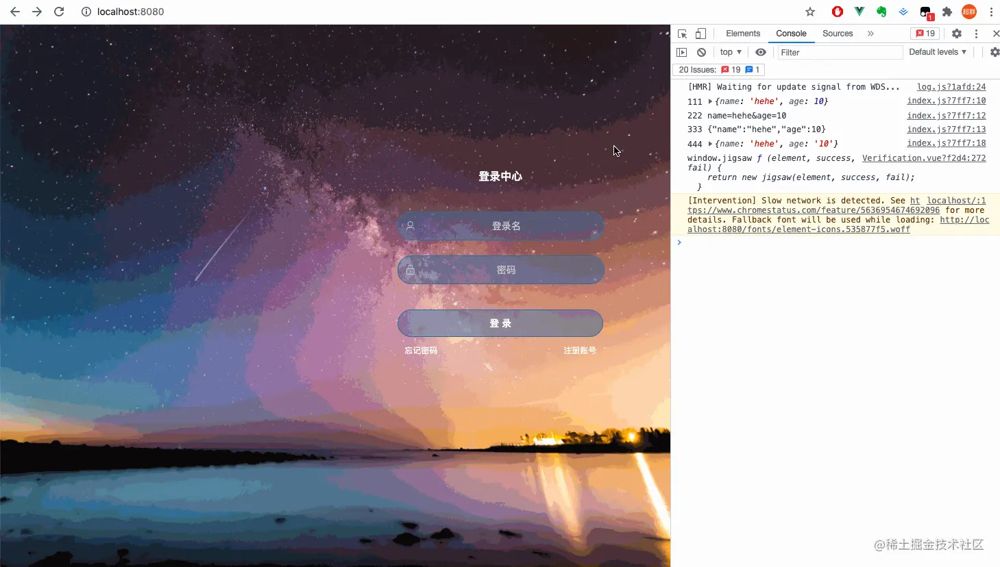
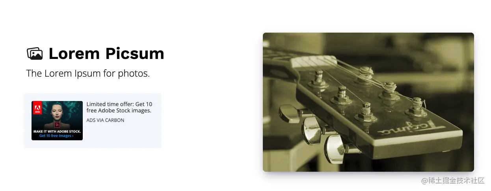
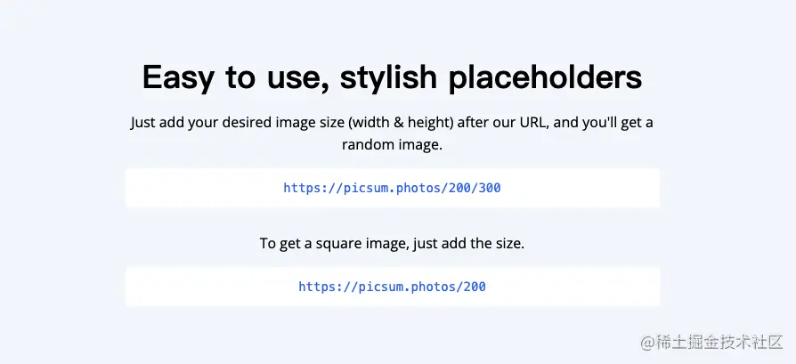
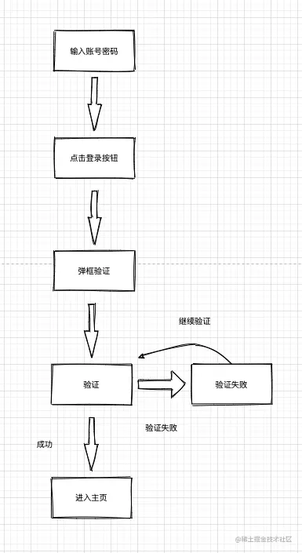
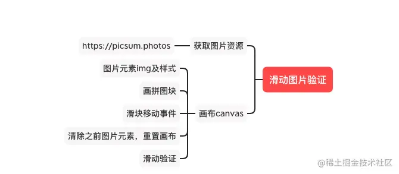
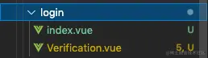

## 前言

<!--more-->

佛祖保佑， 永无`bug`。Hello 大家好！我是海的对岸！

滑动验证，学习一下，记录一下。

## 效果

gif的效果图有些失真，大家可以把代码复制一下，本地跑跑看



## 准备

滑动图片验证需要用到图片资源，这里给大家推荐一个`免费的图片获取api`

https://picsum.photos





使用方法也很简单，

```js
方法1
https://picsum.photos/宽/高
例子：https://picsum.photos/300/150
说明：得到一张宽300px，高150px的图片

方法2
https://picsum.photos/宽
例子：https://picsum.photos/300
说明：只输入一个长度，默认是正方形图片，所以得到一张宽300px，高300px的图片

方法3
https://picsum.photos/宽/高?random=随机数
例子：https://picsum.photos/200/300?random=1
说明：得到一张宽300px，高150px的随机图片

...

更多使用方法，可以看 https://picsum.photos
```

因为图片滑动验证，每次出现的图片都不一样，可以使用`方法3`来做

ps：因为实际上调用这个图片接口的图片出现的会`有点慢(看我演示的gif图就知道了)`，所以演示的时候，我就用这个图片网址，在`实际项目中`，可以`事先准备一些图片`，放在一个文件夹中，自己写一个返回图片的接口，每次访问，随机获取一张图片，这样图片显示的`速度就会加快`。

本次项目中用到的UI组件是element-ui，如果你没有安装的话，可以看我这篇[【vue起步】快速搭建vue项目引入第三方插件](https://juejin.cn/post/7020064317852614687)

## 实现过程

### 流程



### 逻辑



### 图片资源

这里采用前面说的的`方法3`来做

```js
...

方法3 https://picsum.photos/宽/高?random=随机数
例子：https://picsum.photos/200/300?random=1
说明：得到一张宽300px，高150px的随机图片

```

```js
// 获得随机数
function getRandomNumberByRange(start, end) {
  return Math.round(Math.random() * (end - start) + start);
}

// 获取背景图片
function getRandomImg() {
  return (
    "https://picsum.photos/300/150/?image=" + getRandomNumberByRange(0, 100)
  );
}
```

### 图片创建及定义一些样式的方法

```js
const l = 42, // 滑块边长
  r = 10, // 滑块半径
  w = 310, // canvas宽度
  h = 155, // canvas高度
  PI = Math.PI;
const L = l + r * 2; // 滑块实际边长

// 创建canvas元素
function createCanvas(width, height) {
  const canvas = createElement("canvas");
  canvas.width = width;
  canvas.height = height;
  return canvas;
}
// 创建图片元素
function createImg(onload) {
  const img = createElement("img");
  img.crossOrigin = "Anonymous";
  img.onload = onload;
  img.onerror = () => {
    img.src = getRandomImg();
  };
  img.src = getRandomImg();
  return img;
}
// 创建元素
function createElement(tagName) {
  return document.createElement(tagName);
}
// 添加样式
function addClass(tag, className) {
  tag.classList.add(className);
}
// 移除样式
function removeClass(tag, className) {
  tag.classList.remove(className);
}
```

### 画一个滑块

关于`canvas`的绘制方法，参考[这里](https://www.w3school.com.cn/tags/html_ref_canvas.asp)

本次用到的方法：

1. `beginPath();` 起始一条路径，或重置当前路径
2. `moveTo();` 把路径移动到画布中的指定点，不创建线条
3. `lineTo();` 添加一个新点，然后在画布中创建从该点到最后指定点的线条
4. `arc();` 创建弧/曲线（用于创建圆形或部分圆）

使用到的方法都写在了代码的注释中，请放心食用

```js
// 画拼图块
// 参考：https://www.w3school.com.cn/tags/html_ref_canvas.asp
/*
 * ctx: canvas对象
 * operation:
 * x: x轴数据
 * y: y轴数据
 */
function draw(ctx, operation, x, y) {
  //绘制
  ctx.beginPath(); // 起始一条路径，或重置当前路径
  //left
  ctx.moveTo(x, y); // 把路径移动到画布中的指定点，不创建线条
  //top
  ctx.lineTo(x + l / 2, y); // 添加一个新点，然后在画布中创建从该点到最后指定点的线条
  ctx.arc(x + l / 2, y - r + 2, r, 0, 2 * PI); // 创建弧/曲线（用于创建圆形或部分圆）
  //right
  ctx.lineTo(x + l / 2, y);
  ctx.lineTo(x + l, y);
  ctx.lineTo(x + l, y + l / 2);
  ctx.arc(x + l + r - 2, y + l / 2, r, 0, 2 * PI);
  ctx.lineTo(x + l, y + l / 2);
  ctx.lineTo(x + l, y + l);
  ctx.lineTo(x, y + l);
  ctx.lineTo(x, y);
  //修饰，没有会看不出效果
  ctx.fillStyle = "#fff"; // 设置或返回用于填充绘画的颜色、渐变或模式
  ctx[operation]();
  ctx.beginPath();
  ctx.arc(x, y + l / 2, r, 1.5 * PI, 0.5 * PI);
  ctx.globalCompositeOperation = "xor"; // 设置或返回新图像如何绘制到已有的图像上
  ctx.fill(); // 填充当前绘图（路径）
}
```

### 滑块相关事件

```js
// 求和
function sum(x, y) {
  return x + y;
}
// 求平方
function square(x) {
  return x * x;
}
// 定义一个类，绑定到window上
// 创建类
class jigsaw {
  constructor(el, success, fail) {
    this.el = el;
    this.success = success;
    this.fail = fail;
  }
  init() {
    this.initDOM(); // 初始化dom
    this.initImg(); // 初始化背景画布
    this.draw(); // 初始化拼图块
    this.bindEvents(); // 绑定事件
  }
  // 初始化
  initDOM() {
    // 创建canvas元素
    const canvas = createCanvas(w, h); // 画布
    const block = canvas.cloneNode(true); // 滑块
    const sliderContainer = createElement("div"); // 滑块容器
    const refreshIcon = createElement("div"); // 刷新按钮div
    const sliderMask = createElement("div"); // 滑块样式，滑块在验证正确，错误时样式的div
    const slider = createElement("div"); // 滑块div
    const sliderIcon = createElement("span"); // 滑块图标
    const text = createElement("span"); // 滑块提示内容
    block.className = "block";
    sliderContainer.className = "sliderContainer";
    refreshIcon.className = "refreshIcon";
    sliderMask.className = "sliderMask";
    slider.className = "slider";
    sliderIcon.className = "sliderIcon";
    text.innerHTML = "向右滑动滑块填充拼图";
    text.className = "sliderText";
    const el = this.el;
    el.appendChild(canvas);
    el.appendChild(refreshIcon);
    el.appendChild(block);
    slider.appendChild(sliderIcon);
    sliderMask.appendChild(slider);
    sliderContainer.appendChild(sliderMask);
    sliderContainer.appendChild(text);
    el.appendChild(sliderContainer);
    Object.assign(this, {
      canvas,
      block,
      sliderContainer,
      refreshIcon,
      slider,
      sliderMask,
      sliderIcon,
      text,
      canvasCtx: canvas.getContext("2d"),
      blockCtx: block.getContext("2d"),
    });
  }
  // 加载图片
  initImg() {
    // 创建图片元素
    const img = createImg(() => {
      this.canvasCtx.drawImage(img, 0, 0, w, h);
      this.blockCtx.drawImage(img, 0, 0, w, h);
      const y = this.y - r * 2 + 2;
      const ImageData = this.blockCtx.getImageData(this.x, y, L, L);
      this.block.width = L;
      this.blockCtx.putImageData(ImageData, 0, y);
    });
    this.img = img;
  }
  // 画滑块
  draw() {
    // 随机创建滑块的位置
    this.x = getRandomNumberByRange(L + 10, w - (L + 10));
    this.y = getRandomNumberByRange(10 + r * 2, h - (L + 10));
    draw(this.canvasCtx, "fill", this.x, this.y);
    draw(this.blockCtx, "clip", this.x, this.y);
  }
  clean() {
    // 清空上一次滑块的操作
    this.canvasCtx.clearRect(0, 0, w, h);
    this.blockCtx.clearRect(0, 0, w, h);
    this.block.width = w;
  }
  // 绑定事件
  bindEvents() {
    this.el.onselectstart = () => false;
    this.refreshIcon.onclick = () => {
      this.reset();
    };
    let originX,
      originY,
      trail = [],
      isMouseDown = false;
    this.slider.addEventListener("mousedown", (e) => {
      ((originX = e.x), (originY = e.y));
      isMouseDown = true;
    });
    document.addEventListener("mousemove", (e) => {
      if (!isMouseDown) return false;
      const moveX = e.x - originX;
      const moveY = e.y - originY;
      if (moveX < 0 || moveX + 38 >= w) return false;
      this.slider.style.left = moveX + "px";
      var blockLeft = ((w - 40 - 20) / (w - 40)) * moveX;
      this.block.style.left = blockLeft + "px";
      addClass(this.sliderContainer, "sliderContainer_active");
      this.sliderMask.style.width = moveX + "px";
      trail.push(moveY);
    });
    document.addEventListener("mouseup", (e) => {
      if (!isMouseDown) return false;
      isMouseDown = false;
      if (e.x == originX) return false;
      removeClass(this.sliderContainer, "sliderContainer_active");
      this.trail = trail;
      const { spliced, TuringTest } = this.verify();
      if (spliced) {
        if (TuringTest) {
          addClass(this.sliderContainer, "sliderContainer_success");
          this.success && this.success();
        } else {
          addClass(this.sliderContainer, "sliderContainer_fail");
          this.text.innerHTML = "再试一次";
          this.reset();
        }
      } else {
        new Vue().$notify({
          title: "错误",
          message: "验证失败",
          type: "error",
        });
        addClass(this.sliderContainer, "sliderContainer_fail");
        this.fail && this.fail();
        //验证失败后，1秒后重新加载图片
        setTimeout(() => {
          this.reset();
        }, 1000);
      }
    });
  }
  // 验证
  verify() {
    const arr = this.trail; // 拖动时y轴的移动距离
    const average = arr.reduce(sum) / arr.length; // 平均值
    const deviations = arr.map((x) => x - average); // 偏差数组
    const stddev = Math.sqrt(deviations.map(square).reduce(sum) / arr.length); // 标准差
    const left = parseInt(this.block.style.left);
    return {
      spliced: Math.abs(left - this.x) < 10,
      TuringTest: average !== stddev, // 只是简单的验证拖动轨迹，相等时一般为0，表示可能非人为操作
    };
  }
  // 重置
  reset() {
    this.sliderContainer.className = "sliderContainer";
    this.slider.style.left = 0;
    this.block.style.left = 0;
    this.sliderMask.style.width = 0;
    this.clean();
    this.img.src = getRandomImg();
    this.draw();
  }
}
// 创建对象，并将对象绑定到window
window.jigsaw = (element, success, fail) => {
  return new jigsaw(element, success, fail);
};
```

## 最后附上完整代码



`inex.vue` 这中间用到的背景图片，大家可以自行找一张放进去

```js
<template>
  <div class="content">
    <div id="login">
      <el-form
        class="loginFrom"
        :model="logindata"
        :rules="rules"
        ref="ruleForm"
      >
        <el-form-item class="login-item">
          <h1 class="login-title">登录中心</h1>
        </el-form-item>
        <el-form-item prop="userName">
          <el-input
            class="login-inputorbuttom"
            prefix-icon="el-icon-user"
            placeholder="登录名"
            v-model="logindata.userName"
            @keyup.enter.native="loginButton"
          ></el-input>
        </el-form-item>
        <el-form-item prop="password">
          <el-input
            class="login-inputorbuttom"
            prefix-icon="el-icon-lock"
            placeholder="密码"
            type="password"
            v-model="logindata.password"
            @keyup.enter.native="loginButton"
          ></el-input>
        </el-form-item>
        <el-form-item class="login-item">
          <el-button
            class="login-inputorbuttom login-bottom"
            type="primary"
            :loading="logining"
            v-popover:popover
            @click="loginButton"
            >登 录</el-button
          >
          <div class="memo">
            <span style="cursor: pointer">忘记密码</span>
            <span style="cursor: pointer" @click="jumpPage()">注册账号</span>
          </div>
        </el-form-item>
      </el-form>
    </div>
    <!--验证码弹窗-->
    <el-popover
      popper-class="slidingPictures"
      ref="popover"
      trigger="manual"
      v-model="visible"
    >
      <div class="sliding-pictures">
        <Verification
          ref="verificationImg"
          @closePupUp="closePupUp"
          @login="login"
        />
        <div class="operation">
          <span
            title="关闭验证码"
            @click="closePupUp"
            class="el-icon-circle-close"
          ></span>
          <span
            title="刷新验证码"
            @click="canvasInit"
            class="el-icon-refresh-left"
          ></span>
        </div>
      </div>
    </el-popover>
  </div>
</template>

<script>
import Verification from "./Verification";
export default {
  components: {
    Verification,
  },
  data() {
    return {
      logining: false, // 登录加载提示
      logindata: {
        userName: "",
        password: "",
        verificationCode: "",
      },
      rules: {
        userName: [{ required: true, message: "请填写密码" }],
        password: [{ required: true, message: "请填写密码" }],
      },
      visible: false, //弹窗开启关闭

      //拼图是否正确
      puzzle: false,
    };
  },
  watch: {
    visible(e) {
      if (e === true) {
        // 初始化拼图
        this.$refs.verificationImg.Event_initImg();
        this.puzzle = false;
      }
    },
  },
  mounted() {},
  methods: {
    // 登录按钮
    loginButton() {
      this.$refs["ruleForm"].validate((valid) => {
        if (valid) {
          this.visible = true;
          this.puzzle = false;
        }
      });
    },
    //刷新拼图验证码
    canvasInit() {
      this.$refs.verificationImg.Event_restImg();
    },
    // 关闭验证码
    closePupUp() {
      this.visible = false;
    },

    // 注册
    jumpPage() {},
    // 登录
    login() {
      console.log("进入主页");
    },
  },
};
</script>

<style>
.slidingPictures {
  /* padding: 0; */
  /* width: 300px; */
  padding: 10px;
  width: 310px;
  border-radius: 2px;
}
</style>

<style lang="scss" scoped>
.content {
  background-image: url(~@/assets/imgs/back3.jpg);
  background-size: 100% 100%;
}
#login {
  display: flex;
  flex-flow: row;
  justify-content: flex-end;
  align-items: center;
  width: 100vw;
  height: 100vh;
  .loginFrom {
    width: 300px;
    margin-top: -10vw;
    margin-right: 10vw;
    ::v-deep .el-form-item__error {
      padding-left: 10px;
    }
    .login-item {
      display: flex;
      justify-content: center;
      align-items: center;
      .memo,
      .joint-logon {
        color: #f9f9f9;
        font-size: 12px;
        display: flex;
        justify-content: space-between;
        padding: 0 10px;
        height: 20px;
      }
      .joint-logon {
        margin-top: 3px;
        justify-content: flex-start;
        align-items: center;
        height: 25px;
        .login-tips {
          margin-right: 7px;
        }
        .logon-icon {
          width: 25px;
          height: 25px;
          margin-right: 4px;
          display: flex;
          align-items: center;
          justify-content: center;
          border-radius: 2px;
          background: rgba(255, 255, 255, 0.8);
          cursor: pointer;
          &:hover {
            background: rgba(28, 136, 188, 0.5);
          }
          > img {
            width: 85%;
            height: 85%;
          }
        }
      }
    }
    .login-title {
      color: #ffffff;
      font-size: 16px;
      margin-bottom: 10px;
    }
    .login-bottom {
      margin-top: 15px;
    }
    .login-bottom:hover {
      background: rgba(28, 136, 188, 0.5);
    }
    .login-bottom:active {
      background: rgba(228, 199, 200, 0.5);
    }
    ::v-deep.login-inputorbuttom {
      height: 40px;
      width: 300px;
      background: rgba(57, 108, 158, 0.5);
      border-radius: 20px;
      border: #396c9e 1px solid;
      font-size: 14px;
      color: #ffffff;
      .el-input--small,
      .el-input__inner {
        line-height: 43px;
        border: none;
        color: #ffffff;
        font-size: 14px;
        height: 40px;
        border-radius: 20px;
        background: transparent;
        text-align: center;
      }
      .el-input__icon {
        line-height: 40px;
        font-size: 16px;
      }
    }
  }
}

.blog {
  font-size: 14px;
  width: 100%;
  text-align: center;
  display: inline-block;
  color: #ffffff;
  cursor: pointer;
  &:hover {
    color: #ff4758;
  }
}

/*该样式最终是以弹窗插入*/
.sliding-pictures {
  width: 100%;
  .operation {
    width: 100%;
    height: 40px;
    > span {
      color: #9fa3ac;
      display: inline-block;
      width: 40px;
      font-size: 25px;
      line-height: 40px;
      text-align: center;
      &:hover {
        background: #e2e8f5;
      }
    }
  }
}
</style>

```

`Verification.vue` 这里用到的是一张雪碧图，我放上来


```js
<template>
  <div class="container">
    <div id="captcha" style="position: relative"></div>
  </div>
</template>

<script>
import Vue from "vue";
((window) => {
  const l = 42, // 滑块边长
    r = 10, // 滑块半径
    w = 310, // canvas宽度
    h = 155, // canvas高度
    PI = Math.PI;
  const L = l + r * 2; // 滑块实际边长
  // 1.获得随机数
  function getRandomNumberByRange(start, end) {
    return Math.round(Math.random() * (end - start) + start);
  }
  // 2.创建canvas元素
  function createCanvas(width, height) {
    const canvas = createElement("canvas");
    canvas.width = width;
    canvas.height = height;
    return canvas;
  }
  // 3.创建图片元素
  function createImg(onload) {
    const img = createElement("img");
    img.crossOrigin = "Anonymous";
    img.onload = onload;
    img.onerror = () => {
      img.src = getRandomImg();
      // img.src = "31.jpg";;
    };
    img.src = getRandomImg();
    // img.src = "31.jpg";;
    return img;
  }
  // 4.创建元素
  function createElement(tagName) {
    return document.createElement(tagName);
  }
  // 5.添加样式
  function addClass(tag, className) {
    tag.classList.add(className);
  }
  // 6.移除样式
  function removeClass(tag, className) {
    tag.classList.remove(className);
  }
  // 7.获取背景图片
  function getRandomImg() {
    return (
      "https://picsum.photos/300/150/?image=" + getRandomNumberByRange(0, 100)
    );
  }
  // 8.画拼图块
  // 参考：https://www.w3school.com.cn/tags/html_ref_canvas.asp
  /*
    * ctx: canvas对象
    * operation:
    * x: x轴数据
    * y: y轴数据
    */
  function draw(ctx, operation, x, y) {
    //绘制
    ctx.beginPath(); // 起始一条路径，或重置当前路径
    //left
    ctx.moveTo(x, y); // 把路径移动到画布中的指定点，不创建线条
    //top
    ctx.lineTo(x + l / 2, y); // 添加一个新点，然后在画布中创建从该点到最后指定点的线条
    ctx.arc(x + l / 2, y - r + 2, r, 0, 2 * PI); // 创建弧/曲线（用于创建圆形或部分圆）
    //right
    ctx.lineTo(x + l / 2, y);
    ctx.lineTo(x + l, y);
    ctx.lineTo(x + l, y + l / 2);
    ctx.arc(x + l + r - 2, y + l / 2, r, 0, 2 * PI);
    ctx.lineTo(x + l, y + l / 2);
    ctx.lineTo(x + l, y + l);
    ctx.lineTo(x, y + l);
    ctx.lineTo(x, y);
    //修饰，没有会看不出效果
    ctx.fillStyle = "#fff"; // 设置或返回用于填充绘画的颜色、渐变或模式
    ctx[operation]();
    ctx.beginPath();
    ctx.arc(x, y + l / 2, r, 1.5 * PI, 0.5 * PI);
    ctx.globalCompositeOperation = "xor"; // 设置或返回新图像如何绘制到已有的图像上
    ctx.fill(); // 填充当前绘图（路径）
  }
  // 9.求和
  function sum(x, y) {
    return x + y;
  }
  // 10.求平方
  function square(x) {
    return x * x;
  }
  // 11.创建类
  class jigsaw {
    constructor(el, success, fail) {
      this.el = el;
      this.success = success;
      this.fail = fail;
    }
    init() {
      this.initDOM(); // 初始化dom
      this.initImg(); // 初始化背景画布
      this.draw(); // 初始化拼图块
      this.bindEvents(); // 绑定事件
    }
    initDOM() {
      // 创建canvas元素
      const canvas = createCanvas(w, h); // 画布
      const block = canvas.cloneNode(true); // 滑块
      const sliderContainer = createElement("div"); // 滑块容器
      const refreshIcon = createElement("div"); // 刷新按钮div
      const sliderMask = createElement("div"); // 滑块样式，滑块在验证正确，错误时样式的div
      const slider = createElement("div"); // 滑块div
      const sliderIcon = createElement("span"); // 滑块图标
      const text = createElement("span"); // 滑块提示内容
      block.className = "block";
      sliderContainer.className = "sliderContainer";
      refreshIcon.className = "refreshIcon";
      sliderMask.className = "sliderMask";
      slider.className = "slider";
      sliderIcon.className = "sliderIcon";
      text.innerHTML = "向右滑动滑块填充拼图";
      text.className = "sliderText";
      const el = this.el;
      el.appendChild(canvas);
      el.appendChild(refreshIcon);
      el.appendChild(block);
      slider.appendChild(sliderIcon);
      sliderMask.appendChild(slider);
      sliderContainer.appendChild(sliderMask);
      sliderContainer.appendChild(text);
      el.appendChild(sliderContainer);
      Object.assign(this, {
        canvas,
        block,
        sliderContainer,
        refreshIcon,
        slider,
        sliderMask,
        sliderIcon,
        text,
        canvasCtx: canvas.getContext("2d"),
        blockCtx: block.getContext("2d"),
      });
    }
    initImg() {
      // 创建图片元素
      const img = createImg(() => {
        this.canvasCtx.drawImage(img, 0, 0, w, h);
        this.blockCtx.drawImage(img, 0, 0, w, h);
        const y = this.y - r * 2 + 2;
        const ImageData = this.blockCtx.getImageData(this.x, y, L, L);
        this.block.width = L;
        this.blockCtx.putImageData(ImageData, 0, y);
      });
      this.img = img;
    }
    draw() {
      // 随机创建滑块的位置
      this.x = getRandomNumberByRange(L + 10, w - (L + 10));
      this.y = getRandomNumberByRange(10 + r * 2, h - (L + 10));
      draw(this.canvasCtx, "fill", this.x, this.y);
      draw(this.blockCtx, "clip", this.x, this.y);
    }
    clean() {
      // 清空上一次滑块的操作
      this.canvasCtx.clearRect(0, 0, w, h);
      this.blockCtx.clearRect(0, 0, w, h);
      this.block.width = w;
    }
    // 绑定事件
    bindEvents() {
      this.el.onselectstart = () => false;
      this.refreshIcon.onclick = () => {
        this.reset();
      };
      let originX,
        originY,
        trail = [],
        isMouseDown = false;
      this.slider.addEventListener("mousedown", (e) => {
        (originX = e.x), (originY = e.y);
        isMouseDown = true;
      });
      document.addEventListener("mousemove", (e) => {
        if (!isMouseDown) return false;
        const moveX = e.x - originX;
        const moveY = e.y - originY;
        if (moveX < 0 || moveX + 38 >= w) return false;
        this.slider.style.left = moveX + "px";
        var blockLeft = ((w - 40 - 20) / (w - 40)) * moveX;
        this.block.style.left = blockLeft + "px";
        addClass(this.sliderContainer, "sliderContainer_active");
        this.sliderMask.style.width = moveX + "px";
        trail.push(moveY);
      });
      document.addEventListener("mouseup", (e) => {
        if (!isMouseDown) return false;
        isMouseDown = false;
        if (e.x == originX) return false;
        removeClass(this.sliderContainer, "sliderContainer_active");
        this.trail = trail;
        const { spliced, TuringTest } = this.verify();
        if (spliced) {
          if (TuringTest) {
            addClass(this.sliderContainer, "sliderContainer_success");
            this.success && this.success();
          } else {
            addClass(this.sliderContainer, "sliderContainer_fail");
            this.text.innerHTML = "再试一次";
            this.reset();
          }
        } else {
          new Vue().$notify({
            title: "错误",
            message: "验证失败",
            type: "error",
          });
          addClass(this.sliderContainer, "sliderContainer_fail");
          this.fail && this.fail();
          //验证失败后，1秒后重新加载图片
          setTimeout(() => {
            this.reset();
          }, 1000);
        }
      });
    }
    // 验证
    verify() {
      const arr = this.trail; // 拖动时y轴的移动距离
      const average = arr.reduce(sum) / arr.length; // 平均值
      const deviations = arr.map((x) => x - average); // 偏差数组
      const stddev = Math.sqrt(deviations.map(square).reduce(sum) / arr.length); // 标准差
      const left = parseInt(this.block.style.left);
      return {
        spliced: Math.abs(left - this.x) < 10,
        TuringTest: average !== stddev, // 只是简单的验证拖动轨迹，相等时一般为0，表示可能非人为操作
      };
    }
    // 重置
    reset() {
      this.sliderContainer.className = "sliderContainer";
      this.slider.style.left = 0;
      this.block.style.left = 0;
      this.sliderMask.style.width = 0;
      this.clean();
      this.img.src = getRandomImg();
      this.draw();
    }
  }
  // 创建对象，并将对象绑定到window
  window.jigsaw = (element, success, fail) => {
    return new jigsaw(element, success, fail);
  };
})(window);

export default {
  data() {
    return {
      codeImg: false, // true:表示拼图已经创建， false:表示拼图还没创建
      objImg: null, // 拼图对象
    };
  },
  mounted() {
    // this.Event_initImg();
    console.log("window.jigsaw", window.jigsaw);
  },
  methods: {
    // 初始化图片
    Event_initImg() {
      this.objImg = {};
      document.getElementById("captcha").innerHTML = "";
      this.objImg = window.jigsaw(document.getElementById("captcha"), () => {
        // 成功的回调
        this.$notify({
          title: "成功",
          message: "验证成功",
          type: "success",
        });
        // 验证成功关闭验证码弹框
        this.$emit("closePupUp");
        // 进入主页
        this.$emit("login");
      });
      this.objImg.init();
    },
    // 刷新图片
    Event_restImg() {
      this.objImg.reset();
    },
  },
};
</script>

<style>
.container {
  width: 310px;
  /* margin: 100px auto; */
}
#msg {
  width: 100%;
  line-height: 40px;
  font-size: 14px;
  text-align: center;
}
a:link,
a:visited,
a:hover,
a:active {
  margin-left: 100px;
  color: #0366d6;
}
.block {
  position: absolute;
  left: 0;
  top: 0;
}
.sliderContainer {
  position: relative;
  text-align: center;
  width: 310px;
  height: 40px;
  line-height: 40px;
  margin-top: 15px;
  background: #f7f9fa;
  color: #45494c;
  border: 1px solid #e4e7eb;
}
.sliderContainer_active .slider {
  height: 38px;
  top: -1px;
  border: 1px solid #1991fa;
}
.sliderContainer_active .sliderMask {
  height: 38px;
  border-width: 1px;
}
.sliderContainer_success .slider {
  height: 38px;
  top: -1px;
  border: 1px solid #52ccba;
  background-color: #52ccba !important;
}
.sliderContainer_success .sliderMask {
  height: 38px;
  border: 1px solid #52ccba;
  background-color: #d2f4ef;
}
.sliderContainer_success .sliderIcon {
  background-position: 0 0 !important;
}
.sliderContainer_fail .slider {
  height: 38px;
  top: -1px;
  border: 1px solid #f57a7a;
  background-color: #f57a7a !important;
}
.sliderContainer_fail .sliderMask {
  height: 38px;
  border: 1px solid #f57a7a;
  background-color: #fce1e1;
}
.sliderContainer_fail .sliderIcon {
  background-position: 0 -83px !important;
}
.sliderContainer_active .sliderText,
.sliderContainer_success .sliderText,
.sliderContainer_fail .sliderText {
  display: none;
}
.sliderMask {
  position: absolute;
  left: 0;
  top: 0;
  height: 40px;
  border: 0 solid #1991fa;
  background: #d1e9fe;
}
.slider {
  position: absolute;
  top: 0;
  left: 0;
  width: 40px;
  height: 40px;
  background: #fff;
  box-shadow: 0 0 3px rgba(0, 0, 0, 0.3);
  cursor: pointer;
  transition: background 0.2s linear;
}
.slider:hover {
  background: #1991fa;
}
.slider:hover .sliderIcon {
  background-position: 0 -13px;
}
.sliderIcon {
  position: absolute;
  top: 15px;
  left: 13px;
  width: 14px;
  height: 10px;
  background: url(~@/assets/imgs/tb.png) 0 -26px;
  background-size: 34px 471px;
}
.refreshIcon {
  position: absolute;
  right: 0;
  top: 0;
  width: 34px;
  height: 34px;
  cursor: pointer;
  background: url(~@/assets/imgs/tb.png) 0 -437px;
  background-size: 34px 471px;
  display: none;
}
</style>
```
