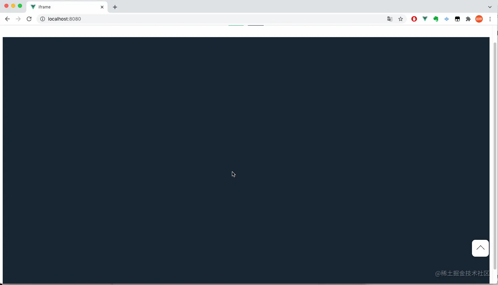
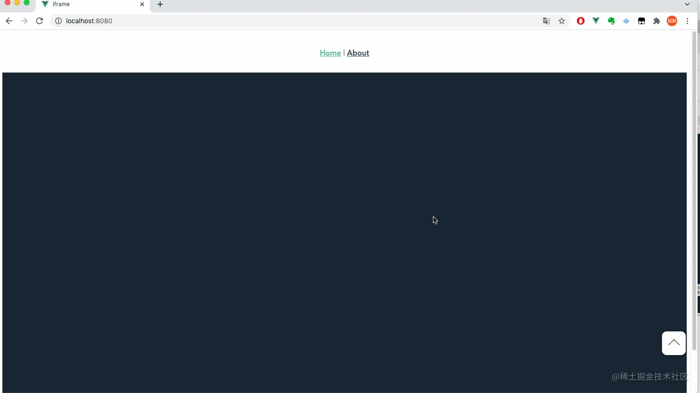

## 前言

<!--more-->

佛祖保佑， 永无`bug`。Hello 大家好！我是海的对岸！

这个组件也算是一个通用的组件，在此记录一下。

## 基础版

### 实现过程

网页`回到顶部`的方法主要是`网页内容太长`，出现`滚动条`了，本质就是将`滚动条置卷起来的高度置为0` ，即可实现网页回到顶部。

```js
// 获取当前页面的滚动条纵坐标位置
document.documentElement.scrollTop;

// 网页被卷去的高
document.body.scrollTop;
```

核心代码就一句话

```js
document.documentElement.scrollTop = document.body.scrollTop = 0;
```

里面用到`document.documentElement`和`document.body`,主要是为了兼容，因为不同浏览器渲染网页，`document`下面可能是`documentElement`也可以能是`body`，所以为了兼容，就2个都写了一下

`documentElement` 对应的是 `html` 标签，而 `body` 对应的是 `body` 标签

在`标准w3c`下，`document.body.scrollTop`恒为`0`，需要用`document.documentElement.scrollTop`来代替;

一般在定义时，代码就会如上定义。

完整代码：

```js
<template>
  <div class="scroll-top" @click="returnTop">
    <div class="box-in"></div>
  </div>
</template>

<script>
export default {
  name: "scroll-top",
  methods: {
    returnTop() {
      document.documentElement.scrollTop = document.body.scrollTop = 0;
    },
  },
};
</script>

<style lang="scss" scoped>
.scroll-top {
  font-size: 14px;
  position: fixed;
  width: 50px;
  height: 30px;
  right: 10px;
  bottom: 80px;
  padding-top: 20px;
  text-align: center;
  background-color: #ffffff;
  border-radius: 20%;
  overflow: hidden;
  -webkit-box-shadow: 0 0 4px 3px rgba(0, 0, 0, 0.2);
  -moz-box-shadow: 0 0 4px 3px rgba(0, 0, 0, 0.2);
  box-shadow: 0 0 4px 3px rgba(0, 0, 0, 0.2);
  &:hover:before {
    top: 50%;
  }
  &:hover .box-in {
    visibility: hidden;
  }
  &:before {
    content: "回到顶部";
    position: absolute;
    font-weight: bold;
    width: 30px;
    top: -50%;
    left: 50%;
    transform: translate(-50%, -50%);
  }
}

.box-in {
  visibility: visible;
  display: inline-block;
  height: 15px;
  width: 15px;
  border: 1px solid #000000;
  border-color: #000000 transparent transparent #000000;
  transform: rotate(45deg);
}
</style>
```

然后我们引用一下

```js
<template>
  <div class="hello">
    <module />
  </div>
</template>

<script>
import module from "./comScrollTop.vue";

export default {
  name: "HelloWorld",
  props: {
    msg: String,
  },
  components: {
    module,
  },
  data() {
    return {
      echartObj: {},
    };
  },
  methods: {},
  mounted() {},
};
</script>

<!-- Add "scoped" attribute to limit CSS to this component only -->
<style scoped lang="scss">
.hello {
  background-color: #182634;
  height: 100vh;
}
</style>
```

### 效果如下



## 升级丝滑版

`升级版`在基础版的上面，增加了`向上滑动的动画`。

原先基础版的时候，`点击回顶按钮`，`页面是一下子就到了顶部`，有点显得突兀

来看看升级版的效果



### 实现过程

除了之前的那一行代码

```js
document.documentElement.scrollTop = document.body.scrollTop = 0;
```

实现动画，用到了 `window`自带的2个方法`cancelAnimationFrame`和`requestAnimationFrame`

`cancelAnimationFrame`，[传送门](https://www.w3cschool.cn/fetch_api/fetch_api-5rzn2uyv.html)
`requestAnimationFrame`，[传送门](https://developer.mozilla.org/zh-CN/docs/Web/API/Window/requestAnimationFrame)

实现原理，看代码，都写在备注里了

```js
<template>
  <div class="scroll-top" @click="returnTop">
    <div class="box-in"></div>
  </div>
</template>

<script>
export default {
  name: "scroll-top",
  methods: {
    returnTop() {
      // 自定义一个计时器
      let timer = null;
      // window自带方法 取消窗体动画
      cancelAnimationFrame(timer);
      // 设置一个开始时间
      let startTime = new Date();
      // 得到当前body标签滚动条的高度 / 当前网页的高度
      let S = document.body.scrollTop || document.documentElement.scrollTop;
      // 停止动画的时间
      let T = 500;
      // window自带方法 requestAnimationFrame
      timer = requestAnimationFrame(function func() {
        let diff = new Date() - startTime;
        let t = T - Math.max(0, T - diff);
        // 每次回调都减掉一点点的高度，使得页面慢慢回到顶部
        document.documentElement.scrollTop = document.body.scrollTop = S - (t * S) / T;
        // 继续回调，继续减掉滚动条的高度
        timer = requestAnimationFrame(func);
        // 满足条件 停止回调，这个时候网页也已经回到顶部了
        if (t === T) {
          cancelAnimationFrame(timer);
        }
      });
    },
  },
};
</script>

<style lang="scss" scoped>
.scroll-top {
  font-size: 14px;
  position: fixed;
  width: 50px;
  height: 30px;
  right: 10px;
  bottom: 80px;
  padding-top: 20px;
  text-align: center;
  background-color: #ffffff;
  border-radius: 20%;
  overflow: hidden;
  -webkit-box-shadow: 0 0 4px 3px rgba(0, 0, 0, 0.2);
  -moz-box-shadow: 0 0 4px 3px rgba(0, 0, 0, 0.2);
  box-shadow: 0 0 4px 3px rgba(0, 0, 0, 0.2);
  &:hover:before {
    top: 50%;
  }
  &:hover .box-in {
    visibility: hidden;
  }
  &:before {
    content: "回到顶部";
    position: absolute;
    font-weight: bold;
    width: 30px;
    top: -50%;
    left: 50%;
    transform: translate(-50%, -50%);
  }
}

.box-in {
  visibility: visible;
  display: inline-block;
  height: 15px;
  width: 15px;
  border: 1px solid #000000;
  border-color: #000000 transparent transparent #000000;
  transform: rotate(45deg);
}
</style>

```

引用的方式 和上面一样，就不多写一遍了。
