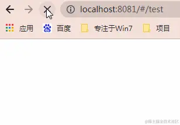
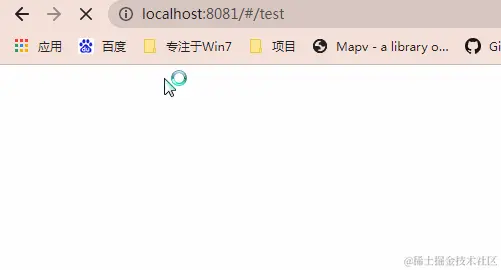

> 本文参考 [汪图南](https://juejin.cn/user/3597257776564174/posts) 大佬的 [《你可能需要这样的大屏数字滚动效果》](https://juejin.cn/post/6844903901355835406)

<!--more-->

## 前言

佛祖保佑， 永无`bug`。Hello 大家好！我是海的对岸！

实际项目中并没有用到这个，但是这个也算是比较常见的功能，趁此机会，记录一个

## 实现思路

1. `首先`要有个`具体的值(value)`，比如这个值是`102346`
2. `然后` 这个组件一加载，显示出来的效果要从`0`跳动到`102346`
3. 这个跳动的时间`time`，我们可以控制,可以让它跳快点，也可以让它慢慢跳

把`第二步`拆开来，用代码来表达，就是“

- a. 设置一个`步进值(增量)step`,
- b. 整个计时器`time`，设置一个开始值`start`，`start` 和 传过来的`具体值(value)`比较，`start`比`value`小，继续使用计时器`time`，给`start`加上增量`step`，再比较`start`和`value`的大小，比到`start`比`value`大的时候，结束

## 具体实现

### 效果



### 代码实现

```js
// 文字变化效果
      numberGrow (ele) {
        // debugger;
        //【这里调速度 1 ，步进值， 通俗地讲，就是每次跳的时候，增加的一个增量】
        let step = parseInt((this.value * 100) / (this.time * 1000));
        // 设置当前值(这个值是计时器持续运行时，每次页面上显示的跳动值，不是最终的那个具体值)
        let current = 0
        // 设置开始值
        let start = 0
        // 设置定时器，用来反复横跳的，哈哈哈
        let t = setInterval(() =>{
          // 每次增加一点步进值
          start += step
          // 开始值大于传过来的的值，说明 到点了，不用 继续横跳了
          if (start > this.value) {
            clearInterval(t)
            // 把穿过的值赋给start，结束
            start = this.value
            // 清掉计时器
            t = null
          }
          if(start == 0){
            start = this.value;
            clearInterval(t)
          }
          // 当前值等于开始值，那就结束
          if (this.value === 0) {
          return
          }
          current = start
          // 正则
          ele.innerHTML = current.toString().replace(/(\d)(?=(?:\d{3}[+]?)+$)/g, '$1,')
        }, this.time * 100)  // 【这里调速度 2， 通俗地讲，这里是页面上，肉眼能看到的跳动频率】
        // 本来想设置成 秒 *1000的，但是实在太慢了，就改成 *100了
      }
```

### 完整代码：

```js
<template>
  <div class="number-grow-warp">
    <span ref="numberGrow" :data-time="time" class="number-grow" :data-value="value">0</span>
  </div>
  </template>
  <script>
  export default {
    props: {
      value: {
        type: Number, // 具体数值
        default() {
          return 720;
        },
      },
      time: {
        type: Number, // 从0-具体数值之间变化的速度，单位秒
        default() {
          return 2;
        },
      },
    },
    data() {
      return {
      }
    },
    mounted() {
      this.numberGrow(this.$refs.numberGrow);  // 取消注释--查看效果
    },
    methods: {
      // 文字变化效果
      numberGrow (ele) {
        // debugger;
        //【这里调速度 1 ，步进值， 通俗地讲，就是每次跳的时候，增加的一个增量】
        let step = parseInt((this.value * 100) / (this.time * 1000));
        // 设置当前值(这个值是计时器持续运行时，每次页面上显示的跳动值，不是最终的那个具体值)
        let current = 0
        // 设置开始值
        let start = 0
        // 设置定时器，用来反复横跳的，哈哈哈
        let t = setInterval(() =>{
          // 每次增加一点步进值
          start += step
          // 开始值大于传过来的的值，说明 到点了，不用 继续横跳了
          if (start > this.value) {
            clearInterval(t)
            // 把穿过的值赋给start，结束
            start = this.value
            // 清掉计时器
            t = null
          }
          if(start == 0){
            start = this.value;
            clearInterval(t)
          }
          // 当前值等于开始值，那就结束
          if (this.value === 0) {
          return
          }
          current = start
          // 正则
          ele.innerHTML = current.toString().replace(/(\d)(?=(?:\d{3}[+]?)+$)/g, '$1,')
        }, this.time * 100)  // 【这里调速度 2， 通俗地讲，这里是页面上，肉眼能看到的跳动频率】
        // 本来想设置成 秒 *1000的，但是实在太慢了，就改成 *100了
      }
    },
  }
  </script>
  <style scoped>
  .number-grow-warp{
  transform: translateZ(0);
  }
  .number-grow {
  display: block;
  }
  </style>
```

因为这是一个组件，我们来引用一下

```js
<template>
  <div>
    <module :value="102346"  :time="2"/>
  </div>
</template>

<script>
// 旋转展示数值组件
import module from './../../components/comRollNumber'
export default {
  name: 'test',
  components: {
    module,
  },
  data() {
    return {
    }
  },
  methods: {
  },
  mounted() {
  },
}
</script>

<style scope>
</style>

```

## 强化版

强化版用到了 `css`中的transform: `translate(-50%,-50%)`，让跳过的过程更加丝滑

### 效果：



原理大同小异

### 直接展示代码

```js
<template>
  <div class="chartNum">
     <h3 class="orderTitle">XX模块展示：</h3>
     <div class="box-item">
      <li :class="{'number-item': !isNaN(item), 'mark-item': isNaN(item) }"
       v-for="(item,index) in orderNum"
       :key="index">
        <span v-if="!isNaN(item)">
         <i ref="numberItem">0123456789</i>
        </span>
       <span class="comma" v-else>{{item}}</span>
      </li>
     </div>
    </div>
 </template>
 <script>
  export default {
    props: {
      value: {
        type: Number, // 具体数值
        default() {
          return 0;
        },
      },
      time: {
        type: Number, // 滚动要花的时间，单位秒
        default() {
          return 3;
        },
      },
    },
   data() {
    return {
     orderNum: ['0', '0', ',', '0', '0', '0', ',', '0', '0', '0'], // 默认订单总数
    }
   },
   mounted() {
    this.toOrderNum(this.value) // 这里输入数字即可调用
    this.increaseNumber(this.time);
   },
   methods: {
    // 定时增长数字
    increaseNumber (time) {
      let self = this
      this.timer = setInterval(() => {
      self.newNumber = self.newNumber + self.getRandomNumber(1, 100)
      self.setNumberTransform()
      }, time * 1000)
    },
     // 设置文字滚动
    setNumberTransform() {
     const numberItems = this.$refs.numberItem // 拿到数字的ref，计算元素数量
     const numberArr = this.orderNum.filter(item => !isNaN(item))
     // 结合CSS 对数字字符进行滚动,显示订单数量
     for (let index = 0; index < numberItems.length; index++) {
     const elem = numberItems[index]
     elem.style.transform = `translate(-50%, -${numberArr[index] * 10}%)`
     }
    },
    getRandomNumber(min, max) {
      return Math.floor(Math.random() * (max - min + 1) + min)
    },
    // 处理传过来的具体值value
    toOrderNum(num) {
     num = num.toString()
     // 把具体值value变成字符串
     if (num.length < 8) {
     num = '0' + num // 如未满八位数，添加"0"补位
     this.toOrderNum(num) // 递归添加"0"补位
     } else if (num.length === 8) {
     // 具体值value中加入逗号
     num = num.slice(0, 2) + ',' + num.slice(2, 5) + ',' + num.slice(5, 8)
     this.orderNum = num.split('') // 将其便变成数据，渲染至滚动数组
     } else {
     // 具体值value数字超过八位显示异常
     this.$message.warning('xxx数量过大，显示异常，请联系后台管理员')
     }
    },
   }
  }
 </script>
 <style scoped lang='scss'>
   /*具体值value总量滚动数字设置*/
  .box-item {
   position: relative;
   height: 100px;
   font-size: 54px;
   line-height: 41px;
   text-align: center;
   list-style: none;
   color: #2D7CFF;
   writing-mode: vertical-lr;
   text-orientation: upright;
   /*文字禁止编辑*/
   -moz-user-select: none; /*火狐*/
   -webkit-user-select: none; /*webkit浏览器*/
   -ms-user-select: none; /*IE10*/
   -khtml-user-select: none; /*早期浏览器*/
   user-select: none;
   /* overflow: hidden; */
  }
  /* 默认逗号设置 */
  .mark-item {
   width: 10px;
   height: 100px;
   margin-right: 5px;
   line-height: 10px;
   font-size: 48px;
   position: relative;
   & > span {
    position: absolute;
    width: 100%;
    bottom: 0;
    writing-mode: vertical-rl;
    text-orientation: upright;
   }
  }
  /*滚动数字设置*/
  .number-item {
   width: 41px;
   height: 75px;
   background: #ccc;
   list-style: none;
   margin-right: 5px;
   background:rgba(250,250,250,1);
   border-radius:4px;
   border:1px solid rgba(221,221,221,1);
   & > span {
    position: relative;
    display: inline-block;
    margin-right: 10px;
    width: 100%;
    height: 100%;
    writing-mode: vertical-rl;
    text-orientation: upright;
    overflow: hidden;
    & > i {
     font-style: normal;
     position: absolute;
     top: 11px;
     left: 50%;
     transform: translate(-50%,0);
     transition: transform 1s ease-in-out;
     letter-spacing: 10px;
    }
   }
  }
  .number-item:last-child {
   margin-right: 0;
  }
 </style>
```

引用方法同上边一样：

```js
<template>
  <div>
    <module :value="102346"  :time="2"/>
  </div>
</template>

<script>
// 旋转展示数值组件
import module from './../../components/comRollNumber2'
export default {
  name: 'test',
  components: {
    module,
  },
  data() {
    return {
    }
  },
  methods: {
  },
  mounted() {
  },
}
</script>

<style scope>
</style>
```

## 参考文章：

1. [vue 实现数字滚动增加效果的实例代码](https://www.jb51.net/article/143262.htm)
2. [Vue.js实现大屏数字滚动翻转效果](https://www.jb51.net/article/175367.htm)
