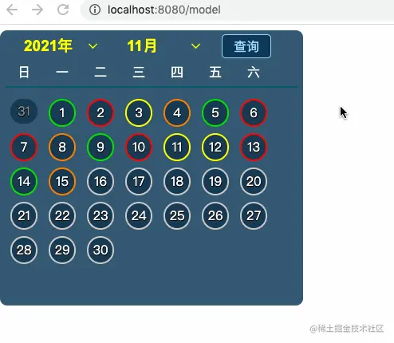
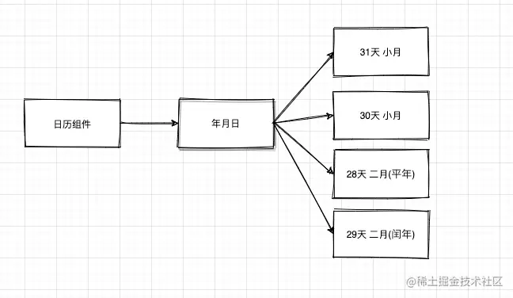
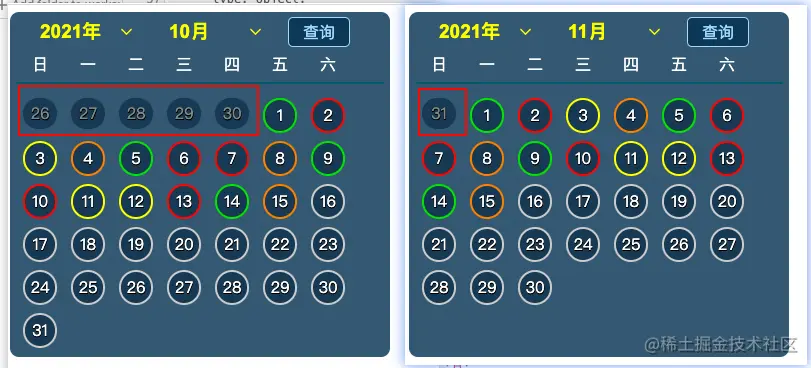

## 前言

<!--more-->

佛祖保佑， 永无`bug`。Hello 大家好！我是海的对岸！

实际开发中，碰到一个日历的需求，这个日历的需求中要加入定制的业务，网上没有现成的，手动实现了一下，整理记录下。

动画效果：



## 实现

### 实现背景

工作上碰到一个需求，需要有一个可以在日历上能看到每天的污染情况的状态，因此，我们梳理下需求：

1. 要有一个日历组件
2. 要在这个日历组件中追加自己的业务逻辑

`简单拎一下核心代码的功能`

### 实现日历模块

大体上日历就是看某个月有多少多少天，拆分下，如下所示：


再对比这我们的效果图，日历上还要有上个月的末尾几天



### 实现上个月的末尾几天

```js
monthFisrtDay() {
      // 所指的星期中的某一天，使用本地时间。返回值是 0（周日） 到 6（周六） 之间的一个整数
      // eslint-disable-next-line radix
      const currDT = (parseInt(this.year.substr(0, 4)) + '/' + parseInt((this.month).replace('月', '')) + '/1');
      let currWeek = new Date(currDT).getDay();
      return ++currWeek || 7;
    },
    // 刷新日历 获得上个月的结尾天数 <=7
    refreshCalendar() {
      this.nunDays = [];
      const lastDays = [];
      const lastMon = (this.month).replace('月', '') * 1 - 1;
      let lastDay = new Date(new Date(this.year.substr(0, 4), lastMon).getTime() - 8.64e7).getDate();
      for (let i = 1; i < this.monthFisrtDay(); i += 1) {
        lastDays.unshift(lastDay);
        lastDay -= 1;
      }
      this.nunDays = lastDays;
    },
```

### 实现每个月的实际天数

```js
// 展示 日历数据
    getDatas() {
      if (this.dealDataFinal && this.dealDataFinal.length > 0) {
        // console.log(this.dealDataFinal);
        this.list = [];
        const datas = this.dealDataFinal;
        const dataMap = {};
        if (datas.length > 0) {
          datas.forEach((item) => {
            item.level -= 1;
            item.dateStr = item.tstamp.substr(0, 10);
            item.date = item.tstamp.substr(8, 2);
            dataMap[item.date] = item;
          });
        }

        const curDay = new Date().getDate();
        for (let i = 1; i <= this.monthDays; i += 1) {
          let currColor = this.lvls[6];
          let dateStr = String(i);
          let isCurDay = false;
          if (i == curDay) {
            isCurDay = true; // 表示刚好是今天(该日期 和网络上的今天是同一天)
          }
          dateStr = '0' + dateStr;
          dateStr = dateStr.substr(dateStr.length - 2);
          const dataObj = dataMap[dateStr];
          if (dataObj) {
            if (dataObj.level >= 0 && dataObj.level <= 5) {
              currColor = this.lvls[dataObj.level].color;
            } else {
              currColor = this.lvls[6].color;
            }

            this.list.push({
              date: i,
              curDay: isCurDay,
              color: currColor,
              datas: dataObj,
              checkedColor: undefined, // 选中颜色
            });
          } else {
            this.list.push({
              date: i,
              curDay: isCurDay,
              color: this.lvls[6].color,
              datas: {},
              checkedColor: undefined, // 选中颜色
            });
          }
        }
        // console.log(this.list);
      } else {
        this.clearCalendar();
      }
    },
    // 清除上一次的记录
    clearCalendar() {
      this.list = [];
      for (let i = 1; i <= this.monthDays; i += 1) {
        this.list.push({
          date: i,
          color: this.lvls[6].color,
          datas: {},
        });
      }
    },
```

### 实现日历之后，追加业务

定义业务上的字段

```js
data() {
    return {
      ...
      lvls: [
        { title: '优', color: '#00e400' },
        { title: '良', color: '#ffff00' },
        { title: '轻度污染', color: '#ff7e00' },
        { title: '中度污染', color: '#ff0000' },
        { title: '重度污染', color: '#99004c' },
        { title: '严重污染', color: '#7e0023' },
        { title: '未知等级', color: '#cacaca' },
      ],
      list: [], // 当前月的所有天数
      dealDataFinal: [], // 处理接口数据之后获得的最终的数组
      ...
      curYearMonth: '', // 当前时间 年月
      choseYearMonth: '', // 选择的时间 年月
    };
  },
```

定义业务上的方法

```js
// 加载等级
    loadImgType(value) {
      let imgUrl = 0;
      switch (value) {
        case '优':
          imgUrl = 1;
          break;
        case '良':
          imgUrl = 2;
          break;
        case '轻':
          imgUrl = 3;
          break;
        case '中':
          imgUrl = 4;
          break;
        case '重':
          imgUrl = 5;
          break;
        case '严':
          imgUrl = 6;
          break;
        default:
          imgUrl = 0;
          break;
      }
      return imgUrl;
    },
```

因为展示效果，用到的是css，css用的比较多，这里就不一段一段的解读了，总而言之，就是`日元素`不同状态的样式展示，通过前面设置的等级方法，来得到不同的返回参数，进而展示出不同参数对应的不同颜色样式。

最后会放出日历组件的完整代码。

### 完整代码

```js
<template>
  <div class="right-content">
    <div style="height: 345px;">
      <div class="" style="padding: 0px 15px;">
        <el-select v-model="year" style="width: 119px;" popper-class="EntDate">
          <el-option v-for="item in years" :value="item" :label="item" :key="item"></el-option>
        </el-select>
        <el-select v-model="month" style="width: 119px; margin-left: 10px;" popper-class="EntDate">
          <el-option v-for="item in mons" :value="item" :label="item" :key="item"></el-option>
        </el-select>
        <div class="r-inline">
          <span class="searchBtn"  @click="qEQCalendar">查询</span>
        </div>
      </div>
      <div class="calendar" element-loading-spinner="el-icon-loading"
        element-loading-background="rgba(0, 0, 0, 0.6)">
        <div class="day-title clearfix">
          <div class="day-tt" v-for="day in days" :key="day">{{day}}</div>
        </div>
        <div class="clearfix" style="padding-top: 10px;">
          <div :class="{'date-item': true, 'is-last-month': true,}" v-for="(item, index) in nunDays" :key="index + 'num'">
            <div class="day">{{item}}</div>
          </div>
          <div :class="{'date-item': true, 'is-last-month': false, 'isPointer': isPointer}"
            v-for="(item, index) in list" :key="index" @click="queryDeal(item)">
            <div v-if="item.curDay && (curYearMonth === choseYearMonth)" class="day" :style="{border:'2px dashed' +  item.color}"
              :class="{'choseDateItemI': item.checkedColor === '#00e400',
              'choseDateItemII': item.checkedColor === '#ffff00', 'choseDateItemIII': item.checkedColor === '#ff7e00', 'choseDateItemIV': item.checkedColor === '#ff0000',
              'choseDateItemV': item.checkedColor === '#99004c', 'choseDateItemVI': item.checkedColor === '#7e0023', 'choseDateItemVII': item.checkedColor === '#cacaca'}"
              >
              今
            </div>
            <div v-else class="day" :style="{border:'2px solid' +  item.color}"
              :class="{'choseDateItemI': item.checkedColor === '#00e400',
              'choseDateItemII': item.checkedColor === '#ffff00', 'choseDateItemIII': item.checkedColor === '#ff7e00', 'choseDateItemIV': item.checkedColor === '#ff0000',
              'choseDateItemV': item.checkedColor === '#99004c', 'choseDateItemVI': item.checkedColor === '#7e0023', 'choseDateItemVII': item.checkedColor === '#cacaca'}"
              >
              {{item.date}}
            </div>
          </div>
        </div>
      </div>
    </div>
  </div>
</template>

<script>
const today = new Date();
const years = [];
const year = today.getFullYear();
for (let i = 2018; i <= year; i += 1) {
  years.push(`${i}年`);
}
export default {
  props: {
    rightData2: {
      type: Object,
      defaul() {
        return undefined;
      },
    },
    isPointer: {
      type: Boolean,
      default() {
        return false;
      },
    },
  },
  watch: {
    rightData2(val) {
      this.dealData(val);
    },
    calendarData(val) {
      this.dealData(val);
    },
  },
  data() {
    return {
      pointInfo: {
        title: 'xxx污染日历',
      },
      days: ['日', '一', '二', '三', '四', '五', '六'],
      year: year + '年',
      years,
      month: (today.getMonth() + 1) + '月',
      mons: ['1月', '2月', '3月', '4月', '5月', '6月', '7月', '8月', '9月', '10月', '11月', '12月'],
      lvls: [
        { title: '优', color: '#00e400' },
        { title: '良', color: '#ffff00' },
        { title: '轻度污染', color: '#ff7e00' },
        { title: '中度污染', color: '#ff0000' },
        { title: '重度污染', color: '#99004c' },
        { title: '严重污染', color: '#7e0023' },
        { title: '未知等级', color: '#cacaca' },
      ],
      list: [], // 当前月的所有天数
      dealDataFinal: [], // 处理接口数据之后获得的最终的数组
      nunDays: [],
      testDays: ['日', '一', '二', '三', '四', '五', '六'],
      calendarData: null,
      curYearMonth: '', // 当前时间 年月
      choseYearMonth: '', // 选择的时间 年月
    };
  },
  computed: {
    // 获取 select框中展示的具体月份应对应的月数
    monthDays() {
      const lastyear = (this.year).replace('年', '') * 1;
      const lastMon = (this.month).replace('月', '') * 1;
      const monNum = new Date(lastyear, lastMon, 0).getDate();
      // return this.$mp.dateFun.GetMonthDays(this.year.substr(0, 4), lastMon);
      return monNum;
    },
  },
  methods: {
    monthFisrtDay() {
      // 所指的星期中的某一天，使用本地时间。返回值是 0（周日） 到 6（周六） 之间的一个整数
      // eslint-disable-next-line radix
      const currDT = (parseInt(this.year.substr(0, 4)) + '/' + parseInt((this.month).replace('月', '')) + '/1');
      let currWeek = new Date(currDT).getDay();
      return ++currWeek || 7;
    },
    // 刷新日历 获得上个月的结尾天数 <=7
    refreshCalendar() {
      this.nunDays = [];
      const lastDays = [];
      const lastMon = (this.month).replace('月', '') * 1 - 1;
      let lastDay = new Date(new Date(this.year.substr(0, 4), lastMon).getTime() - 8.64e7).getDate();
      for (let i = 1; i < this.monthFisrtDay(); i += 1) {
        lastDays.unshift(lastDay);
        lastDay -= 1;
      }
      this.nunDays = lastDays;
    },
    // 展示 日历数据
    getDatas() {
      if (this.dealDataFinal && this.dealDataFinal.length > 0) {
        // console.log(this.dealDataFinal);
        this.list = [];
        const datas = this.dealDataFinal;
        const dataMap = {};
        if (datas.length > 0) {
          datas.forEach((item) => {
            item.level -= 1;
            item.dateStr = item.tstamp.substr(0, 10);
            item.date = item.tstamp.substr(8, 2);
            dataMap[item.date] = item;
          });
        }

        const curDay = new Date().getDate();
        for (let i = 1; i <= this.monthDays; i += 1) {
          let currColor = this.lvls[6];
          let dateStr = String(i);
          let isCurDay = false;
          if (i == curDay) {
            isCurDay = true; // 表示刚好是今天(该日期 和网络上的今天是同一天)
          }
          dateStr = '0' + dateStr;
          dateStr = dateStr.substr(dateStr.length - 2);
          const dataObj = dataMap[dateStr];
          if (dataObj) {
            if (dataObj.level >= 0 && dataObj.level <= 5) {
              currColor = this.lvls[dataObj.level].color;
            } else {
              currColor = this.lvls[6].color;
            }

            this.list.push({
              date: i,
              curDay: isCurDay,
              color: currColor,
              datas: dataObj,
              checkedColor: undefined, // 选中颜色
            });
          } else {
            this.list.push({
              date: i,
              curDay: isCurDay,
              color: this.lvls[6].color,
              datas: {},
              checkedColor: undefined, // 选中颜色
            });
          }
        }
        // console.log(this.list);
      } else {
        this.clearCalendar();
      }
    },
    clearCalendar() {
      this.list = [];
      for (let i = 1; i <= this.monthDays; i += 1) {
        this.list.push({
          date: i,
          color: this.lvls[6].color,
          datas: {},
        });
      }
    },

    // 处理接口返回的日历数据
    dealData(currDS) {
      const tempData = [];
      if (('dates' in currDS) && ('level' in currDS) && ('levelName' in currDS) && ('values' in currDS)) {
        if (currDS.dates.length > 0 && currDS.level.length > 0 && currDS.levelName.length > 0 && currDS.values.length > 0) {
          for (let i = 0; i < currDS.dates.length; i++) {
            const temp = {
              tstamp: currDS.dates[i],
              level: currDS.level[i],
              levelName: currDS.levelName[i],
              value: currDS.values[i],
              grade: this.loadImgType(currDS.levelName[i]),
              week: this.testDays[new Date(currDS.dates[i]).getDay()], // currDS.dates[i]: '2020-03-31'
            };
            tempData.push(temp);
          }
          // this.dealDataFinal = tempData.filter(item => item.grade>0);
          this.dealDataFinal = tempData;
          this.refreshCalendar();
          this.getDatas();
        } else {
          this.dealDataFinal = null;
          this.getDatas();
        }
      } else {
        this.dealDataFinal = null;
        this.getDatas();
      }
    },
    // 加载等级
    loadImgType(value) {
      let imgUrl = 0;
      switch (value) {
        case '优':
          imgUrl = 1;
          break;
        case '良':
          imgUrl = 2;
          break;
        case '轻':
          imgUrl = 3;
          break;
        case '中':
          imgUrl = 4;
          break;
        case '重':
          imgUrl = 5;
          break;
        case '严':
          imgUrl = 6;
          break;
        default:
          imgUrl = 0;
          break;
      }
      return imgUrl;
    },
    // （右边）区域环境质量日历
    qEQCalendar() {
      this.curYearMonth = new Date().getFullYear() + '-' + (new Date().getMonth() + 1);
      this.choseYearMonth = this.year.substr(0, 4) + '-' + this.month.substr(0, 1);
      this.calendarData = {
        dates: [
          '2020-07-01',
          '2020-07-02',
          '2020-07-03',
          '2020-07-04',
          '2020-07-05',
          '2020-07-06',
          '2020-07-07',
          '2020-07-08',
          '2020-07-09',
          '2020-07-10',
          '2020-07-11',
          '2020-07-12',
          '2020-07-13',
          '2020-07-14',
          '2020-07-15',
          '',
          '',
          '',
          '',
          '',
          '',
          '',
          '',
          '',
          '',
          '',
          '',
          '',
          '',
          '',
          '',
        ],
        level: [
          1,
          4,
          2,
          3,
          1,
          4,
          4,
          3,
          1,
          4,
          2,
          2,
          4,
          1,
          3,
          '',
          '',
          '',
          '',
          '',
          '',
          '',
          '',
          '',
          '',
          '',
          '',
          '',
          '',
          '',
          '',
        ],
        levelName: [
          '优',
          '中度污染',
          '良',
          '轻度污染',
          '优',
          '中度污染',
          '中度污染',
          '轻度污染',
          '优',
          '中度污染',
          '良',
          '良',
          '中度污染',
          '优',
          '轻度污染',
          '',
          '',
          '',
          '',
          '',
          '',
          '',
          '',
          '',
          '',
          '',
          '',
          '',
          '',
          '',
          '',
        ],
        values: [
          '65',
          '65',
          '65',
          '65',
          '65',
          '65',
          '65',
          '65',
          '65',
          '65',
          '65',
          '65',
          '65',
          '65',
          '65',
          '',
          '',
          '',
          '',
          '',
          '',
          '',
          '',
          '',
          '',
          '',
          '',
          '',
          '',
          '',
          '',
        ],
      };
      // this.$axios.get('api/xxx/xxx/calendar?year=' + parseInt(this.year.substr(0, 4)) + '&month=' + parseInt((this.month).replace('月', '')))
      //   .then((res) => {
      //     if (res.status == 200) {
      //       this.calendarData = res.data.data;
      //     } else {
      //       this.calendarData = null;
      //     }
      //   }, () => {
      //     this.calendarData = null;
      //   });
    },
    // 设置选中之后的逻辑
    queryDeal(item) {
      if (this.isPointer) {
        console.log(item);
        // 设置选中之后的效果
        if (this.list && this.list.length) {
          const tempList = [...this.list];
          tempList.forEach((singleObj) => {
            singleObj.checkedColor = undefined;
            if (item.date === singleObj.date) {
              singleObj.checkedColor = singleObj.color;
            }
          });
          this.list = tempList;
        }
      }
    },
  },
  mounted() {
    this.qEQCalendar();
  },
};
</script>

<style>
.EntDate{
  background-color: rgba(2, 47, 79, 0.8) !important;
  border: 1px solid rgba(2, 47, 79, 0.8) !important;
}
.EntDate /deep/ .popper__arrow::after{
  border-bottom-color: rgba(2, 47, 79, 0.8) !important;
}
.EntDate /deep/ .el-scrollbar__thumb{
  background-color: rgba(2, 47, 79, 0.8) !important;
}
.el-select-dropdown__item.hover, .el-select-dropdown__item:hover{
  background-color: transparent !important;
}
</style>

<style lang="scss" scoped>
.r-inline{
    display: inline-block;
}
.right-content{
    width: 380px;
    margin: 7px;
    border-radius: 9px;
    background-color: rgba(2, 47, 79, 0.8);
}
.day-title {
  border-bottom: 2px solid #03596f;
  padding: 1px 0 10px;
  height: 19px;
  .day-tt {
    float: left;
    text-align: center;
    color: #ffffff;
    width: 48px;
  }
}
.date-item {
  float: left;
  text-align: center;
  color: #fff;
  width: 34px;
  // padding: 2px 2px;
  padding: 4px 4px;
  margin: 0px 3px;
  &.is-last-month {
    color: #7d8c8c;
  }
  .day {
    border-radius: 17px;
    padding: 3px;
    height: 25px;
    line-height: 25px;
    text-shadow: #000 0.5px 0.5px 0.5px, #000 0 0.5px 0, #000 -0.5px 0 0, #000 0 -0.5px 0;
    background-color: #173953;
  }
}
.calendar{
  padding: 0px 6px;
}
.lvls {
  padding: 0px 6px 6px 13px;
}
.lvl-t-item {
  float: left;
  font-size:10px;
  padding-right: 3px;
  .lvl-t-ico {
    height: 12px;
    width: 12px;
    display: inline-block;
    margin-right: 5px;
  }
  .lvl-tt {
    color: #5b5e5f;
  }
}
// ================================================================================================= 日期框样式
::v-deep .el-input__inner {
  background-color: transparent;
  border-radius: 4px;
  border: 0px solid #DCDFE6;
  color: #Fcff00;
  font-size: 19px;
  font-weight: bolder;
}
::v-deep .el-select .el-input .el-select__caret {
  color: #fcff00;
  font-weight: bolder;
}
// ================================================================================================= 日期框的下拉框样式
.el-select-dropdown__item{
  background-color: rgba(2, 47, 79, 0.8);
  color: white;
  &:hover{
    background-color: rgba(2, 47, 79, 0.8);
    color: #5de6f8;
    cursor: pointer;
  }
}
.searchBtn {
  cursor: pointer;
  width: 60px;
  height: 28px;
  display: inline-block;
  background-color: rgba(2, 47, 79, 0.8);
  color: #a0daff;
  text-align: center;
  border: 1px solid #a0daff;
  border-radius: 5px;
  margin-left: 15px;
  line-height: 28px;
}

.isPointer{
  cursor: pointer;
}
.choseDateItemI{
  border: 2px solid #00e400 !important;
  box-shadow: #00e400 0px 0px 9px 2px;
}
.choseDateItemII{
  border: 2px solid #ffff00 !important;
  box-shadow: #ffff00 0px 0px 9px 2px;
}
.choseDateItemIII{
  border: 2px solid #ff7e00 !important;
  box-shadow: #ff7e00 0px 0px 9px 2px;
}
.choseDateItemIV{
  border: 2px solid #ff0000 !important;
  box-shadow: #ff0000 0px 0px 9px 2px;
}
.choseDateItemV{
  border: 2px solid #99004c !important;
  box-shadow: #99004c 0px 0px 9px 2px;
}
.choseDateItemVI{
  border: 2px solid #7e0023 !important;
  box-shadow: #7e0023 0px 0px 9px 2px;
}
.choseDateItemVII{
  border: 2px solid #cacaca !important;
  box-shadow: #cacaca 0px 0px 9px 2px;
}
</style>

```
