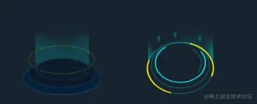
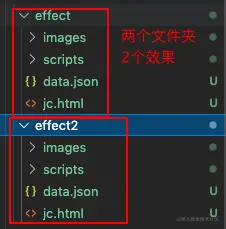
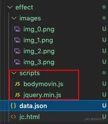
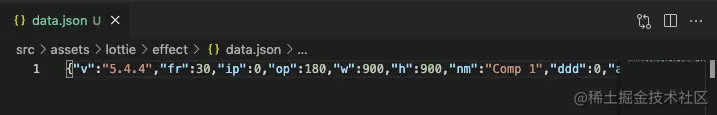
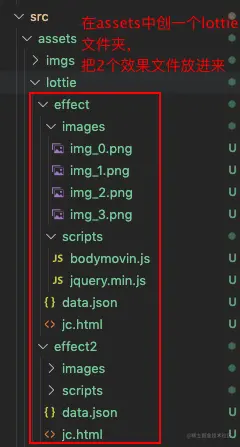
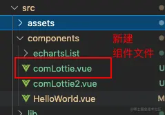
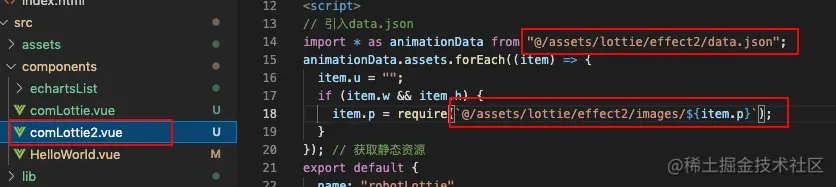

## 前言

<!--more-->

佛祖保佑， 永无`bug`。Hello 大家好！我是海的对岸！

这个组件也是做项目的时候，碰到的。当时`UI`给的原型图，`强调`，这是一个`会动`的`动画`，不是静态图片。



UI给的图 ↑

当时第一反应就是，这个直接用`css`的动画`animation`, 好像不太好搞的样子。当时也是脸皮厚，对UI说，要不你做一个动态的效果出来，我看看，再实现

but，后来UI真的做出来了，我当时第一反应，就是卧槽， UI 🐂 🍺 ！


第二反应就是，我要怎么搞？

## 实现过程思考

既然UI 弄出来了，那么说明 这个东西，恩，理论上是可以用前端代码实现的，那么就开始着手做吧

### 剥茧抽丝

1. 刚开始，看到这个动画，确实不知道要怎么弄，当时 UI 是给了一个文件夹过来，说，让我用`nginx本地部署`一下，就能看到效果了。

文件夹的内容如下：



2. 第一眼看上去，这个东西，`怎么看都不是她自己手写出来的`，应该是UI用她的`软件画出一个动画`出来，然后`导出成代码`的形式，给我们前端工程师看的

接着看逐次打开每个文件夹，`images`里面放的都是图片素材，`jc.html`一看就是个`入口文件`，`scripts`里面放的是`js`文件，`data.json`是一长串的`json对象`，也不太好下手。





等下！！`script`中的`bodymovin.js`怎么看都应该是生成出来的`固定文件名`，这个文件名，网上一定能搜的到

### 顺藤摸瓜

1. 在网上搜 `bodymovin.js`，没有得到想要的结果，但是让我知道了这个`js`作用大概就是`实现动画`的，而`data.json`就是支撑动画的`数据`，`images`里放的就是动画要用到的`素材`

2. 我是用`vue`开发的，那么，在网上接着搜`vue bodymovin.js`，果然，很快就找到我想要的了


## vue-lottie登场

关于`vue-lottie的安装`，可以去看我的[【vue起步】快速搭建vue项目引入第三方插件](https://juejin.cn/post/7020064317852614687)

### 为什么使用Lottie

一直以来我们的设计同学都是使用设计软件，设计动画效果，开发同学再通过代码来实现动效。对于复杂的动画，开发同学要用很长的时间来实现，并且还有可能无法达到设计同学的最初的效果。\
还有一种实现动画的方式就是gif图。然而Android并不支持gif图，而且gif图对于移动端还有占用过多空间的问题。

那么，Lottie为我们做了什么呢。\
首先，设计同学在Adobe After Effects上设计了动画效果，通过bodymovin插件，可以将动画导出成一个json文件。\
然后，开发同学就可以通过Lottie将前面生成的json文件渲染成动画效果。\
这样就可以高效的实现很多复杂动画效果啦。

### 直接上代码





`comLottie.vue`

```js
<template>
  <div>
    <lottie
      :options="defaultOptions"
      :height="170"
      :width="170"
      v-on:animCreated="handleAnimation"
    />
  </div>
</template>

<script>
// 引入data.json
import * as animationData from "@/assets/lottie/effect/data.json";
animationData.assets.forEach((item) => {
  item.u = "";
  if (item.w && item.h) {
    item.p = require(`@/assets/lottie/effect/images/${item.p}`);
  }
}); // 获取静态资源
export default {
  name: "robotLottie",
  props: [],
  data() {
    return {
      defaultOptions: {
        // 动画数据：注意是 .default
        animationData: animationData.default,
      },
    };
  },
  computed: {},
  methods: {
    handleAnimation(anim) {
      this.anim = anim;
    },
  },
  mounted() {},
};
</script>

<style lang="scss" scoped></style>
```

这样就完了？没错，这就好了，然后我们引用一下

```js
<template>
  <div class="hello">
    <module style="display: inline-block" />
  </div>
</template>

<script>
import module from "./comLottie.vue";

export default {
  name: "HelloWorld",
  props: {
    msg: String,
  },
  components: {
    module,
  },
  data() {
    return {
      echartObj: {},
    };
  },
  methods: {},
  mounted() {},
};
</script>

<!-- Add "scoped" attribute to limit CSS to this component only -->
<style scoped lang="scss">
.hello {
  background-color: #182634;
}
</style>
```


因为这种动画的素材引用的并不多，项目中就只有2个，所以我就给另一个动画素材，直接也新建一个组件来展示了。
把`comLottie.vue` 复制一下，改名`comLottie2.vue`

把代码中的`动画资源地址改下`



再引入一遍

```js
<template>
  <div class="hello">
    <module style="display: inline-block" />
    <module2 style="display: inline-block" />
  </div>
</template>

<script>
import module from "./comLottie.vue";
import module2 from "./comLottie2.vue";

export default {
  name: "HelloWorld",
  props: {
    msg: String,
  },
  components: {
    module,
    module2,
  },
  data() {
    return {
      echartObj: {},
    };
  },
  methods: {},
  mounted() {},
};
</script>

<!-- Add "scoped" attribute to limit CSS to this component only -->
<style scoped lang="scss">
.hello {
  background-color: #182634;
}
</style>
```

这样，效果就来了！


## 参考文档

参考1：<https://segmentfault.com/a/1190000010935368>

参考2：<https://www.cnblogs.com/cynthia-wuqian/p/12835465.html>
