## 前言

<!--more-->

佛祖保佑， 永无`bug`。Hello 大家好！我是海的对岸！

`3d饼图`，平时用的是`echarts`,但是这个有`3d的效果`，后来就找到了`highcharts`，学习一下，记录一下。

## 实现过程

### 简单介绍

**Highcharts** 系列软件包含 **Highcharts JS**，**Highstock JS**，**Highmaps JS** 共三款软件，均为**纯 JavaScript 编写的 HTML5 图表库**，全部源码开放，全部源码开放，个人及非商业用途可以任意使用及源代码编辑。个人及非商业用途可以任意使用及源代码编辑。

先看效果：

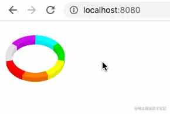

这次找的时候发现了`higcharts`和`highcharts-vue`，这两个我都讲下怎么实现

### highcharts实现

用到的第三方组件`highcharts`

highcharts官网：[传送门](https://www.highcharts.com/)

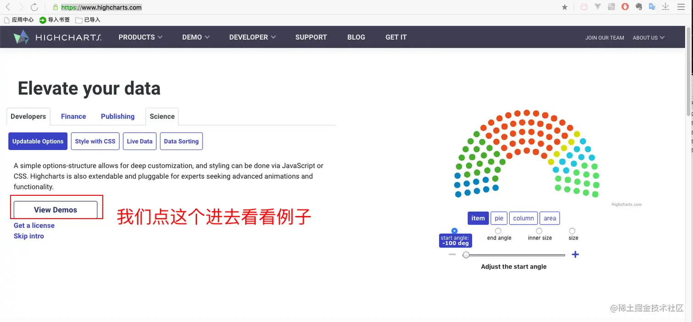

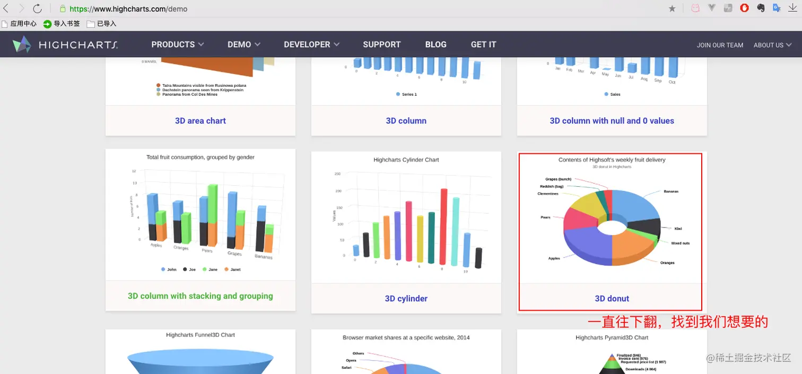

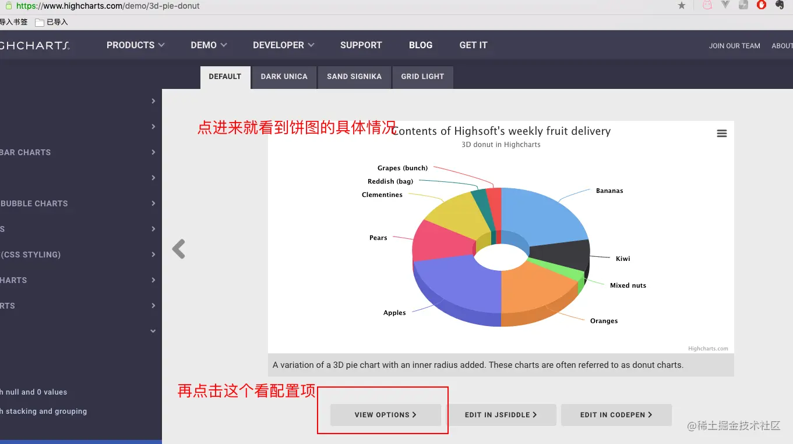

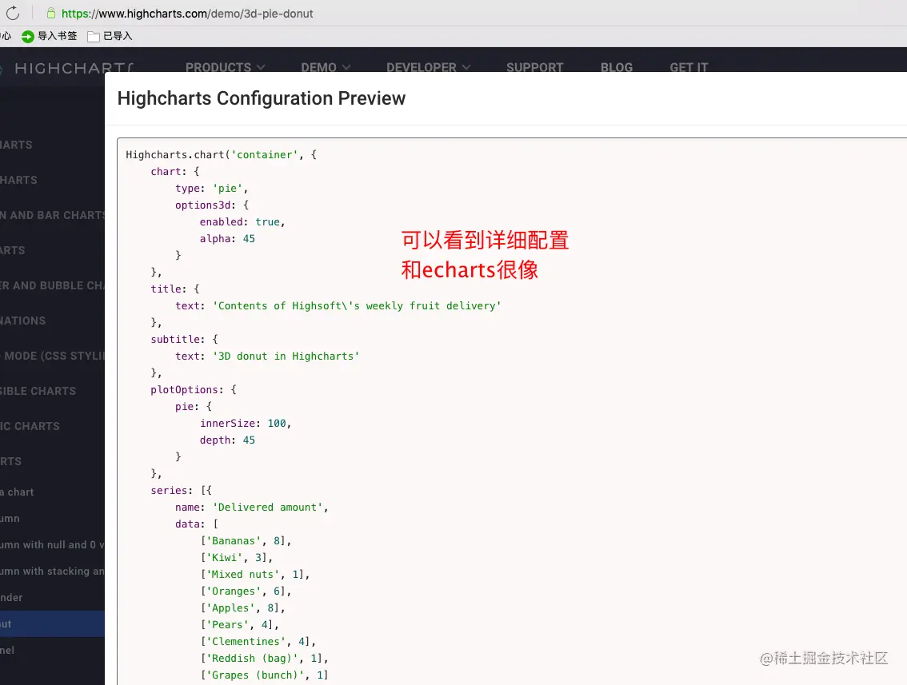

先安装下`highcharts`

```sh
yarn add highcharts
```

老规矩，在`lib`文件夹中新建个`highchart`文件夹

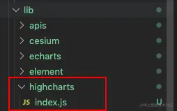

`index.js`的代码如下：

```js
import HighCharts from "highcharts";
import highcharts3d from "highcharts/highcharts-3d";

// 因为要使用3d效果，所以这段代码必须加上，不然跑出来的效果就是2d效果
highcharts3d(HighCharts);

export default (Vue) => {
  Vue.prototype.$HighCharts = HighCharts;
};
```

在`main.js`中引用下

```js
import Vue from "vue";
import App from "./App.vue";
...
import highcharts from "./lib/highcharts";

...
Vue.use(highcharts);
...
```

新建个组件中`comHighCharts.vue`引用下看看

```js
<template>
  <div class="container">
    <div id="demo" :option="option" style="height: 120px; width: 120px"></div>
  </div>
</template>

<script>
export default {
  data() {
    return {
      // option中的属性可以做成传值的形式，从要引用这个组件的父组件中传过来
      // 这里就不写父组件的引用调用了(实在是在【自定义的小组件】专栏中写了太多次)
      option: {
        credits: {
          enabled: false,
        },
        chart: {
          margin: 0,
          height: 120,
          backgroundColor: "rgba(0, 0, 0, 0)",
          borderWidth: 0,
          type: "pie",
          options3d: {
            enabled: true,
            alpha: 45,
          },
          panning: false, // 禁用放大
          pinchType: "", // 禁用手势操作
          zoomType: "",
          panKey: "shift",
        },
        title: {
          text: "",
        },
        plotOptions: {
          pie: {
            innerSize: "80%",
            allowPointSelect: false, // 扇块点击
            depth: 15, // 厚度
            dataLabels: {
              enabled: false,
            },
          },
        },
        series: [
          {
            name: "",
            colors: ["#00FFFF", "#00E400", "#FFFF00", "#FF7E00", "#ff0000", "#E1E1E1"],
            data: [
              ["I-II类", 1],
              ["III类", 1],
              ["IV类", 1],
              ["V类", 1],
              ["劣V类", 1],
              ["离线", 1],
            ],
          },
        ],
      },
    };
  },
  methods: {
    loadChart() {
      this.$HighCharts.chart("demo", this.option);
    },
  },
  mounted() {
    this.loadChart();
  },
};
</script>

<style scoped>
* {
  padding: 0;
  margin: 0;
}
.container {
  width: 120px;
  height: 120px;
  border: 0px solid #ddd;
  background: rgb(0, 0, 0, 0);
}
</style>
```

这样就完成了

### highcharts-vue实现

其实除了上面这种方法，`hightcharts`也有适合`vue`的`hightcharts扩展包`，叫`highcharts-vue`
，不过使用这个插件，还是要`先安装上highcharts`(感觉就像`echarts` 和 `vue-echarts`的关系一样)

`highcharts-vue` 也有文档，还是中文的，比较友好，[传送门](https://www.highcharts.com.cn/docs/highcharts-vue)

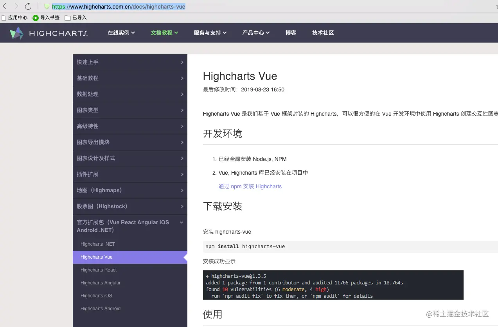

我们也来试试这种形式的

安装

```js
yarn add highcharts highcharts-vue
```

来创建我们的第三方文件夹`lib/highchartsVue`

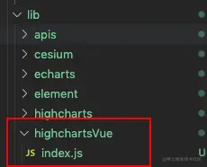

`index.js`代码如下：

```js
import Highchart from "highcharts/highcharts";
import HighchartsVue from "highcharts-vue";
import stockInit from "highcharts/modules/stock";

stockInit(Highchart);

export default (Vue) => {
  Vue.use(HighchartsVue);
};
```

`index.js`为什么这么写，因为**文档上有示例**

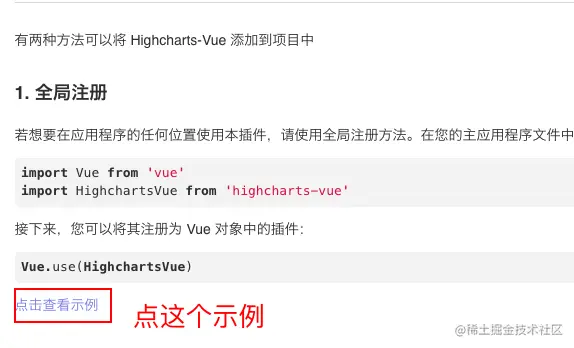

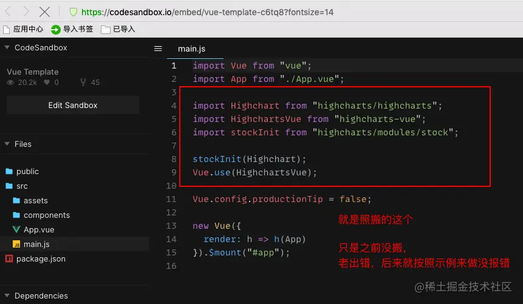

创建我们的组件
`comHighCharts2.vue`

```js
<template>
  <div>
    <highcharts :options="chartOptions" :callback="myCallback"></highcharts>
  </div>
</template>

<script>
export default {
  name: "HelloWorld",
  data() {
    return {
      chartOptions: {
        credits: {
          enabled: false,
        },
        chart: {
          margin: 0,
          height: 120,
          backgroundColor: "rgba(0, 0, 0, 0)",
          borderWidth: 0,
          type: "pie",
          options3d: {
            enabled: true,
            alpha: 45,
          },
          panning: false, // 禁用放大
          pinchType: "", // 禁用手势操作
          zoomType: "",
          panKey: "shift",
        },
        title: {
          text: "",
        },
        plotOptions: {
          pie: {
            innerSize: "80%",
            allowPointSelect: false, // 扇块点击
            depth: 15, // 厚度
            dataLabels: {
              enabled: false,
            },
          },
        },
        series: [
          {
            name: "",
            colors: ["#00FFFF", "#00E400", "#FFFF00", "#FF7E00", "#ff0000", "#E1E1E1", "#D20DEF"],
            data: [
              ["I-II类", 1],
              ["III类", 1],
              ["IV类", 1],
              ["V类", 1],
              ["劣V类", 1],
              ["离线", 1],
              ["有效性不足", 1],
            ],
          },
        ],
      }
    };
  },
  mounted() {},
  methods: {
    myCallback() {
      console.log("this is callback function");
    }
  }
};
</script>

<style>
.highcharts-container {
  width: 600px;
  height: 400px;
  border: 1px solid #ddd;
  margin: auto;
}
</style>
```

效果也有：

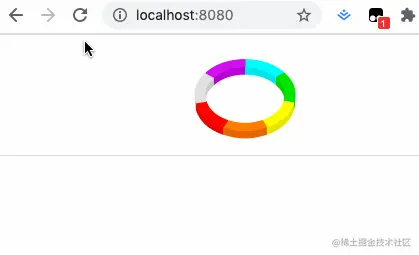

## 一点小想法

个人的一点见解，当我们vue用的多了，业务做的越来越多，会遇到越来越多的的非封装好的第三方vue的插件包，这些包并没有`现成的vue的版本`。

但是随着`模块化的思想`逐渐流行，现在市面上大部分第三方包都遵守`import xxx from "xxxx"`的约定，所以这些非vue版本的包，我们在vue中也能使用。

在没有现成的vue包的时候，比如`highcharts(假设它没有hightcharts-vue 这个扩展包)`，我们大多是通过第一种方式的途径，来把第三方包加到vue中，在vue中使用。

原理也很简单：就是把安装的第三方包`挂载在vue对象`上，给vue实例添加一个`字段属性`，这个`字段`就是我们`安装的当前的第三方包`，然后我们在项目中就通过`this.xxx`方法加载我们的第三方包。

比如我在[【vue起步】快速搭建vue项目引入第三方插件](https://juejin.cn/post/7020064317852614687)中引入的`jquery`，就是这种方式。

希望大家能越用vue越熟练，逐渐掌握vue。

`ps`: 另外多说一句，`highcharts`做出的`3d饼图`，配合我之前的[【vue自定义组件】实现UI给的动画，lottie登场](https://juejin.cn/post/7021924065413693477)的效果，叠放在一块，逼格瞬间拉满，如果你有做大屏的需求，千万别错过这个特效噢

## 参考文档

1. [highcharts官网](https://www.highcharts.com/)
2. [highcharts-vue中文文档](https://www.highcharts.com.cn/docs/start-introduction)
