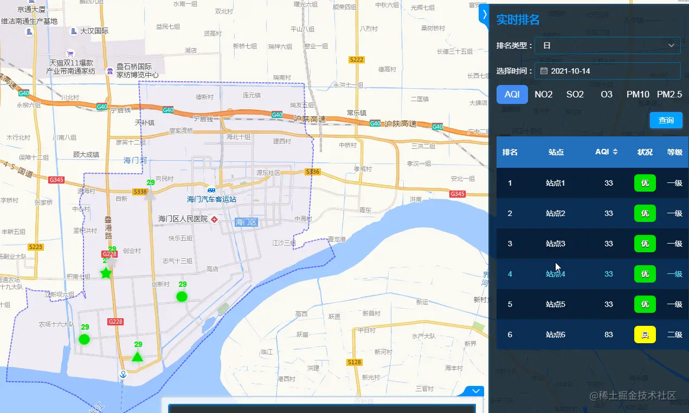
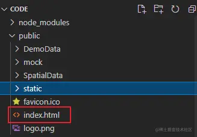
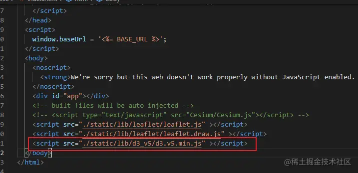
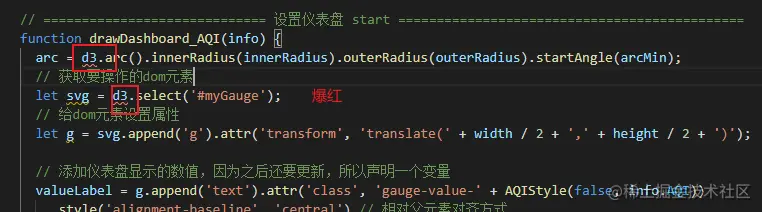
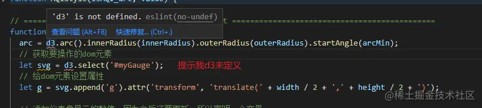
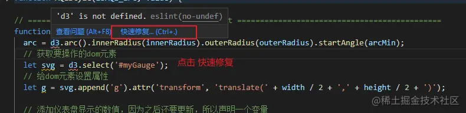
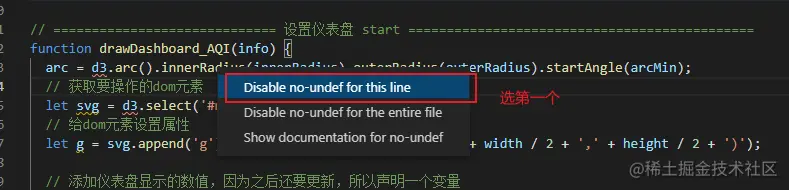
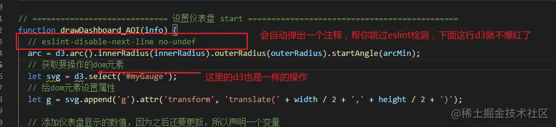
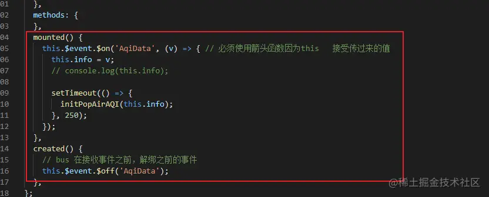

## 前言

<!--more-->

佛祖保佑， 永无`bug`。Hello 大家好！我是海的对岸！

有时我们在项目中要根据ui设计出的原型图，将原型图转变成具体的页面，里面用到的一些组件，不是现成可用的。这个时候就需要自己实现这些特定的组件。

这些组件是自己会用的，对自己来说可以算是通用的，可以拿来复用。

早前，我们还在用`H5`的时候，当初实现过一次这个功能，现在我司技术栈转到`Vue.js`,最近有个项目需要这个功能，就要把之前的代码重新转成`Vue`

## 实现过程简介

效果如下：

`先不要急着复制代码，我会在最后把整个代码都放出来`

先讲实现过程



要做的效果是：点位弹框出现之后，显示出一个有动画效果的仪表盘。

拆分下这个功能的实现：

1. 一个值变换到一个新的值时，是一个渐变的过程；
2. 在仪表盘数值变化时，有一个弹性的动画效果
3. 圆弧末尾有一个竖线，作为仪表盘的指针，在仪表盘数值变化时，有一个弹性的动画效果。

因为之前查过资料，早前用`H5`的时候，用`D3`做过，这次就还是用D3来做

[D3传送门](https://d3js.org/)

ps：我当时的D3版本是 `d3_v5`

> ## 画仪表盘

1. 首先定义一个`svg`元素：

```js
<svg id="myGauge" width="150" height="150"></svg>
```

2. 然后，声明一些变量用于初始化：

```js
// =============================== 定义仪表盘需要用到的参数 =====================================
// svg的高度和宽度，也可以通过svg的width、height属性获取
let width = 158;
let height = 158;
// 圆弧的内外半径
let innerRadius = 35;
let outerRadius = 60;
// 圆弧的起始角度和终止角度
let arcMin = (-Math.PI * 2) / 3;
let arcMax = (Math.PI * 2) / 3;
let valueLabel = 0; // 仪表盘显示的数值，AQI的值
let foreground; // 表示AQI圆弧长度，是另一段圆弧对象 ,未定义值默认为 undefined
let tick; // 表示QI圆弧尾部的指针 ,未定义值默认为 undefined
let arc; // 表示圆弧的绘制函数 ,未定义值默认为 undefined
let background; // 设置背景圆弧的颜色 ,未定义值默认为 undefined
let valueLevel; // 设置AQI圆弧的严重级别 ,未定义值默认为 undefined
let percentage; // 表示AQI值对应的圆弧弧长， 在0-1之间 ,未定义值默认为 undefined
// =============================== 定义仪表盘需要用到的参数 =====================================
```

3. 涉及到旋转的角度，准备一个 角度转弧度的方法`angleToDegree`

```js
// 角度转弧度
function angleToDegree(angle) {
  return (angle * 180) / Math.PI;
}
```

4. d3属性的补间（渐变）动画方法，使一个圆弧从当前的角度渐变到另一个新的角度

```js
// 定义 一个d属性的补间（渐变）动画方法，使一个圆弧从当前的角度渐变到另一个新的角度。
function arcTween(newAngle) {
  // let self = this;
  return (d) => {
    const interpolate = d3.interpolate(d.endAngle, newAngle); // 在两个值间找一个插值
    return (t) => {
      d.endAngle = interpolate(t); // 根据 transition 的时间 t 计算插值并赋值给endAngle
      // 返回新的“d”属性值
      return arc(d);
    };
  };
}
```

5. 我的仪表盘要展示出 AQI的值，不同的AQI值 展示出来的颜色不一样，定义一个样式的函数

```js
// 根据AQI值，设置弹框中AQI仪表盘样式
/**
 * isAQI_arc: true 表示返回的是AQI的数值 1-500， false 表示返回的是等级 1 2 3 4 5 给class设置颜色样式，样式写在app.vue中
 * value: 传过来的AQI值
 */
function AQIStyle(isAQI_arc, value) {
  let level = 0;
  let AQI_arc = "#717171";
  const valueNum = Number(value);
  switch (true) {
    case valueNum > 0 && valueNum <= 50:
      if (isAQI_arc) {
        AQI_arc = "#01e401";
      } else {
        level = 1;
      }
      break;
    case valueNum > 50 && valueNum <= 100:
      if (isAQI_arc) {
        AQI_arc = "#ffff00";
      } else {
        level = 2;
      }
      break;
    case valueNum > 100 && valueNum <= 150:
      if (isAQI_arc) {
        AQI_arc = "#ff7e00";
      } else {
        level = 3;
      }
      break;
    case valueNum > 150 && valueNum <= 200:
      if (isAQI_arc) {
        AQI_arc = "#ff0000";
      } else {
        level = 4;
      }
      break;
    case valueNum > 200 && valueNum <= 300:
      if (isAQI_arc) {
        AQI_arc = "#99004c";
      } else {
        level = 5;
      }
      break;
    case valueNum > 300:
      if (isAQI_arc) {
        AQI_arc = "#7e0023";
      } else {
        level = 6;
      }
      break;
    default:
      if (isAQI_arc) {
        AQI_arc = "#717171";
      } else {
        level = 0;
      }
      break;
  }
  if (isAQI_arc) {
    return AQI_arc;
  } else {
    return level;
  }
}
```

6. 接下来就是`D3的api操作`，以及`svg中的操作`了，简单介绍下用到的D3的api，及svg用到的api

- d3操作 [传送门](https://github.com/d3/d3-shape/blob/main/README.md#arc_startAngle)

```js
// 构造一个新的弧发生器使用默认设置， 我的理解：创建一个圆弧的实例
d3.arc();

const arc = d3.arc(); // 创建一个圆弧实例，并进行一些属性的设置
arc({
  innerRadius: 0, // 设置圆弧的内半径
  outerRadius: 100, // 设置圆弧外半径
  startAngle: 0, // 设置圆弧的开始弧度
  endAngle: Math.PI / 2, // 设置圆弧底截止弧度
});
```

```js
// 找到需要操作的dom元素 得到的是svg
d3.select("#id");
```

- 对svg进行操作

```js
// 获取SVG元素，并且转换原点到画布的中心，这样我们在之后创建圆弧时就不需要再单独指定它们的位置了
let svg = d3.select("#myGauge");
let g = svg
  .append("g")
  .attr("transform", "translate(" + width / 2 + "," + height / 2 + ")");
```

- 添加仪表盘中的文字（标题，数值，单位）

```js
//添加仪表盘的标题
g.append("text")
  .attr("class", "gauge-title")
  .style("alignment-baseline", "central") //相对父元素对齐方式
  .style("text-anchor", "middle") //文本锚点，居中
  .attr("y", -45) //到中心的距离
  .text("CPU占用率");
//添加仪表盘显示的数值，因为之后还要更新，所以声明一个变量
var valueLabel = g
  .append("text")
  .attr("class", "gauge-value")
  .style("alignment-baseline", "central") //相对父元素对齐方式
  .style("text-anchor", "middle") //文本锚点，居中
  .attr("y", 25) //到中心的距离
  .text(12.65);
//添加仪表盘显示数值的单位
g.append("text")
  .attr("class", "gauge-unity")
  .style("alignment-baseline", "central") //相对父元素对齐方式
  .style("text-anchor", "middle") //文本锚点，居中
  .attr("y", 40) //到中心的距离
  .text("%");
```

- `D3`制作的`SVG`图，与`Echarts`绘制的`Canvas`比起来，很重要的一个优点是，可以用`CSS`定义`SVG`的样式。比如，此处仪表盘标题的样式如下：

```css
.gauge-title {
  font-size: 10px;
  fill: #a1a6ad;
}
```

- 添加背景圆弧

```js
//添加背景圆弧
var background = g
  .append("path")
  .datum({ endAngle: arcMax }) //传递endAngle参数到arc方法
  .style("fill", "#444851")
  .attr("d", arc);
```

- 添加表示百分比的圆弧，其中`percentage`是要表示的百分比，0到1的小数。

```js
//计算圆弧的结束角度
var currentAngle = percentage * (arcMax - arcMin) + arcMin;
//添加另一层圆弧，用于表示百分比
var foreground = g
  .append("path")
  .datum({ endAngle: currentAngle })
  .style("fill", "#444851")
  .attr("d", arc);
```

- 在圆弧末尾添加一个指针标记

```js
var tick = g
  .append("line")
  .attr("class", "gauge-tick")
  .attr("x1", 0)
  .attr("y1", -innerRadius)
  .attr("x2", 0)
  .attr("y2", -(innerRadius + 12)) //定义line位置，默认是在圆弧正中间，12是指针的长度
  .style("stroke", "#A1A6AD")
  .attr("transform", "rotate(" + angleToDegree(currentAngle) + ")");
```

`rotate`中的参数是度数，`Math.PI`对应`180`，因此需要自定义一个`angleToDegree`方法把`currentAngle`转换一下。 就是 上面`第三步`中的`angleToDegree`方法

要**这个仪表盘**的**数值从一个值跳到另一个值**，怎么做？

> ## 更新圆弧
>
> 修改圆弧下方的数值即可：

```js
valueLabel.text(newValue);
```

更新圆弧则稍麻烦一点，具体思路是：修改圆弧的`endAngle`，以及修改圆弧末尾指针的`transform`值。\
实现的过程中，需要使用的API：

- `selection.transition`：[https://github.com/d3/d3-transition/blob/master/README.md#selection_transition](https://link.jianshu.com?t=https%3A%2F%2Fgithub.com%2Fd3%2Fd3-transition%2Fblob%2Fmaster%2FREADME.md%23selection_transition)
- `transition.attrTween`：[https://github.com/d3/d3-transition/blob/master/README.md#transition_attrTween](https://link.jianshu.com?t=https%3A%2F%2Fgithub.com%2Fd3%2Fd3-transition%2Fblob%2Fmaster%2FREADME.md%23transition_attrTween)
- `d3.interpolate`：[https://github.com/d3/d3-interpolate/blob/master/README.md#interpolate](https://link.jianshu.com?t=https%3A%2F%2Fgithub.com%2Fd3%2Fd3-interpolate%2Fblob%2Fmaster%2FREADME.md%23interpolate)

1. 更新圆弧，其中`angle`为新圆弧的结束角度

```js
// 更新圆弧，并且设置渐变动效
foreground
  .transition()
  .duration(750)
  .ease(d3.easeElastic) //设置来回弹动的效果
  .attrTween("d", arcTween(angle));
```

`arcTween`方法定义如下。它返回一个`d`属性的补间（渐变）动画**方法**，使一个圆弧从当前的角度渐变到另一个新的角度。

```js
arcTween(newAngle) {
    let self=this
    return function(d) {
        var interpolate = d3.interpolate(d.endAngle, newAngle); //在两个值间找一个插值
        return function(t) {
            d.endAngle = interpolate(t);    //根据 transition 的时间 t 计算插值并赋值给endAngle
            return arc(d); //返回新的“d”属性值
        };
    };
}
```

这个方法更详细的说明可以参考[Arc Tween](https://link.jianshu.com/?t=http%3A%2F%2Fbl.ocks.org%2Fmbostock%2F5100636)中的注释。

1.  更新圆弧末尾的指针的原理同上，其中`oldAngle`是旧圆弧的结束角度。

```js
//更新圆弧末端的指针标记，并且设置渐变动效
tick
  .transition()
  .duration(750)
  .ease(d3.easeElastic) //设置来回弹动的效果
  .attrTween("transform", function () {
    //设置“transform”属性的渐变，原理同上面的arcTween方法
    var i = d3.interpolate(angleToDegree(oldAngle), angleToDegree(newAngle)); //取插值
    return function (t) {
      return "rotate(" + i(t) + ")";
    };
  });
```

理论上到这边，就完工了。
接下来，我们就来**落地实现**！

## 实现代码

我是 基于Vue2实现的

1. 在`index.html`中引入`d3.js`





2. 在`APP.vue`中设置我自定义的样式

```css
/* ====================================实时AQI 弹框的 仪表盘样式 start ===========================*/
.gauge-title-0 {
  font-size: 20px;
  fill: #717171;
  border-radius: 5px;
  padding: 3px;
  text-shadow:
    #000 0.5px 0.5px 0.5px,
    #000 0 0.5px 0,
    #000 -0.5px 0 0,
    #000 0 -0.5px 0;
}
.gauge-title-1 {
  font-size: 20px;
  fill: #01e401;
  border-radius: 5px;
  padding: 3px;
  text-shadow:
    #000 0.5px 0.5px 0.5px,
    #000 0 0.5px 0,
    #000 -0.5px 0 0,
    #000 0 -0.5px 0;
}
.gauge-title-2 {
  font-size: 20px;
  fill: #ffff00;
  border-radius: 5px;
  padding: 3px;
  text-shadow:
    #000 0.5px 0.5px 0.5px,
    #000 0 0.5px 0,
    #000 -0.5px 0 0,
    #000 0 -0.5px 0;
}
.gauge-title-3 {
  font-size: 20px;
  fill: #ff7e00;
  border-radius: 5px;
  padding: 3px;
  text-shadow:
    #000 0.5px 0.5px 0.5px,
    #000 0 0.5px 0,
    #000 -0.5px 0 0,
    #000 0 -0.5px 0;
}
.gauge-title-4 {
  font-size: 20px;
  fill: #ff0000;
  border-radius: 5px;
  padding: 3px;
  text-shadow:
    #000 0.5px 0.5px 0.5px,
    #000 0 0.5px 0,
    #000 -0.5px 0 0,
    #000 0 -0.5px 0;
}
.gauge-title-5 {
  font-size: 20px;
  fill: #99004c;
  border-radius: 5px;
  padding: 3px;
  text-shadow:
    #000 0.5px 0.5px 0.5px,
    #000 0 0.5px 0,
    #000 -0.5px 0 0,
    #000 0 -0.5px 0;
}
.gauge-title-6 {
  font-size: 20px;
  fill: #7e0023;
  border-radius: 5px;
  padding: 3px;
  text-shadow:
    #000 0.5px 0.5px 0.5px,
    #000 0 0.5px 0,
    #000 -0.5px 0 0,
    #000 0 -0.5px 0;
}
.gauge-value-0 {
  font-size: 28px;
  fill: #717171;
  border-radius: 5px;
  padding: 3px;
  text-shadow:
    #000 0.5px 0.5px 0.5px,
    #000 0 0.5px 0,
    #000 -0.5px 0 0,
    #000 0 -0.5px 0;
}
.gauge-value-1 {
  font-size: 28px;
  fill: #01e401;
  border-radius: 5px;
  padding: 3px;
  text-shadow:
    #000 0.5px 0.5px 0.5px,
    #000 0 0.5px 0,
    #000 -0.5px 0 0,
    #000 0 -0.5px 0;
}
.gauge-value-2 {
  font-size: 28px;
  fill: #ffff00;
  border-radius: 5px;
  padding: 3px;
  text-shadow:
    #000 0.5px 0.5px 0.5px,
    #000 0 0.5px 0,
    #000 -0.5px 0 0,
    #000 0 -0.5px 0;
}
.gauge-value-3 {
  font-size: 28px;
  fill: #ff7e00;
  border-radius: 5px;
  padding: 3px;
  text-shadow:
    #000 0.5px 0.5px 0.5px,
    #000 0 0.5px 0,
    #000 -0.5px 0 0,
    #000 0 -0.5px 0;
}
.gauge-value-4 {
  font-size: 28px;
  fill: #ff0000;
  border-radius: 5px;
  padding: 3px;
  text-shadow:
    #000 0.5px 0.5px 0.5px,
    #000 0 0.5px 0,
    #000 -0.5px 0 0,
    #000 0 -0.5px 0;
}
.gauge-value-5 {
  font-size: 28px;
  fill: #99004c;
  border-radius: 5px;
  padding: 3px;
  text-shadow:
    #000 0.5px 0.5px 0.5px,
    #000 0 0.5px 0,
    #000 -0.5px 0 0,
    #000 0 -0.5px 0;
}
.gauge-value-6 {
  font-size: 28px;
  fill: #7e0023;
  border-radius: 5px;
  padding: 3px;
  text-shadow:
    #000 0.5px 0.5px 0.5px,
    #000 0 0.5px 0,
    #000 -0.5px 0 0,
    #000 0 -0.5px 0;
}
/* ====================================实时AQI 弹框的 仪表盘样式 end ===========================*/
```

3. 自定义组件 `DynamicDashboard.vue`

```js
<template>
  <div>
    <svg id="myGauge" width="150" height="150" ></svg>
  </div>
</template>

<script>
// =============================== 定义仪表盘需要用到的参数 =====================================
// svg的高度和宽度，也可以通过svg的width、height属性获取
let width = 158;
let height = 158;
// 圆弧的内外半径
let innerRadius = 35;
let outerRadius = 60;
// 圆弧的起始角度和终止角度
let arcMin = -Math.PI * 2 / 3;
let arcMax = Math.PI * 2 / 3;
let valueLabel = 0; // 仪表盘显示的数值，AQI的值
let foreground; // 表示AQI圆弧长度，是另一段圆弧对象 ,未定义值默认为 undefined
let tick; // 表示QI圆弧尾部的指针 ,未定义值默认为 undefined
let arc; // 表示圆弧的绘制函数 ,未定义值默认为 undefined
let background; // 设置背景圆弧的颜色 ,未定义值默认为 undefined
let valueLevel; // 设置AQI圆弧的严重级别 ,未定义值默认为 undefined
let percentage; // 表示AQI值对应的圆弧弧长， 在0-1之间 ,未定义值默认为 undefined
// =============================== 定义仪表盘需要用到的参数 =====================================

// 角度转弧度
function angleToDegree(angle) {
  return angle * 180 / Math.PI;
}
// 定义 一个d属性的补间（渐变）动画方法，使一个圆弧从当前的角度渐变到另一个新的角度。
function arcTween(newAngle) {
  // let self = this;
  return (d) => {
    const interpolate = d3.interpolate(d.endAngle, newAngle); // 在两个值间找一个插值
    return (t) => {
      d.endAngle = interpolate(t); // 根据 transition 的时间 t 计算插值并赋值给endAngle
      // 返回新的“d”属性值
      return arc(d);
    };
  };
}

// 根据AQI值，设置弹框中AQI仪表盘样式
/**
 * isAQI_arc: true 表示返回的是AQI的数值 1-500， false 表示返回的是等级 1 2 3 4 5 给class设置颜色样式，样式写在app.vue中
 * value: 传过来的AQI值
 */
function AQIStyle(isAQI_arc, value) {
  let level = 0;
  let AQI_arc = '#717171';
  const valueNum = Number(value);
  switch (true) {
    case valueNum > 0 && valueNum <= 50:
      if (isAQI_arc) {
        AQI_arc = '#01e401';
      } else {
        level = 1;
      }
      break;
    case valueNum > 50 && valueNum <= 100:
      if (isAQI_arc) {
        AQI_arc = '#ffff00';
      } else {
        level = 2;
      }
      break;
    case valueNum > 100 && valueNum <= 150:
      if (isAQI_arc) {
        AQI_arc = '#ff7e00';
      } else {
        level = 3;
      }
      break;
    case valueNum > 150 && valueNum <= 200:
      if (isAQI_arc) {
        AQI_arc = '#ff0000';
      } else {
        level = 4;
      }
      break;
    case valueNum > 200 && valueNum <= 300:
      if (isAQI_arc) {
        AQI_arc = '#99004c';
      } else {
        level = 5;
      }
      break;
    case valueNum > 300:
      if (isAQI_arc) {
        AQI_arc = '#7e0023';
      } else {
        level = 6;
      }
      break;
    default:
      if (isAQI_arc) {
        AQI_arc = '#717171';
      } else {
        level = 0;
      }
      break;
  }
  if (isAQI_arc) {
    return AQI_arc;
  } else {
    return level;
  }
}

// ============================= 设置仪表盘 start =============================================
function drawDashboard_AQI(info) {
  arc = d3.arc().innerRadius(innerRadius).outerRadius(outerRadius).startAngle(arcMin);
  // 获取要操作的dom元素
  let svg = d3.select('#myGauge');
  // 给dom元素设置属性
  let g = svg.append('g').attr('transform', 'translate(' + width / 2 + ',' + height / 2 + ')');

  // 添加仪表盘显示的数值，因为之后还要更新，所以声明一个变量
  valueLabel = g.append('text').attr('class', 'gauge-value-' + AQIStyle(false, info.AQI))
    .style('alignment-baseline', 'central') // 相对父元素对齐方式
    .style('text-anchor', 'middle') // 文本锚点，居中
    .attr('y', 0) // 到中心的距离
    .text('--');
  // 添加仪表盘显示数值的等级
  valueLevel = g.append('text').attr('class', 'gauge-title-' + AQIStyle(false, info.AQI))
    .style('alignment-baseline', 'central') // 相对父元素对齐方式
    .style('text-anchor', 'middle') // 文本锚点，居中
    .attr('y', 45) // 到中心的距离
    .text('--'); // 暂无单位

  // 添加背景圆弧
  background = g.append('path')
    .datum({ endAngle: arcMax }) // 传递endAngle参数到arc方法
    .style('fill', '#717171')
    .attr('d', arc);

  // 计算圆弧的结束角度
  percentage = 0; // percentage是要表示的百分比，0到1的小数。
  const currentAngle = (percentage * (arcMax - arcMin) + arcMin);
  // 添加另一层圆弧，用于表示百分比
  foreground = g.append('path')
    .datum({ endAngle: currentAngle })
    .style('fill', AQIStyle(true, info.AQI))
    .attr('d', arc);

  tick = g.append('line')
    .attr('class', 'gauge-tick')
    .attr('x1', 0)
    .attr('y1', -innerRadius)
    .attr('x2', 0)
    .attr('y2', -(innerRadius + 32)) // 定义line位置，默认是在圆弧正中间，12是指针的长度
    .style('stroke', '#A1A6AD')
    .attr('transform', 'rotate(' + angleToDegree(currentAngle) + ')');
}

// ============================= 设置仪表盘 end =============================================

// 预加载 打开对话框
function initPopAirAQI(info) {
  // 绘制圆弧
  drawDashboard_AQI(info);

  setTimeout(() => {
    let endAngle_AQI = 1;
    // if (info.AQI == undefined || info.AQI === '--') {
    //     endAngle_AQI = 0;
    // } else {
    //     endAngle_AQI = (Number(info.AQI) / 500) <= 1 ? (Number(info.AQI) / 500) : 1; // aqi值对应的弧长
    // }
    let newAngle = endAngle_AQI * (arcMax - arcMin) + arcMin; // 新圆弧的结束角度
    valueLabel.text(info.AQI); // 设置AQI值
    valueLevel.text(info.Level); // 设置AQI值对应的级别
    // 更新圆弧，并且设置渐变动效
    foreground.transition()
      .duration(750)
      .ease(d3.easeElastic) // 设置来回弹动的效果
      .attrTween('d', arcTween(newAngle)); // newAngle : 新圆弧的结束角度
    // 更新圆弧末端的指针标记，并且设置渐变动效
    tick.transition()
      .duration(750)
      .ease(d3.easeElastic) // 设置来回弹动的效果
      .attrTween('transform', () => { // 设置“transform”属性的渐变，原理同上面的arcTween方法
        // 0 : 是旧圆弧的结束角度。newAngle : 新圆弧的结束角度
        const i = d3.interpolate(angleToDegree(0), angleToDegree(newAngle)); // 取插值
        return (t) => {
          return 'rotate(' + i(t) + ')';
        };
      });
  }, 1000);
}

export default {
  data() {
    return {
      info: {
        AQI: 0,
        Level: '优',
      },
    };
  },
  methods: {
  },
  mounted() {
    this.$event.$on('AqiData', (v) => { // 必须使用箭头函数因为this   接受传过来的值
      this.info = v;
      // console.log(this.info);

      setTimeout(() => {
        initPopAirAQI(this.info);
      }, 250);
    });
  },
  created() {
    // bus 在接收事件之前，解绑之前的事件
    this.$event.$off('AqiData');
  },
};
</script>

<style lang="scss" scoped>

</style>

```

注意：

1. 因为`d3.js` 是在 `index.html`中引用的，如果你敲代码设置了语法检测，那么在这个组件中，`d3` 这个变量 它会给你爆红，提示你说这个`d3`未定义，不用管它，代码是能正常运行的，如果你弄了一个很严格的`eslint检测`,那么 你就在用到 `d3`的地方，单独给它加个`跳过eslint检测的注释`即可











2. 大家可以看到我最后是通过 `bus`方法进行给组件传值的，因为业务的需要，我要在弹框中展示这个组件，而弹框则是基于 `leaflet`来做的，对，就是`leaflet`,就是搞地图那个的， 我这个项目是`webgis`的项目，我发现 传统的`props`传值 和 `vuex` 传值都传不过去，最后发现 `bus`可以，因此，这里就用 `bus`来做的。

弹框组件通过`Vue.extend(弹框组件);`方法载入，再通过`leaflet`的`popup`方法装在进去，而这个`仪表盘组件`又是 装载在 `弹框组件中的`，可能Vue的`extend()` 和 `leaflet`的`api` 中间有些我还没搞懂的东西，只有`bus`能走得通，后边有空再研究研究



如果你是正常的情况下，那我还是建议你用 `props` 或 `vuex` 来做吧

## 参考阅读

感谢[Evelynzzz](https://www.jianshu.com/p/cdf4ed494421)大佬的H5实现的指导
