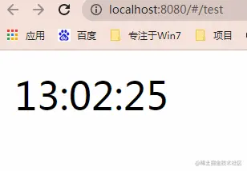

## 前言

<!--more-->

佛祖保佑， 永无`bug`。Hello 大家好！我是海的对岸！

这个组件也算是一个通用的组件，在此记录一下。

## 实现

### 效果



### 原理

原理很简单，大概撸一遍

1. 获取`当前时间`（时分秒）
2. 一天24小时 `减去` 获取的当前时间，得到`倒计时时间`
3. 对`倒计时时间`进行时分秒的判断，如果`时分秒`是`一位数`，那么需要在前面`补0`
4. 把处理好的倒计时时间显示出来
5. 用`计时器`接着进行`步骤1 继续走`

上代码：

```js
<template>
  <div class="number-grow-warp">
    <span >{{time}}</span>
  </div>
  </template>
  <script>
  export default {
    data() {
      return {
        time: '24:00:00',
        timer: undefined, // 计时器，作用：组件销毁的时候需要把定时器清除
      }
    },
    mounted() {
      this.start();  // 24小时倒计时
    },
    methods: {
      //  获取当前时间的24小时倒计时
      countDown() {
        let now = new Date(); // 获取当前时间
        let hour = now.getHours(); // 时
        let min = now.getMinutes(); // 分
        let sec = now.getSeconds(); // 秒
        let result = ''; // 返回结果

        let h = 24 - hour; // 一天中剩下的时间(小时)
        if (min > 0 || sec > 0) {
            h -= 1
        }
        let m = 60 - min; // 一天中剩下的时间(分钟)
        if (sec > 0) {
            m -= 1
        }
        if (m == 60) {
            m = 0
        }
        let s = 60 - sec; // 一天中剩下的时间(秒)
        if (s == 60) {
            s = 0
        }

        h = h.toString();
        m = m.toString();
        s = s.toString();
        if (h.length == 1) { // 补0
            h = '0' + h
        }
        if (m.length == 1) { // 补0
            m = '0' + m
        }
        if (s.length == 1) // 补0
            s = '0' + s
        result = h + ':' + m + ':' + s
        return result
      },
      start() {
        this.timer = setInterval(function () {
          this.time = this.countDown();
        }, 1000)
      },
    },
    destroyed() {
      clearInterval(this.timer); // 组件销毁时清除定时器
    },
  }
  </script>
  <style scoped>

  </style>

```

计时器的方法没有问题，但是页面上并没有显示出倒计时，细心的大家有没有看出问题在哪里？

问题在`setInterval`这个函数上，这就引出了`vue的this` 和 `function的this`中间的出入了

### vue的this 和 function的this

1. `vue`中的`this`：

- 很好理解，这个`this` 指向的就是`vue对象`。比如，你在`motheds`中写了几个方法`(xx1(), xx2(), ...)`，在`mounted`或`created`，或`watch`等`钩子`中使用，都可以直接`this.xx1()`，直接调用方法

2. `function`的`this`:

- 这个`this`指向`window`
- `普通函数`中的`this`指向是`变化的`，`谁调用`的`指向谁`，因为 `setInterval` 和 `setTimeout` 是挂载在 `window` 上的，相当于`window.setInterval` 和 `window.setTimeout`，所以执行函数中的 `this` 指向 `window`
- 那`箭头函数`呢？`箭头函数中的this指向是固定不变（定义函数时的指向）`

### 解决this的问题

同样是上面的代码，改动的地方就在`start()`中

1. 方法1

- 用`箭头函数`（简单粗暴）

```js
start() {
    setInterval(() => {
        this.time = this.countDown();
    }, 1000)
}
```

试验下直接在`start()`中`不使用箭头函数`呢？答案是`undefined`

```js
start() {
    setInterval(function() {
        console.log(this.time); // 打印出undefined
    }, 1000)
}
```

2. 方法2

- 用 `setInterval` 和 `setTimeout`的`第三个参数`
- 原理：`setInterval` 和 `setTimeout` 的`第三个参数`可以`作为执行函数的参数`，具体用法看下文代码

```js
start() {
    setInterval(
        _this => {
            console.log(_this.time); // 打印出具体时间
            _this.time = this.countDown();
        },
        500,
        this
    );
}
```

3. 保存一下 `this`

```js
start() {
     let that = this;
     setInterval(() => {
       console.log(that.time); // 打印出具体时间
       that.time = this.countDown();
    }, 500);
}
```

## 最后完整代码

`com24hourCountDown.vue`

```js
<template>
  <div class="number-grow-warp">
    <span ref="time">{{time}}</span>
  </div>
  </template>
  <script>

  export default {
    data() {
      return {
        time: '24:00:00',
        timer: undefined, // 计时器，作用：组件销毁的时候需要把定时器清除
      }
    },
    mounted() {
      this.start();  // 24小时倒计时
    },
    methods: {
      //  获取当前时间的24小时倒计时
      countDown() {
        let now = new Date(); // 获取当前时间
        let hour = now.getHours(); // 时
        let min = now.getMinutes(); // 分
        let sec = now.getSeconds(); // 秒
        let result = ''; // 返回结果

        let h = 24 - hour; // 一天中剩下的时间(小时)
        if (min > 0 || sec > 0) {
            h -= 1
        }
        let m = 60 - min; // 一天中剩下的时间(分钟)
        if (sec > 0) {
            m -= 1
        }
        if (m == 60) {
            m = 0
        }
        let s = 60 - sec; // 一天中剩下的时间(秒)
        if (s == 60) {
            s = 0
        }

        h = h.toString();
        m = m.toString();
        s = s.toString();
        if (h.length == 1) { // 补0
            h = '0' + h
        }
        if (m.length == 1) { // 补0
            m = '0' + m
        }
        if (s.length == 1) // 补0
            s = '0' + s
        result = h + ':' + m + ':' + s
        return result
      },
      start() {
        setInterval(() => {
          this.time = this.countDown();
        }, 1000)

        // 测试1
        // setInterval(function() {
        //   console.log(this.time); // undefined
        // }, 500);
        // 测试2
        // setInterval(() => {
        //   console.log(this.time); // 具体时间
        // }, 500);
        // 测试3
        // setInterval(
        //   _this => {
        //     console.log(_this.time); // 具体时间
        //     _this.time = this.countDown();
        //   },
        //   500,
        //   this
        // );
        // 测试4
        // let that = this;
        // setInterval(() => {
        //   console.log(that.time);// 具体时间
        //   that.time = this.countDown();
        // }, 500);
      },

    },
    destroyed() {
      clearInterval(this.timer); // 组件销毁时清除定时器
    },
  }
  </script>
  <style scoped>
  </style>
```

然后我们引用一下

```js
<template>
  <div>
    <module />
  </div>
</template>

<script>
// 旋转展示数值组件
import module from './../../components/com24hourCountDown'
export default {
  name: 'test',
  components: {
    module,
  },
  data() {
    return {
    }
  },
  methods: {
  },
  mounted() {
  },
}
</script>

<style scope>
</style>
```

## 参考文章

1. [Vue中setInterval和setTimeout执行函数中的this的指向](https://www.jianshu.com/p/e20062b1d27d)
