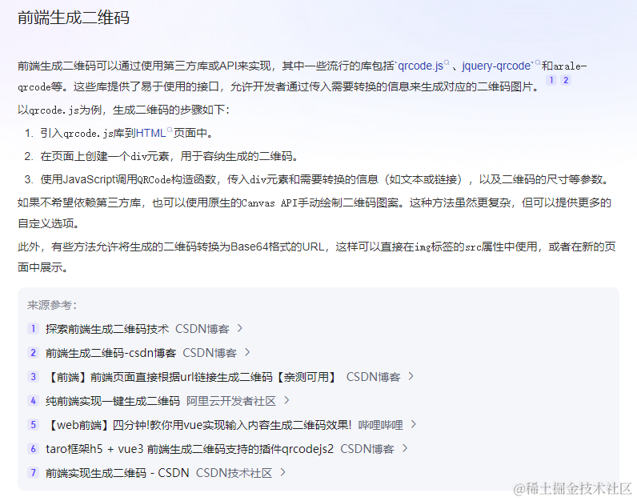
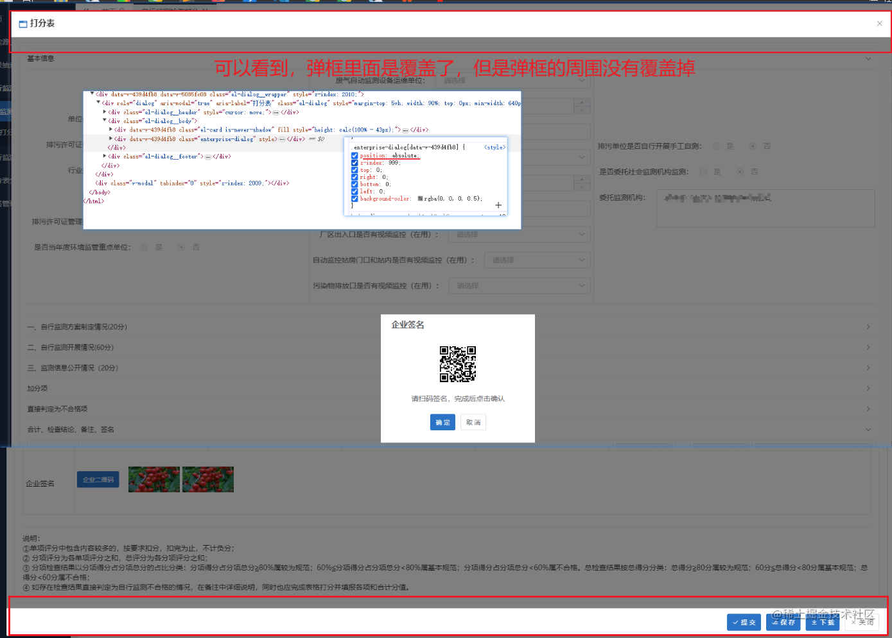
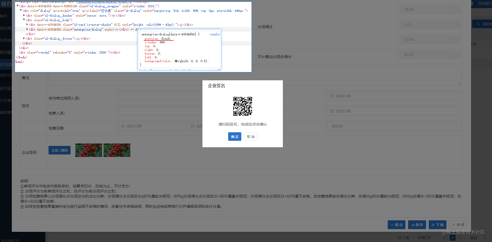
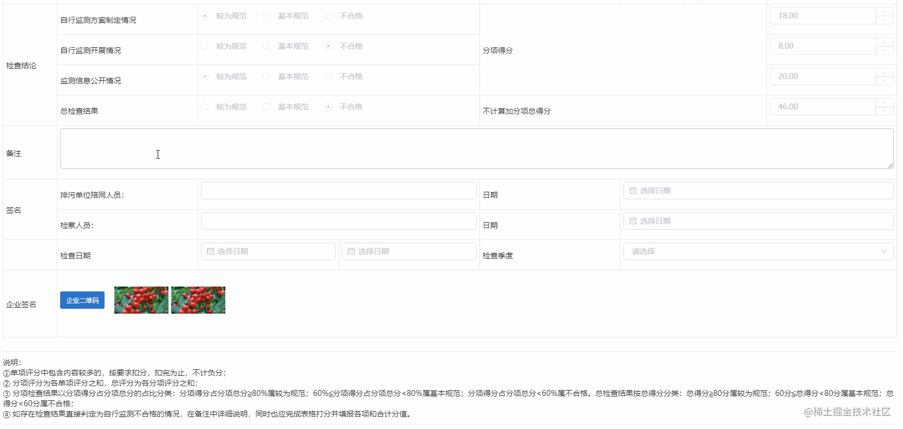
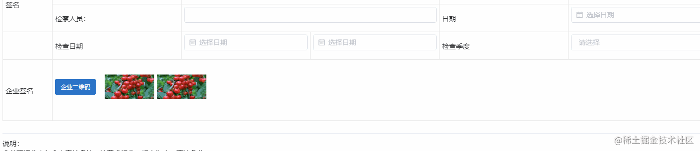

## 前言

佛祖保佑， 永无`bug`。Hello 大家好！我是海的对岸！

## 期望效果


## 背景

这次需求是要做一个二维码的需求，涉及到移动端操作，让移动端扫码，进行一系列的逻辑，最后移动端处理好了，电脑端点击确认，重新刷新数据，把移动端提交的数据获取到，并在电脑端显示出来

## 功能实现

首先，我先查询了一下，前端生成二维码的方法



可以看出，方法很多，有qrcode.js, jquery-qrcode, 等等，因为本次项目是vue2技术栈，所以，依旧使用 npm/yarn 的方式安装第三方包。

一番资料查询下来，发现`qrcodejs2` 使用的人蛮多的，基本可能存在的坑也踩的差不多了，因此，决定使用 `qrcodejs2`进行需求的实现。

## 实现步骤

### 插件安装

```bash
npm install qrcodejs2 -S
或
yarn add qrcodejs2
```

我安装之后的版本是 (`防止出现可能隐藏的问题`，存在`第三方包版本后续升级`，导致相同的代码，最后实现不了效果)

```bash
"qrcodejs2": "^0.0.2",
```

如果要安装指定版本

```bash
npm install qrcodejs2@0.0.2 -S
或
yarn add qrcodejs2@0.0.2
```

### 使用

#### 前置剧情

因为我的二维码生成，是放在一个弹框里面，我这里图方便，就把二维码直接写在弹框里了，之所以这么干，主要还有另一个问题。

之前是用 `element-ui`的 `dialog组件`，这是一个现成的弹框，直接把二维码的标签容器，放进去，结果，`element-ui的dialog 没打开的时候`，在`dom树`中是`不存在`的，你`打开之后`，才`创建出来的`，相当于是一个`v-if`的那种效果。

二维码的生成方法，是`依赖`那个`dom树中`的`存放二维码标签的容器`的，所以`在dialog组件没打开`的时候，这个`二维码容器的标签是不存在的`，所以会出现一个报错。

比如我二维码存放的标签是这个：

    <div ref="qrcode" class="img"></div>

dialog还没有打开之前，这个标签是不存在的，那么，我需要使用`this.nextTick(() => {...})`，等弹框加载好了，之后才能去调用二维码的生成方法。

而我`当下的场景`，是弹框里面再套一个弹框，第一个`弹框A`展示内容，第二个`弹框B`显示二维码，而第一个弹框里面的内容较多，加载就要一会，而第二个弹框，里面就一个二维码，然后还有一个确认，取消按钮，其他就没了,与其再写一个`this.nextTick`，不如直接梭哈。

所以，我果断自己手搓一个简单的div,来充当弹框使用。

#### 正式开干

大致需求如下：

1.  点击一个生成二维码的按钮，打开一个弹框，里面有一个二维码，还有一个确定，取消按钮
2.  确定按钮，是移动端扫码之后，在移动设备上，把逻辑操作完成之后，点击确定，从接口获取最新数据
3.  取消按钮，关闭二维码弹框
4.  鼠标悬停到二维码图像上，可以刷新二维码
5.  确定按钮点击之后，页面上刷新，拿到最新数据，会把签名图片加载出来，悬停签名图片，可以删除签名

（二维码生成的）核心代码：

```bash
<template>
    ...
    <div ref="qrcode" class="img"></div>
    ...
</template>

<script>
export default {
    data() {
        return {
           showImg: false,         // 是否显示企业签名二维码的弹框，默认false
           qrcode: '',             // 二维码数据
        };
    },
    methods: {
        // 生成企业签名二维码
        getQRInviteCode() {
          // 清除上一次的二维码
          if (this.$refs.qrcode) {
            this.$refs.qrcode.innerHTML = ''; // 清除二维码方法
          }

          // 生成二维码(这里有个坑，一定要在 new关键字前面用 等于号，赋给一个变量，否则vue运行会报错)
          this.qrcode = new QRCode(this.$refs.qrcode, {
            width: 70,  // 二维码宽度 （不支持100%）
            height: 70, // 二维码高度（不支持100%）
            text: 'www.baidu.com', // 后端返回的二维码地址，这里暂时写死
            render: 'canvas', // 设置渲染方式（有两种方式 table和canvas，默认是canvas）
          });
        },
    },
};
</script>
```

其他的效果基本就是和css相关，

- 简易弹框

涉及到的知识点，就是一个遮罩，加一个内容框，因为我这里是在弹框A的里面，再做要给弹框的效果，要注意遮罩是封盖全屏的，一不小心，就会把设置弄成只覆盖到弹框A自身，弹框A外的区域就没覆盖掉



这个时候，把 `position` 设置成 `fixed`就满足条件了



- 悬停刷新



- 悬停删除



### 完整代码

1. 二维码弹框组件

```vue
<!-- 二维码弹框 非element-ui的dialog组件, 只是原生css样式设置成弹框的样子的组件 -->
<template>
  <div class="enterprise-dialog" v-show="showImg">
    <div class="content">
      <div class="title">{{ title }}</div>
      <div class="item-pic">
        <div class="qrcode-item">
          <div ref="qrcode" class="img"></div>
          <!-- 悬停刷新二维码 -->
          <span class="option">
            <i class="el-icon-refresh" @click="getQRInviteCode()"></i>
          </span>
        </div>
      </div>
      <div class="tip">请扫码签名，完成后点击确认</div>
      <div class="foot">
        <el-button type="primary" @click="close(true)">确 定</el-button>
        <el-button @click="close(false)">取 消</el-button>
      </div>
    </div>
  </div>
</template>

<script>
import QRCode from "qrcodejs2";

export default {
  name: "QTCodePop",
  props: {
    // 弹框标题
    title: {
      type: String,
      default: "企业签名",
    },
    // 二维码对应的链接地址
    codeUrl: {
      type: String,
      default: "",
    },
    // 当前的二维码弹框 是否在element-ui的dialog组件内,
    // 如果是的话，需要给dialog组件的canExitByESC属性设置 isInPop，防止用户在打开二维码弹框的情况下，按下esc键直接退出dialog组件
    isInPop: {
      type: Boolean,
      default: false,
    },
  },
  data() {
    return {
      showImg: false,
      row: {},
    };
  },
  methods: {
    // 打开弹框
    open(row) {
      this.showImg = true;
      this.getQRInviteCode();
      this.row = row;
    },
    // 生成企业签名二维码
    getQRInviteCode() {
      // 清除上一次的二维码
      if (this.$refs.qrcode) {
        this.$refs.qrcode.innerHTML = ""; // 清除二维码方法
      }
      const url = this.codeUrl;

      // 生成二维码
      this.qrcode = new QRCode(this.$refs.qrcode, {
        width: 250, // 二维码宽度 （不支持100%）
        height: 250, // 二维码高度（不支持100%）
        text: `${url}?folderId=${this.row.id}`, // 后端返回的二维码地址
        render: "canvas", // 设置渲染方式（有两种方式 table和canvas，默认是canvas）
      });
    },
    close(isSure) {
      if (isSure) {
        // 关闭弹框，并刷新外部页面
        this.$emit("query");
      }
      // 关闭
      this.showImg = false;
      if (this.isInPop) {
        this.$emit("closeCodePop");
      }
    },
  },
};
</script>

<style lang="scss" scoped>
.enterprise-dialog {
  position: fixed;
  z-index: 999;
  top: 0;
  right: 0;
  bottom: 0;
  left: 0;
  background-color: rgba(0, 0, 0, 0.5);
  .content {
    position: absolute;
    top: 15%;
    left: 32%;
    width: 625px;
    height: 450px;
    background-color: white;
    .title {
      height: 40px;
      line-height: 40px;
      padding-left: 20px;
      font-size: 16px;
      font-weight: bold;
    }
    .item-pic {
      height: 304px;
      display: flex;
      justify-content: center;
      align-items: center;
      .qrcode-item {
        position: relative;
        .img {
          width: 250px;
          height: 250px;
        }
        .option {
          opacity: 0;
          position: absolute;
          left: 0;
          top: 0;
          width: 100%;
          height: 100%;
          text-align: center;
          line-height: 250px;
          font-size: 62px;
          cursor: pointer;
          color: #fff;
          background-color: rgba(0, 0, 0, 0.5);
          transition: opacity 0.3s;
        }
        &:hover {
          .option {
            opacity: 1;
          }
        }
      }
    }
    .tip {
      text-align: center;
      height: 40px;
      line-height: 26px;
    }
    .foot {
      text-align: center;
    }
  }
}
</style>
```

2. 引用二维码弹框组件

```bash
<template>
<div>
...
  <div class="enterprise-signature">
    <div class="btn">
      <el-button type="primary" @click="openImg">企业二维码</el-button>
    </div>
    <!-- 这里到时候要从接口获取签名数据，这里先写假数据，写个2条，意思一下 -->
    <div class="signature">
      <div class="img-item">
        
        <span class="option">
          <i class="el-icon-delete" @click="delImg('id001')"></i>
        </span>
      </div>
    </div>
    <div class="signature">
      <div class="img-item">
        
        <span class="option">
          <i class="el-icon-delete" @click="delImg('id002')"></i>
        </span>
      </div>
    </div>
  </div>
  ...
    <!-- 手戳弹框的问题，主要在于样式，html部分其实不复杂 -->
    <!-- 二维码弹框 -->
    <QTCodePop
      title="企业人员签名"
      ref="qtCodeByEnt"
      :codeUrl="enterpriseSignUrl"
      :isInPop="true"
      @closeCodePop="closeCodePop"
      @query="queryData"/>

    <QTCodePop
      title="检查人员签名"
      ref="qtCodeByInt"
      :codeUrl="InspectorSignUrl"
      :isInPop="true"
      @closeCodePop="closeCodePop"
      @query="queryData"/>

</div>
<template>

<script>
...
import QTCodePop from './QTCodePop';
...

export default {
    ...
    data() {
        return {
            ...
            canExit: true,              // 签名弹框打开的情况下，禁止按esc 退出整个弹框
            enterpriseSignUrl: '',      // 企业人员二维码链接地址
            InspectorSignUrl: '',       // 检察人员二维码链接地址
        };
    },
    methods: {
        ...
        // 删除企业签名
       delImg(id) {
        console.log('id', id);
       },
       // 重新加载弹框数据
       async queryData() {
         ...
       },

       // 打开企业弹框
       async openImgByEnt() {
         this.canExit = false;
         this.$refs.qtCodeByEnt.open(this.row);
       },
       // 打开检察人员弹框
       openImgByInt() {
         this.canExit = false;
         this.$refs.qtCodeByInt.open(this.row);
       },
       // 关闭企业/检查人员弹框回调方法
       closeCodePop() {
         this.canExit = true;
       },

    },
};
<script>

<style lang="scss" scoped>
...
.enterprise-signature {
  height: 100px;
  display: flex;
  .btn {
    width: 100px;
    display: flex;
    align-items: center;
  }
  .signature {
    width: 100px;
    display: flex;
    align-items: center;
    margin-right: 5px;
    .img-item {
      width: 100px;
      height: 50px;
      position: relative;
      .img {
        width: 100%;
        height: 100%;
      }
      .option {
        opacity: 0;
        position: absolute;
        left: 0;
        top: 0;
        width: 100%;
        height: 100%;
        text-align: center;
        line-height: 50px;
        cursor: pointer;
        color: #fff;
        background-color: rgba(0,0,0,.5);
        transition: opacity .3s;
      }
      &:hover {
        .option {
          opacity: 1;
        }
      }
    }
  }
}

</style>
```

## 参考文章

1.[【前端】前端页面直接根据URL链接生成二维码【亲测可用】](https://blog.csdn.net/m0_64210833/article/details/125883375)

2.[ Vue使用qrcodejs2实现二维码生成](https://blog.csdn.net/m0_51431448/article/details/124663102)
