## 前言

佛祖保佑， 永无`bug`。Hello 大家好！我是海的对岸！

## 期望

期望的效果如下：

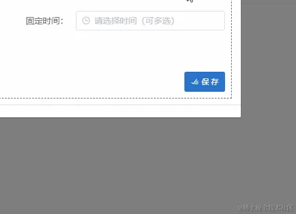

## 背景

因为业务需要，需要对`时间`进行`多选`，然而我们这套系统依旧是vue2版本的，ui框架是 element的，虽然 element-ui里面已经有了`多选日期`的，但是我这个要求的是，`多选时间`的。

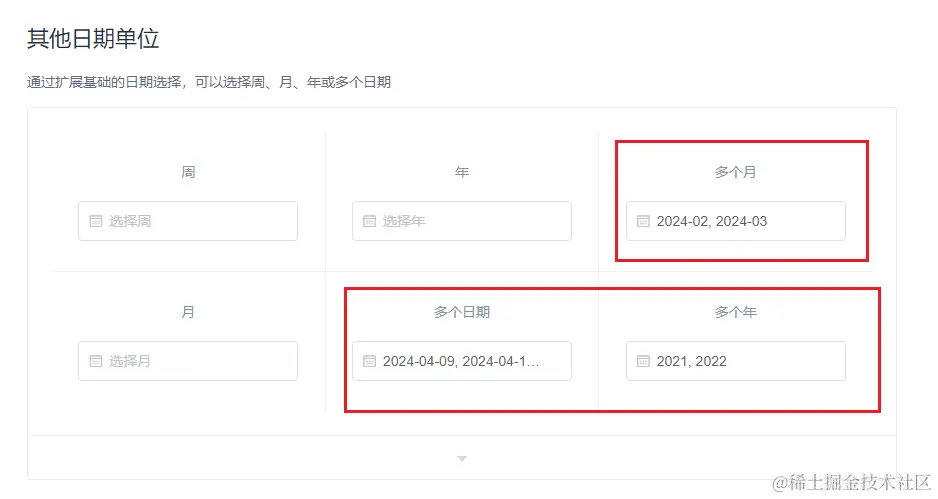

element-plus中也已经有了`多选日期框`，但是我要的是`多选时间`

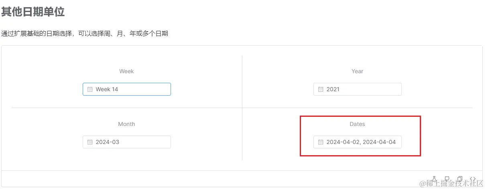

## 开干

既然近水远水都解不了近火，那我就看看有没有其他方法，一番查找下来，也没找到能用的，没办法，只能自己手搓一个。

首先仔细查看需求，发现，当前需求上，只需要多选时间，`注意：是只要多选时间，不是多选日期`，相对简单了一些，不用考虑日期，什么大月，小月，平年，闰年啥的

我可以直接把`小时 和 分钟 直接写死`，就像下面这样

```js
...

data() {
    return {
      ...
      hourList: [
        '00', '01', '02', '03', '04', '05', '06', '07', '08', '09',
        '10', '11', '12', '13', '14', '15', '16', '17', '18', '19',
        '20', '21', '22', '23',
      ],
      minList: [
        '00', '01', '02', '03', '04', '05', '06', '07', '08', '09',
        '10', '11', '12', '13', '14', '15', '16', '17', '18', '19',
        '20', '21', '22', '23', '24', '25', '26', '27', '28', '29',
        '30', '31', '32', '33', '33', '35', '36', '37', '38', '39',
        '40', '41', '42', '43', '44', '45', '46', '47', '48', '49',
        '50', '51', '52', '53', '54', '55', '56', '57', '58', '59',
      ],
      ...
    };
},
...
```

然后展示形式

看了element里面的几种形式，感觉不是想要的

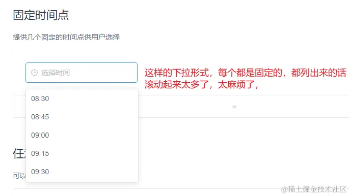

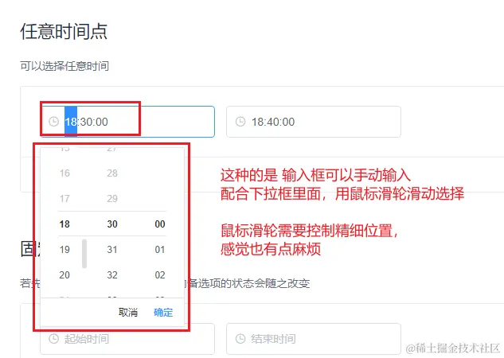

我想要的是，可以鼠标直接点点点，都不用鼠标滑动滚动的，（我个人的想法啊，我觉得客户使用的时候，应该会更加倾向鼠标无脑点点点的那种方式）

然后再找了找，也没看到合适的，最后，就按照自己的想法做了一个鼠标点点点的样子。

## 实现步骤

梳理了下实现步骤，大概步骤如下：

1. 点击时间输入框，时间选择框出现

2. 时间选择框中，只有`时`和`分`, `秒`默认就是`00`, 不要显示，只需要最后调接口的时候，处理下选中的值，添加上`00`，传到后台即可
3. 显示方式，我采用 `上下箭头`，中间是具体数值的方式来选择`时，分`
4. `上下箭头`点击的时候，逻辑处理，`小时`从`23`加1的时候，要变成`00`,分钟从`59`加1的时候，要变成`00`，同时`小时`也要加1，`分钟`从`00`减1的时候，`小时`如果不是刚好是`00`的话，也需要减1，如果`小时`刚好是`00`的话，`小时`就要变成`23`
5. 然后，中间的，`时，分`点击之后，可以出来一个具体详细的`时`，`分`框来选择，不然，一直按`上下箭头`，调到想要的时间，还是太麻烦了
6. 最后，还有一个，鼠标点击到这个多选时间框`区域之外`，就`把时间选择框关掉`,以及如果在弹框打开的状态下，点击了输入框的清空按钮，弹框要消失，输入框内容消失，并取消焦点

因为分钟，之前也是按照 0-60，一个不落的显示出来，结果，内容实在太密了，因此减少了分钟的个数(其实，我在弄小时的时候，就应该想到了，因为小时0-23，共24个元素，已经有些挤了，所以，最后分钟按照每隔5个，处理了下，好多了)

```js
...
data() {
    return {
      ...
      hourList: [
        '00', '01', '02', '03', '04', '05', '06', '07', '08', '09',
        '10', '11', '12', '13', '14', '15', '16', '17', '18', '19',
        '20', '21', '22', '23',
      ],
      minList: [
        '00', '05',
        '10', '15',
        '20', '25',
        '30', '35',
        '40', '45',
        '50', '55',
      ],
      // minList: [
      //   '00', '01', '02', '03', '04', '05', '06', '07', '08', '09',
      //   '10', '11', '12', '13', '14', '15', '16', '17', '18', '19',
      //   '20', '21', '22', '23', '24', '25', '26', '27', '28', '29',
      //   '30', '31', '32', '33', '33', '35', '36', '37', '38', '39',
      //   '40', '41', '42', '43', '44', '45', '46', '47', '48', '49',
      //   '50', '51', '52', '53', '54', '55', '56', '57', '58', '59',
      // ],
      ...
    };
},
...
```

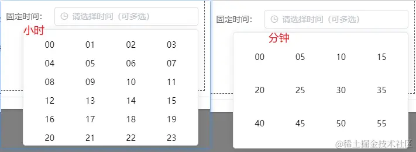

最后 实现得效果如下：


## 部分代码讲解

### 多选时间框`区域之外`，就`把时间选择框关掉`

多选时间框`区域之外`，就`把时间选择框关掉`,以及如果在弹框打开的状态下，点击了输入框的清空按钮，弹框要消失，输入框内容消失，并取消焦点

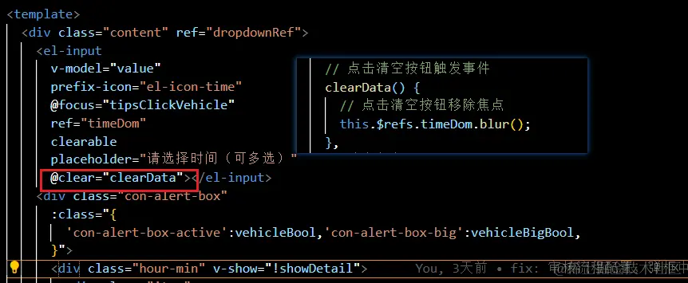

这里应该算是自定义弹框类组件中，经常使用到的小功能了，

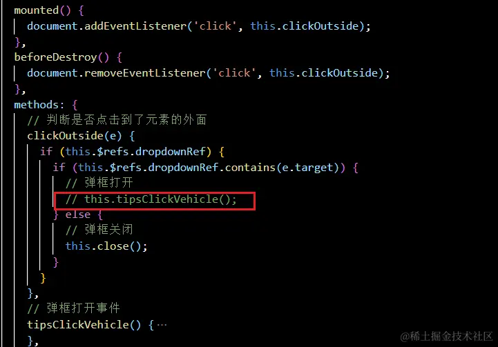

可以看到，弹框打开这里，我弄了一个注释，`弹框打开`被我放到别的地方触发了。

因为，这个小功能，之前放的场景，是没有清空按钮的场景，比如你登录那里的下拉框，你登录之后，在页面的右上方，你鼠标悬停在你的昵称那里，会出现一个下拉框，修改密码，退出登录等等选项，

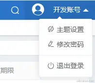

但是，在我们现在的`时间多选框`这里，有了清空的需求，因此做了些调整，详细可以去看我后面贴出的全部代码

这个功能可以单独抽离出来，做成一个hook, 我之前用vue3做了一下，这里贴出来，大家有需要的自取

```js
// hooks（vue3)
// 判断是否点击到了元素的外面
import { ref, onMounted, onUnmounted, Ref } from 'vue'

const useClickOutside = (elementRef: Ref<null | HTMLElement>) => {
  const isClickOutside = ref(false)
  const handler = (e: MouseEvent) => {
    if (elementRef.value) {
      if (elementRef.value.contains(e.target as HTMLElement)) {
        isClickOutside.value = false
      } else {
        isClickOutside.value = true
      }
    }
  }

  onMounted(() => {
    document.addEventListener('click', handler)
  })

  onUnmounted(() => {
    document.removeEventListener('click', handler)
  })
  return isClickOutside
}

export default useClickOutside
```

使用

```vue
<template>
      
  <div class="dropdown" ref="dropdownRef">
            <a
      href="#"
      class="btn btn-outline-light my-2 dropdown-toggle"
      @click.prevent="toggleOpen"
      >{{ title }}</a
    >
            
    <ul class="dropdown-menu" :style="{ display: 'block' }" v-if="isOpen">
                  <slot
      ></slot>
              
    </ul>
        
  </div>
</template>

<script lang="ts">
import { defineComponent, ref, watch } from "vue";
// 引入 hook
import useClickOutside from "../hooks/useClickOutside";
export default defineComponent({
  name: "DropDown",
  props: {
    title: {
      type: String,
      required: true,
    },
  },
  components: {},
  setup() {
    const isOpen = ref(false);
    const toggleOpen = () => {
      isOpen.value = !isOpen.value;
    }; // ----------------------- 使用 hook ------------------------
    const dropdownRef = ref<null | HTMLElement>(null);
    const isClickOutside = useClickOutside(dropdownRef);
    watch(isClickOutside, () => {
      if (isOpen.value && isClickOutside.value) {
        isOpen.value = false;
      }
    }); // ----------------------- 使用 hook ------------------------
    return {
      isOpen,
      toggleOpen,
      dropdownRef,
    };
  },
});
</script>
```

### 上下箭头的点击逻辑

`上下箭头`点击的时候，逻辑处理，`小时`从`23`加1的时候，要变成`00`,分钟从`59`加1的时候，要变成`00`，同时`小时`也要加1，`分钟`从`00`减1的时候，`小时`如果不是刚好是`00`的话，也需要减1，如果`小时`刚好是`00`的话，`小时`就要变成`23`

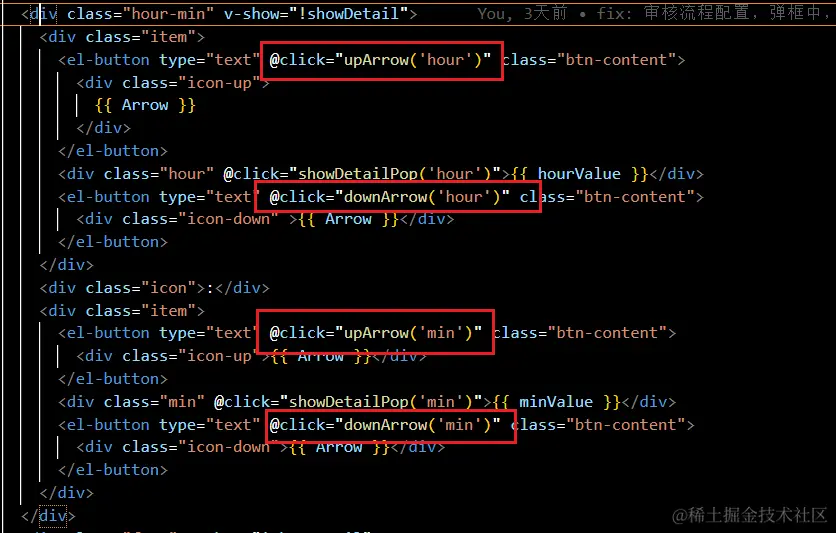

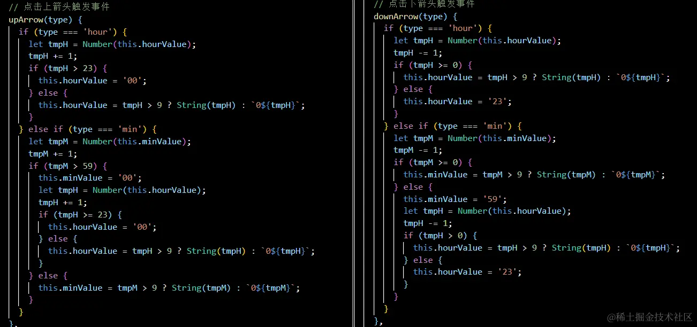

### 传值进来处理，处理完传值出去

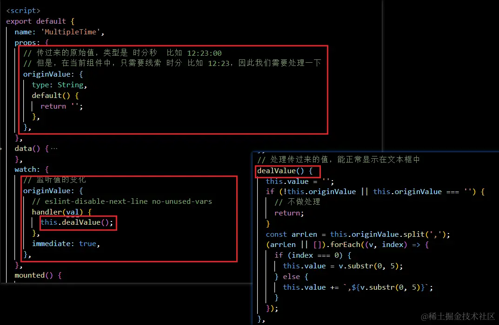

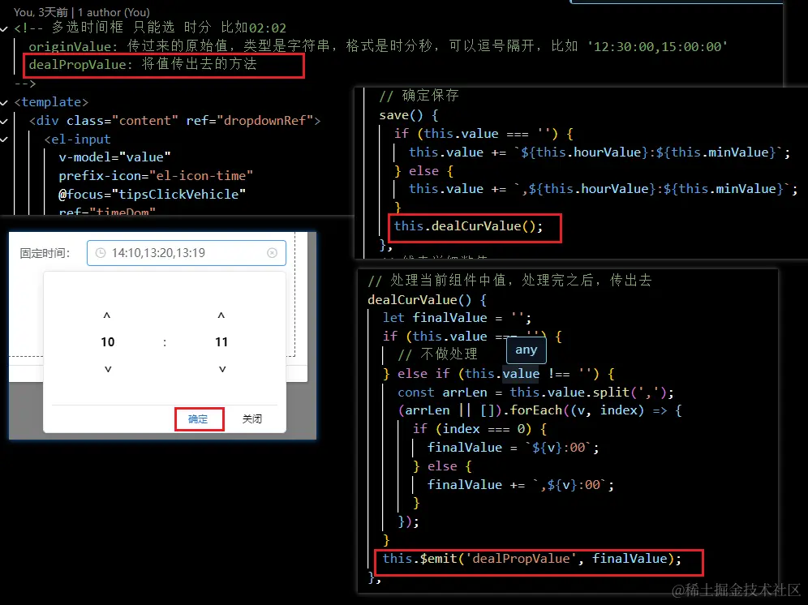

外部调用

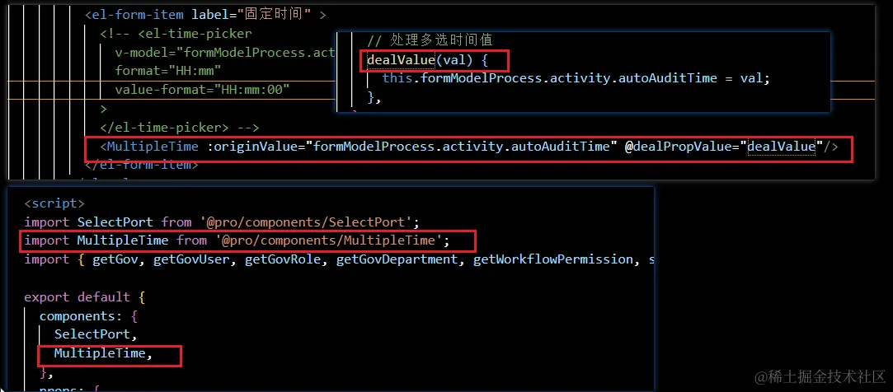

逻辑都写在了组件内部，所以只需要把`原始值`传进去，再把`处理之后的值`传出去即可。

## 全部代码如下

本组件，是基于 element-ui 实现的

```vue
<!-- 多选时间框 只能选 时分 比如02:02
  originValue: 传过来的原始值，类型是字符串，格式是时分秒，可以逗号隔开，比如 '12:30:00,15:00:00'
  dealPropValue: 将值传出去的方法
-->
<template>
  <div class="content" ref="dropdownRef">
    <el-input
      v-model="value"
      prefix-icon="el-icon-time"
      @focus="tipsClickVehicle"
      ref="timeDom"
      clearable
      placeholder="请选择时间（可多选）"
      @clear="clearData"
    ></el-input>
    <div
      class="con-alert-box"
      :class="{
        'con-alert-box-active': vehicleBool,
        'con-alert-box-big': vehicleBigBool,
      }"
    >
      <div class="hour-min" v-show="!showDetail">
        <div class="item">
          <el-button type="text" @click="upArrow('hour')" class="btn-content">
            <div class="icon-up">
              {{ Arrow }}
            </div>
          </el-button>
          <div class="hour" @click="showDetailPop('hour')">{{ hourValue }}</div>
          <el-button type="text" @click="downArrow('hour')" class="btn-content">
            <div class="icon-down">{{ Arrow }}</div>
          </el-button>
        </div>
        <div class="icon">:</div>
        <div class="item">
          <el-button type="text" @click="upArrow('min')" class="btn-content">
            <div class="icon-up">{{ Arrow }}</div>
          </el-button>
          <div class="min" @click="showDetailPop('min')">{{ minValue }}</div>
          <el-button type="text" @click="downArrow('min')" class="btn-content">
            <div class="icon-down">{{ Arrow }}</div>
          </el-button>
        </div>
      </div>
      <div class="foot" v-show="!showDetail">
        <!-- <el-button type="text" @click="close" style="color: black;">
          <span class="btn">取消</span>
        </el-button> -->
        <el-button type="text" @click="save" style="color: #2b73c7;">
          <span class="btn">确定</span>
        </el-button>
        <el-button type="text" @click="close" style="color: black;">
          <span class="btn">关闭</span>
        </el-button>
      </div>
      <div v-show="showDetail">
        <div v-show="showHourDetail" class="detail-hour">
          <div
            class="item"
            v-for="(item, index) in hourList"
            :key="index"
            @click="choseValue('hour', item)"
          >
            {{ item }}
          </div>
        </div>
        <div v-show="showMinDetail" class="detail-min">
          <div
            class="item"
            v-for="(item, index) in minList"
            :key="index"
            @click="choseValue('min', item)"
          >
            {{ item }}
          </div>
        </div>
      </div>
    </div>
  </div>
</template>

<script>
export default {
  name: "MultipleTime",
  props: {
    // 传过来的原始值，类型是 时分秒  比如 12:23:00
    // 但是，在当前组件中，只需要线索 时分 比如 12:23，因此我们需要处理一下
    originValue: {
      type: String,
      default() {
        return "";
      },
    },
  },
  data() {
    return {
      vehicleBool: false, // [ Bool ,  弹框-显示隐藏 ]
      vehicleBigBool: false, // [ Bool ,  弹框放大缩小 ]
      Arrow: "<",
      value: "",
      hourList: [
        "00",
        "01",
        "02",
        "03",
        "04",
        "05",
        "06",
        "07",
        "08",
        "09",
        "10",
        "11",
        "12",
        "13",
        "14",
        "15",
        "16",
        "17",
        "18",
        "19",
        "20",
        "21",
        "22",
        "23",
      ],
      minList: [
        "00",
        "05",
        "10",
        "15",
        "20",
        "25",
        "30",
        "35",
        "40",
        "45",
        "50",
        "55",
      ],
      // minList: [
      //   '00', '01', '02', '03', '04', '05', '06', '07', '08', '09',
      //   '10', '11', '12', '13', '14', '15', '16', '17', '18', '19',
      //   '20', '21', '22', '23', '24', '25', '26', '27', '28', '29',
      //   '30', '31', '32', '33', '33', '35', '36', '37', '38', '39',
      //   '40', '41', '42', '43', '44', '45', '46', '47', '48', '49',
      //   '50', '51', '52', '53', '54', '55', '56', '57', '58', '59',
      // ],
      hourValue: "", // 小时值
      minValue: "", // 分钟值
      showDetail: false, // 展示具体时分数据
      showHourDetail: false, // 展示具体时钟数据
      showMinDetail: false, // 展示具体分钟数据
    };
  },
  watch: {
    // 监听值的变化
    originValue: {
      // eslint-disable-next-line no-unused-vars
      handler(val) {
        this.dealValue();
      },
      immediate: true,
    },
  },
  mounted() {
    document.addEventListener("click", this.clickOutside);
  },
  beforeDestroy() {
    document.removeEventListener("click", this.clickOutside);
  },
  methods: {
    // 判断是否点击到了元素的外面
    clickOutside(e) {
      if (this.$refs.dropdownRef) {
        if (this.$refs.dropdownRef.contains(e.target)) {
          // 弹框打开
          // this.tipsClickVehicle();
        } else {
          // 弹框关闭
          this.close();
        }
      }
    },
    // 弹框打开事件
    tipsClickVehicle() {
      this.vehicleBool = true;
      const tmpH = new Date().getHours();
      this.hourValue = tmpH > 9 ? String(tmpH) : `0${tmpH}`;
      const tmpM = new Date().getMinutes();
      this.minValue = tmpM > 9 ? String(tmpM) : `0${tmpM}`;
    },
    // 弹框关闭事件
    vehicleClose() {
      // this.vehicleBool = false;
      // this.vehicleBigBool = false;
    },
    close() {
      this.vehicleBool = false;
      this.vehicleBigBool = false;
      this.showDetail = false;
      this.showHourDetail = false;
      this.showMinDetail = false;
    },
    // 点击清空按钮触发事件
    clearData() {
      // 点击清空按钮移除焦点
      this.$refs.timeDom.blur();
    },
    // 确定保存
    save() {
      if (this.value === "") {
        this.value += `${this.hourValue}:${this.minValue}`;
      } else {
        this.value += `,${this.hourValue}:${this.minValue}`;
      }
      this.dealCurValue();
    },
    // 显示详细数值
    showDetailPop(type) {
      this.showDetail = true;
      if (type === "hour") {
        this.showMinDetail = false;
        this.showHourDetail = true;
      } else if (type === "min") {
        this.showHourDetail = false;
        this.showMinDetail = true;
      }
    },
    // 点击上箭头触发事件
    upArrow(type) {
      if (type === "hour") {
        let tmpH = Number(this.hourValue);
        tmpH += 1;
        if (tmpH > 23) {
          this.hourValue = "00";
        } else {
          this.hourValue = tmpH > 9 ? String(tmpH) : `0${tmpH}`;
        }
      } else if (type === "min") {
        let tmpM = Number(this.minValue);
        tmpM += 1;
        if (tmpM > 59) {
          this.minValue = "00";
          let tmpH = Number(this.hourValue);
          tmpH += 1;
          if (tmpH >= 23) {
            this.hourValue = "00";
          } else {
            this.hourValue = tmpH > 9 ? String(tmpH) : `0${tmpH}`;
          }
        } else {
          this.minValue = tmpM > 9 ? String(tmpM) : `0${tmpM}`;
        }
      }
    },
    // 点击下箭头触发事件
    downArrow(type) {
      if (type === "hour") {
        let tmpH = Number(this.hourValue);
        tmpH -= 1;
        if (tmpH >= 0) {
          this.hourValue = tmpH > 9 ? String(tmpH) : `0${tmpH}`;
        } else {
          this.hourValue = "23";
        }
      } else if (type === "min") {
        let tmpM = Number(this.minValue);
        tmpM -= 1;
        if (tmpM >= 0) {
          this.minValue = tmpM > 9 ? String(tmpM) : `0${tmpM}`;
        } else {
          this.minValue = "59";
          let tmpH = Number(this.hourValue);
          tmpH -= 1;
          if (tmpH > 0) {
            this.hourValue = tmpH > 9 ? String(tmpH) : `0${tmpH}`;
          } else {
            this.hourValue = "23";
          }
        }
      }
    },
    // 选择具体值
    choseValue(type, val) {
      if (type === "hour") {
        this.hourValue = val;
        this.showHourDetail = false;
      } else if (type === "min") {
        this.minValue = val;
        this.showMinDetail = false;
      }
      this.showDetail = false;
    },
    // 处理传过来的值，能正常显示在文本框中
    dealValue() {
      this.value = "";
      if (!this.originValue || this.originValue === "") {
        // 不做处理
        return;
      }
      const arrLen = this.originValue.split(",");
      (arrLen || []).forEach((v, index) => {
        if (index === 0) {
          this.value = v.substr(0, 5);
        } else {
          this.value += `,${v.substr(0, 5)}`;
        }
      });
    },
    // 处理当前组件中值，处理完之后，传出去
    dealCurValue() {
      let finalValue = "";
      if (this.value === "") {
        // 不做处理
      } else if (this.value !== "") {
        const arrLen = this.value.split(",");
        (arrLen || []).forEach((v, index) => {
          if (index === 0) {
            finalValue = `${v}:00`;
          } else {
            finalValue += `,${v}:00`;
          }
        });
      }
      this.$emit("dealPropValue", finalValue);
    },
  },
};
</script>

<style lang="scss" scoped>
.content {
  position: relative;
}
.con-alert-box {
  color: black;
  position: absolute;
  right: 0px;
  margin-top: 6px;
  z-index: 99998;
  background-color: white;
  border-radius: 5px;
  width: 0px;
  max-height: 0;
  border-top: 1.5px solid #56ffff;
  box-shadow: 0px 0 5px 0.5px #56ffff;
  // transition: padding 0.3s, width 0.5s 1s, max-height 0.5s, border 0.3s,
  //   box-shadow 0.3s 0.3s;
  // -moz-transition: padding 0.3s, width 0.5s 1s, max-height 0.5s, border 0.3s,
  //   box-shadow 0.3s 0.3s;
  // -webkit-transition: padding 0.3s, width 0.5s 1s, max-height 0.5s, border 0.3s,
  //   box-shadow 0.3s 0.3s;
  // -o-transition: padding 0.3s, width 0.5s 1s, max-height 0.5s, border 0.3s,
  //   box-shadow 0.3s 0.3s;
  padding: 0 0;
  overflow: hidden;
  box-sizing: border-box;
}
.con-alert-box-active {
  width: 300px;
  height: 200px;
  // transition: max-height 0.5s 1s, width 0.8s, border 0.3s 1.3s,
  //   box-shadow 0.3s 1s, padding 0.3s 1.3s;
  // -moz-transition: max-height 0.5s 1s, width 0.8s, border 0.3s 1.3s,
  //   box-shadow 0.3s 1s, padding 0.3s 1.3s;
  // -webkit-transition: max-height 0.5s 1s, width 0.8s, border 0.3s 1.3s,
  //   box-shadow 0.3s 1s, padding 0.3s 1.3s;
  // -o-transition: max-height 0.5s 1s, width 0.8s, border 0.3s 1.3s,
  //   box-shadow 0.3s 1s, padding 0.3s 1.3s;
  padding: 10px 10px;
  max-height: 75vh;
  border-top-width: 0px;
  border: 1px solid #e4e7ed;
  box-shadow: 0 2px 12px 0 rgba(0, 0, 0, 0.1);
}
.con-alert-box-big {
  width: 40%;
}
.hour-min {
  display: flex;
  justify-content: center;
  align-items: center;
  height: 154px;
  .item {
    width: 145px;
    text-align: center;
    font-weight: bold;
    .btn-content {
      font-weight: bold;
      color: black;
      font-size: 15px;
    }
    .icon-up {
      transform: rotate(90deg);
    }
    .icon-down {
      transform: rotate(-90deg);
    }
    .hour {
      cursor: pointer;
    }
    .min {
      cursor: pointer;
    }
  }
}
.foot {
  border-top: 1px solid #e4e7ed;
  text-align: right;
  .btn {
    display: inline-block;
    width: 30px;
    margin-right: 5px;
    cursor: pointer;
  }
}
.detail-hour {
  width: 100%;
  height: 100%;
  .item {
    width: 25%;
    text-align: center;
    height: 20px;
    display: inline-block;
    cursor: pointer;
  }
  .item:hover {
    color: #66b1ff;
  }
}
.detail-min {
  width: 100%;
  height: 100%;
  .item {
    // width: 10%;
    width: 25%;
    text-align: center;
    height: 57px;
    line-height: 64px;
    display: inline-block;
    cursor: pointer;
  }
  .item:hover {
    color: #66b1ff;
  }
}
</style>
```
