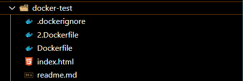

### 常用命令

#### 1. 根据 dockerfile 文件 生成镜像



```sh
# 根据这个 dockerfile 来生成镜像 (dockerfile文件，默认名称是 Dockerfile ，生成镜像的时候不用在具体到文件名)
docker build -t aaa:ccc .

# aaa 是镜像名，ccc 是镜像的标签
```

```sh
# 换个dockerfile 来生成镜像（现在以  2.Dockerfile 这个文件来生成镜像）
docker build -t aaa:ddd -f 2.Dockerfile .

# 因为现在不是默认的 Dockerfile 了，需要用 -f 指定下 dockefile 的文件名
```

#### 2. docker run 命令 将镜像生成容器

- docker run 这个镜像就可以生成容器，指定映射的端口、挂载的数据卷、环境变量等

- VOLUME 指令看起来没啥用，但能保证你容器内某个目录下的数据一定会被持久化，能保证没挂载数据卷的时候，数据不丢失。

- 我们点击 pull 按钮，就相当于执行了 docker pull：

```sh
docker pull nginx:latest
```

- 在可视化页面上填了个表单，我们点击 run 按钮，就相当于执行了 docker run：

```sh
docker run --name nginx-test -p 80:80 -v /tmp/aaa:/usr/share/nginx/html -e KEY1=VALUE1 -d nginx:latest

-p 是端口映射

-v 是指定数据卷挂载目录

-e 是指定环境变量

-d 是后台运行

# 跑镜像 生成 容器
docker run -p 3000:3000 -v /aaa:/bbb/ccc --name xxx-container xxx-image
```

#### 3. 在可视化页面的 容器的 terminal 里执行命令，对应的是 docker exec 命令：

ps. 这里的可视化页面，指的是 docker desktop 这个客户端软件

#### 4. 容器操作

```sh
docker start：启动一个已经停止的容器
docker rm：删除一个容器
docker stop：停止一个容器
```

#### 5. .dockerignore 语法

\*.md 就是忽略所有 md 结尾的文件，然后 !README.md 就是其中不包括 README.md

node_modules/ 就是忽略 node_modules 下 的所有文件

[a-c].txt 是忽略 a.txt、b.txt、c.txt 这三个文件

.DS_Store 是 mac 的用于指定目录的图标、背景、字体大小的配置文件，这个一般都要忽略

eslint、prettier 的配置文件在构建镜像的时候也用不到

### Docker 实现原理的三大基础技术

Namespace 实现各种资源的隔离
Control Group 实现容器进程的资源访问限制
UnionFS 做文件系统，实现容器文件系统的分层存储，镜像合并

---

举例：以hexo博客为例

1. 生成镜像

```sh
docker build -t hexo:aaa
```

2. 将镜像跑起来，得到容器

```sh
docker run -d -p 80:80 -v /z-docker/public:/usr/share/nginx/html/ --name hexo-container hexo:aaa
```

3. 基本docker指令

```sh
# 停止运行容器 docker stop<容器ID或容器名>
docker stop hexo-container

# 移除容器 docker rm <容器ID或容器名>\
docker rm hexo-container

# 查看当前容器
docker container ls -a

docker run # 会返回一个容器的 hash：

# 查看运行中的容器
docker ps

# 查看所有的容器
docker ps -a

# 查看 image 镜像列表
docker images

```
