官网：https://www.docker.com/

双击 安装包
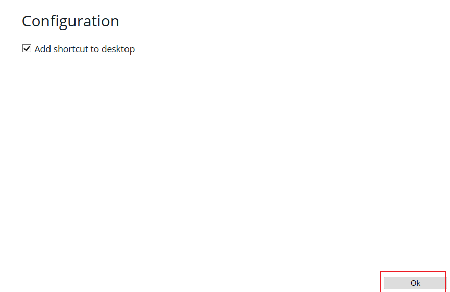
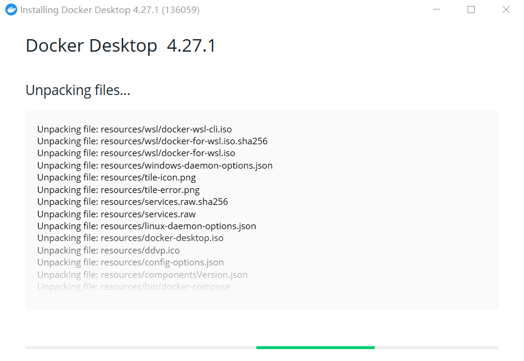
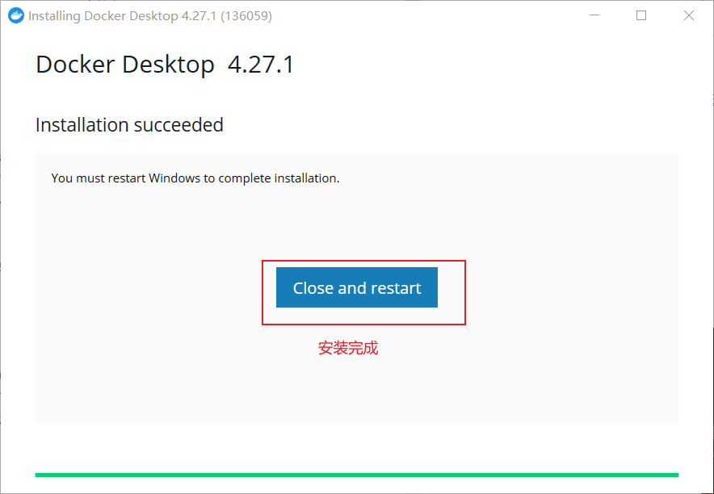

点了close之后，docker desktop 就直接关闭了，所以还是点 accept
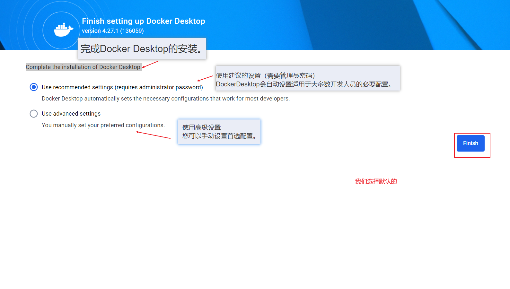

然后注册docker账号
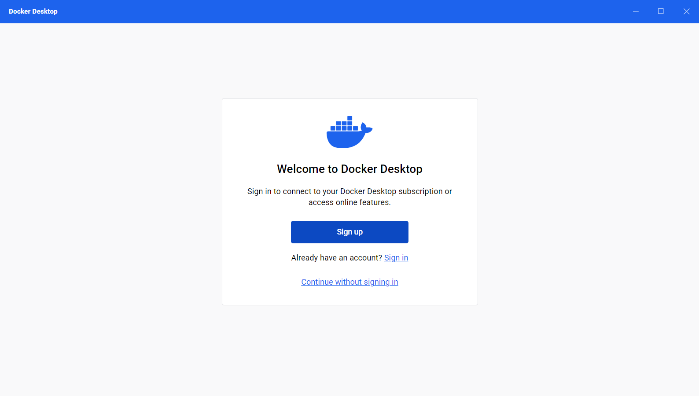

报错
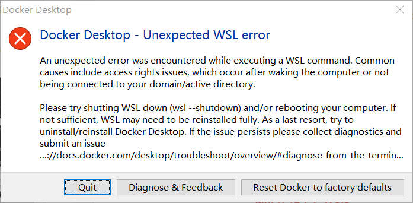

要升级 wsl
用管理员权限打开 cmd, 输入 wsl --update （我当时是为了注册docker账号 开着科学上网，注册完了也没关闭科学上网，所以不清楚 这个wsl 升级要不要翻墙）
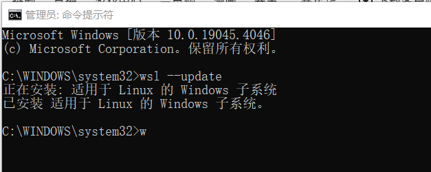
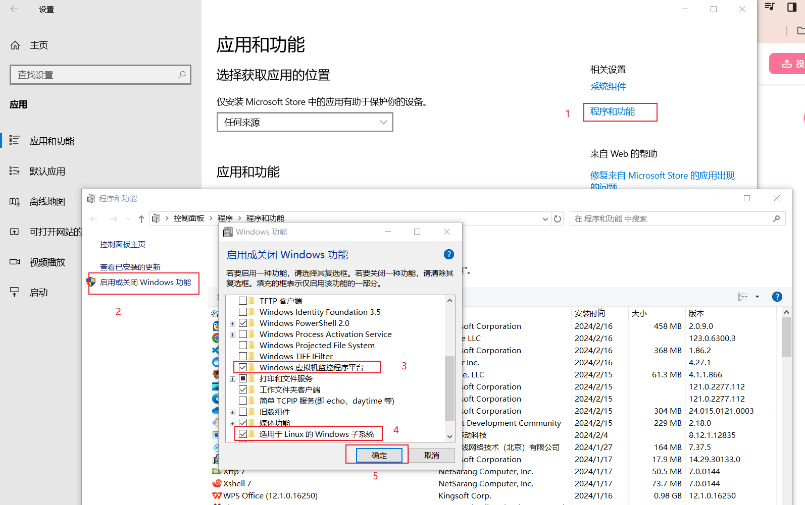
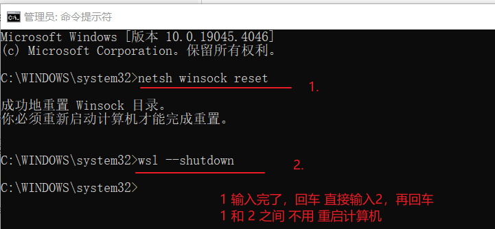

升级wsl的参考链接：https://www.bilibili.com/video/BV1G34y1V7YD/?spm_id_from=333.337.search-card.all.click&vd_source=342e5c8d91f6ac5b453d6e8b23bf5998

（1）wsl --update 先用管理员运行CMD执行wsl --update更新你的WSL 更新完后使用wsl --shutdown重启一下  
（2） 在【启用或关闭 Windows 功能】进行勾选 适用于 Linux 的 Windows 子系统 Windows 虚拟机监控程序平台 点击确定后，重启计算机系统  
（3）netsh winsock reset 管理员运行CMD执行netsh winsock reset 运行完后记得使用wsl --shutdown重启一下，不需要重启计算机

这样就成了：
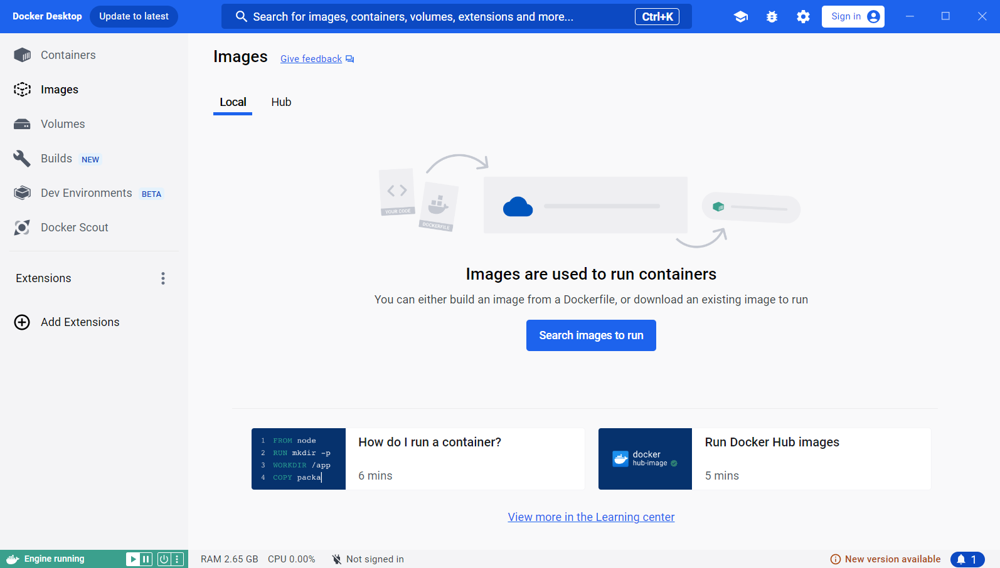

我们也可以直接点跳过这次登录

我就先不登录了，我们打开 cmd 窗口，输入 docker -h 跳出如下命令，就说明安装成功了
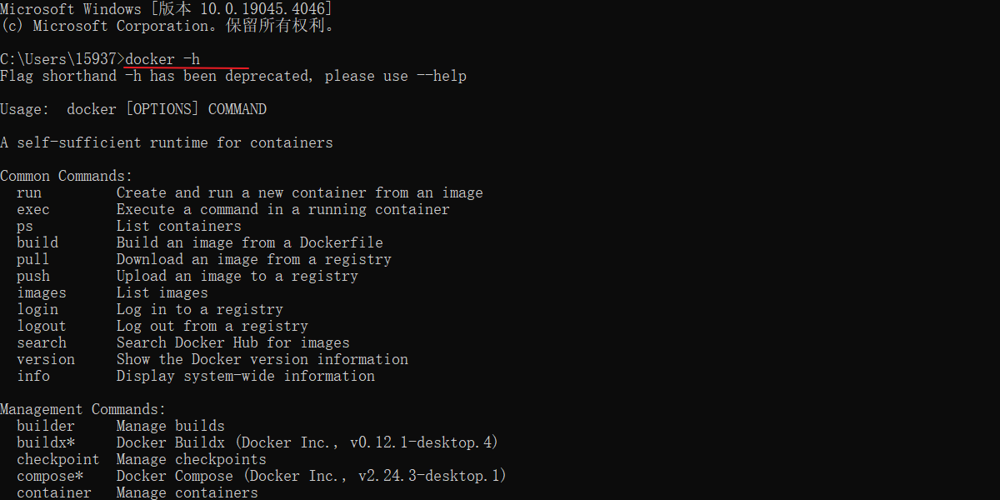
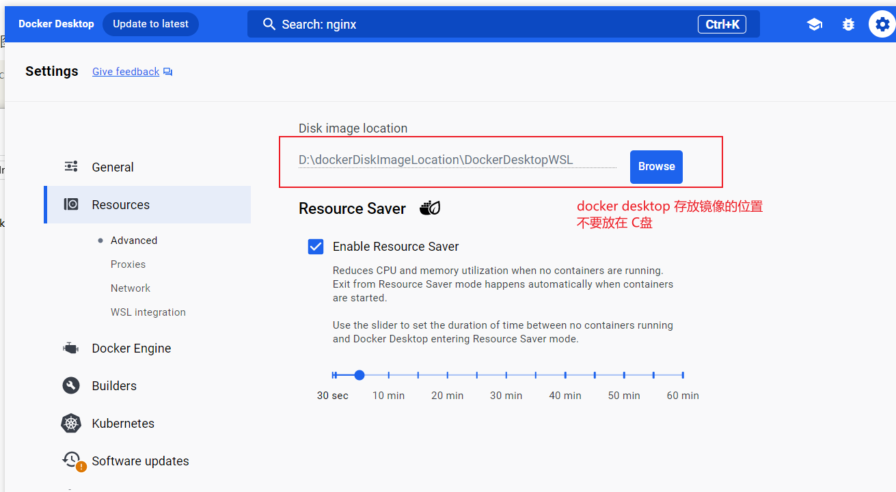

docker 安装镜像慢，设置其他的源
步骤1：
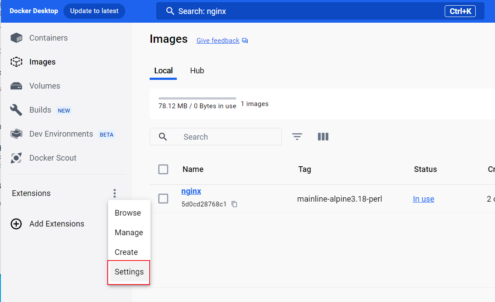

步骤2：
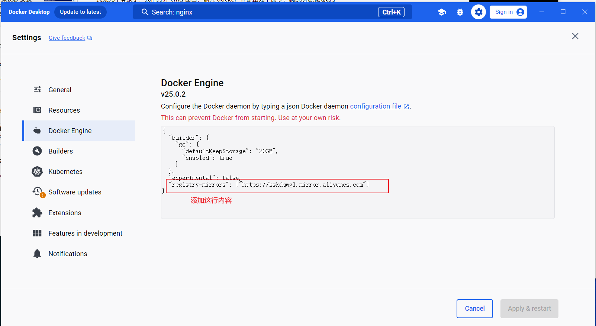
