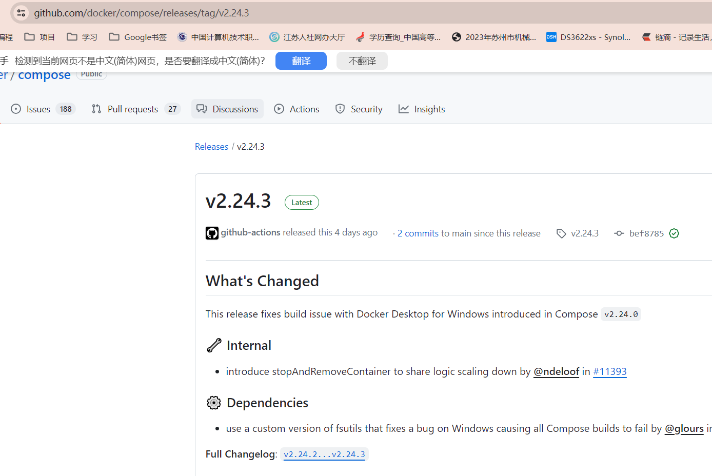
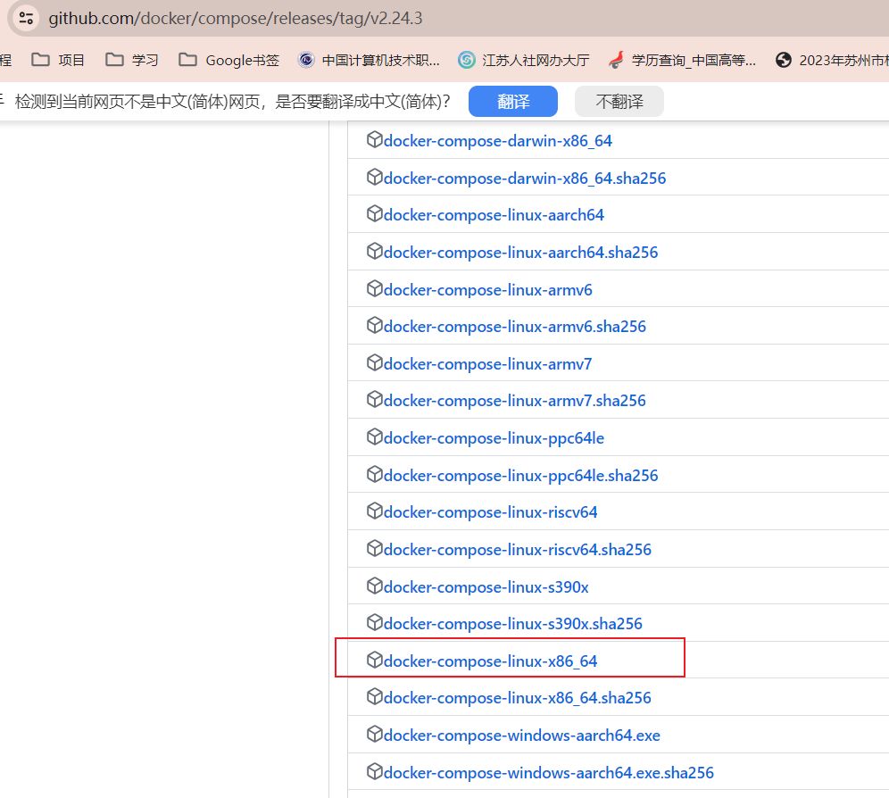
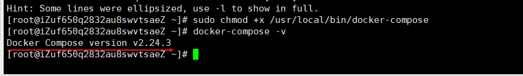

### docker-compose 安装有3中方式

1. 方法1 安装官方的方式安装
2. 方法2 通过pip进行安装
3. 方法3 离线安装

本人是直接使用链接中的 方案3 直接成功的，

因为方法1 需要直接从 github上获取，阿里云服务器，总是超时，不像你本地电脑连github，超时的话，你还可以科学上网一下试试

方案2需要 额外安装 pip 相关，我想省事，嫌麻烦

### 方法3安装

方案3： 从 https://github.com/docker/compose/releases 找到最新版本，点进去



下载到本地， 将docker-compose-Linux-x86_64重命名为docker-compose
使用 xftp 上传到服务器上 的/usr/local/bin/目录下

输入以下命令 添加可执行权限和查看docker compose版本

```sh
# 添加可执行权限
sudo chmod +x /usr/local/bin/docker-compose
# 查看docker-compose版本
docker-compose -v
```



### 参考链接

1. https://blog.csdn.net/qq_26400011/article/details/113856681
2. https://blog.csdn.net/ytangdigl/article/details/103831739
