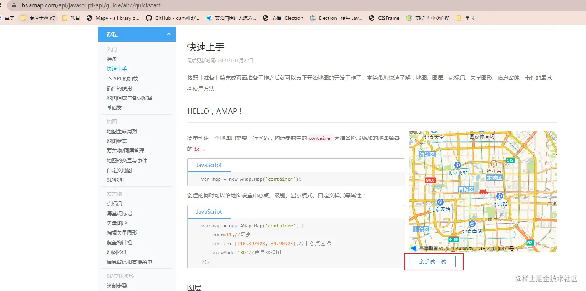
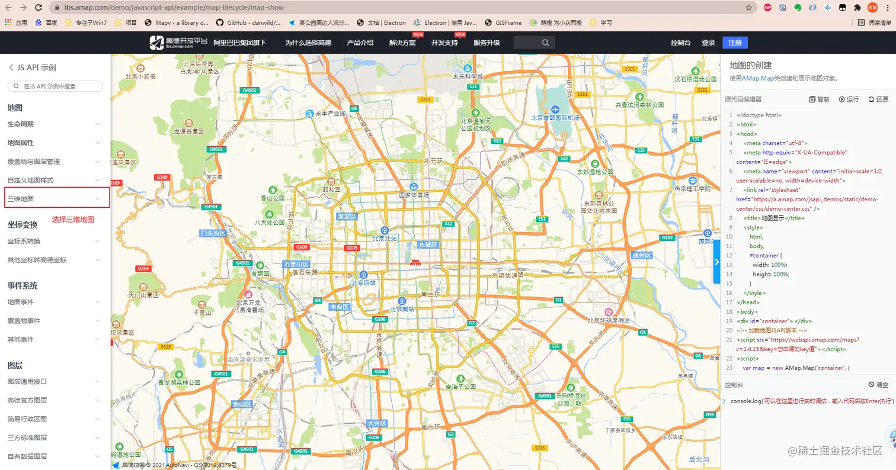
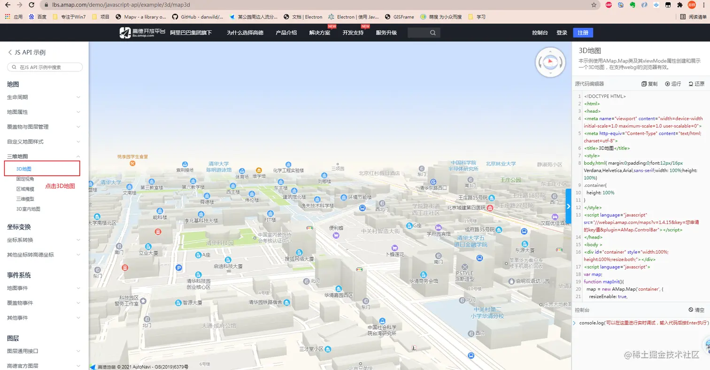
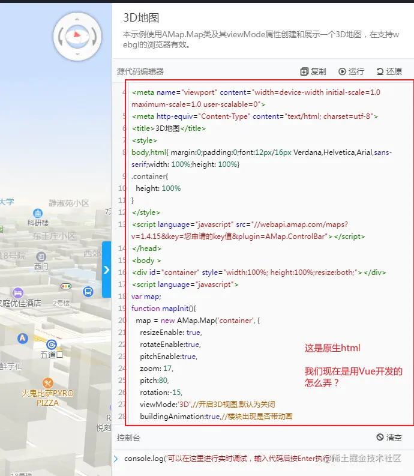
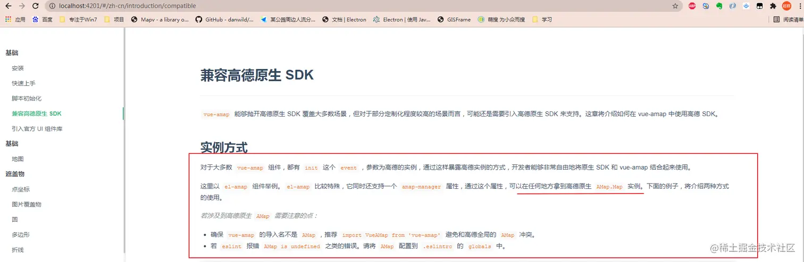
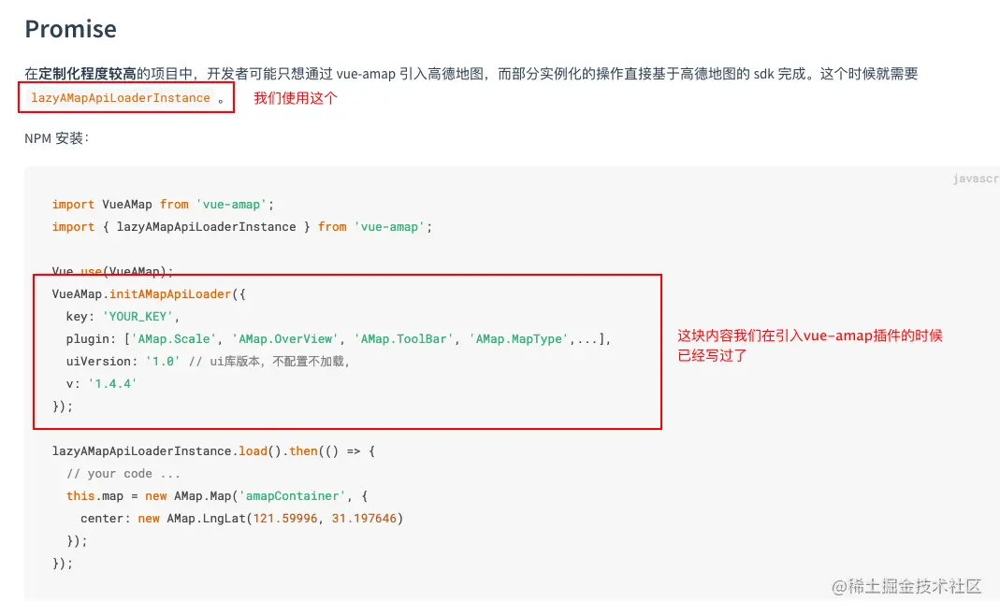
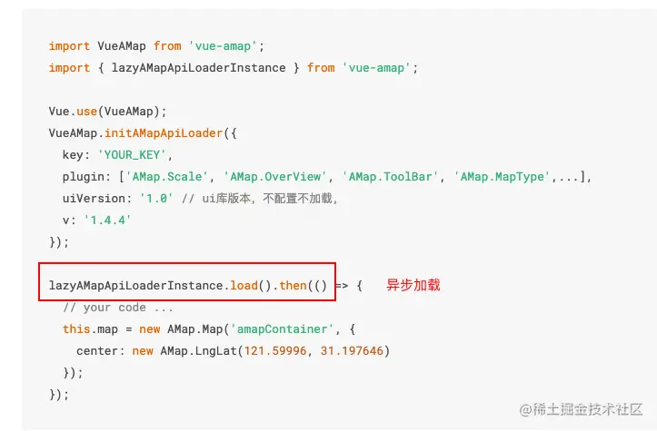
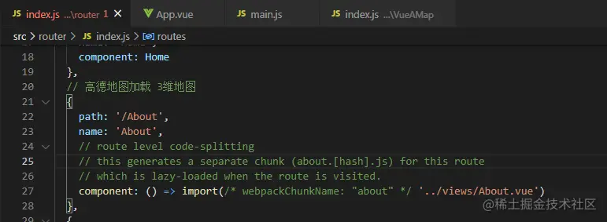
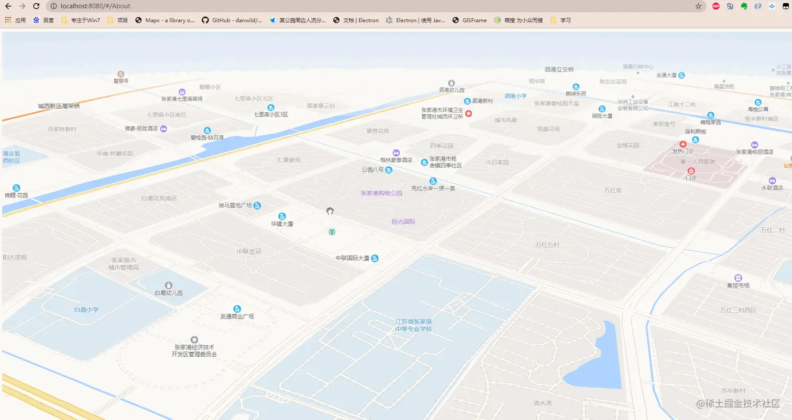

## 前言

<!--more-->

佛祖保佑， 永无`bug`。Hello 大家好！我是海的对岸！

因我司在尝试`三维地图`方面的摸索，所以，我这边尝试下用`高德地图加载三维地图`，特此记录一下

## 开干，解决过程

因为我是`vue`开发

首先，需要引入`vue-amap`，`Vue`引入`vue-amap`，看这边，[传送门](https://juejin.cn/post/7020064317852614687)

上篇讲到，`vue-amap文档显示不全`，需要把`vue-amap的文档下载下来，本地跑起来看`，怎么本地跑`vue-amp文档`，看我上一篇写的`vue-amap 官方文档显示不全【解决】`

### 步骤1

还需要用到`高德地图开发者平台`上的`高德地图文档`，[传送门](https://lbs.amap.com/api/javascript-api/guide/abc/quickstart)

我们打开高德在线调试界面









### 步骤2

再看`vue-amap`



看到这里，你会发现，图例让你使用`vue-amap`的时候，避免使用`AMap`这个名字，因为这个名字是`原生高德SDK`的，说明`AMap`这个在`vue项目`里面，已经是存在的了

因为我们开发，定制化可能会比较多，使用上会更加`贴近原生高德SDK`。



由于地图实例是异步加载的，当使用地图的页面开始加载地图的时候地图还没完成初始化，会造成获取不到地图实例



## 直接上代码

```js
<template>
  <div class="amap-page-container">
    <div id="amap-demo1" class="amap-demo">
    </div>
  </div>
</template>

<script>
  // NPM 方式
  import { lazyAMapApiLoaderInstance } from 'vue-amap';

  const loadPromise = lazyAMapApiLoaderInstance.load();

  export default {
    data() {
      return {
        map: null
      }
    },
    methods: {
      initMap() {
        loadPromise.then(() => {
          console.log('-----');
          this.map = new AMap.Map('amap-demo1', {
            center: [120.55538, 31.87532], // 以张家港为例
            zoom: 12,
            resizeEnable: true,
            rotateEnable:true,
            pitchEnable:true,
            pitch:80,
            rotation:-15,
            viewMode:'3D',//开启3D视图,默认为关闭
            buildingAnimation:true,//楼块出现是否带动画

            expandZoomRange:true,
            zooms:[3,20],
          });
        });
      }
    },
    mounted() {
      this.initMap();
    },
  }
</script>

<style scoped>
  .amap-demo {
    height: 98vh;
    width: 100%;
    resize:both;
  }
</style>

```

路由里配置下



### 效果如下


