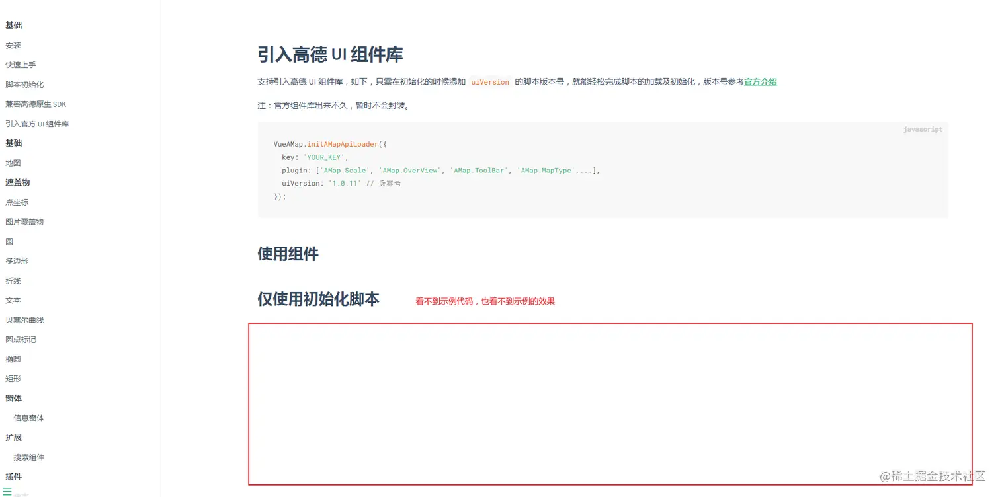
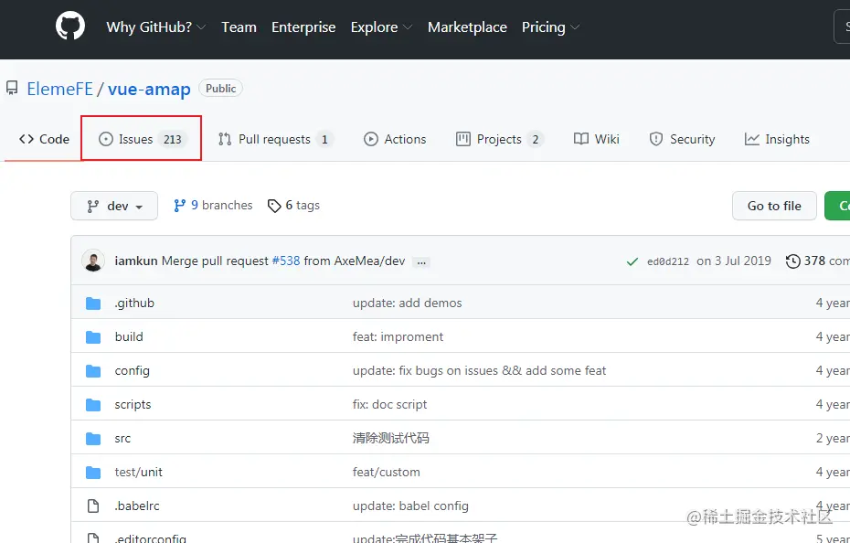
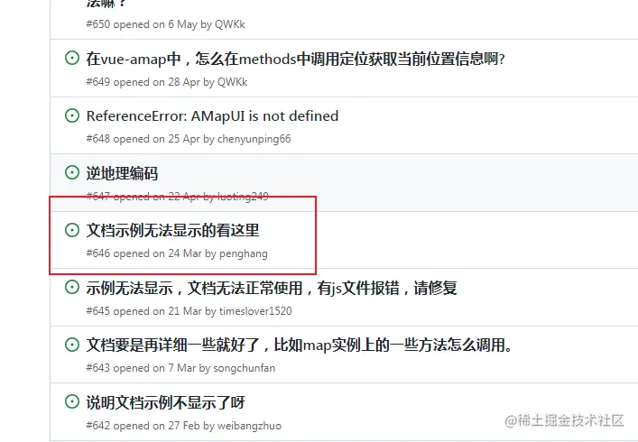
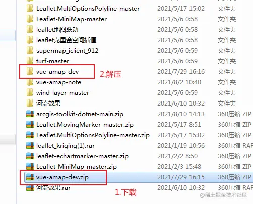
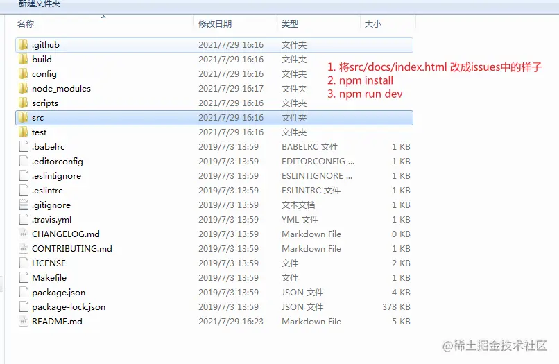
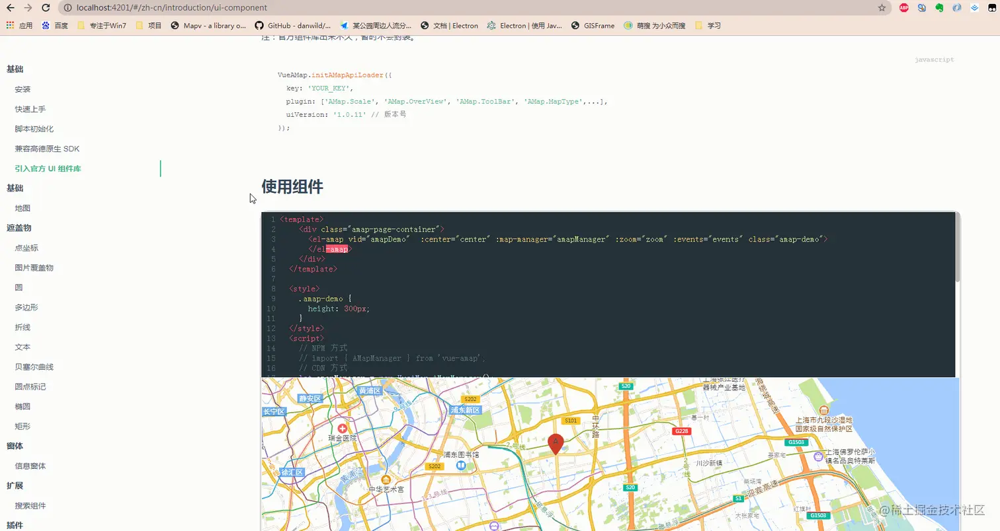

## 前言

<!--more-->

佛祖保佑， 永无`bug`。Hello 大家好！我是海的对岸！

这次的起因是，我司打算往`三维GIS`方向探索，因此让我来查(上)询(网)资(百)料(度)

我记得以前查资料的时候，看到`高德地图`是有`3d`功能的，那么这次就试试

因为是基于`Vue`开发，所以打开[vue-amap官方文档](https://elemefe.github.io/vue-amap/#/)

点击`文档`,看看文档给的`示例代码`，but

（`示例代码是空白，也看不到例子的效果`）

明显感觉不对劲

## 解决方法

作为一个日常和bug打交道的程序员，每天都在解决bug和制造bug中度过，我这种情况，我肯定不是第一个碰到这种示例代码空白的人，对吧，这很合理

### 打开github

### 进入issues

来看看，有没有解决方法

点进去，发现，确实有这个问题，但是没有说怎么解决这个问题，那么继续往下翻翻

这个好像有点靠谱，我们点进去看看

### 本地跑下vue-amap文档

没问题了

