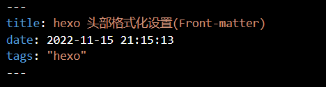

#### 前言

Front-matter 是文件最上方以 --- 分隔的区域，用于指定个别文件的变量，举例来说：

- 以下是预先定义的参数，您可在模板中使用这些参数值并加以利用。

| 参数              | 描述                                                                                                                                                 | 默认值                                                                                 |
| ----------------- | ---------------------------------------------------------------------------------------------------------------------------------------------------- | -------------------------------------------------------------------------------------- |
| `layout`          | 布局                                                                                                                                                 | [`config.default_layout`](https://hexo.io/zh-cn/docs/configuration#%E6%96%87%E7%AB%A0) |
| `title`           | 标题                                                                                                                                                 | 文章的文件名                                                                           |
| `date`            | 建立日期                                                                                                                                             | 文件建立日期                                                                           |
| `updated`         | 更新日期                                                                                                                                             | 文件更新日期                                                                           |
| `comments`        | 开启文章的评论功能                                                                                                                                   | `true`                                                                                 |
| `tags`            | 标签（不适用于分页）                                                                                                                                 |                                                                                        |
| `categories`      | 分类（不适用于分页）                                                                                                                                 |                                                                                        |
| `permalink`       | 覆盖文章的永久链接，永久链接应该以 `/` 或 `.html` 结尾                                                                                               | `null`                                                                                 |
| `excerpt`         | 纯文本的页面摘要。使用 [该插件](https://hexo.io/zh-cn/docs/tag-plugins#%E6%96%87%E7%AB%A0%E6%91%98%E8%A6%81%E5%92%8C%E6%88%AA%E6%96%AD) 来格式化文本 |                                                                                        |
| `disableNunjucks` | 启用时禁用 Nunjucks 标签 `{{ }}`/`` 和 [标签插件](https://hexo.io/zh-cn/docs/tag-plugins) 的渲染功能                                            | false                                                                                  |
| `lang`            | 设置语言以覆盖 [自动检测](https://hexo.io/zh-cn/docs/internationalization#%E8%B7%AF%E5%BE%84)                                                        | 继承自 `_config.yml`                                                                   |
| `published`       | 文章是否发布                                                                                                                                         | 对于 `_posts` 下的文章为 `true`，对于 `_draft` 下的文章为 `false`                      |

#### 参考文章

[hexo官网之【front-matter】](https://hexo.io/zh-cn/docs/front-matter)
