## 前言

作为程序员，基本上都希望有一个自己的博客，记录自己学习过程中的点点滴滴

实现博客的方法也很多，有的人是自己手把手实现一个博客出来，有的是使用一些现成的博客框架，我这里，就用现成的博客框架Hexo来给自己搭建一个博客

[ Hexo官网](https://hexo.io/zh-cn/docs/)

本节内容教你 新建一个 hexo博客

## 简单介绍下 hexo

### 什么是Hexo

Hexo 是一个快速、简洁且高效的博客框架。Hexo 使用 Markdown（或其他渲染引擎）解析文章，在几秒内，即可利用靓丽的主题生成静态网页。此处附上[Hexo中文官网](https://link.juejin.cn/?target=https%3A%2F%2Fhexo.io%2Fzh-cn%2Fdocs%2F "https://hexo.io/zh-cn/docs/")。下面我们详细介绍搭建步骤。

## 开始

我们先把hexo的博客项目创建出来，跑起来看看，先把关联到github先放放，先跑起来再说

### 使用hexo前提

Hexo是基于Node环境的静态博客，npm工具是必不可少的。

- [下载地址](https://nodejs.org/en/)
- 安装步骤：基本操作，这里就不赘述了。
- 确认成功：执行`node -v`，控制台打印出对应Node版本就说明安装成功了。

### 开干

先全局安装 hexo

```js
npm install -g hexo-cli
因为 npm 速度实在太慢，还是推荐用 cnpm
cnpm install -g hexo-cli
```

安装结束之后，查看下 hexo的版本

```js
hexo - v;
```

出现下面这张图就说明，你的 hexo 安装成功了

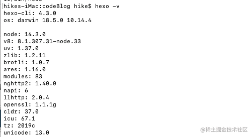

新建一个文件夹`hexo`

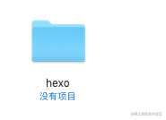

然后进入这个文件夹，这个文件夹我打算专门放博客网站，但是我以后可能会不止弄一个博客网站，那我就在这个文件夹内，再创个文件夹`codeBolg`，表示这是个放和代码相关的博客网站。

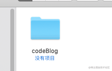

打开终端， 先输入 cd + 空格，再把这个空文件夹拖到终端上去，接着回车

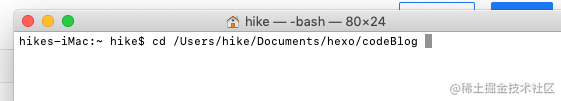

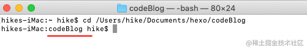

这样，就在终端进入到`codeBlog`文件夹了

然后输入 hexo init

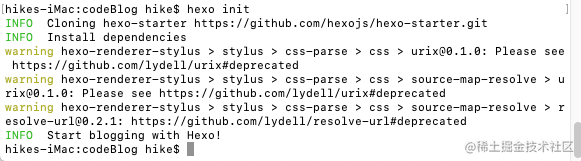

网站就已经生成出来了

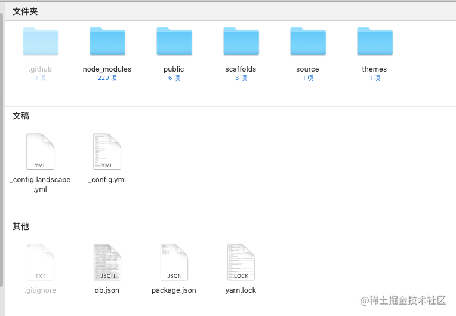

再在这个网站的目录下执行

```js
hexo clean
hexo generate
hexo server
```

上面截图中的 `public` 就是我执行三段命令之后生成出来的，部署网站，也只是把public里面的内容部署到服务器即可

我用的`vscode`编辑器，默认博客项目跑起来是在4000端口下

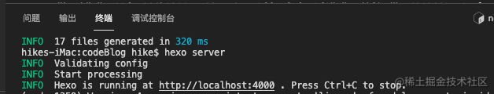

我们访问下看看

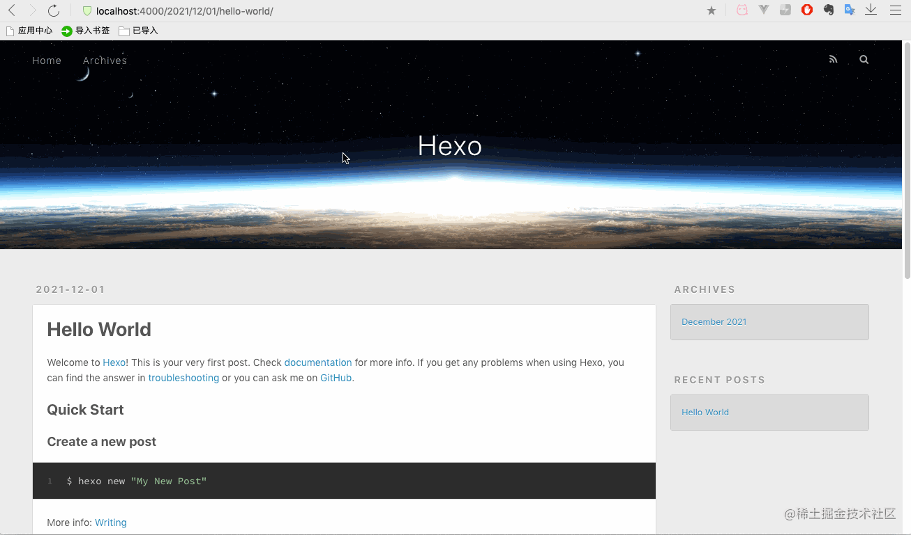

## 写文章

怎么写博客？

- 新建文章：`hexo new '文章名'`，然后在blog的source文件夹就可以看到了。
- 写内容：支持markdown语法，所以我自己现在是用掘金自带的markdown编辑器写完后把文章复制过来的，完美兼容~

比如现在的这篇博客我要写在 hexo上
那我就

```js
hexo new '手把手带你创建hexo博客'
```

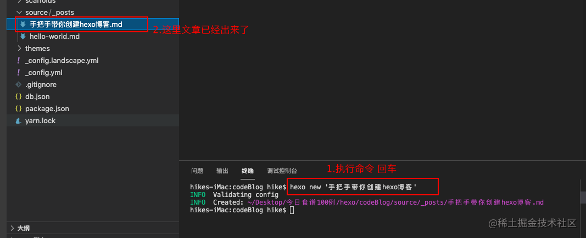

我们再看看4000端口

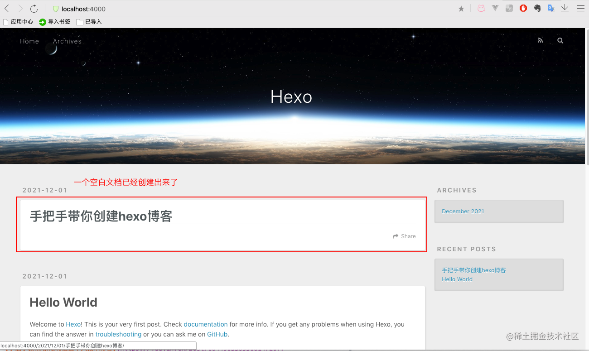

## 参考文章

1. [手把手教你用Hexo搭建个人技术博客](https://juejin.cn/post/6844903585508147207)

感觉还不错的hexo主题，后面可以尝试改改看看

1. https://shoka.lostyu.me/about/
2. https://autoload.github.io/
3. https://huaji8.top/
4. https://kyori.xyz/
5. https://www.tangyuxian.com/
6. https://nexmoe.com/
7. http://fuchenchenle.cn/
