## 前言

刚刚把 hexo 博客搭建出来，原来样式太丑，给它换一个新的主题，之前没用过hexo，更别说设置主题了，这次就先用next主题练练手，熟悉了之后，就可以任意换其他主题。

本次要完成的内容如下：

1. 找 next主题
2. 启用主题
3. 隐藏底部的强力驱动
4. 增加内容分享服务

## 找 next主题

先百度搜索 hexo next

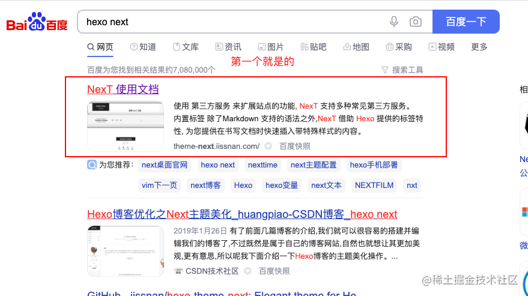

我们点进去，我这里把 next的文档地址也放下：[传送门](http://theme-next.iissnan.com/getting-started.html#stable)

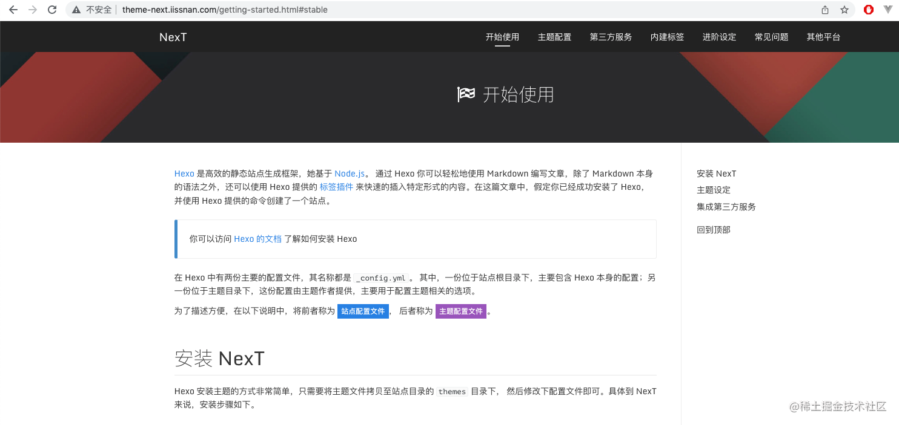

往下拉，找到下载主题

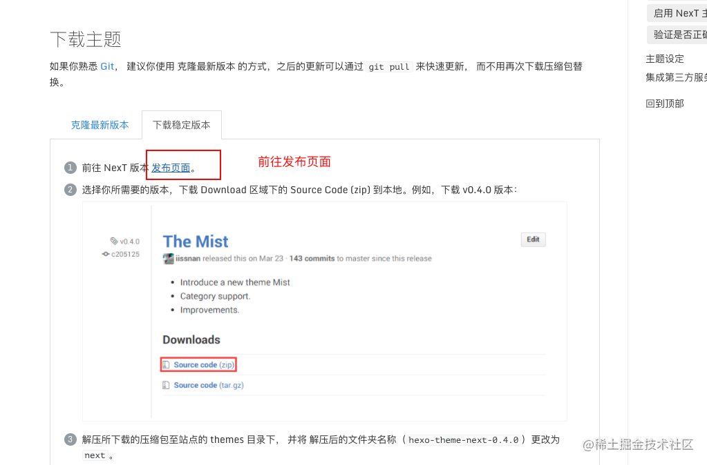

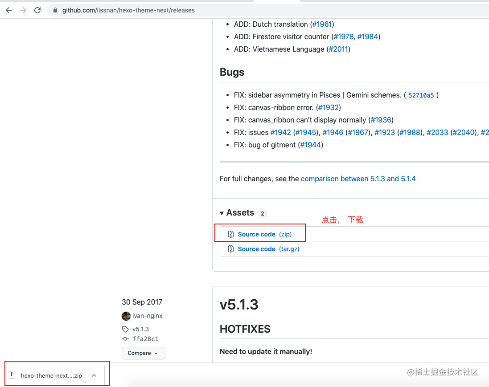

解压，修改名称为 next

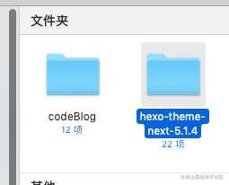

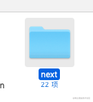

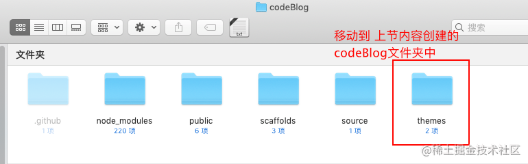

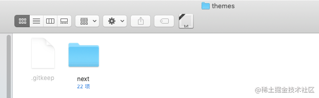

到此，NexT 主题安装完成。下一步我们将验证主题是否正确启用。在切换主题之后、验证之前， 我们最好使用 `hexo clean` 来清除 Hexo 的缓存。

## 启用主题

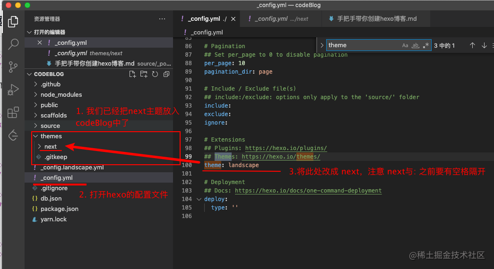

执行指令

```js
hexo clean
hexo s 或则 hexo server
```

访问 http://localhost:4000

恩？页面出现一串代码

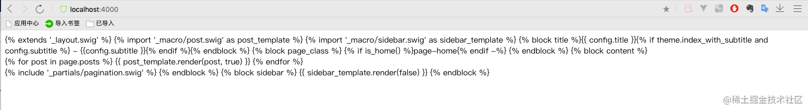

百度一下，发现原因是：hexo在5.0之后把swig给删除了需要自己手动安装

```js
npm i hexo-renderer-swig -S 或
yarn add hexo-renderer-swig
```

然后再重新启动下

```js
hexo s
```

成啦

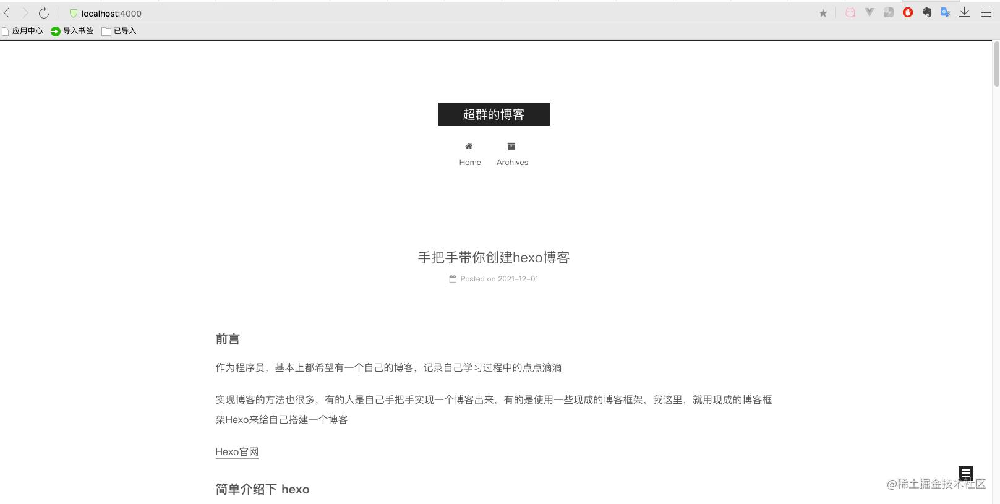

ps：页面正中央的 `超群的博客`是在 hexo网站`codeBlog`下的`_config.yml`中修改的，修改之后，重新启动即可生效。大家也可以改成各自想要的形式

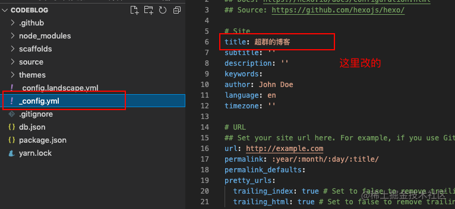

## 隐藏底部的强力驱动

页面拉到最下面，会发现有hexo默认的文字在下方，我们把它隐藏掉

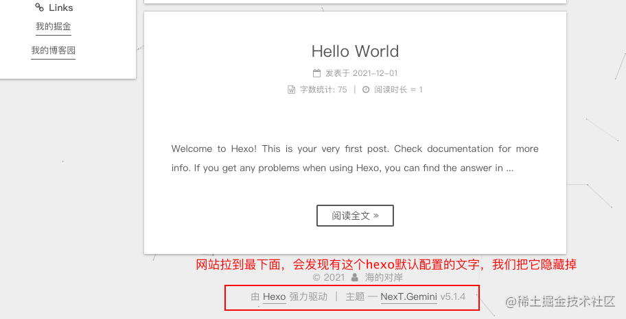

【由Hexo强力驱动】 这个在 `next`主题下的配置文件`_config.yml`中 搜索`power`，将其改为`false`即可

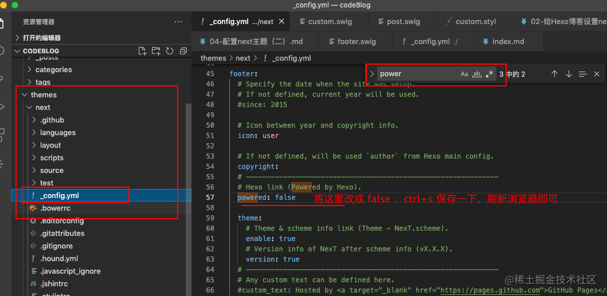

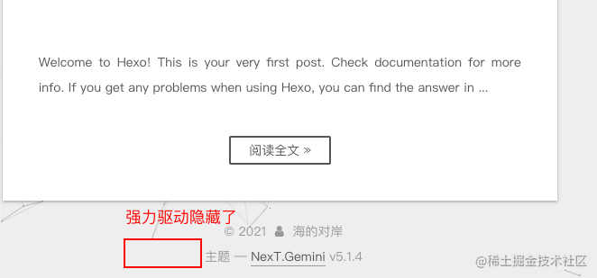

【主题 — NexT.Gemini v5.1.4】 将`theme`下的两项 都设置成false，保存即可

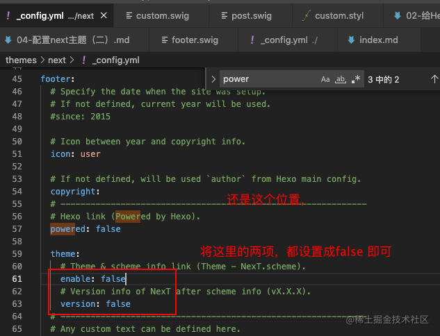

保存之后，最后刷新浏览器就行了

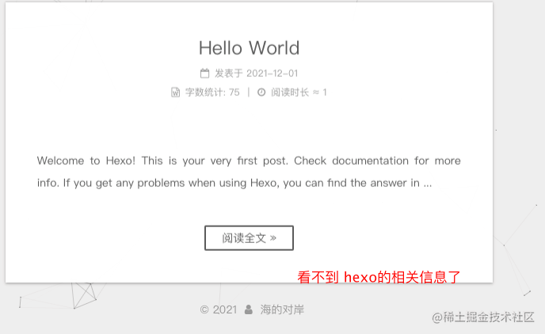

## 增加内容分享服务

找到`next`主题下的配置文件`_config.yml`

ctrl + f 搜索 jia

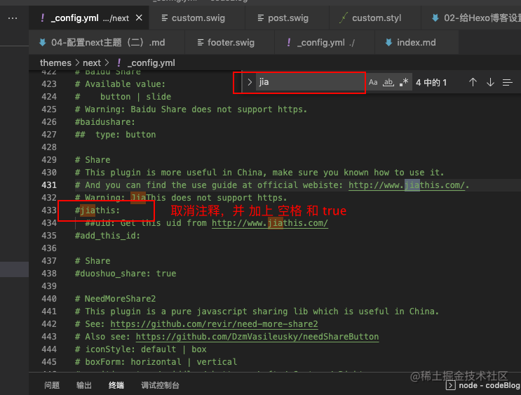

修改之后 即可
