## 前言

前面 创建了hexo博客`codeBlog`，并且安装了next主题，现在我们来配置下next主题

本次要完成的内容如下：

1. 更改next主题为中文
2. 添加分类页，标签页
3. 创建标签页
4. 创建分类页
5. 主题样式的更改
6. 更改头像
7. 更改标题作者以及链接
8. 补充：修改侧边栏作者头像并旋转
9. 启用侧边栏社交链接

## 更改next主题为中文

打开 `codeBlog`

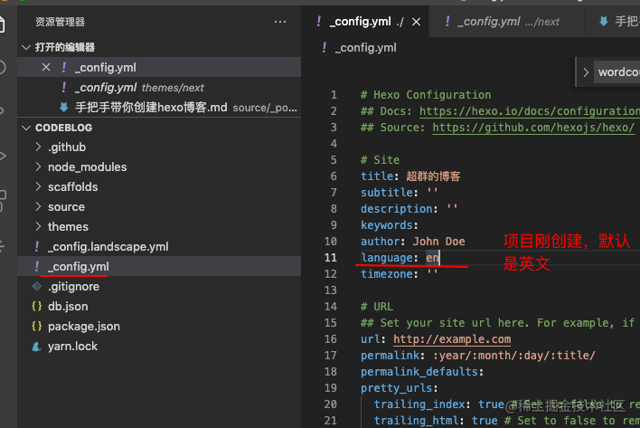

再打开[next文档](http://theme-next.iissnan.com/getting-started.html#stable)

找到设置语言

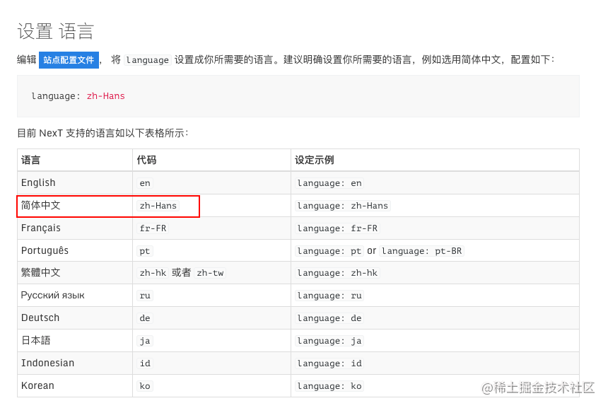

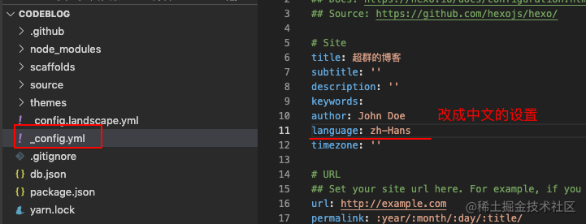

注意：`zh-Hans`前面要有一个空格隔开

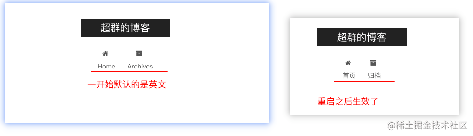

如果重启之后还是没有生效，那就先执行 hexo clean, 再执行 hexo s

## 添加分类页，标签页

打开 next主题里面的`_config.yml`文件

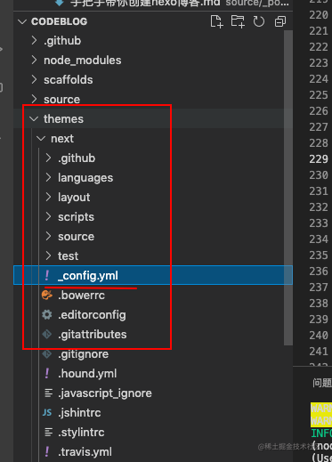

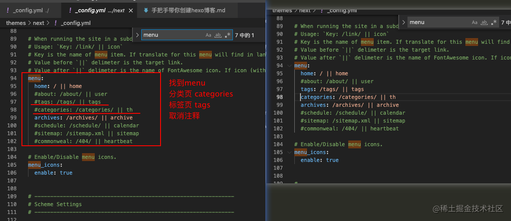

修改之后 ctrl + s 保存，然后直接刷新浏览器

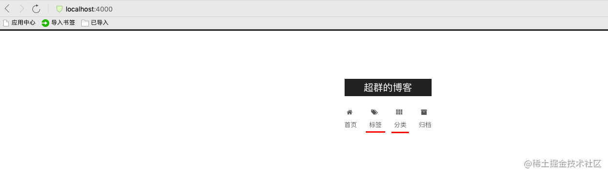

标签 和 分类 就出来了

现在打开标签页，发现里面没东西

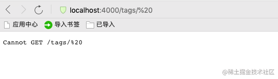

原因是我们还没有创建标签，所以没有内容展示

### 创建标签页

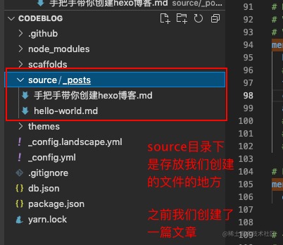

现在我们要创建标签页

控制台输入下面指令

```js
hexo n page tags
```

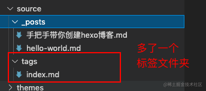

然后启动`codeBlog` , 点击进入标签页

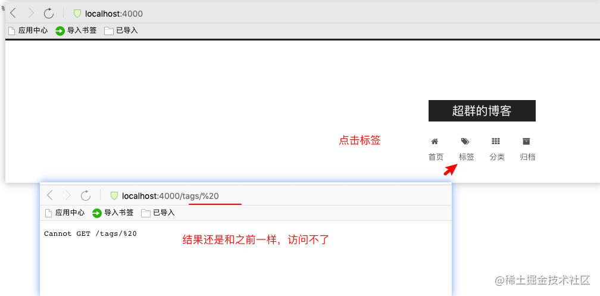

百度了一通，找到了原因：%20 是空格的意思，把配置文件里 ||之前所有的空格删掉即可。

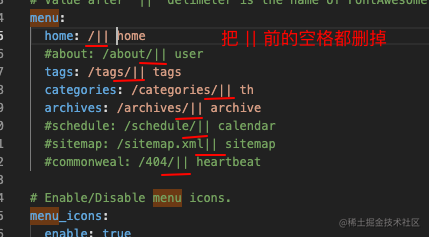

修改好了，保存，重新运行，就正常了

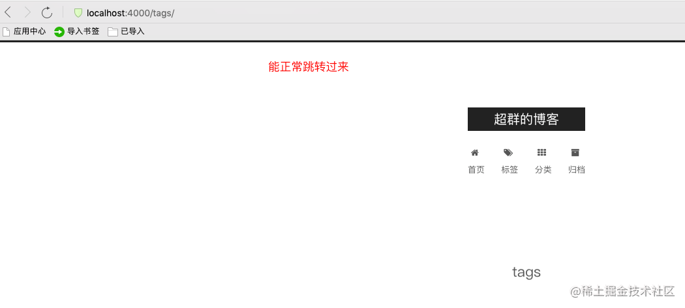

### 修改标签

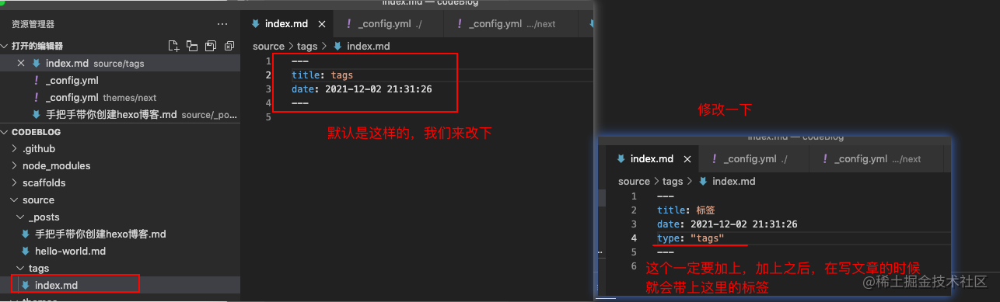

修改之后，保存，浏览器刷新

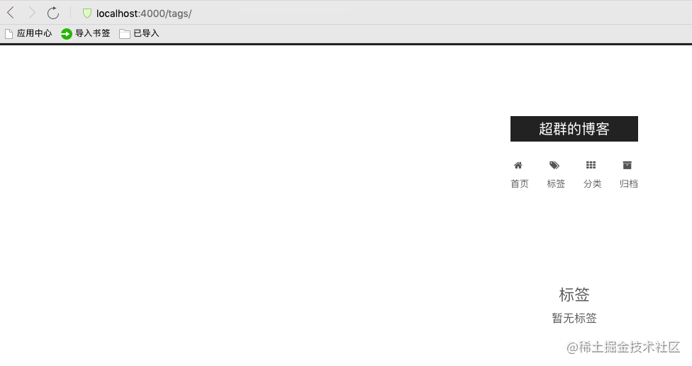

就多出标签了

### 创建分类页

控制台执行命令

```js
hexo n page categories
```

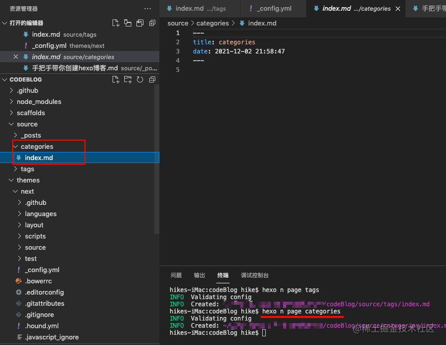

分类页也创建出来了，浏览器上打开看看

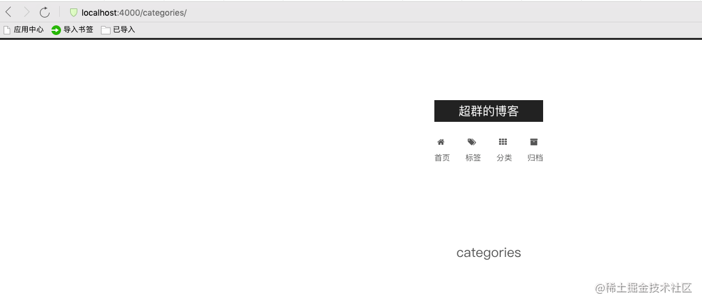

再改下分类页的内容

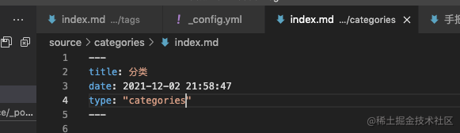

保存之后，浏览器刷新

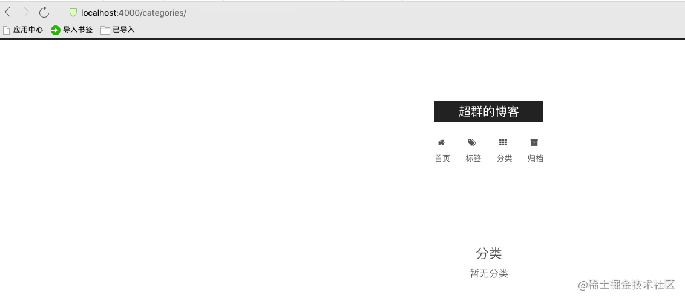

现在就和 标签页差不多了

## 主题样式的更改

看[next的官方文档](http://theme-next.iissnan.com/getting-started.html#select-scheme)

### 选择 Scheme

Scheme 是 NexT 提供的一种特性，借助于 Scheme，NexT 为你提供多种不同的外观。同时，几乎所有的配置都可以 在 Scheme 之间共用。目前 NexT 支持三种 Scheme，他们是：

- Muse - 默认 Scheme，这是 NexT 最初的版本，黑白主调，大量留白
- Mist - Muse 的紧凑版本，整洁有序的单栏外观
- Pisces - 双栏 Scheme，小家碧玉似的清新

Scheme 的切换通过更改 主题配置文件，搜索 scheme 关键字。 你会看到有三行 scheme 的配置，将你需用启用的 scheme 前面注释 `#` 去除即可。

选择 Pisces Scheme

```
#scheme: Muse
#scheme: Mist
scheme: Pisces
```

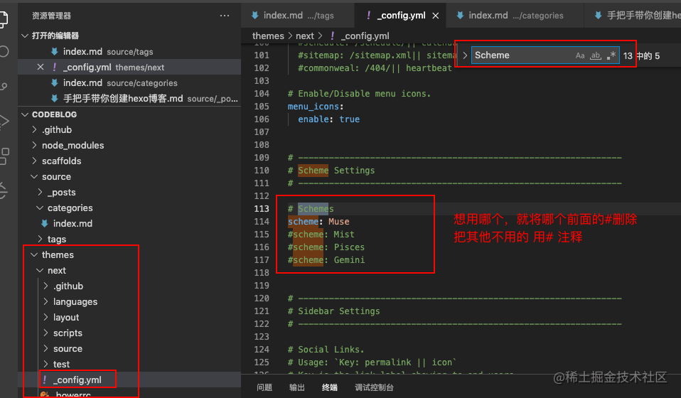

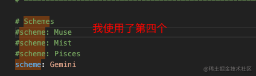

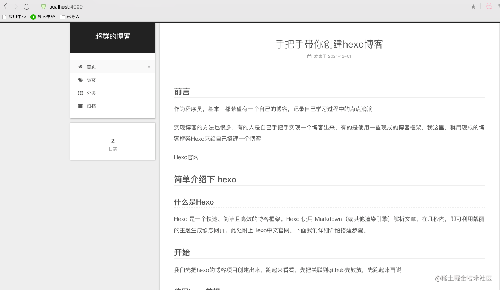

## 更改头像

更改头像 也是在 next文件夹下的配置文件`_config.yml`中设置

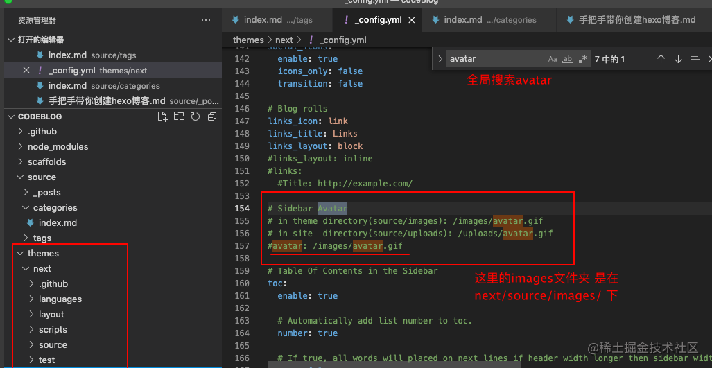

我们来改下

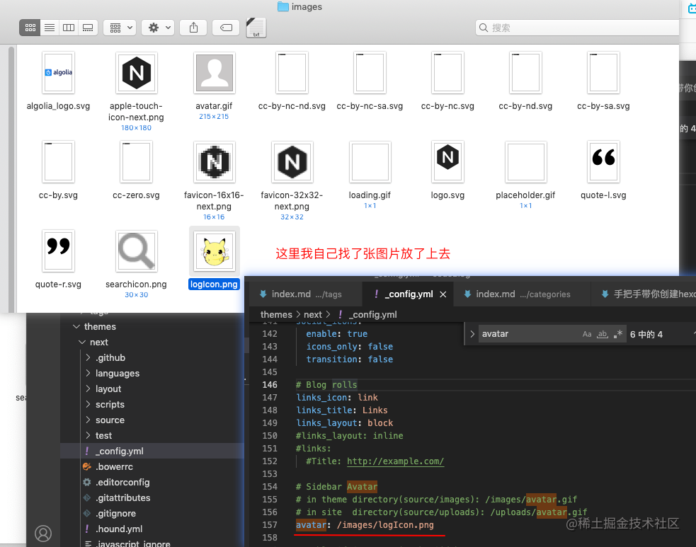

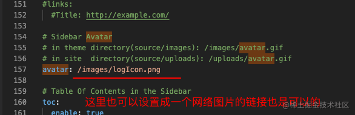

保存之后，刷新浏览器

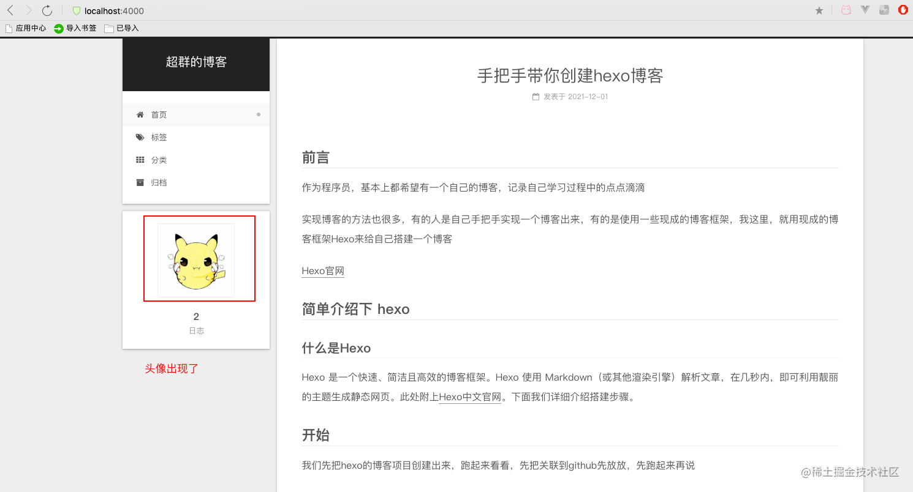

## 更改标题作者以及链接

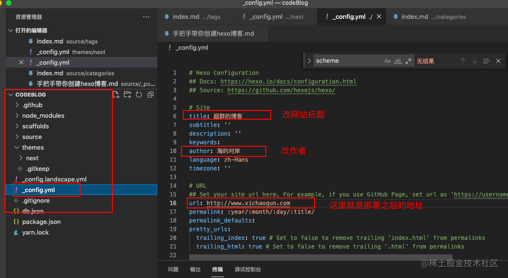

改完之后，执行

```js
hexo clean
hexo s
```

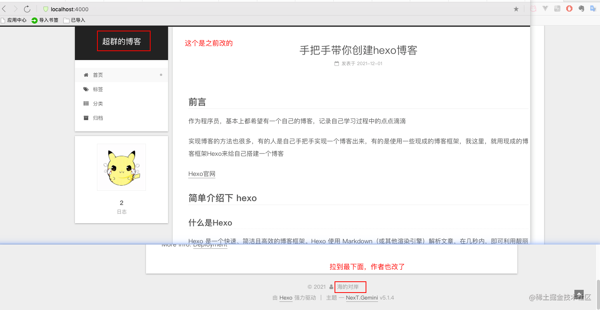

ps: 我看到有的人的hexo博客的头像那边还有名称，但是我这个hexo博客，没找到在哪设置，有空再研究研究

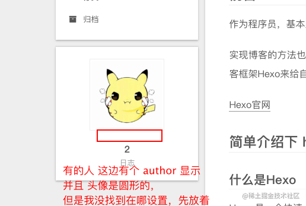

### 补充：

1. 修改侧边栏作者头像并旋转
   打开`\themes\next\source\css_common\components\sidebar\sidebar-author.styl`，在里面添加如下代码：

```js
.site-author-image {
  display: block;
  margin: 0 auto;
  padding: $site-author-image-padding;
  max-width: $site-author-image-width;
  height: $site-author-image-height;
  border: $site-author-image-border-width solid $site-author-image-border-color;

  /* 头像圆形 */
  border-radius: 80px;
  -webkit-border-radius: 80px;
  -moz-border-radius: 80px;
  box-shadow: inset 0 -1px 0 #333sf;

  /* 设置循环动画 [animation: (play)动画名称 (2s)动画播放时长单位秒或微秒 (ase-out)动画播放的速度曲线为以低速结束
    (1s)等待1秒然后开始动画 (1)动画播放次数(infinite为循环播放) ]*/


  /* 鼠标经过头像旋转360度 */
  -webkit-transition: -webkit-transform 1.0s ease-out;
  -moz-transition: -moz-transform 1.0s ease-out;
  transition: transform 1.0s ease-out;
}

img:hover {
  /* 鼠标经过停止头像旋转
  -webkit-animation-play-state:paused;
  animation-play-state:paused;*/

  /* 鼠标经过头像旋转360度 */
  -webkit-transform: rotateZ(360deg);
  -moz-transform: rotateZ(360deg);
  transform: rotateZ(360deg);
}

/* Z 轴旋转动画 */
@-webkit-keyframes play {
  0% {
    -webkit-transform: rotateZ(0deg);
  }
  100% {
    -webkit-transform: rotateZ(-360deg);
  }
}
@-moz-keyframes play {
  0% {
    -moz-transform: rotateZ(0deg);
  }
  100% {
    -moz-transform: rotateZ(-360deg);
  }
}
@keyframes play {
  0% {
    transform: rotateZ(0deg);
  }
  100% {
    transform: rotateZ(-360deg);
  }
}

```

## 启用侧边栏社交链接

侧栏社交链接的修改包含两个部分，第一是链接，第二是链接图标。 两者配置均在 主题配置文件 中。

1.  链接放置在 `social` 字段下，一行一个链接。其键值格式是 `显示文本: 链接地址`。

    配置示例

    ```
    # Social links
    social:
      GitHub: https://github.com/your-user-name
      Twitter: https://twitter.com/your-user-name
      微博: http://weibo.com/your-user-name
      豆瓣: http://douban.com/people/your-user-name
      知乎: http://www.zhihu.com/people/your-user-name
      # 等等
    ```

1.  设定链接的图标，对应的字段是 `social_icons`。其键值格式是 `匹配键: Font Awesome 图标名称`， `匹配键` 与上一步所配置的链接的 `显示文本` 相同（大小写严格匹配），`图标名称` 是 Font Awesome 图标的名字（不必带 `fa-` 前缀）。 `enable` 选项用于控制是否显示图标，你可以设置成 `false` 来去掉图标。

    配置示例

    ```
    # Social Icons
    social_icons:
      enable: true
      # Icon Mappings
      GitHub: github
      Twitter: twitter
      微博: weibo
    ```

## 参考文档

1. [hexo的next主题个性化配置](https://blog.csdn.net/weixin_44815733/article/details/88817220)
