## 前言

继续配置

本次要完成的内容如下：

1. 启用友情链接
2. 新建一篇博客
3. 解决日志点击跳转乱码问题
4. 增加加载效果
5. Next主题鼠标点击特效
6. 实现字数统计和阅读时长功能

## 启用友情链接

1. 在`next`主题的文件夹内，找到配置文件`_config.yml`
2. 全局搜索`link`关键字
3. 在对应的地方取消注释

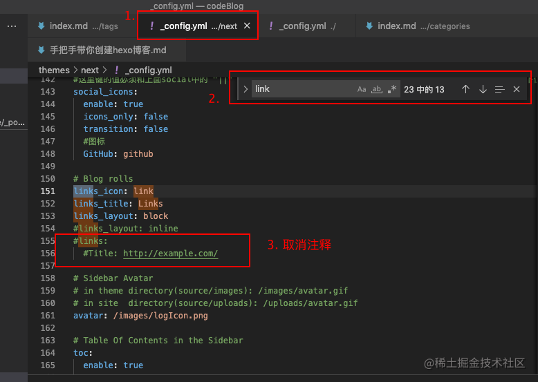

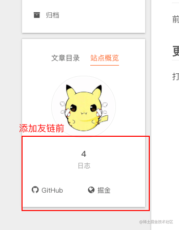

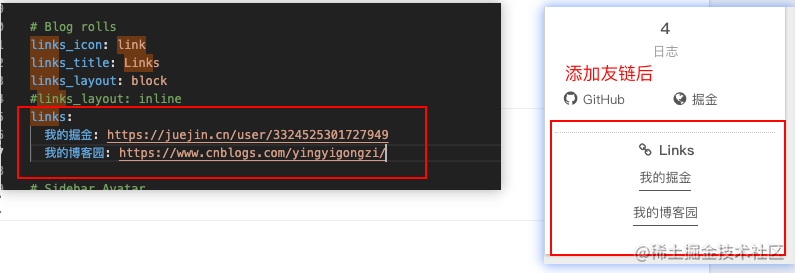

## 新建一篇博客

```js
新建文章：`hexo new '文章名'`
也可以简写 new 成 n
hexo n '文章名'
```

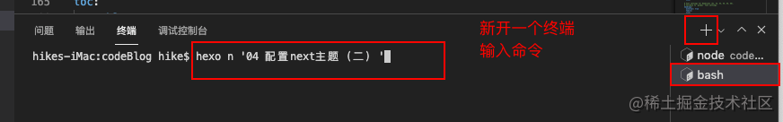

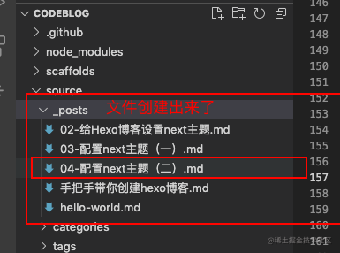

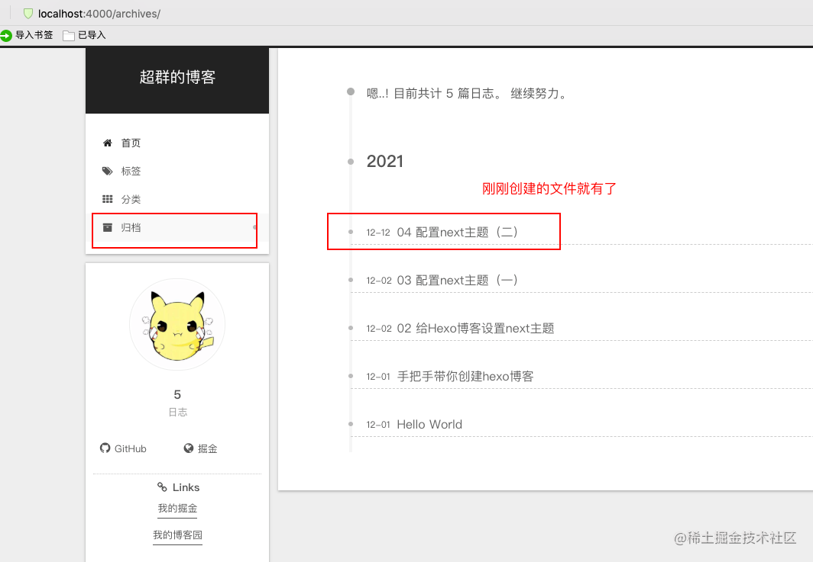

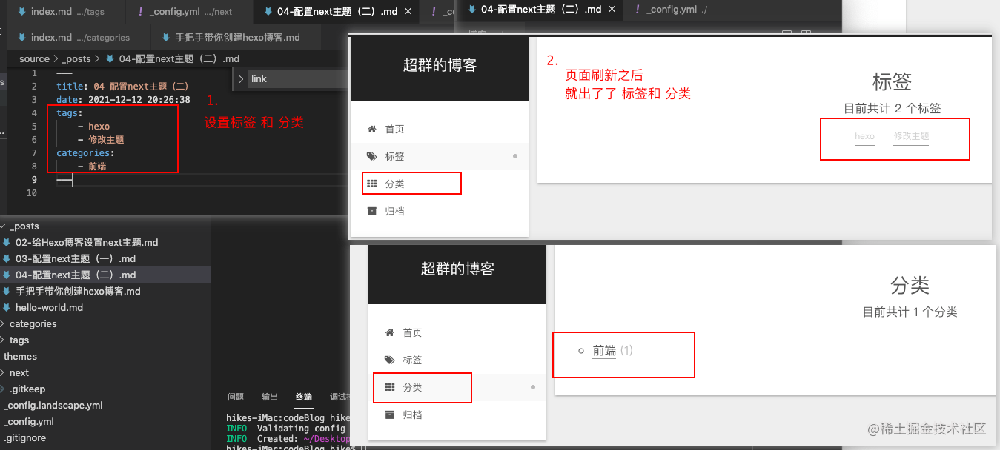

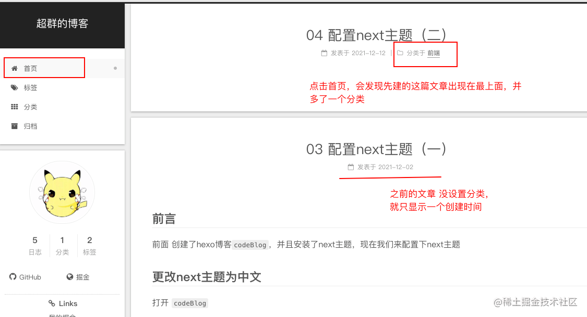

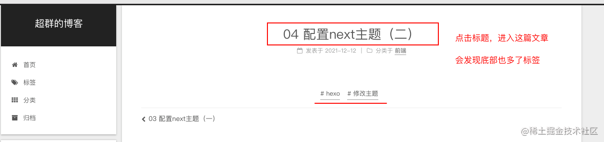

## 解决日志点击跳转乱码问题

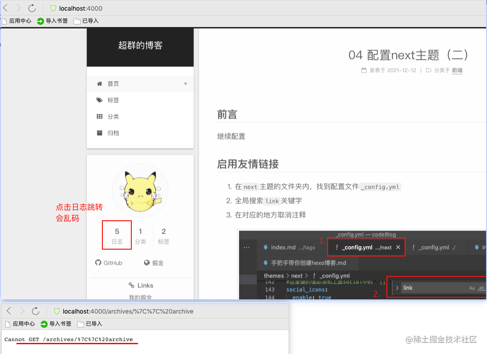

1. 方法一
   `themes/next/_config.yml` 文件下将`archives：/archives/ || archive` 改成`archives：/archives/`

删掉后面的`|| archive`，的确能够解决问题，但是就没有图标了

（网上说这种方法就看不到图标了，但是我还是看得到图标的）

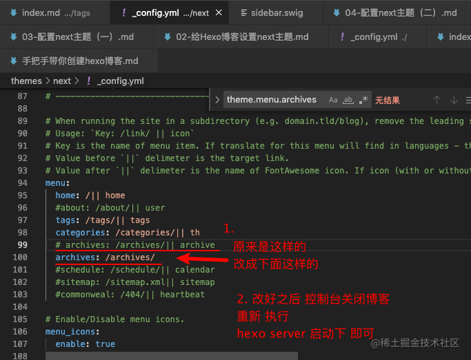

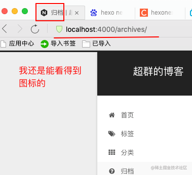

2. 方法二
   next主题目录下

`/layout/_macro/sidebar.swig`文件中找到

```js
找到
<a href="{{ url_for(theme.menu.archives).split('||')[0] | trim }}">
 原因是url_for函数将||转码了，

改成
<a href="{{ url_for(theme.menu.archives.split('||')[0])| trim}}">
即可
```

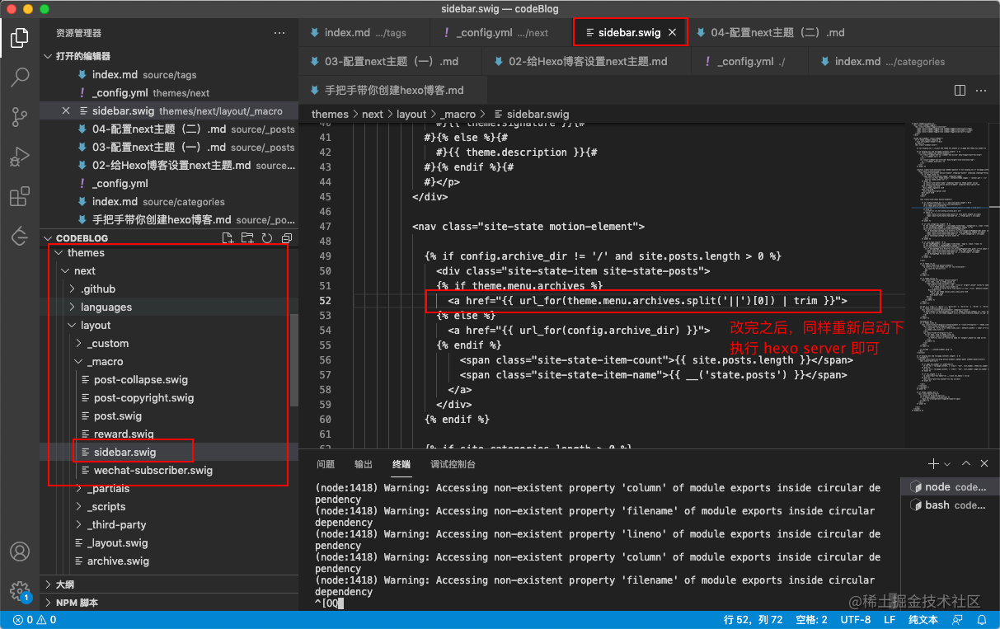

## 增加加载效果

找到`next`主题下的配置文件`_config.yml`

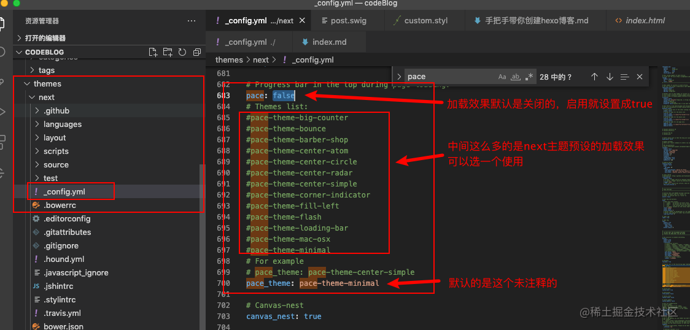

选择next默认的一种加载效果使用看看

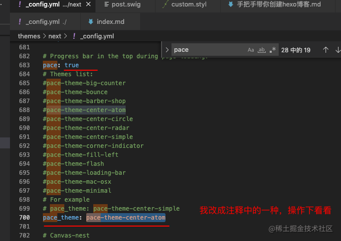

最后`ctrl+S` 保存下配置文件，浏览器刷新页面，即可看到效果

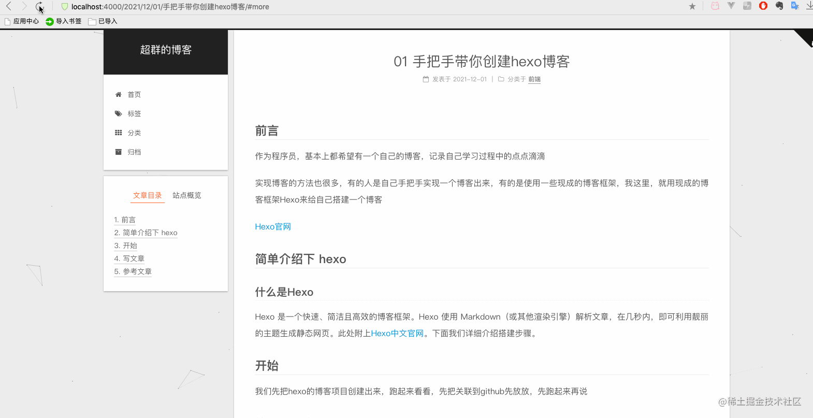

## Next主题鼠标点击特效

先看看效果

【礼花特效】


【爆炸】特效

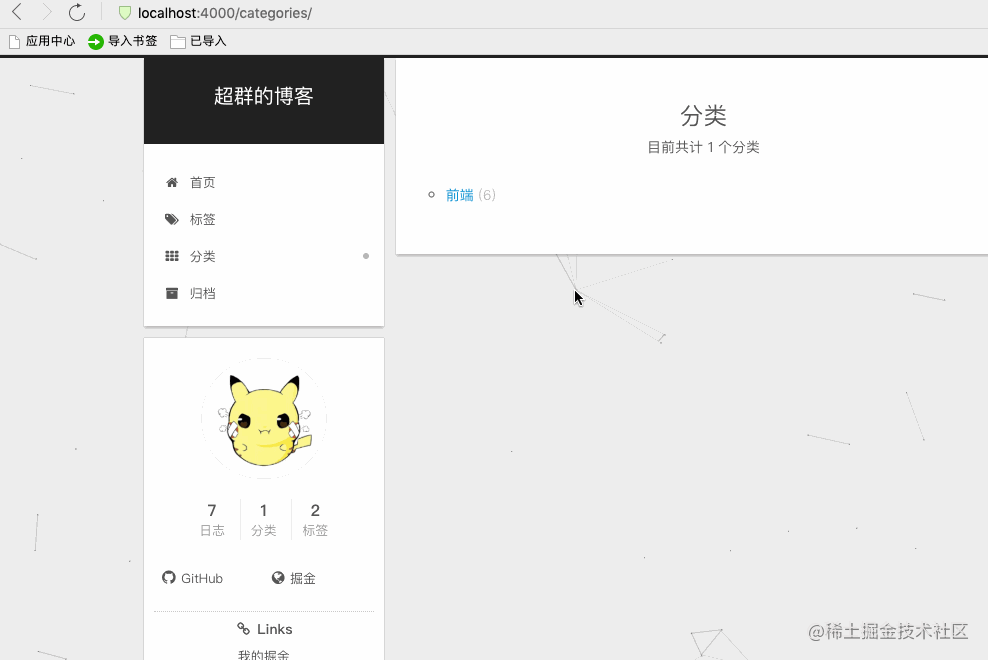

【浮出爱心】特效


【浮出文字】特效

## 

在`/themes/next/layout/_custom/`下新建 一个叫 `custom.swig`的文件

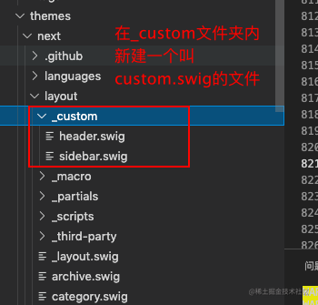

`custom.swig`文件代码如下

```js

  
    <script src="/js/cursor/fireworks.js"></script>
  
    <canvas class="fireworks" style="position: fixed;left: 0;top: 0;z-index: 1; pointer-events: none;" ></canvas>
    <script src="//cdn.bootcss.com/animejs/2.2.0/anime.min.js"></script>
    <script src="/js/cursor/explosion.min.js"></script>
  
    <script src="/js/cursor/love.min.js"></script>
  
    <script src="/js/cursor/text.js"></script>
  

```

在 `/themes/next/layout/_layout.swig` 中调用，刚刚新建的 `custom.swig`文件

在`_layout.swig`中加入如下代码

```js

```

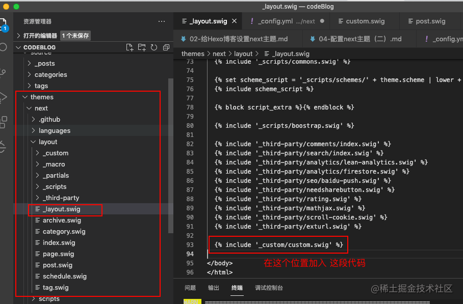

在`/themes/next/source/js/`下新建一个 `cursor`文件夹

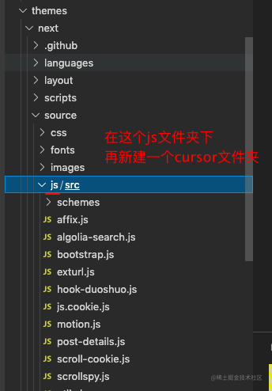

这个`cursor`文件夹中用来放置鼠标点击特效的`js`文件

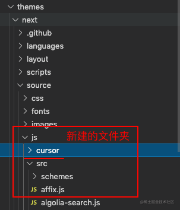

这里，我们写4个特效文件，分别是：

1. fireworks.js --- 【礼花特效】
2. explosion.min.js --- 【爆炸】
3. love.min.js --- 【浮出爱心】
4. text.js --- 【浮出文字】
   4个特效的代码如下：

```js
// fireworks.js
class Circle {
  constructor({ origin, speed, color, angle, context }) {
    this.origin = origin;
    this.position = { ...this.origin };
    this.color = color;
    this.speed = speed;
    this.angle = angle;
    this.context = context;
    this.renderCount = 0;
  }

  draw() {
    this.context.fillStyle = this.color;
    this.context.beginPath();
    this.context.arc(this.position.x, this.position.y, 2, 0, Math.PI * 2);
    this.context.fill();
  }

  move() {
    this.position.x = Math.sin(this.angle) * this.speed + this.position.x;
    this.position.y =
      Math.cos(this.angle) * this.speed +
      this.position.y +
      this.renderCount * 0.3;
    this.renderCount++;
  }
}

class Boom {
  constructor({ origin, context, circleCount = 16, area }) {
    this.origin = origin;
    this.context = context;
    this.circleCount = circleCount;
    this.area = area;
    this.stop = false;
    this.circles = [];
  }

  randomArray(range) {
    const length = range.length;
    const randomIndex = Math.floor(length * Math.random());
    return range[randomIndex];
  }

  randomColor() {
    const range = ["8", "9", "A", "B", "C", "D", "E", "F"];
    return (
      "#" +
      this.randomArray(range) +
      this.randomArray(range) +
      this.randomArray(range) +
      this.randomArray(range) +
      this.randomArray(range) +
      this.randomArray(range)
    );
  }

  randomRange(start, end) {
    return (end - start) * Math.random() + start;
  }

  init() {
    for (let i = 0; i < this.circleCount; i++) {
      const circle = new Circle({
        context: this.context,
        origin: this.origin,
        color: this.randomColor(),
        angle: this.randomRange(Math.PI - 1, Math.PI + 1),
        speed: this.randomRange(1, 6),
      });
      this.circles.push(circle);
    }
  }

  move() {
    this.circles.forEach((circle, index) => {
      if (
        circle.position.x > this.area.width ||
        circle.position.y > this.area.height
      ) {
        return this.circles.splice(index, 1);
      }
      circle.move();
    });
    if (this.circles.length == 0) {
      this.stop = true;
    }
  }

  draw() {
    this.circles.forEach((circle) => circle.draw());
  }
}

class CursorSpecialEffects {
  constructor() {
    this.computerCanvas = document.createElement("canvas");
    this.renderCanvas = document.createElement("canvas");

    this.computerContext = this.computerCanvas.getContext("2d");
    this.renderContext = this.renderCanvas.getContext("2d");

    this.globalWidth = window.innerWidth;
    this.globalHeight = window.innerHeight;

    this.booms = [];
    this.running = false;
  }

  handleMouseDown(e) {
    const boom = new Boom({
      origin: { x: e.clientX, y: e.clientY },
      context: this.computerContext,
      area: {
        width: this.globalWidth,
        height: this.globalHeight,
      },
    });
    boom.init();
    this.booms.push(boom);
    this.running || this.run();
  }

  handlePageHide() {
    this.booms = [];
    this.running = false;
  }

  init() {
    const style = this.renderCanvas.style;
    style.position = "fixed";
    style.top = style.left = 0;
    style.zIndex = "999999999999999999999999999999999999999999";
    style.pointerEvents = "none";

    style.width =
      this.renderCanvas.width =
      this.computerCanvas.width =
        this.globalWidth;
    style.height =
      this.renderCanvas.height =
      this.computerCanvas.height =
        this.globalHeight;

    document.body.append(this.renderCanvas);

    window.addEventListener("mousedown", this.handleMouseDown.bind(this));
    window.addEventListener("pagehide", this.handlePageHide.bind(this));
  }

  run() {
    this.running = true;
    if (this.booms.length == 0) {
      return (this.running = false);
    }

    requestAnimationFrame(this.run.bind(this));

    this.computerContext.clearRect(0, 0, this.globalWidth, this.globalHeight);
    this.renderContext.clearRect(0, 0, this.globalWidth, this.globalHeight);

    this.booms.forEach((boom, index) => {
      if (boom.stop) {
        return this.booms.splice(index, 1);
      }
      boom.move();
      boom.draw();
    });
    this.renderContext.drawImage(
      this.computerCanvas,
      0,
      0,
      this.globalWidth,
      this.globalHeight,
    );
  }
}

const cursorSpecialEffects = new CursorSpecialEffects();
cursorSpecialEffects.init();
```

```js
// explosion.min.js
"use strict";
function updateCoords(e) {
  ((pointerX =
    (e.clientX || e.touches[0].clientX) -
    canvasEl.getBoundingClientRect().left),
    (pointerY =
      e.clientY ||
      e.touches[0].clientY - canvasEl.getBoundingClientRect().top));
}
function setParticuleDirection(e) {
  var t = (anime.random(0, 360) * Math.PI) / 180,
    a = anime.random(50, 180),
    n = [-1, 1][anime.random(0, 1)] * a;
  return { x: e.x + n * Math.cos(t), y: e.y + n * Math.sin(t) };
}
function createParticule(e, t) {
  var a = {};
  return (
    (a.x = e),
    (a.y = t),
    (a.color = colors[anime.random(0, colors.length - 1)]),
    (a.radius = anime.random(16, 32)),
    (a.endPos = setParticuleDirection(a)),
    (a.draw = function () {
      (ctx.beginPath(),
        ctx.arc(a.x, a.y, a.radius, 0, 2 * Math.PI, !0),
        (ctx.fillStyle = a.color),
        ctx.fill());
    }),
    a
  );
}
function createCircle(e, t) {
  var a = {};
  return (
    (a.x = e),
    (a.y = t),
    (a.color = "#F00"),
    (a.radius = 0.1),
    (a.alpha = 0.5),
    (a.lineWidth = 6),
    (a.draw = function () {
      ((ctx.globalAlpha = a.alpha),
        ctx.beginPath(),
        ctx.arc(a.x, a.y, a.radius, 0, 2 * Math.PI, !0),
        (ctx.lineWidth = a.lineWidth),
        (ctx.strokeStyle = a.color),
        ctx.stroke(),
        (ctx.globalAlpha = 1));
    }),
    a
  );
}
function renderParticule(e) {
  for (var t = 0; t < e.animatables.length; t++) {
    e.animatables[t].target.draw();
  }
}
function animateParticules(e, t) {
  for (var a = createCircle(e, t), n = [], i = 0; i < numberOfParticules; i++) {
    n.push(createParticule(e, t));
  }
  anime
    .timeline()
    .add({
      targets: n,
      x: function (e) {
        return e.endPos.x;
      },
      y: function (e) {
        return e.endPos.y;
      },
      radius: 0.1,
      duration: anime.random(1200, 1800),
      easing: "easeOutExpo",
      update: renderParticule,
    })
    .add({
      targets: a,
      radius: anime.random(80, 160),
      lineWidth: 0,
      alpha: { value: 0, easing: "linear", duration: anime.random(600, 800) },
      duration: anime.random(1200, 1800),
      easing: "easeOutExpo",
      update: renderParticule,
      offset: 0,
    });
}
function debounce(e, t) {
  var a;
  return function () {
    var n = this,
      i = arguments;
    (clearTimeout(a),
      (a = setTimeout(function () {
        e.apply(n, i);
      }, t)));
  };
}
var canvasEl = document.querySelector(".fireworks");
if (canvasEl) {
  var ctx = canvasEl.getContext("2d"),
    numberOfParticules = 30,
    pointerX = 0,
    pointerY = 0,
    tap = "mousedown",
    colors = ["#FF1461", "#18FF92", "#5A87FF", "#FBF38C"],
    setCanvasSize = debounce(function () {
      ((canvasEl.width = 2 * window.innerWidth),
        (canvasEl.height = 2 * window.innerHeight),
        (canvasEl.style.width = window.innerWidth + "px"),
        (canvasEl.style.height = window.innerHeight + "px"),
        canvasEl.getContext("2d").scale(2, 2));
    }, 500),
    render = anime({
      duration: 1 / 0,
      update: function () {
        ctx.clearRect(0, 0, canvasEl.width, canvasEl.height);
      },
    });
  (document.addEventListener(
    tap,
    function (e) {
      "sidebar" !== e.target.id &&
        "toggle-sidebar" !== e.target.id &&
        "A" !== e.target.nodeName &&
        "IMG" !== e.target.nodeName &&
        (render.play(), updateCoords(e), animateParticules(pointerX, pointerY));
    },
    !1,
  ),
    setCanvasSize(),
    window.addEventListener("resize", setCanvasSize, !1));
}
("use strict");
function updateCoords(e) {
  ((pointerX =
    (e.clientX || e.touches[0].clientX) -
    canvasEl.getBoundingClientRect().left),
    (pointerY =
      e.clientY ||
      e.touches[0].clientY - canvasEl.getBoundingClientRect().top));
}
function setParticuleDirection(e) {
  var t = (anime.random(0, 360) * Math.PI) / 180,
    a = anime.random(50, 180),
    n = [-1, 1][anime.random(0, 1)] * a;
  return { x: e.x + n * Math.cos(t), y: e.y + n * Math.sin(t) };
}
function createParticule(e, t) {
  var a = {};
  return (
    (a.x = e),
    (a.y = t),
    (a.color = colors[anime.random(0, colors.length - 1)]),
    (a.radius = anime.random(16, 32)),
    (a.endPos = setParticuleDirection(a)),
    (a.draw = function () {
      (ctx.beginPath(),
        ctx.arc(a.x, a.y, a.radius, 0, 2 * Math.PI, !0),
        (ctx.fillStyle = a.color),
        ctx.fill());
    }),
    a
  );
}
function createCircle(e, t) {
  var a = {};
  return (
    (a.x = e),
    (a.y = t),
    (a.color = "#F00"),
    (a.radius = 0.1),
    (a.alpha = 0.5),
    (a.lineWidth = 6),
    (a.draw = function () {
      ((ctx.globalAlpha = a.alpha),
        ctx.beginPath(),
        ctx.arc(a.x, a.y, a.radius, 0, 2 * Math.PI, !0),
        (ctx.lineWidth = a.lineWidth),
        (ctx.strokeStyle = a.color),
        ctx.stroke(),
        (ctx.globalAlpha = 1));
    }),
    a
  );
}
function renderParticule(e) {
  for (var t = 0; t < e.animatables.length; t++) {
    e.animatables[t].target.draw();
  }
}
function animateParticules(e, t) {
  for (var a = createCircle(e, t), n = [], i = 0; i < numberOfParticules; i++) {
    n.push(createParticule(e, t));
  }
  anime
    .timeline()
    .add({
      targets: n,
      x: function (e) {
        return e.endPos.x;
      },
      y: function (e) {
        return e.endPos.y;
      },
      radius: 0.1,
      duration: anime.random(1200, 1800),
      easing: "easeOutExpo",
      update: renderParticule,
    })
    .add({
      targets: a,
      radius: anime.random(80, 160),
      lineWidth: 0,
      alpha: { value: 0, easing: "linear", duration: anime.random(600, 800) },
      duration: anime.random(1200, 1800),
      easing: "easeOutExpo",
      update: renderParticule,
      offset: 0,
    });
}
function debounce(e, t) {
  var a;
  return function () {
    var n = this,
      i = arguments;
    (clearTimeout(a),
      (a = setTimeout(function () {
        e.apply(n, i);
      }, t)));
  };
}
var canvasEl = document.querySelector(".fireworks");
if (canvasEl) {
  var ctx = canvasEl.getContext("2d"),
    numberOfParticules = 30,
    pointerX = 0,
    pointerY = 0,
    tap = "mousedown",
    colors = ["#FF1461", "#18FF92", "#5A87FF", "#FBF38C"],
    setCanvasSize = debounce(function () {
      ((canvasEl.width = 2 * window.innerWidth),
        (canvasEl.height = 2 * window.innerHeight),
        (canvasEl.style.width = window.innerWidth + "px"),
        (canvasEl.style.height = window.innerHeight + "px"),
        canvasEl.getContext("2d").scale(2, 2));
    }, 500),
    render = anime({
      duration: 1 / 0,
      update: function () {
        ctx.clearRect(0, 0, canvasEl.width, canvasEl.height);
      },
    });
  (document.addEventListener(
    tap,
    function (e) {
      "sidebar" !== e.target.id &&
        "toggle-sidebar" !== e.target.id &&
        "A" !== e.target.nodeName &&
        "IMG" !== e.target.nodeName &&
        (render.play(), updateCoords(e), animateParticules(pointerX, pointerY));
    },
    !1,
  ),
    setCanvasSize(),
    window.addEventListener("resize", setCanvasSize, !1));
}
```

```js
// love.min.js
(function (window, document, undefined) {
  var hearts = [];
  window.requestAnimationFrame = (function () {
    return (
      window.requestAnimationFrame ||
      window.webkitRequestAnimationFrame ||
      window.mozRequestAnimationFrame ||
      window.oRequestAnimationFrame ||
      window.msRequestAnimationFrame ||
      function (callback) {
        setTimeout(callback, 1000 / 60);
      }
    );
  })();
  init();
  function init() {
    css(
      ".heart{width: 10px;height: 10px;position: fixed;background: #f00;transform: rotate(45deg);-webkit-transform: rotate(45deg);-moz-transform: rotate(45deg);}.heart:after,.heart:before{content: '';width: inherit;height: inherit;background: inherit;border-radius: 50%;-webkit-border-radius: 50%;-moz-border-radius: 50%;position: absolute;}.heart:after{top: -5px;}.heart:before{left: -5px;}",
    );
    attachEvent();
    gameloop();
  }
  function gameloop() {
    for (var i = 0; i < hearts.length; i++) {
      if (hearts[i].alpha <= 0) {
        document.body.removeChild(hearts[i].el);
        hearts.splice(i, 1);
        continue;
      }
      hearts[i].y--;
      hearts[i].scale += 0.004;
      hearts[i].alpha -= 0.013;
      hearts[i].el.style.cssText =
        "left:" +
        hearts[i].x +
        "px;top:" +
        hearts[i].y +
        "px;opacity:" +
        hearts[i].alpha +
        ";transform:scale(" +
        hearts[i].scale +
        "," +
        hearts[i].scale +
        ") rotate(45deg);background:" +
        hearts[i].color;
    }
    requestAnimationFrame(gameloop);
  }
  function attachEvent() {
    var old = typeof window.onclick === "function" && window.onclick;
    window.onclick = function (event) {
      old && old();
      createHeart(event);
    };
  }
  function createHeart(event) {
    var d = document.createElement("div");
    d.className = "heart";
    hearts.push({
      el: d,
      x: event.clientX - 5,
      y: event.clientY - 5,
      scale: 1,
      alpha: 1,
      color: randomColor(),
    });
    document.body.appendChild(d);
  }
  function css(css) {
    var style = document.createElement("style");
    style.type = "text/css";
    try {
      style.appendChild(document.createTextNode(css));
    } catch (ex) {
      style.styleSheet.cssText = css;
    }
    document.getElementsByTagName("head")[0].appendChild(style);
  }
  function randomColor() {
    return (
      "rgb(" +
      ~~(Math.random() * 255) +
      "," +
      ~~(Math.random() * 255) +
      "," +
      ~~(Math.random() * 255) +
      ")"
    );
  }
})(window, document);
```

```js
// text.js
var a_idx = 0;
jQuery(document).ready(function ($) {
  $("body").click(function (e) {
    var a = new Array(
      "富强",
      "民主",
      "文明",
      "和谐",
      "自由",
      "平等",
      "公正",
      "法治",
      "爱国",
      "敬业",
      "诚信",
      "友善",
    );
    var $i = $("<span/>").text(a[a_idx]);
    var x = e.pageX,
      y = e.pageY;
    $i.css({
      "z-index": 99999,
      top: y - 28,
      left: x - a[a_idx].length * 8,
      position: "absolute",
      color: "#ff7a45",
    });
    $("body").append($i);
    $i.animate(
      {
        top: y - 180,
        opacity: 0,
      },
      1500,
      function () {
        $i.remove();
      },
    );
    a_idx = (a_idx + 1) % a.length;
  });
});
```

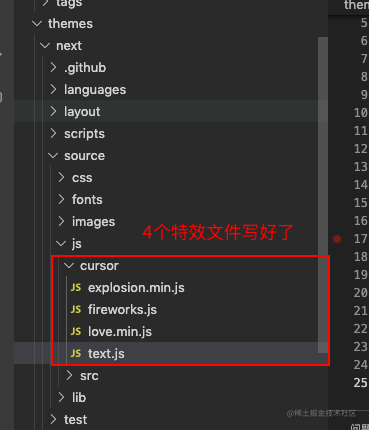

在主题 `_config.yml` 中添加动态配置项

```yml
# 将这段代码加在 _config.yml 的下面
cursor_effect:
  enabled: true
  type: love # fireworks：礼花 | explosion：爆炸 | love：浮出爱心 | text：浮出文字
```

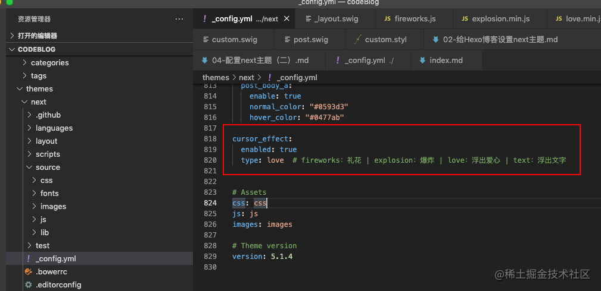

最后`ctrl+S` 保存下配置文件，然后执行那**三行命令**

```js
hexo clean
hexo generate
hexo server
```

刷新浏览器即可

ps. 有时候我们直接修改了配置文件，直接刷新浏览器能生效，有时候不能生效，**不能生效的时候**，就执行那**三行命令**，重新生成下静态博客就行了

## 实现字数统计和阅读时长功能

我们需要先安装hexo-wordcount 插件

```js
npm i --save hexo-wordcount
因网速关系，此处我依旧使用 cnpm 来安装
npm i --save hexo-wordcount
```

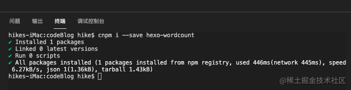

安装完成后，重新执行启动服务预览就可以了。

找到`next`主题下的配置文件`_config.yml`，ctrl + f 搜索 `post_wordcount`

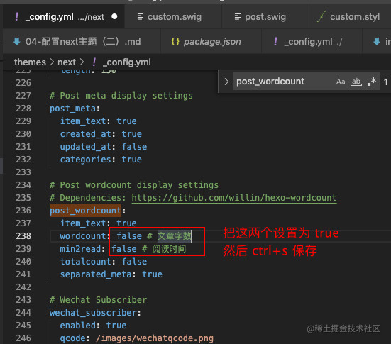

`ctrl+S` 保存下配置文件，浏览器刷新页面，随便进入一篇文章，即可看到效果

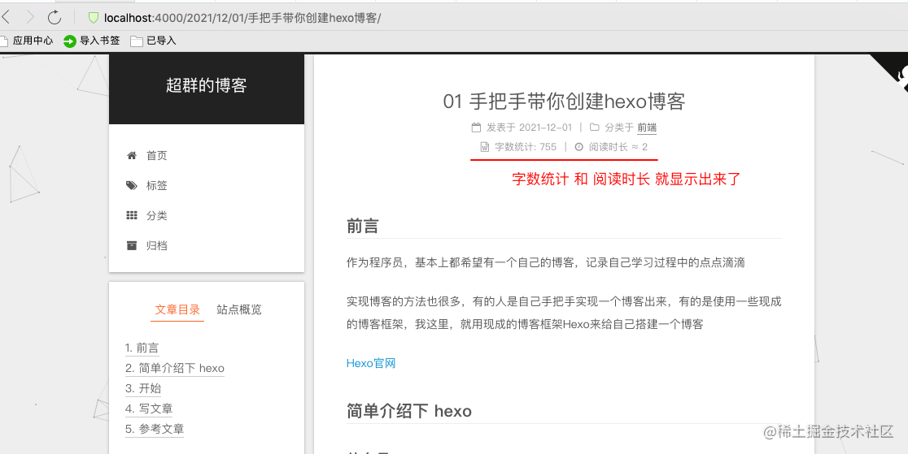

## 参考文章

1. [hexo next主题侧边栏日志出现问题](https://blog.csdn.net/qq_38765633/article/details/104929566)

2. [Next主题鼠标点击特效](https://blog.csdn.net/qq_42889280/article/details/103087564)
