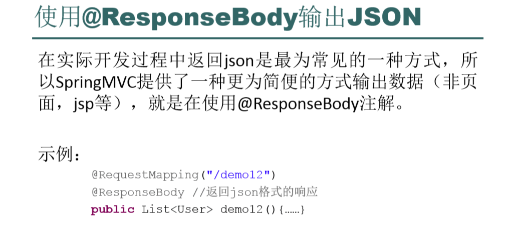
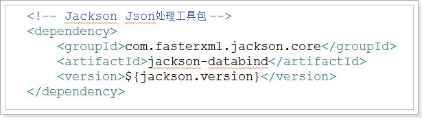
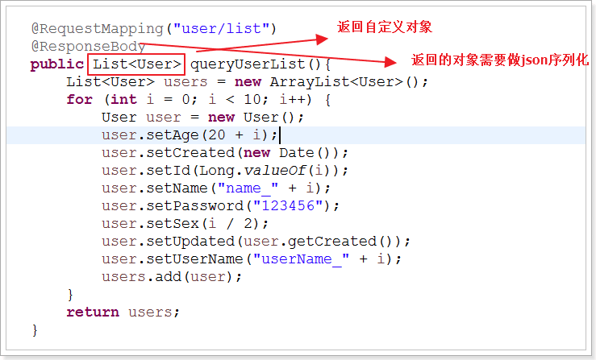
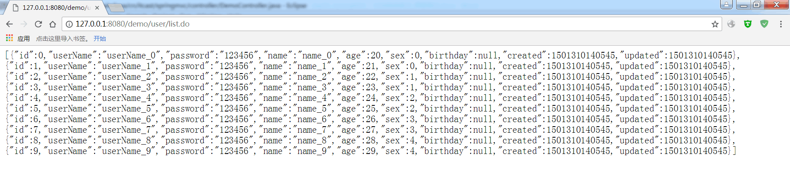
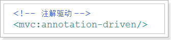
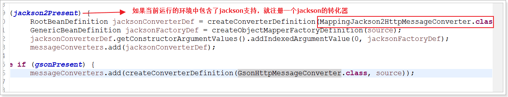

# @responsebody 返回json

添加jackson依赖

添加@ResponseBody

测试：

注意，如果输入中文，出现乱码现象，则需要`@RequestMapping(value="/appinterface", produces = "text/json;charset=UTF-8")`

原理：

当一个处理请求的方法标记为@ResponseBody时，就说明该方法需要输出其他视图（json、xml），SpringMVC通过已定义的转化器做转化输出，默认输出json。

其实是注解驱动帮我们做了这件事情。

